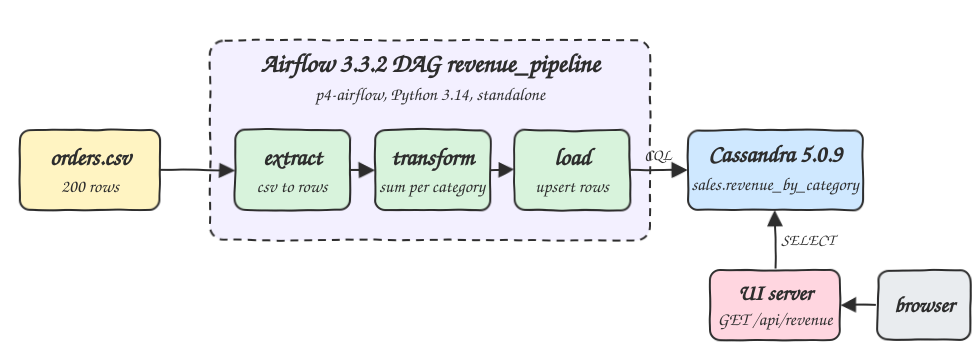
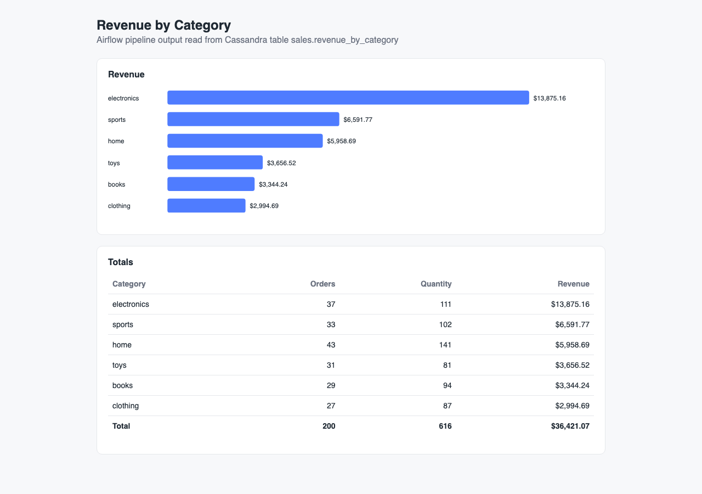
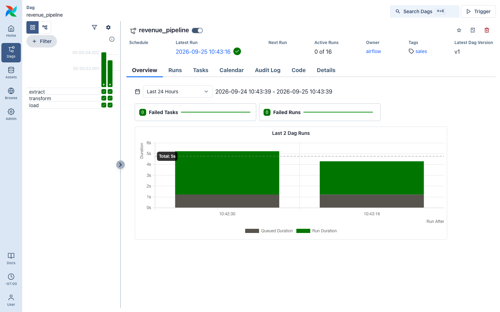

# airflow-python-cassandra

A batch pipeline written in Python and orchestrated by Apache Airflow. It reads `data/orders.csv`, works out orders, units and revenue per product category, and writes the result to Cassandra. A small Python web server reads the Cassandra table and shows it as a table and a bar chart.

## How it Works

1. `podman-compose` starts three containers on the `p4-net` network: `p4-cassandra`, `p4-airflow` and `p4-ui`.
2. Airflow (standalone mode) loads the DAG `revenue_pipeline` from `dags/`. The `data/` folder is mounted into the container.
3. `scripts/run-pipeline.sh` triggers the DAG with the Airflow CLI and waits until the run reports `success`.
4. Task `extract` reads the CSV into a list of rows.
5. Task `transform` groups rows by category in plain Python: order count, sum of quantity, sum of quantity * price rounded to 2 decimals.
6. Task `load` creates keyspace `sales` and table `revenue_by_category` if they are missing and upserts one row per category.
7. The UI server answers `GET /api/revenue` with a Cassandra `SELECT` and serves `index.html` at `/`.

## Architecture



## Features

* **Airflow DAG with three tasks**: extract, transform and load run as separate tasks, so each step has its own logs and retries.
* **Pure Python aggregation**: no pandas, just `csv` and a dict, so the logic is easy to read and unit test.
* **Idempotent load**: the category is the primary key, so running the DAG again overwrites the same 6 rows.
* **Self-contained UI**: one `index.html` with plain JS and SVG, no framework and no build step.
* **End to end check**: `test-all.sh` compares `/api/revenue` against an independent `awk` calculation on the CSV.

## Stack

* **Python 3.14.7**: language for the DAG, the aggregation and the UI server.
* **Apache Airflow 3.3.2** (`apache/airflow:slim-3.3.2-python3.14`): orchestrator, runs on Python 3.14, which Airflow 3.3 supports.
* **Apache Cassandra 5.0.9**: sink table, heap limited to 512M.
* **cassandra-driver 3.30.1**: Apache Cassandra Python driver, ships cp314 wheels.
* **http.server (stdlib)**: serves the UI and the JSON API without any web framework.
* **podman / podman-compose**: runs every service in containers.

## Contracts/APIs

| Method | Path | Response |
|---|---|---|
| GET | `/` | the `index.html` page |
| GET | `/api/revenue` | JSON array sorted by revenue, 503 with `{"error": ...}` when Cassandra is not reachable |

```json
[{"category": "electronics", "total_orders": 37, "total_quantity": 111, "total_revenue": 13875.16}]
```

Cassandra schema:

```sql
CREATE KEYSPACE sales WITH replication = {'class': 'SimpleStrategy', 'replication_factor': 1};
CREATE TABLE sales.revenue_by_category (category text PRIMARY KEY, total_orders bigint, total_quantity bigint, total_revenue double);
```

## Design decisions

* `dags/revenue.py` holds the plain functions (`read_orders`, `aggregate`, `save`) and `dags/revenue_dag.py` only wires them into tasks. The unit tests import `revenue.py` without Airflow installed.
* Data between tasks goes through XCom. 200 rows and 6 results are small enough for that.
* Revenue is rounded after summing, not per row, so rounding errors do not add up.
* The DAG is triggered with the Airflow CLI inside the container (`podman exec p4-airflow airflow dags trigger`), so no API token is needed.
* All host ports are in the 14000-14999 range and every container, network and volume name starts with `p4-`, so it can run next to the other POCs in this repo.

## How to run

```bash
./scripts/setup.sh
./scripts/start-all.sh
./scripts/run-pipeline.sh
./scripts/test-all.sh
./scripts/ui.sh
./scripts/stop-all.sh
```

| Service | Link |
|---|---|
| UI | http://localhost:14080 |
| API | http://localhost:14080/api/revenue |
| Airflow | http://localhost:14081 |
| Cassandra | localhost:14042 |

Expected result (this matches `awk` on the CSV):

| category | orders | quantity | revenue |
|---|---|---|---|
| books | 29 | 94 | 3344.24 |
| clothing | 27 | 87 | 2994.69 |
| electronics | 37 | 111 | 13875.16 |
| home | 43 | 141 | 5958.69 |
| sports | 33 | 102 | 6591.77 |
| toys | 31 | 81 | 3656.52 |

## Printscreens

### UI



The UI at `/`. The chart has one bar per category, scaled to the highest revenue. The table below shows orders, units and revenue for each category with a total row (200 orders, 616 units, $36,421.07). All of it comes from `GET /api/revenue`, which reads Cassandra.

### Airflow



The `revenue_pipeline` DAG in the Airflow 3 UI after two successful runs. The grid on the left shows `extract`, `transform` and `load` all green, and the chart shows each run took about 5 seconds.

## Scripts

All scripts live in `scripts/` and run from any directory of the repository.

| Script | What it does |
|---|---|
| `./scripts/setup.sh` | Pulls Cassandra and builds the Airflow and UI images |
| `./scripts/start-all.sh` | Starts every service and prints the full link of each one |
| `./scripts/run-pipeline.sh` | Triggers the Airflow DAG and waits for success |
| `./scripts/status.sh` | Shows every service port as UP or DOWN |
| `./scripts/test-all.sh` | Runs the unit tests, then the pipeline, and checks the API against the CSV |
| `./scripts/ui.sh` | Opens the UI in the browser |
| `./scripts/stop-all.sh` | Stops every service |
| `./scripts/sql-console.sh` | Opens cqlsh on the `sales` keyspace |

Ports are declared in `scripts/ports.env`.

```bash
./scripts/setup.sh
./scripts/start-all.sh
./scripts/status.sh
./scripts/ui.sh
./scripts/stop-all.sh
```
