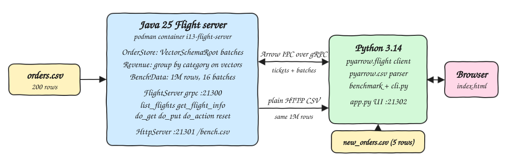
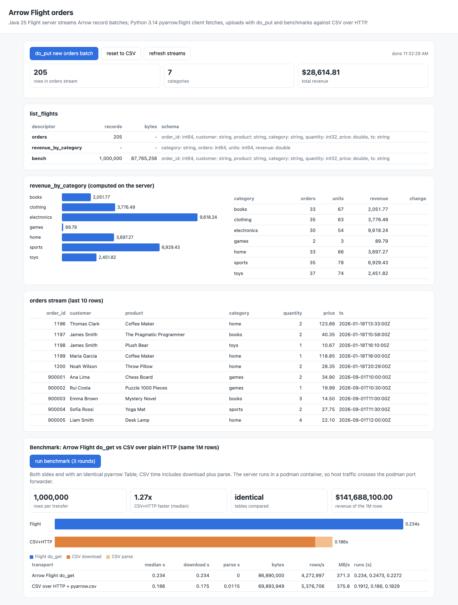

# arrow-flight-java-python

An Apache Arrow Flight server written in Java 25 that loads `data/orders.csv` into Arrow `VectorSchemaRoot` batches and serves them over gRPC, plus a Python 3.14 `pyarrow.flight` client that reads the streams, uploads new orders with `do_put`, and benchmarks Flight against the same data sent as CSV over plain HTTP.

## How it Works

1. The Java server parses `data/orders.csv` (200 rows) into one Arrow `VectorSchemaRoot` held by `OrderStore`.
2. `list_flights` and `get_flight_info` describe three flights: `orders`, `revenue_by_category` and `bench`.
3. `do_get("orders")` streams every stored batch; `do_get("revenue_by_category")` groups the Arrow vectors by category on the server and streams a 4 column result.
4. `do_put` on descriptor `orders` accepts record batches whose schema matches the orders schema and appends them, so both streams change right away.
5. `do_action("reset")` restores the store to the CSV content so runs are repeatable.
6. At boot the server builds 1,000,000 deterministic rows (row `i` is CSV row `i % 200` with `order_id = i + 1`) as 16 Arrow batches and writes the same rows to a CSV file served by a JDK `HttpServer` on `/bench.csv`.
7. The Python client times `do_get("bench")` against `GET /bench.csv` + `pyarrow.csv.read_csv`, checks both tables are identical, and a small `http.server` app renders it all on a UI.

## Architecture



## Features

- `list_flights` / `get_flight_info`: descriptors report schema, record count and byte size, so a client can plan before reading.
- `do_get` for `orders` and `revenue_by_category`: raw rows and a server side aggregate from the same Arrow memory.
- `do_put` upload: new orders arrive as Arrow batches and are moved (transfer pairs, no copy) into the store.
- Schema guard: uploads with a different schema are rejected with `INVALID_ARGUMENT` and the store stays untouched.
- `do_action("reset")`: returns the store to the CSV state for repeatable tests.
- 1M row benchmark: Flight vs CSV over HTTP with the parse cost included, 3 rounds, median reported.
- UI: flights, orders tail, revenue chart with change column, upload/reset buttons and benchmark charts.
- awk verification: tests compare every Flight number against awk over the raw CSV files.

## Stack

- Java 25 (Temurin 25.0.4 in the container): the server runtime requested for the POC.
- Apache Arrow Java 19.0.0 (`flight-core`, `arrow-memory-netty`): latest Arrow Java release with Flight.
- Python 3.14.7: client runtime.
- pyarrow 25.0.1 (`pyarrow.flight`, `pyarrow.csv`): latest pyarrow, ships cp314 wheels.
- Maven 3.9 + JUnit 6.1.3: build and in-process Flight tests.
- pytest 9.1.1 + awk: integration tests against the running server.
- podman / podman-compose: runs the Flight server image `localhost/i13-flight-server:1.0.0`.

## Java 25 notes

Arrow Java 19 runs on Java 25 with these JVM flags (set in `JAVA_TOOL_OPTIONS` in the `Containerfile` and in the surefire `argLine`):

```
--add-opens=java.base/java.nio=ALL-UNNAMED
--sun-misc-unsafe-memory-access=allow
--enable-native-access=ALL-UNNAMED
```

The jar runs on the classpath, so the module name `org.apache.arrow.memory.core` in the usual flag is unknown; `ALL-UNNAMED` is what matters.

## Contracts

Flight (gRPC, `grpc://localhost:21300`):

| Call | Descriptor / ticket | Result |
|---|---|---|
| `list_flights` | - | `orders`, `revenue_by_category`, `bench` |
| `get_flight_info` | path `orders` / `revenue_by_category` / `bench` | schema, endpoint with ticket, records, bytes |
| `do_get` | ticket `orders` | `order_id int64, customer string, product string, category string, quantity int32, price double, ts string` |
| `do_get` | ticket `revenue_by_category` | `category string, orders int64, units int64, revenue double` (sorted by category, revenue rounded to cents) |
| `do_get` | ticket `bench` | 1,000,000 rows in the orders schema |
| `do_put` | path `orders` | appends the uploaded batches, rejects other schemas |
| `do_action` | `reset` | restores the CSV rows, returns the row count |

HTTP:

| Method | Path | Port | What |
|---|---|---|---|
| GET | `/bench.csv` | 21301 | the same 1M rows as CSV |
| GET | `/health` | 21301 | `ok` when the server is ready |
| GET | `/api/flights` | 21302 | `list_flights` as JSON |
| GET | `/api/orders` | 21302 | row count and last 10 rows of `do_get("orders")` |
| GET | `/api/revenue` | 21302 | `do_get("revenue_by_category")` rows |
| POST | `/api/upload` | 21302 | `do_put` of `data/new_orders.csv` |
| POST | `/api/reset` | 21302 | `do_action("reset")` |
| GET | `/api/bench?rounds=3` | 21302 | runs the benchmark |
| GET | `/api/bench/last` | 21302 | last benchmark result or `null` |

## Design decisions

- The store is a list of `VectorSchemaRoot` batches. Uploads add a batch, they never rewrite existing vectors, so `do_get` just loads each batch into one stream root with `VectorUnloader`/`VectorLoader` (buffer reference counts, no copies).
- Uploaded batches are moved out of the Flight stream root with transfer pairs into the store allocator, so the stream can be closed safely.
- The revenue aggregate reads `category`, `quantity` and `price` vectors directly, which is the point of having columnar data on the server.
- The benchmark data is generated on the server in both formats from the same rows, and the CSV is served from a file, so neither side pays a generation cost per request.
- CSV timing includes `pyarrow.csv.read_csv`, because a CSV response is not usable until parsed; the Flight result is already a `pyarrow.Table`.

## How to run

```bash
./scripts/setup.sh
./scripts/start-all.sh
client/.venv/bin/python client/cli.py 3
./scripts/test-all.sh
./scripts/ui.sh
./scripts/stop-all.sh
```

`client/cli.py` output:

```
reset -> 200 rows
flight orders               records=200      bytes=-1
flight revenue_by_category  records=-1       bytes=-1
flight bench                records=1000000  bytes=87765256
orders before upload: 200 rows
revenue_by_category before upload
  books        orders=32   units=64    revenue=2008.27
  clothing     orders=35   units=63    revenue=3776.49
  electronics  orders=30   units=54    revenue=9618.24
  home         orders=32   units=62    revenue=3608.87
  sports       orders=34   units=76    revenue=6873.93
  toys         orders=37   units=74    revenue=2451.82
do_put uploaded 5 rows
orders after upload: 205 rows (+5)
revenue_by_category after upload
  books        orders=33   units=67    revenue=2051.77
  clothing     orders=35   units=63    revenue=3776.49
  electronics  orders=30   units=54    revenue=9618.24
  games        orders=2    units=3     revenue=89.79
  home         orders=33   units=66    revenue=3697.27
  sports       orders=35   units=78    revenue=6929.43
  toys         orders=37   units=74    revenue=2451.82
benchmark rows=1000000 rounds=3 identical=True revenue=141688100.00
  flight median=0.2455s download=0.2455s parse=0.0s bytes=86890000 rows/s=4073231 MB/s=353.9
  csv    median=0.2055s download=0.1924s parse=0.0133s bytes=69893949 rows/s=4866937 MB/s=340.2
  flight speedup over csv+http: 0.84x
```

## Verification

`./scripts/test-all.sh` runs 5 JUnit tests (in-process Flight server) and 5 pytest tests against the running container. The pytest suite checks:

- `do_get("orders")` equals `data/orders.csv` read by pyarrow (200 rows).
- `revenue_by_category` equals awk over `data/orders.csv`.
- after `do_put`, `revenue_by_category` equals awk over `data/orders.csv data/new_orders.csv`, and the orders count is 205.
- a wrong schema upload fails with `schema must be ...` and leaves 200 rows.
- `do_get("bench")` and `/bench.csv` give identical tables; awk over the downloaded CSV gives `rows=1000000 revenue=141688100.00 max_id=1000000`.

awk over the raw files, same numbers as the Flight streams above:

```
awk -F, 'FNR>1{o[$4]++;u[$4]+=$5;r[$4]+=$5*$6} END{for(c in o) printf "%s,%d,%d,%.2f\n",c,o[c],u[c],r[c]}' data/orders.csv data/new_orders.csv | sort
books,33,67,2051.77
clothing,35,63,3776.49
electronics,30,54,9618.24
games,2,3,89.79
home,33,66,3697.27
sports,35,78,6929.43
toys,37,74,2451.82
```

## Benchmark results

1,000,000 rows, 3 rounds, median, on a laptop:

| Server location | Flight do_get | CSV over HTTP + parse | Winner |
|---|---|---|---|
| podman container (traffic goes through the podman port forwarder) | 0.234 s, 86.9 MB, ~370 MB/s | 0.186 s (0.175 download + 0.012 parse), 69.9 MB | CSV+HTTP 1.27x |
| same jar run natively on the host (5 rounds) | 0.027 s, ~3.2 GB/s | 0.041 s (0.029 download + 0.012 parse) | Flight 1.48x |

What the numbers say:

- Through the podman port forwarder both transports hit the same ~350-375 MB/s ceiling, so the result is decided by payload size. The uncompressed Arrow payload (86.9 MB) is bigger than the CSV (69.9 MB) because the strings repeat and Arrow stores them plain plus offsets.
- On a direct loopback connection the forwarder is gone and Flight is 1.48x faster: it moves 3.2 GB/s and needs no parse step.
- `pyarrow.csv` is multithreaded and parses 70 MB in about 12 ms, which makes CSV a tough baseline; a row-by-row CSV parser would lose by a much larger margin.

## Printscreens



The UI after one `do_put` of `data/new_orders.csv` and one benchmark run: `orders` has 205 rows and the new `games` category shows up in `revenue_by_category`; the last 10 rows of the `orders` stream include the uploaded ids `900001`-`900005`; `list_flights` shows the schema of each descriptor; the benchmark card compares Flight against CSV over HTTP for the same 1M rows (split into download and parse) and confirms both tables are identical.

## Scripts

All scripts live in `scripts/` and run from any directory of the repository.

| Script | What it does |
|---|---|
| `./scripts/setup.sh` | Builds the jar with Java 25, creates the Python 3.14 venv and builds the server image |
| `./scripts/start-all.sh` | Starts the Flight server container and the UI, prints the full link of each one |
| `./scripts/status.sh` | Shows every service port as UP or DOWN |
| `./scripts/test-all.sh` | Runs the JUnit tests and the pytest + awk tests |
| `./scripts/ui.sh` | Opens the UI in the browser |
| `./scripts/stop-all.sh` | Stops every service |

Ports are declared in `scripts/ports.env`: `flight=21300`, `csv-http=21301`, `ui=21302`.

```bash
./scripts/setup.sh
./scripts/start-all.sh
./scripts/status.sh
./scripts/ui.sh
./scripts/stop-all.sh
```
