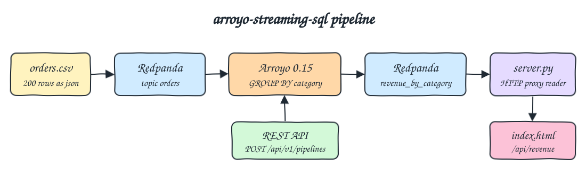
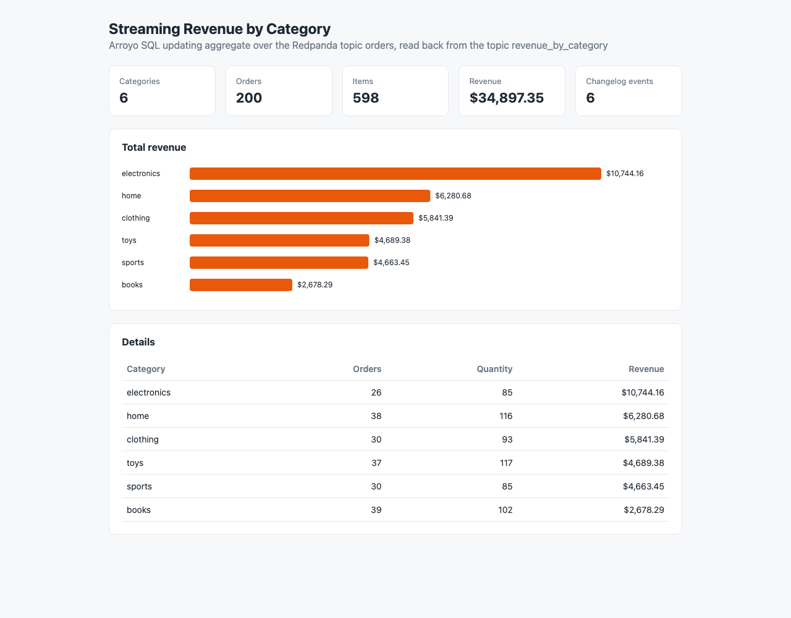

# arroyo-streaming-sql

A streaming SQL pipeline: `data/orders.csv` is produced as JSON into the Redpanda topic `orders`, an Arroyo SQL pipeline created through the Arroyo REST API keeps a running revenue aggregate per category and writes every change to the topic `revenue_by_category`. A tiny Python backend reads that changelog topic and serves a single `index.html`.

## How it Works

1. `scripts/start-all.sh` starts Redpanda, Arroyo and the UI backend with `podman-compose`.
2. `scripts/pipeline.sh` stops and deletes any old `revenue_by_category` pipeline through the Arroyo REST API, then recreates the `orders` and `revenue_by_category` topics.
3. It converts the 200 CSV rows into JSON lines with `awk` and produces them with `rpk` inside the Redpanda container.
4. It posts `arroyo/revenue.sql` to `POST /api/v1/pipelines` and waits until the job state is `Running`.
5. Arroyo reads `orders` from the earliest offset and runs an updating aggregate: per category `total_orders` (count), `total_quantity` (sum of quantity) and `total_revenue` (sum of quantity * price, rounded to 2 decimals).
6. Every change of a category is written to `revenue_by_category` as a Debezium JSON record (`c` on first sight, `u` with `before` and `after` on every update).
7. The UI backend (`app/`) reads the topic through the Redpanda HTTP proxy, replays the changelog into the latest row per category and serves `GET /api/revenue`. The page refreshes every 5 seconds.

## Architecture



## Features

* Pipeline as code: the whole job is one SQL file sent to the Arroyo REST API, no Rust to compile.
* Real streaming: the pipeline keeps running, so new orders update the totals within seconds.
* Changelog sink: Debezium JSON keeps `before` and `after`, so any consumer can rebuild the latest state.
* Idempotent pipeline script: old pipelines are stopped and deleted and both topics are recreated before each run.
* Zero dependency backend: Python standard library only, it reads Kafka data through the Redpanda HTTP proxy.
* End to end test that compares the API with an independent `awk` aggregation of the CSV, then produces the orders again and checks that every total doubles.

## Stack

* Arroyo 0.15.0 (`ghcr.io/arroyosystems/arroyo:0.15.0`): latest release, stream processing SQL engine in Rust, runs as a single `cluster` process with an embedded SQLite config store.
* Redpanda v26.2.3: Kafka compatible broker with a built-in HTTP proxy, one core and 512M.
* Python 3.14.7 (`python:3.14.7-slim`): UI backend with `http.server` and `urllib`, no libraries.
* podman and podman-compose: run everything in containers.

## Contracts

`GET /api/revenue` returns the latest state rebuilt from the changelog topic, sorted by revenue, and the number of changelog events read.

```json
{
  "changelog_events": 6,
  "categories": [
    {"category": "electronics", "total_orders": 26, "total_quantity": 85, "total_revenue": 10744.16},
    {"category": "home", "total_orders": 38, "total_quantity": 116, "total_revenue": 6280.68}
  ]
}
```

`GET /` returns the UI page.

Input message on `orders`:

```json
{"order_id":1001,"customer":"isabel","product":"Building Blocks Set","category":"toys","quantity":2,"price":49.99,"ts":"2026-08-02 11:19:00"}
```

Output message on `revenue_by_category`:

```json
{"before":{"category":"toys","total_orders":37,"total_quantity":117,"total_revenue":4689.38},"after":{"category":"toys","total_orders":74,"total_quantity":234,"total_revenue":9378.76},"op":"u"}
```

Arroyo SQL, from `arroyo/revenue.sql`:

```sql
INSERT INTO revenue_by_category
SELECT
  category,
  count(*) AS total_orders,
  sum(quantity) AS total_quantity,
  round(sum(quantity * price), 2) AS total_revenue
FROM orders
GROUP BY category;
```

Arroyo REST calls used by `scripts/pipeline.sh`:

| Call | Purpose |
|---|---|
| `GET /api/v1/pipelines` | Find old pipelines by name |
| `PATCH /api/v1/pipelines/{id}` with `{"stop":"immediate"}` | Stop an old pipeline |
| `DELETE /api/v1/pipelines/{id}` | Delete an old pipeline |
| `POST /api/v1/pipelines` with `{"name","query","parallelism":1}` | Create and start the pipeline |
| `GET /api/v1/pipelines/{id}/jobs` | Wait for the `Running` state |

## Design Decisions

* Updating aggregate instead of a tumbling window: a Kafka source never ends, so the last event time window only closes when a later event moves the watermark. A `GROUP BY` without a window emits every change, which is what a live dashboard needs, and its totals can be checked exactly.
* Debezium JSON is required by Arroyo for updating results; the backend applies `c`, `u` and `d` records in offset order.
* Arroyo has no CSV format, so the CSV is turned into JSON lines while producing.
* The Arroyo container keeps no volume: pipelines are created by `pipeline.sh`, so a restart starts clean and never points at lost checkpoints.
* Reading through the Redpanda HTTP proxy keeps the backend free of a Kafka client library.
* Every container, volume and network is prefixed with `q1-` and every host port is in the 26000 range. The HTTP proxy is only reachable inside the `q1-net` network.

| Service | Host port |
|---|---|
| Redpanda Kafka | 26092 |
| Arroyo API and web console | 26015 |
| UI | 26080 |

## How to Run

Requirements: podman, podman-compose, curl and python3.

```bash
./scripts/setup.sh
./scripts/start-all.sh
./scripts/pipeline.sh
./scripts/ui.sh
./scripts/test-all.sh
./scripts/stop-all.sh
```

Test output:

```
tests started
topics orders and revenue_by_category recreated
produced 200 orders into topic orders
created arroyo pipeline pl_rU7SAchMrM
pipeline pl_rU7SAchMrM running, sink topic revenue_by_category
expected from csv x1
books 39 102 2678.29
clothing 30 93 5841.39
electronics 26 85 10744.16
home 38 116 6280.68
sports 30 85 4663.45
toys 37 117 4689.38
actual from api
books 39 102 2678.29
clothing 30 93 5841.39
electronics 26 85 10744.16
home 38 116 6280.68
sports 30 85 4663.45
toys 37 117 4689.38
producing the same orders again, the running aggregate must double
expected from csv x2
books 78 204 5356.58
clothing 60 186 11682.78
electronics 52 170 21488.32
home 76 232 12561.36
sports 60 170 9326.90
toys 74 234 9378.76
actual from api
books 78 204 5356.58
clothing 60 186 11682.78
electronics 52 170 21488.32
home 76 232 12561.36
sports 60 170 9326.90
toys 74 234 9378.76
tests passed
```

## Printscreens



The UI right after `pipeline.sh`. The cards show 6 categories, 200 orders, 598 items, $34,897.35 of revenue and 6 changelog events, one `c` record per category because all orders were already in the topic when the pipeline started. The bar chart ranks categories by revenue, electronics first. The table lists the latest row per category rebuilt from `revenue_by_category`, the same numbers returned by `GET /api/revenue`. After `test-all.sh` produces the orders again, the page shows 400 orders, doubled revenue and 12 changelog events.

## Scripts

All scripts live in `scripts/` and run from any directory of the repository.

| Script | What it does |
|---|---|
| `./scripts/setup.sh` | Pulls the Redpanda and Arroyo images and builds the UI image |
| `./scripts/start-all.sh` | Starts Redpanda, Arroyo and the UI and prints the full link of each one |
| `./scripts/pipeline.sh` | Recreates the topics, produces the orders and creates the Arroyo pipeline through the REST API |
| `./scripts/status.sh` | Shows every service port as UP or DOWN |
| `./scripts/test-all.sh` | Runs the pipeline and checks the API against the CSV, once and after producing the orders again |
| `./scripts/ui.sh` | Opens the UI in the browser |
| `./scripts/stop-all.sh` | Stops every service |

Ports are declared in `scripts/ports.env`.

```bash
./scripts/setup.sh
./scripts/start-all.sh
./scripts/status.sh
./scripts/ui.sh
./scripts/stop-all.sh
```
