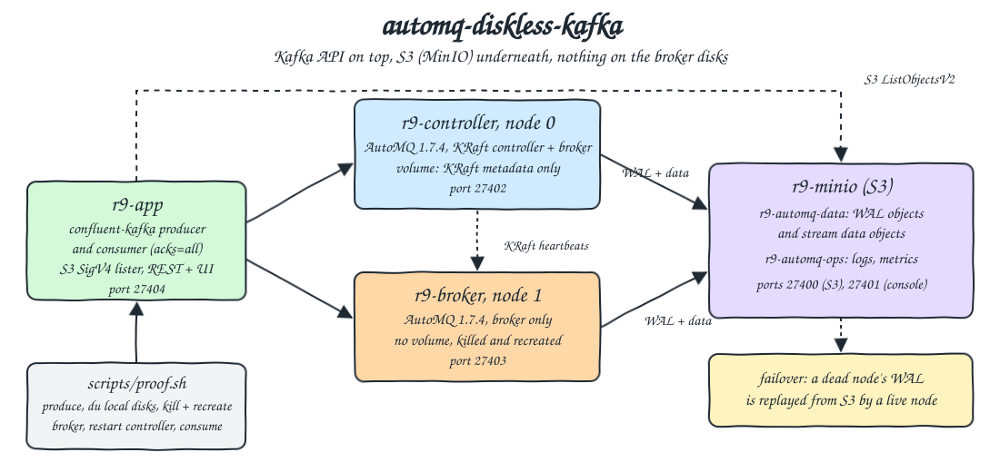
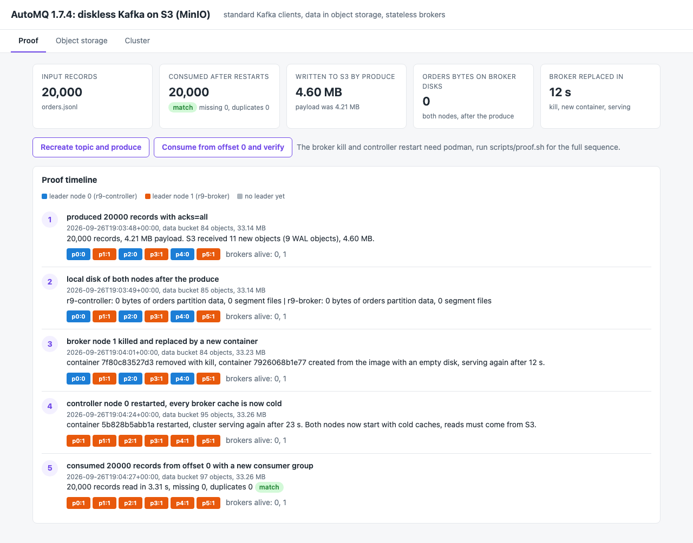
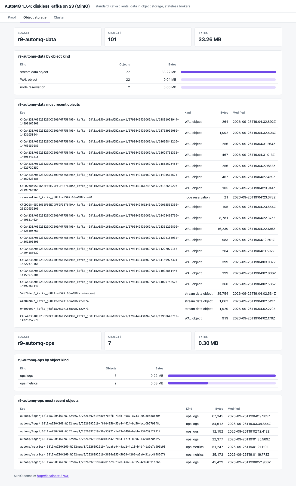
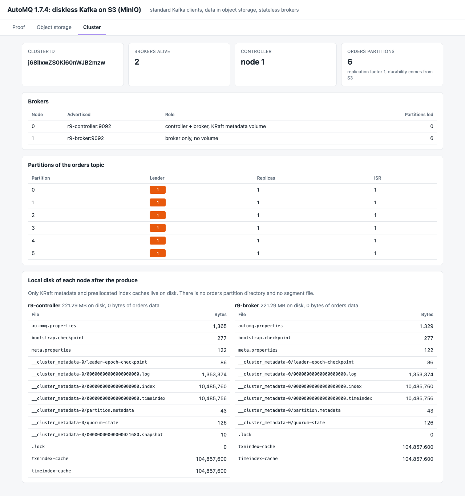

<p align="center"></p>

# automq-diskless-kafka

AutoMQ is Apache Kafka with the storage layer replaced: brokers keep no partition data on local disk, every acknowledged record goes to an S3 write ahead log and then to S3 stream objects. This POC runs AutoMQ 1.7.4 (latest stable open source release) on MinIO with one controller+broker node and one broker-only node without any volume, produces 20,000 orders with a standard Kafka client (`confluent-kafka`, librdkafka), lists the objects AutoMQ wrote to the bucket, measures the local disks of both nodes, kills the broker container and replaces it with a brand new one, restarts the controller node, and then reads every record back from offset 0 and compares it with the input file. A small web UI shows each step.

## How it Works

1. `app/gen.py` writes `data/orders.jsonl` (20,000 orders, 4.2 MB) from a seeded `random.Random(2026)`.
2. `r9-app` creates the `r9-automq-data` and `r9-automq-ops` buckets in MinIO with a stdlib SigV4 client (`app/s3.py`).
3. `r9-controller` (node 0, KRaft controller and broker) and `r9-broker` (node 1, broker only) point `s3.wal.path`, `s3.data.buckets` and `s3.ops.buckets` at MinIO.
4. `scripts/proof.sh` runs five steps: recreate topic `orders` (6 partitions, replication factor 1) and produce the file with `acks=all`, record every file on both nodes' `/data/kafka`, `podman rm -f` the broker and `podman-compose up` a new container, `podman restart` the controller, consume from offset 0 with a new consumer group.
5. Each step is posted to the app, which stores it in `results/proof.json` with the partition leaders and the bucket totals at that moment.
6. `tests/test_diskless.py` checks the results against the input file and the live cluster, not against what the app claims.

## Architecture



## Features

* Diskless brokers: after producing 4.2 MB, both nodes hold 0 bytes of `orders` partition data, only KRaft metadata and preallocated index caches.
* Data in object storage: the produce writes WAL objects and stream data objects to MinIO, at least as many bytes as the payload.
* Stateless broker replacement: the broker container is removed with kill (no clean shutdown) and a new one with an empty filesystem takes node id 1, serving again in about 12 s.
* Failover without data copy: when a broker dies, a live node replays its WAL from S3 and takes its partitions, with replication factor 1.
* Cold restart proof: the controller node is restarted after the broker replacement, so no JVM cache holds the data and the final read comes from S3.
* Standard clients: the producer, the consumer and the admin client are plain `confluent-kafka` 2.15.1, no AutoMQ SDK.
* Independent checks: the tests recompute the expected records, byte counts and revenue per region from `data/orders.jsonl`.

## Stack

* AutoMQ 1.7.4 (`docker.io/automqinc/automq:1.7.4`): latest stable open source release, 1.7.5 is still a release candidate.
* MinIO RELEASE.2026-08-04 (`docker.io/pgsty/minio`): community build of MinIO, the S3 endpoint for WAL, data and ops buckets.
* Python 3.14.7 (`docker.io/library/python:3.14.7-slim`): runs the generator, the REST API, the UI and the tests.
* confluent-kafka 2.15.1: the standard librdkafka based Kafka client for Python, has Python 3.14 wheels.
* Python stdlib (`http.server`, `urllib`, `hmac`): REST API and the S3 SigV4 client, no boto3.
* Plain HTML, CSS and JS: the UI, no framework.
* podman + podman-compose: runs the four containers, 1152 MB limit per AutoMQ node, 384 MB for MinIO and the app.

## Contracts / APIs

| Method | Path / endpoint | Description |
|---|---|---|
| Kafka | `localhost:27402` | node 0 (controller + broker), EXTERNAL listener |
| Kafka | `localhost:27403` | node 1 (broker only), EXTERNAL listener |
| S3 | `http://localhost:27400` | MinIO S3 API |
| GET | `http://localhost:27401` | MinIO console |
| GET | `/` | UI |
| GET | `/api/health` | `{"status": "ok"}` |
| GET | `/api/cluster` | cluster id, controller, brokers, partitions with leader, replicas and ISR |
| GET | `/api/storage` | per bucket: object count, bytes, bytes by object kind, 20 most recent keys |
| GET | `/api/proof` | `results/proof.json`: input, produce result, events, consume result |
| POST | `/api/produce` | recreates topic `orders`, produces `data/orders.jsonl`, starts a new proof |
| POST | `/api/events` | `{"step", "title", "detail"}` appends a proof event with a cluster and storage snapshot |
| POST | `/api/consume` | reads every record from offset 0 with a new group and compares with the input |

```json
{"topic": "orders", "input": {"file": "orders.jsonl", "records": 20000},
 "produced": {"records": 20000, "bytes": 4413810, "sha256": "449cb2...", "s3_written": {"objects": 11, "bytes": 4824801, "wal_objects": 9}},
 "consumed": {"records": 20000, "missing": 0, "duplicates": 0, "matches_input": true, "seconds": 3.31},
 "events": [{"step": "recreate-broker", "detail": {"old_container": "7f80c83527d3", "new_container": "7926068b1e77", "seconds_to_serve": 12}}]}
```

## Design decisions

* Two nodes, not one: a single node cannot show a stateless broker being replaced while the cluster keeps its metadata. Node 0 keeps the KRaft metadata log on the `r9-controller-meta` volume, node 1 has no volume at all.
* Static IPs on `r9-net` (`10.209.27.0/24`): without them `podman restart` gives the controller a new IP, the broker keeps heartbeating the old address, gets fenced by the AutoMQ failover and exits. Pinning the addresses keeps the proof about storage, not container DNS.
* Object kinds come from the key layout AutoMQ uses: `.../_kafka_<cluster id>/<node>/<epoch>/wal/<start>-<end>` for WAL objects, `<prefix>/_kafka_<cluster id>/<object id>` for stream data objects, `automq/logs|metrics/...` in the ops bucket.
* Bytes written by the produce are the objects with `LastModified` after the produce started, so deletes of older topics and compaction do not hide or inflate the number.
* Deleted topics are not reclaimed right away: the data bucket keeps growing across runs (about 33 MB after 7 runs). This is AutoMQ's async cleanup, not data kept by the brokers.

## Tests

`./scripts/test-all.sh` reruns `scripts/proof.sh` and then runs `tests/test_diskless.py` inside `r9-app`:

* `test_live_consume_returns_exactly_the_input_file`: the test consumes the topic itself and compares the sorted records with the file.
* `test_revenue_recomputed_from_consumed_records_matches_the_input`: revenue per region from the consumed records equals revenue per region from the file.
* `test_app_consume_after_restarts_matched_the_input`: count, missing, duplicates and SHA-256 of the app's post-restart read match the file.
* `test_acked_bytes_landed_in_object_storage`: WAL objects exist and S3 received at least the payload bytes computed from the file.
* `test_brokers_keep_no_partition_data_on_local_disk`: no `orders-*` file and no segment on either node.
* `test_replaced_broker_is_a_new_container_that_starts_empty`: new container id, empty disk, serving within 60 s.
* `test_bucket_objects_belong_to_this_kafka_cluster`: objects keyed by the live cluster id hold at least the payload bytes.
* `test_every_partition_has_a_live_leader_after_the_restarts`, `test_proof_ran_every_step_in_order`, `test_ui_page_has_every_tab`.

```
step 1/5 recreate topic orders and produce data/orders.jsonl with acks=all
step 2/5 measure what the brokers keep on local disk
step 3/5 kill -9 the broker container and create a brand new one with an empty filesystem
step 4/5 restart the controller node (combined controller and broker)
step 5/5 consume every record from offset 0 with a new consumer group and compare with the input file
consumed 20000 records, missing 0, duplicates 0, matches input True
test_acked_bytes_landed_in_object_storage ... ok
test_app_consume_after_restarts_matched_the_input ... ok
test_brokers_keep_no_partition_data_on_local_disk ... ok
test_bucket_objects_belong_to_this_kafka_cluster ... ok
test_every_partition_has_a_live_leader_after_the_restarts ... ok
test_live_consume_returns_exactly_the_input_file ... ok
test_proof_ran_every_step_in_order ... ok
test_replaced_broker_is_a_new_container_that_starts_empty ... ok
test_revenue_recomputed_from_consumed_records_matches_the_input ... ok
test_ui_page_has_every_tab ... ok

Ran 10 tests in 3.473s

OK
all tests passed
```

## Printscreens

Proof tab: tiles with the input records, the records read back after the broker replacement and the controller restart (match, 0 missing, 0 duplicates), the bytes the produce wrote to S3 next to the payload size, 0 bytes of `orders` data on the broker disks, and the 12 s it took a new broker container to serve. The timeline shows each step with the partition leaders: after the broker is replaced its partitions stay on node 1, after the controller restart node 1 leads all six partitions.



Object storage tab: both buckets with object counts and bytes by kind (stream data objects, WAL objects, node reservations, ops logs and metrics) and the most recent keys, where the WAL keys show the cluster id, the node id and the node epoch.



Cluster tab: cluster id, live brokers, the controller, the leader of every `orders` partition, and every file on the local disk of both nodes: KRaft metadata, two 100 MB preallocated index caches, and no partition directory.



## Scripts

All scripts live in `scripts/` and run from any directory of the repository.

| Script | What it does |
|---|---|
| `./scripts/setup.sh` | Pulls the AutoMQ, MinIO and Python images, builds the app image, generates `data/orders.jsonl` when missing |
| `./scripts/start-all.sh` | Starts MinIO, the UI (creates buckets), both AutoMQ nodes, waits for each, runs the proof when there is none, prints every link |
| `./scripts/proof.sh` | Produce, measure local disks, replace the broker, restart the controller, consume and compare |
| `./scripts/status.sh` | Shows every service port as UP or DOWN |
| `./scripts/test-all.sh` | Reruns the proof and runs the tests |
| `./scripts/ui.sh` | Opens the UI in the browser and prints the MinIO console link |
| `./scripts/stop-all.sh` | Stops every container and waits until the ports are free |

Ports are declared in `scripts/ports.env`: MinIO S3 27400, MinIO console 27401, node 0 Kafka 27402, node 1 Kafka 27403, UI 27404 (`http://localhost:27404`).

```bash
./scripts/setup.sh
./scripts/start-all.sh
./scripts/status.sh
./scripts/test-all.sh
./scripts/ui.sh
./scripts/stop-all.sh
```
