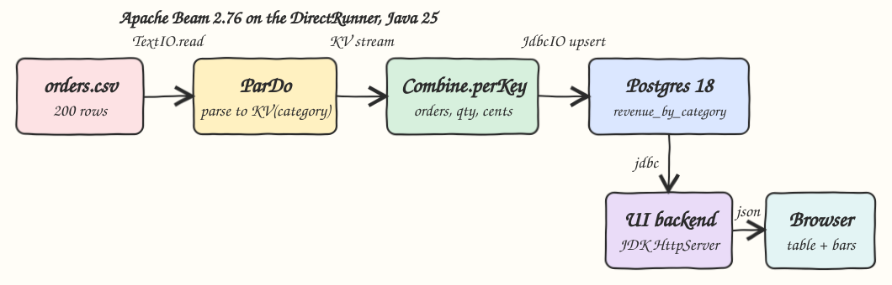
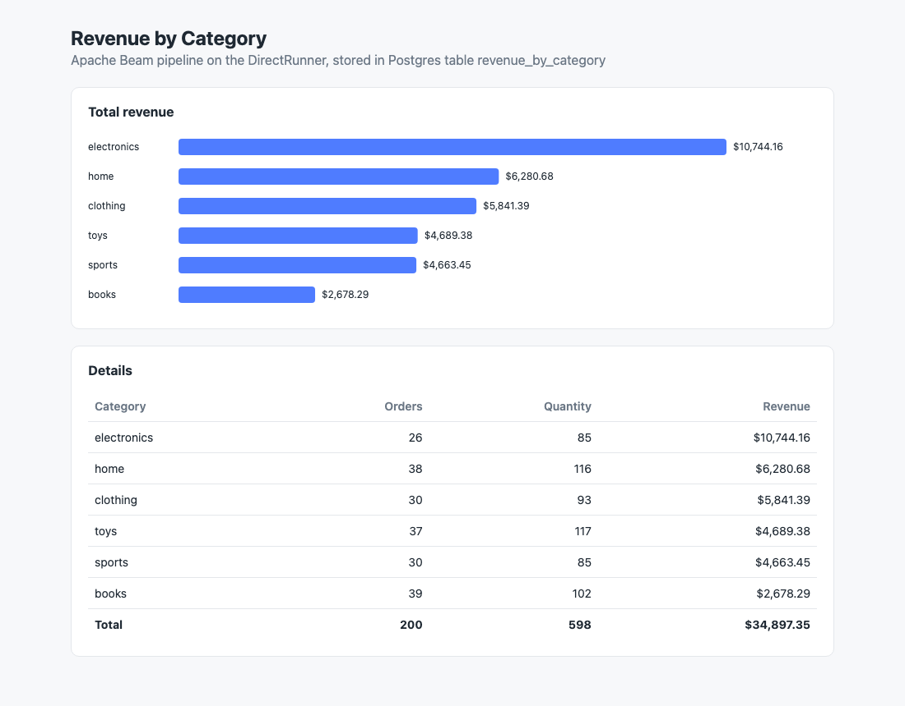

# beam-java-pipeline

A batch pipeline written with Apache Beam in Java 25: `data/orders.csv` is read with `TextIO`, parsed with a `ParDo`, aggregated into revenue per category with `Combine.perKey`, and upserted into Postgres with `JdbcIO`. A tiny UI backend on the JDK `HttpServer` reads Postgres and serves a single `index.html` with a bar chart and a table.

## How it Works

1. `scripts/start-all.sh` starts Postgres with `podman-compose`; `postgres/schema.sql` creates `revenue_by_category` on first boot.
2. `scripts/pipeline.sh` runs `beam.RevenuePipeline` once in the `q2-pipeline` container on the Beam DirectRunner.
3. `TextIO.read()` emits one element per CSV line.
4. `ParseOrderFn` (a `DoFn` in a `ParDo`) drops the header and blank lines, normalizes the category, and emits `KV<category, Totals(1, quantity, quantity * priceCents)>`.
5. `Combine.perKey(SumTotalsFn)` groups by category and sums orders, quantity and revenue in cents.
6. `JdbcIO.write()` runs `INSERT ... ON CONFLICT (category) DO UPDATE`, so rerunning the pipeline never duplicates rows.
7. `beam.UiServer` serves `index.html` on `/` and `GET /api/revenue` straight from Postgres.

## Architecture



## Features

* Beam composite transform `RevenueByCategory`: the whole business logic is one `PTransform`, so the same code runs in the pipeline and in unit tests.
* `ParDo` + `Combine.perKey`: `Combine.perKey` is a `GroupByKey` with combiner lifting, so partial sums happen before the shuffle.
* Money in integer cents: prices are parsed with `BigDecimal` into cents, so sums are exact and only turned into `numeric(12,2)` at the edge.
* Idempotent writes: `JdbcIO` upserts keyed by category, safe to rerun.
* Beam unit tests with `TestPipeline` + `PAssert`, including a case where `double` math would drift.
* End to end check: `test-all.sh` compares the API with an independent `awk` aggregation of the CSV.
* One self-contained `index.html`, plain JS and SVG, no framework.

## Stack

* Java 25 (Eclipse Temurin 25.0.4): Beam supports Java 11, 17, 21 and 25 since 2.75.0, so the newest LTS is used. Java 27 is out but Beam does not list it as supported.
* Apache Beam 2.76.0 (`beam-sdks-java-core`, `beam-runners-direct-java`, `beam-sdks-java-io-jdbc`): latest release, DirectRunner keeps it to one JVM with no cluster.
* PostgreSQL 18.6 (`postgres:18.6-alpine`): result store, `shared_buffers=32MB` and a 256m memory limit.
* PostgreSQL JDBC driver 42.7.13: used by `JdbcIO` and by the UI backend.
* JDK `HttpServer`: serves the UI and the API with no web framework.
* Maven 3.9.16 (`maven:3.9.16-eclipse-temurin-25`): simplest build for a single Java module, runs inside the build stage, no local JDK needed.
* JUnit 4.13.2 + Hamcrest 3.0: required by Beam `TestPipeline` and `PAssert`.
* podman + podman-compose: runs everything.

## Contracts / APIs

`GET /` returns the UI.

`GET /api/revenue` returns every row of `revenue_by_category` sorted by revenue:

```json
[
  {"category":"electronics","total_orders":26,"total_quantity":85,"total_revenue":10744.16},
  {"category":"home","total_orders":38,"total_quantity":116,"total_revenue":6280.68}
]
```

Postgres table, from `postgres/schema.sql`:

```sql
CREATE TABLE IF NOT EXISTS revenue_by_category (
  category text PRIMARY KEY,
  total_orders bigint NOT NULL,
  total_quantity bigint NOT NULL,
  total_revenue numeric(12, 2) NOT NULL
);
```

## Key design decisions

* `Totals` is a Java `record` with `@DefaultCoder(SerializableCoder.class)`, used as input, accumulator and output of the `CombineFn`, which keeps the combiner to four one-line methods.
* DirectRunner instead of Flink or Spark runners: the input is 200 rows, and the same `RevenueByCategory` transform would run unchanged on any runner.
* One image for the pipeline and the UI: a multi stage `Containerfile` builds with Maven (running the unit tests) and copies the runtime classpath into a small JRE alpine image.
* The Maven build stage is also tagged as `q2-beam-java-pipeline-build`, so `test-all.sh` reruns the unit tests offline inside it.
* Every container, image, volume and network is prefixed with `q2-`.

| Service | Host port |
|---|---|
| Postgres | 26132 |
| UI | 26180 |

## Layout

```
data/orders.csv                               input data
postgres/schema.sql                           result table
src/main/java/beam/RevenueByCategory.java     ParDo + Combine.perKey transform
src/main/java/beam/Totals.java                orders, quantity, revenue in cents
src/main/java/beam/RevenuePipeline.java       TextIO -> transform -> JdbcIO
src/main/java/beam/UiServer.java              http backend
src/main/java/beam/Env.java                   env settings
src/main/resources/index.html                 UI
src/test/java/beam/RevenueByCategoryTest.java TestPipeline + PAssert
Containerfile / podman-compose.yml / pom.xml
```

## How to run

Requirements: podman, podman-compose, curl and python3.

```bash
./scripts/setup.sh
./scripts/start-all.sh
./scripts/test-all.sh
./scripts/ui.sh
./scripts/stop-all.sh
```

`test-all.sh` runs the Beam unit tests, reruns the pipeline to prove the upsert is idempotent (still 6 rows), and compares `/api/revenue` with an `awk` calculation over the CSV:

```
beam unit tests with TestPipeline and PAssert
[INFO] Tests run: 3, Failures: 0, Errors: 0, Skipped: 0
rerunning the pipeline to prove the upsert is idempotent
running beam pipeline on the DirectRunner
beam pipeline wrote revenue_by_category from /app/data/orders.csv
comparing /api/revenue with an independent awk calculation over data/orders.csv
expected from csv
books 39 102 2678.29
clothing 30 93 5841.39
electronics 26 85 10744.16
home 38 116 6280.68
sports 30 85 4663.45
toys 37 117 4689.38
actual from api
books 39 102 2678.29
clothing 30 93 5841.39
electronics 26 85 10744.16
home 38 116 6280.68
sports 30 85 4663.45
toys 37 117 4689.38
all tests passed
```

## Printscreens



The single page of the UI after the Beam pipeline ran. The top card is an SVG bar chart of total revenue per category, electronics first. The bottom card lists orders, quantity and revenue per category plus a total row (200 orders, 598 items, $34,897.35). Every number comes from `GET /api/revenue`, which reads the rows `JdbcIO` wrote into Postgres.

## Scripts

All scripts live in `scripts/` and run from any directory of the repository.

| Script | What it does |
|---|---|
| `./scripts/setup.sh` | Pulls Postgres and builds the Maven stage (with unit tests) and the runtime image |
| `./scripts/start-all.sh` | Starts Postgres, runs the Beam pipeline, starts the UI and prints the full link of each one |
| `./scripts/pipeline.sh` | Runs the Beam pipeline again |
| `./scripts/status.sh` | Shows every service port as UP or DOWN |
| `./scripts/test-all.sh` | Runs Beam unit tests, reruns the pipeline and checks the API against the CSV |
| `./scripts/ui.sh` | Opens the UI in the browser |
| `./scripts/stop-all.sh` | Stops every service |
| `./scripts/sql-console.sh` | Opens psql on the `sales` database |

Ports are declared in `scripts/ports.env`.

```bash
./scripts/setup.sh
./scripts/start-all.sh
./scripts/status.sh
./scripts/ui.sh
./scripts/stop-all.sh
```
