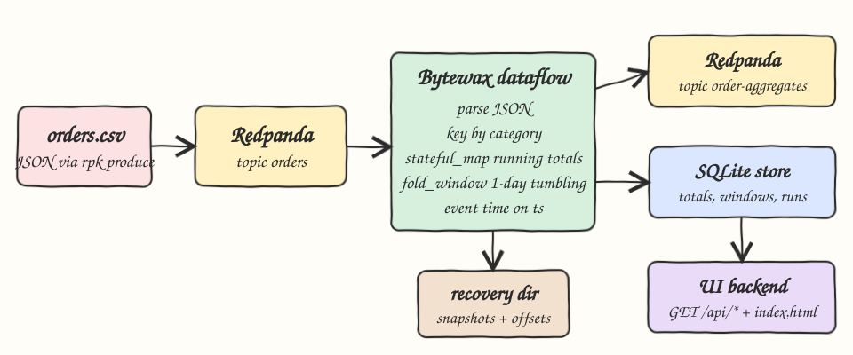
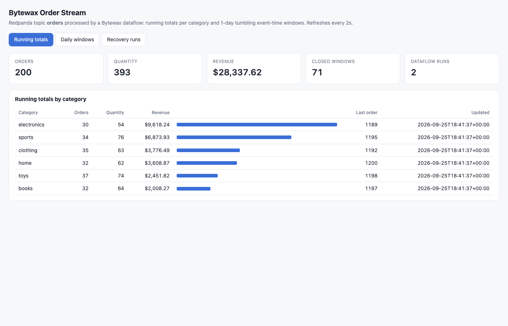
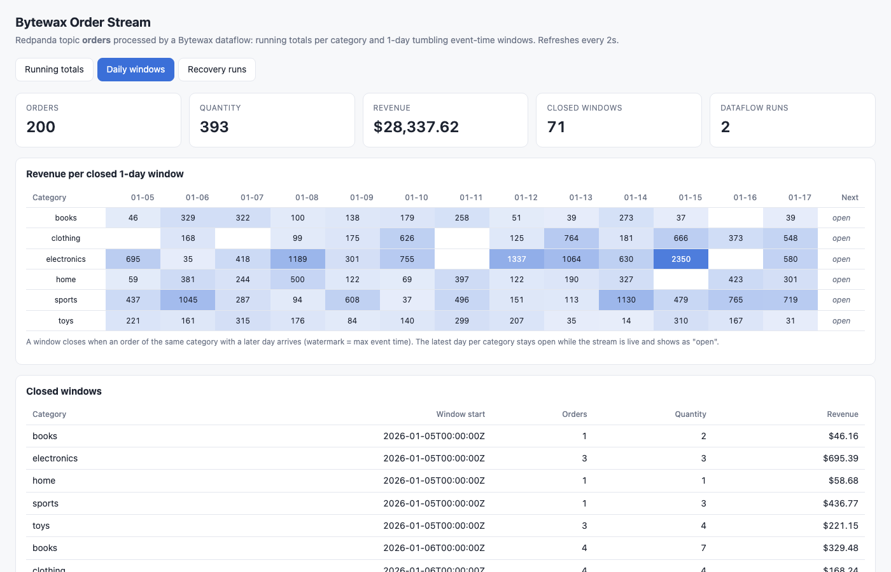
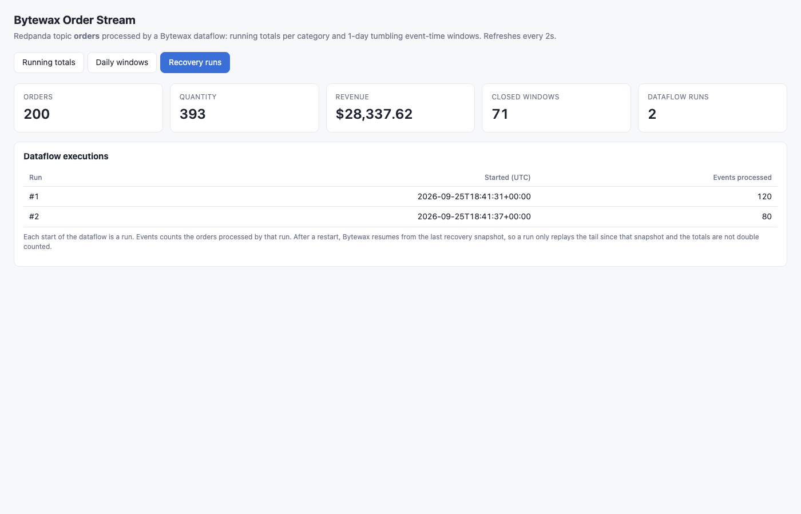

# bytewax-python-streaming

Stream processing in Python with Bytewax. The 200 orders of `data/orders.csv` are produced as JSON into the Redpanda topic `orders`. A Bytewax dataflow keys them by category, keeps running totals (orders, quantity, revenue) and 1-day tumbling event-time windows on `ts`, and writes every result to the Redpanda topic `order-aggregates` and to a SQLite store. A small UI shows running totals, closed windows and the dataflow runs, which is where crash recovery becomes visible.

## How it Works

1. `scripts/start-all.sh` starts Redpanda with `podman-compose`, creates `orders` and `order-aggregates`, produces the CSV as JSON with `rpk topic produce` when `orders` is empty, and starts the dataflow and the UI.
2. The dataflow (`dataflow/flow.py`) reads `orders` with the Bytewax Kafka connector and runs `dataflow/core.py`: `parse` JSON, `key_on` category, `stateful_map` for running totals and `fold_window` with a `TumblingWindower` of 1 day aligned to 2026-01-01.
3. The window clock is an `EventClock` on `ts` with a frozen system time, so the watermark is exactly the max event time seen per category. A day closes when an order of the same category from a later day arrives; the latest day per category stays open while the stream is live.
4. Revenue is `quantity * price`, kept as integer cents so the sums are exact.
5. Results go to Kafka (key = category, value = JSON) and to `state/store.db` with `INSERT OR REPLACE`, so a replay rewrites the same rows instead of adding to them.
6. The dataflow runs with recovery enabled (`-r state/recovery -s 1 -b 0`). Bytewax snapshots operator state and Kafka offsets every second. After a crash it resumes from the last snapshot: state and offsets come back together, so nothing is counted twice.
7. `ui/server.py` reads the SQLite store and serves `index.html` plus JSON under `/api/...`.

## Architecture



## Features

* Kafka API streaming source through Redpanda, the dataflow tails the topic and processes new orders as they arrive.
* Stateful running totals per category with `stateful_map`, one update per order.
* 1-day tumbling event-time windows with `fold_window`, closed by the watermark, not by wall clock.
* Crash recovery with Bytewax snapshots, verified by killing the dataflow with SIGKILL and resuming.
* Idempotent sinks: SQLite upserts by key, the last message per key in `order-aggregates` is the current value.
* A `runs` table records how many orders each dataflow execution processed, so a resume is visible.
* Unit tests with Bytewax `TestingSource` including an `ABORT` crash and resume.
* End to end test that compares the store and the output topic with an independent `awk` aggregation.

## Stack

* Python 3.12.12 for the dataflow: Bytewax 0.21.1 (latest, Nov 2024) ships wheels only up to cp312 and no sdist, so Python 3.13 and 3.14 cannot install it.
* Python 3.14.7 for the UI backend and the CSV to JSON converter: standard library only (`http.server`, `sqlite3`, `csv`).
* Bytewax 0.21.1 with the `kafka` extra (confluent-kafka 2.15.1): Python dataflows on a Rust (Timely Dataflow) runtime with built in recovery.
* Redpanda v26.2.3: Kafka API compatible broker, single container, `--smp 1 --memory 512M --overprovisioned`.
* SQLite: simplest store the UI can read, WAL mode so reads never block the sink.
* uv: creates the Python 3.12 venv for the dataflow.
* podman and podman-compose: run Redpanda.

## Contracts / APIs

| Method | Path | Returns |
|---|---|---|
| GET | `/` | `index.html` |
| GET | `/api/totals` | `[{category, orders, quantity, revenue_cents, revenue, last_order_id, updated_at}]` |
| GET | `/api/windows` | `[{category, window_start, orders, quantity, revenue_cents, revenue, updated_at}]` closed windows only |
| GET | `/api/runs` | `[{run_id, started_at, events}]` one row per dataflow execution |

Topic `orders` value:

```json
{"order_id":"1001","customer":"Emma Brown","product":"Building Blocks Set","category":"toys","quantity":"1","price":"42.87","ts":"2026-01-05T10:05:00Z"}
```

Topic `order-aggregates`, key = category:

```json
{"kind":"total","category":"toys","orders":37,"quantity":74,"revenue_cents":245182,"last_order_id":1198}
{"kind":"window","category":"toys","window_start":"2026-01-05T00:00:00Z","orders":3,"quantity":4,"revenue_cents":22115}
```

## Key data structures and design decisions

* Accumulator `{orders, quantity, revenue_cents}` is shared by the running total and the window fold, with `add` and `merge` as pure functions.
* Integer cents instead of floats, so the totals match `awk` to the cent.
* Frozen `now_getter` on the `EventClock`: the CSV is historical (January 2026), a real system clock would make window closing depend on how long the process runs. With the frozen clock it only depends on event time.
* Open windows are not flushed: a live stream never reaches EOF, so the last day of each category stays open until later data arrives. The unit tests show that a bounded input (EOF) flushes all 77 windows, and a live stream closes 71.
* Recovery is at least once on the sinks: after a crash Bytewax replays from the last snapshot. Sinks are upserts by key, so replays never inflate the numbers.
* Store tables: `totals(category PK)`, `windows(category, window_start PK)`, `runs(run_id PK, started_at, events)`.

## How to run

```bash
./scripts/setup.sh
./scripts/start-all.sh
./scripts/test-all.sh
./scripts/ui.sh
./scripts/stop-all.sh
```

`test-all.sh` runs the unit tests, then the crash and resume scenario:

1. Stops the dataflow, recreates both topics, wipes `state/` and initialises the recovery partition.
2. Produces rows 1-120, starts the dataflow, waits until the store has 120 orders and a snapshot is taken.
3. Kills the dataflow with SIGKILL, produces rows 121-200 and starts it again with the same recovery directory.
4. Checks the store totals, the last value per key in `order-aggregates` and the 71 closed windows against `awk`, and checks that the resumed run processed 80 orders, not 200.

Verified output:

```
expected totals from awk
books 32 64 2008.27
clothing 35 63 3776.49
electronics 30 54 9618.24
home 32 62 3608.87
sports 34 76 6873.93
toys 37 74 2451.82
actual totals from store
books 32 64 2008.27
clothing 35 63 3776.49
electronics 30 54 9618.24
home 32 62 3608.87
sports 34 76 6873.93
toys 37 74 2451.82
latest totals from topic order-aggregates (271 messages)
books 32 64 2008.27
clothing 35 63 3776.49
electronics 30 54 9618.24
home 32 62 3608.87
sports 34 76 6873.93
toys 37 74 2451.82
closed windows: expected 71, store has 71
dataflow runs
run 1 events 120
run 2 events 80
tests passed
```

271 messages = 200 running total updates + 71 closed windows, no duplicates after the resume.

## Printscreens

Running totals: KPI tiles for all orders, quantity and revenue, and one row per category with a revenue bar and the last order id folded into the running state.



Daily windows: a heatmap of revenue per category per closed 1-day window. The last column is the open window of each category, which the live stream has not closed yet.



Recovery runs: run 1 processed 120 orders and was killed with SIGKILL. Run 2 resumed from the snapshot and processed only the 80 new orders, and the totals still equal the CSV.



## Scripts

All scripts live in `scripts/` and run from any directory of the repository.

| Script | What it does |
|---|---|
| `./scripts/setup.sh` | Pulls the Redpanda image, creates the Python 3.12 venv and installs Bytewax |
| `./scripts/start-all.sh` | Starts Redpanda, the dataflow and the UI and prints the full link of each one |
| `./scripts/status.sh` | Shows every service port as UP or DOWN, plus the dataflow process |
| `./scripts/test-all.sh` | Runs the unit tests and the crash and resume test against `awk` |
| `./scripts/ui.sh` | Opens the UI in the browser |
| `./scripts/stop-all.sh` | Stops every service |
| `./scripts/sql-console.sh` | Opens a `sqlite3` console on `state/store.db` |

Ports are declared in `scripts/ports.env` (Redpanda 22892, UI 22880).

```bash
./scripts/setup.sh
./scripts/start-all.sh
./scripts/status.sh
./scripts/ui.sh
./scripts/stop-all.sh
```
