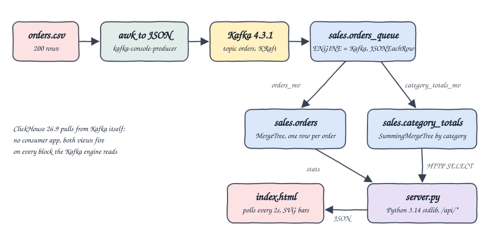
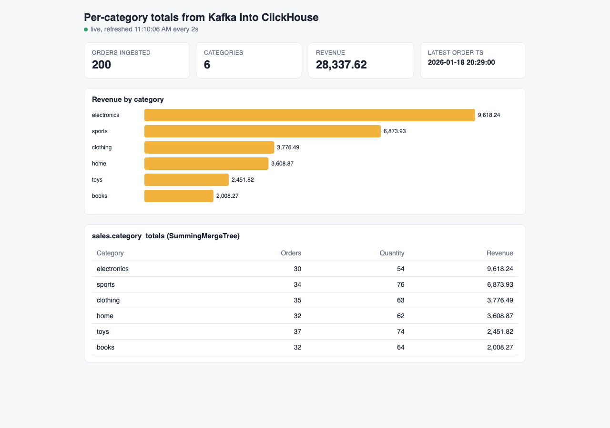

# clickhouse-kafka-engine

ClickHouse ingests orders from Kafka with no consumer application in between. It uses the Kafka table engine and two materialized views. One view writes every order into a MergeTree table. The other rolls orders up into a SummingMergeTree table that keeps per-category totals. A small Python page shows those totals live.

## How it Works

1. `start-all.sh` starts Kafka 4.3.1 (KRaft, single node) and ClickHouse 26.9 with podman-compose.
2. It creates the `orders` topic and applies `sql/schema.sql` to ClickHouse.
3. awk turns each row of `data/orders.csv` into one JSON line. The lines are piped into `kafka-console-producer.sh` inside the Kafka container.
4. `sales.orders_queue` (`ENGINE = Kafka`, `JSONEachRow`) consumes the topic with the consumer group `i30-clickhouse`.
5. `sales.orders_mv` writes every consumed row to `sales.orders` (MergeTree) and parses `ts` into a `DateTime`.
6. `sales.category_totals_mv` groups every consumed block by category and writes partial sums to `sales.category_totals` (SummingMergeTree).
7. `server.py` sends SQL to the ClickHouse HTTP interface. The page polls `/api/totals` and `/api/stats` every 2 seconds.

## Architecture



## Features

* Ingestion inside the database: ClickHouse is the Kafka consumer, so no stream processor or consumer app is needed.
* Two views on one Kafka table: raw rows and aggregates come from the same consumed block, in one pass.
* SummingMergeTree totals: the per-category rows merge in the background, and queries still use `sum() ... GROUP BY` so rows from parts that have not merged yet are counted correctly.
* Exact money: `price` is `Decimal(10,2)` and revenue is `Decimal(18,2)`, so there is no float drift.
* Live UI: the page polls every 2 seconds and updates as new messages land on the topic.
* Idempotent start: the producer runs only when the topic is empty, so a second `start-all.sh` does not produce duplicates.

## Stack

* ClickHouse 26.9.2.8 (`clickhouse/clickhouse-server`): the Kafka engine, MergeTree, SummingMergeTree and materialized views.
* Apache Kafka 4.3.1 (`apache/kafka`, KRaft): a single broker and controller with no ZooKeeper.
* Kafka console producer: the simplest producer, it ships in the Kafka image.
* Python 3.14 standard library: `http.server` and `urllib` for the UI backend, with no packages to install.
* Plain HTML, JS and SVG: a single `index.html` with no frameworks.
* podman and podman-compose: run both containers with small memory limits (Kafka heap 384m, ClickHouse 1g).

## Contracts

Kafka message on topic `orders`, one JSON object per message:

```json
{"order_id":1001,"customer":"Emma Brown","product":"Building Blocks Set","category":"toys","quantity":1,"price":42.87,"ts":"2026-01-05T10:05:00Z"}
```

ClickHouse tables (full DDL in `sql/schema.sql`):

| Table | Engine | Purpose |
|---|---|---|
| `sales.orders_queue` | Kafka | reads topic `orders` as `JSONEachRow` |
| `sales.orders` | MergeTree | one row per order, `ORDER BY (category, order_id)` |
| `sales.category_totals` | SummingMergeTree | `total_orders`, `total_quantity`, `total_revenue` per category |
| `sales.orders_mv` | Materialized view | `orders_queue` to `orders` |
| `sales.category_totals_mv` | Materialized view | `orders_queue` grouped by category to `category_totals` |

REST API:

| Method | Path | Response |
|---|---|---|
| GET | `/` | the UI page |
| GET | `/api/totals` | `[{"category":"electronics","orders":30,"quantity":54,"revenue":9618.24}, ...]` sorted by revenue |
| GET | `/api/stats` | `[{"orders":200,"categories":6,"revenue":28337.62,"last_ts":"2026-01-18 20:29:00"}]` |

## Key Design Decisions

* SummingMergeTree over AggregatingMergeTree: the totals are plain sums, so SummingMergeTree needs no `-State` / `-Merge` combinators.
* Both views read from `orders_queue`, not from `sales.orders`. The totals therefore do not depend on the raw table, and the test checks that the two paths agree.
* Kafka has two listeners. `PLAINTEXT` is advertised on the host port. `INTERNAL` (`i30-kafka:29092`) is used by ClickHouse and by the console tools on the podman network.
* `kafka_flush_interval_ms = 1000` so new messages show up in the UI within about a second.
* The containers have no volumes. The topic, the consumer offsets and the tables are all dropped together on `stop-all.sh`, so they cannot get out of sync.
* `CLICKHOUSE_SKIP_USER_SETUP=1` keeps the passwordless `default` user reachable over HTTP. That is fine for a local POC and not for production.

## How to run

Requirements: podman with a started machine, podman-compose, Python 3.14 (`python3.14` on the PATH), lsof.

```bash
./scripts/setup.sh
./scripts/start-all.sh
./scripts/test-all.sh
./scripts/ui.sh
./scripts/stop-all.sh
```

`test-all.sh` computes the expected totals with awk directly from the CSV. It then checks that:

* `sales.orders` holds exactly 200 rows with 200 distinct `order_id`s, so nothing was lost or duplicated.
* `sales.category_totals`, the SummingMergeTree path, matches awk.
* `sales.orders` grouped by category, the MergeTree path, matches awk.
* `GET /api/totals`, the numbers the UI shows, matches awk.

Verified output:

```
books 32 64 2008.27
clothing 35 63 3776.49
electronics 30 54 9618.24
home 32 62 3608.87
sports 34 76 6873.93
toys 37 74 2451.82
PASS sales.orders holds 200 rows, 200 distinct order ids, csv has 200
PASS sales.category_totals (SummingMergeTree via kafka mv) matches awk
PASS sales.orders (MergeTree via kafka mv) matches awk
PASS GET /api/totals matches awk
all checks passed
```

## Printscreens



The single page of the UI. The tiles show how many orders ClickHouse has ingested into `sales.orders`, the number of categories, the total revenue and the latest order timestamp. The bar chart and the table read `sales.category_totals`, the SummingMergeTree filled by the Kafka materialized view. The green dot shows that the page is polling the backend every 2 seconds.

## Scripts

All scripts live in `scripts/` and run from any directory of the repository.

| Script | What it does |
|---|---|
| `./scripts/setup.sh` | Checks the tools and pulls the Kafka and ClickHouse images |
| `./scripts/start-all.sh` | Starts Kafka, ClickHouse and the UI, applies the schema, produces the orders and prints the full link of each service |
| `./scripts/status.sh` | Shows every service port as UP or DOWN |
| `./scripts/test-all.sh` | Checks ClickHouse and the API against awk |
| `./scripts/ui.sh` | Opens the UI in the browser |
| `./scripts/stop-all.sh` | Stops every service |
| `./scripts/sql-console.sh` | Opens `clickhouse-client` on the `sales` database |

Ports are declared in `scripts/ports.env`: Kafka `23092`, ClickHouse HTTP `23123`, UI `23080`.

```bash
./scripts/setup.sh
./scripts/start-all.sh
./scripts/status.sh
./scripts/ui.sh
./scripts/stop-all.sh
```
