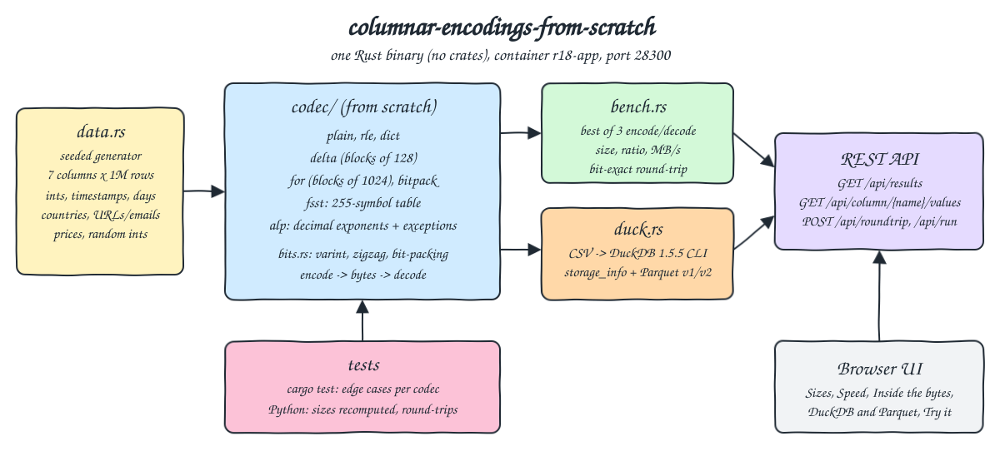
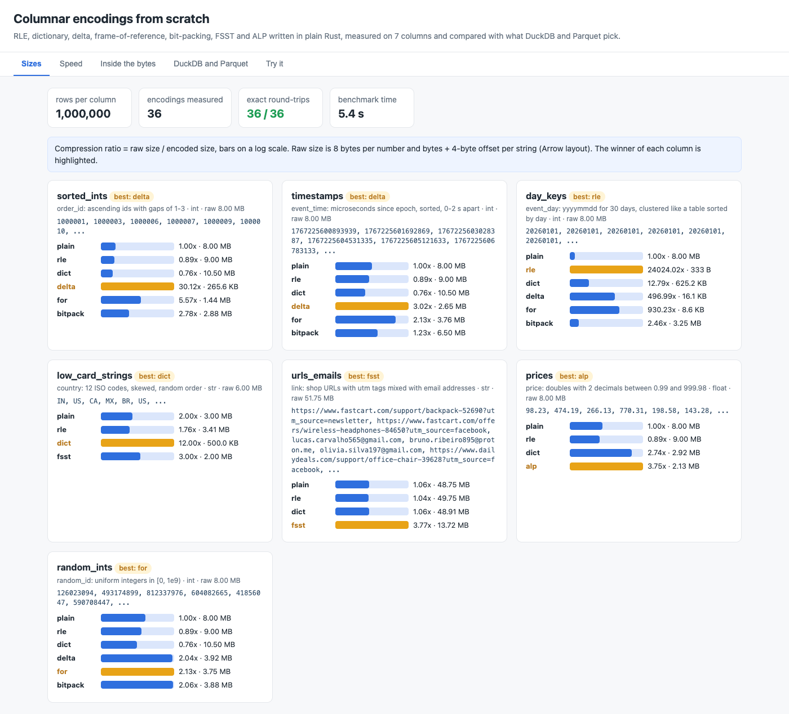
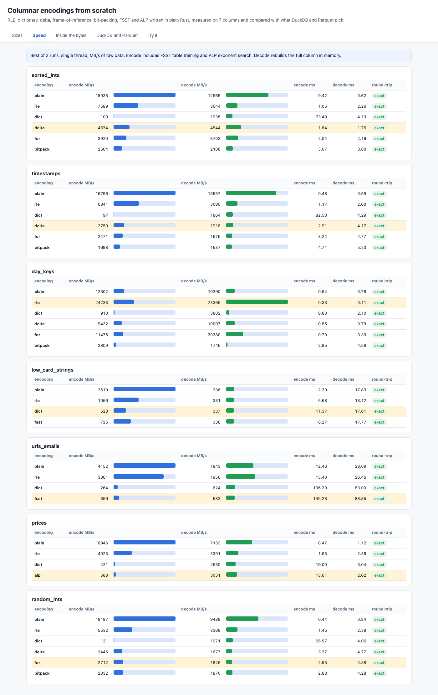
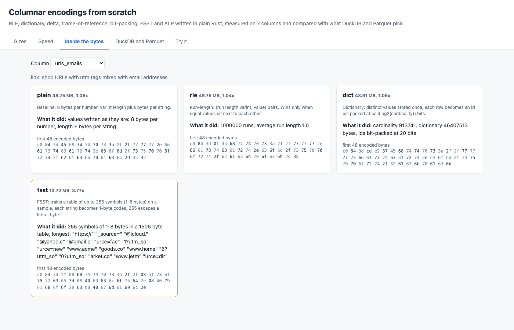
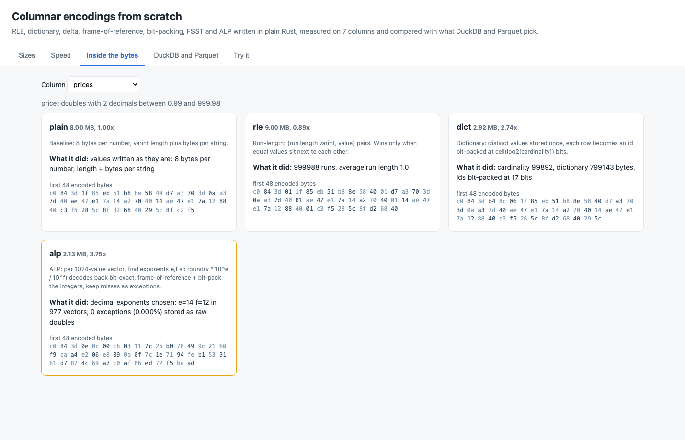
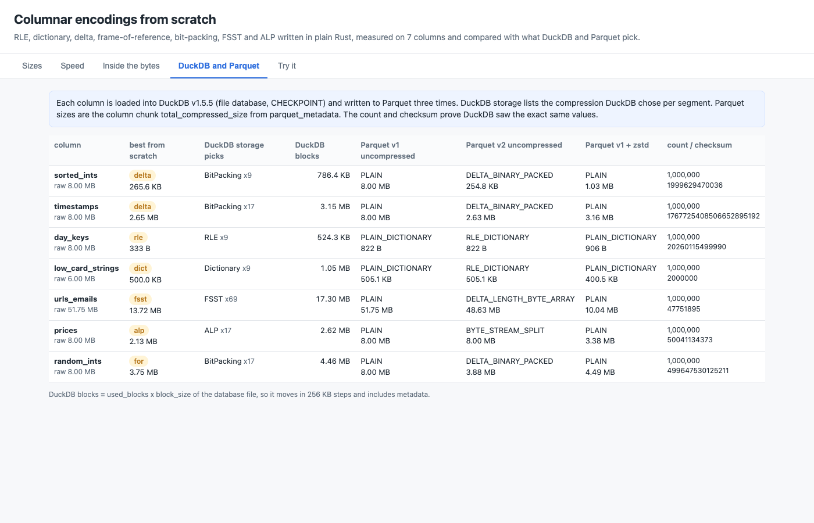
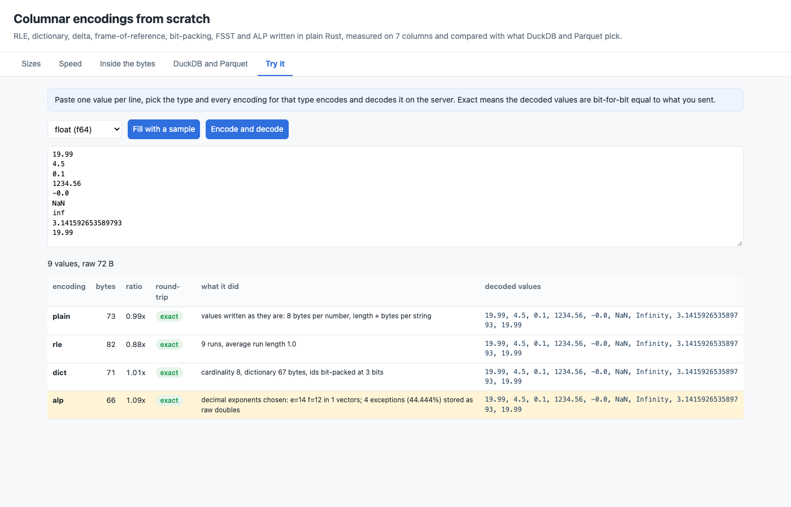

# columnar-encodings-from-scratch

The encodings that make columnar formats small, written from scratch in plain Rust with zero crates: RLE, dictionary, delta, frame-of-reference, bit-packing, FSST (Fast Static Symbol Table for strings) and ALP (Adaptive Lossless floating Point). They run on 7 generated columns of 1,000,000 rows each (sorted ids, timestamps, clustered day keys, low-cardinality strings, URLs and emails, prices as doubles, random ints). The POC measures encoded size, compression ratio, encode and decode speed, and checks that every decode gives back exactly the original data. The same columns then go through DuckDB 1.5.5 to see which compression DuckDB storage picks and which encodings its Parquet writer uses. A small web UI and a REST API show the results.

## How it Works

1. `src/data.rs` generates 7 columns from a seeded xorshift generator, so every run produces the same values.
2. `src/codec/` holds one file per encoding. Each one writes its own byte format (`Vec<u8>`) and reads it back. The shared building blocks are in `src/bits.rs`: LEB128 varints, zigzag and a bit packer for any width from 0 to 64.
3. `src/bench.rs` runs every encoding that fits the column type (6 for ints, 4 for doubles, 4 for strings), keeps the best of 3 runs for encode and decode, and compares the decoded column with the original. Doubles are compared bit by bit.
4. `src/duck.rs` writes each column to CSV and runs the DuckDB CLI on it. DuckDB loads the column into a file database and runs `CHECKPOINT`. The POC then reads `pragma_storage_info` for DuckDB's pick, writes Parquet v1, Parquet v2 and Parquet zstd files, and reads their encodings and sizes with `parquet_metadata`.
5. `src/main.rs` is a small HTTP server on `std::net`. It serves the UI, the results, the raw column values, and a round-trip endpoint where you can send your own values.
6. The tests recompute the exact byte size of 6 encoding formats in Python, independently of the Rust code, and send real and adversarial values through the round-trip API.

## Architecture



## Features

* Every encoding is written by hand, and no compression library is used, so the byte layout of each format is easy to see and reason about.
* Exact round-trip: 36 of 36 column/encoding pairs decode bit-for-bit. This covers NaN, -0.0, infinities, subnormals, i64 extremes, empty strings and unicode.
* FSST learns a 255-symbol table in 5 generations over a 64 KB sample. It finds symbols like `https://`, `_source=` and `@gmail.c` and compresses the URL/email column 3.77x.
* ALP searches the decimal exponent pair (e, f) per 1024-value vector. Prices compress 3.75x with 0 exceptions, and random doubles still round-trip exactly because misses are stored as exceptions.
* Delta and frame-of-reference work in blocks (128 and 1024 values) with a local minimum per block, so a single outlier only widens its own block.
* Plain bit-packing, with no reference point, is kept as a baseline. On timestamps it needs 52 bits per value, while FOR needs 30 and delta needs 21.
* DuckDB and Parquet cross-check: the POC shows next to our result which compression DuckDB storage chose and which encodings Parquet v1 and v2 used. It also checks with a count and a checksum that DuckDB saw the same values.
* The Try it tab encodes any values you paste with every encoding and shows sizes, what each encoder did, and the decoded values.

## Stack

* Rust 1.98.1 (`docker.io/library/rust:1.98.1-slim`): builds a single release binary. The encoders, the HTTP server and the JSON output use only the standard library, with zero crates.
* DuckDB CLI 1.5.5 (GitHub release binary for the host architecture): the reference for which compression DuckDB (ALP, FSST, Dictionary, RLE, BitPacking) and Parquet choose.
* Python 3.14.7 (`docker.io/library/python:3.14.7-slim`): the runtime image. The API tests use only the stdlib (`unittest`, `urllib`, `struct`).
* Plain HTML, CSS and JS: the UI, embedded in the binary with `include_str!`. No framework.
* podman and podman-compose: one container `r18-app` (1536 MB limit, 2 CPUs, uses about 320 MB) on network `r18-net`.

## Contracts / APIs

| Method | Path | Description |
|---|---|---|
| GET | `/` | UI |
| GET | `/api/health` | `{"status":"UP"}` |
| GET | `/api/results` | Full benchmark: per column raw size, best encoding, and per encoding bytes, ratio, ms, MB/s, round-trip, detail, first 48 bytes, DuckDB/Parquet block. Returns 503 while a run is in progress |
| POST | `/api/run` | Reruns the benchmark in the background (`202 {"started":true}`) |
| GET | `/api/columns` | Column names, types, row counts |
| GET | `/api/column/{name}/values?limit=N` | The raw values of a column as a JSON array |
| POST | `/api/roundtrip?type=int\|float\|str[&encoding=delta]` | Body: first line is the count, then one value per line. Ints are decimal. Floats are decimal or `0x` plus 16 hex digits of the IEEE bits. Strings are the hex of their UTF-8 bytes. The response has the encoded size and the decoded values in the same token format |

```json
{"generated_unix":1790000000,"rows":1000000,"runs":3,"duckdb_version":"v1.5.5 (Variegata) d8cdaa33fd","elapsed_s":5.365,
 "columns":[{"name":"prices","about":"price: doubles with 2 decimals between 0.99 and 999.98","type":"float","rows":1000000,"raw_bytes":8000000,"best":"alp",
   "sample":["98.23","474.19","..."],
   "encodings":[{"name":"alp","bytes":2130865,"ratio":3.754,"encode_ms":13.6,"decode_ms":2.62,"encode_mbs":588,"decode_mbs":3051,"roundtrip":true,
                 "detail":"decimal exponents chosen: e=14 f=12 in 977 vectors; 0 exceptions (0.000%) stored as raw doubles","head_hex":"c0843d0e0c00..."}],
   "duckdb":{"storage":[{"compression":"ALP","segments":17}],"db_bytes":2621440,"count":1000000,"checksum":"50041134373",
             "parquet_v1":{"encodings":"PLAIN","bytes":8000279},"parquet_v2":{"encodings":"BYTE_STREAM_SPLIT","bytes":8000279},"parquet_zstd":{"encodings":"PLAIN","bytes":3377148}}}]}
```

## Key data structures and design decisions

* `Values` is an enum `Int(Vec<i64>) | Float(Vec<f64>) | Str(Vec<String>)`. `encode(name, &Values) -> Encoded { bytes, detail }` and `decode(name, kind, &[u8]) -> Values`. Every format starts with a varint row count, so a decoder never needs outside metadata.
* RLE and dictionary share one generic `Item` trait (8 fixed bytes for numbers, varint length plus bytes for strings). Values are stored at full width on purpose, so RLE and dictionary only win through runs and repetition, never through a hidden varint.
* Dictionary ids are bit-packed at `ceil(log2(cardinality))` bits: 4 bits for 12 countries, 20 bits for 913,741 distinct URLs (so dictionary is useless there, and FSST wins).
* Delta follows the Parquet `DELTA_BINARY_PACKED` idea: first value, then blocks of 128 deltas, each with its own min delta and bit width. On sorted ids it comes to 265.6 KB, against 254.8 KB for DuckDB's Parquet v2 writer.
* FSST uses code 255 as the escape, with up to 255 symbols of 1 to 8 bytes stored as a `u64` plus a length. Lookup goes through a per-first-byte candidate list sorted longest first. Symbol gain is `count x length`, counted over single symbols and adjacent pairs in each generation, as in the paper.
* ALP encodes a value as `round(v * 10^e * 10^-f)` and keeps it only if `int * 10^f * 10^-e` gives back the same 64 bits. It picks the top 5 (e, f) pairs on a sample of the whole column, then the cheapest pair per vector, and stores misses as `(u16 position, raw f64)`. ALP_rd for high-precision doubles is not implemented. Random doubles fall back to exceptions, which is exact but does not compress.
* Raw size is 8 bytes per number and bytes plus a 4-byte offset per string (the Arrow layout). This is why plain strings show 2.00x on 2-letter country codes.
* The DuckDB storage size (`used_blocks x block_size`) moves in 256 KB blocks and includes metadata, so it is only a rough size. The Parquet sizes are exact column chunk sizes.
* The container, network and volume names all start with `r18-` (`r18-app`, `r18-net`, `r18-cargo-target` for the cargo cache used by the tests).

## Results (1,000,000 rows, podman VM, single thread, best of 3)

| Column | Raw | Best from scratch | Ratio | DuckDB storage | Parquet v2 uncompressed | Parquet v1 zstd |
|---|---|---|---|---|---|---|
| sorted_ints | 8.00 MB | delta 265.6 KB | 30.1x | BitPacking | DELTA_BINARY_PACKED 254.8 KB | PLAIN 1.03 MB |
| timestamps | 8.00 MB | delta 2.65 MB | 3.02x | BitPacking | DELTA_BINARY_PACKED 2.63 MB | PLAIN 3.16 MB |
| day_keys | 8.00 MB | rle 333 B | 24024x | RLE | RLE_DICTIONARY 822 B | PLAIN_DICTIONARY 906 B |
| low_card_strings | 6.00 MB | dict 500.0 KB | 12.0x | Dictionary | RLE_DICTIONARY 505.1 KB | PLAIN_DICTIONARY 400.5 KB |
| urls_emails | 51.75 MB | fsst 13.72 MB | 3.77x | FSST | DELTA_LENGTH_BYTE_ARRAY 48.63 MB | PLAIN 10.04 MB |
| prices | 8.00 MB | alp 2.13 MB | 3.75x | ALP | BYTE_STREAM_SPLIT 8.00 MB | PLAIN 3.38 MB |
| random_ints | 8.00 MB | for 3.75 MB | 2.13x | BitPacking | DELTA_BINARY_PACKED 3.88 MB | PLAIN 4.49 MB |

* For every column, the encoding that wins here is from the same family DuckDB picks for its own storage (DuckDB uses BitPacking with its own delta/FOR modes for ints).
* Random ints cannot go below `64 / log2(1e9) = 2.14x`. FOR reaches 2.13x and the tests check that no encoding beats that bound.
* General-purpose zstd on plain Parquet beats FSST on URLs (10.04 MB vs 13.72 MB), but FSST can decode or compare a single string without decompressing a whole page. ALP beats zstd on prices (2.13 MB vs 3.38 MB).
* Decode speed: FOR/delta/bitpack decode at 1.5 to 4.5 GB/s, ALP at about 3 GB/s, FSST at about 0.6 GB/s. The slowest encoders are dictionary on high-cardinality ints (HashMap, about 0.1 GB/s) and FSST including training (about 0.36 GB/s).

## How to run

Requirements: podman, podman-compose, curl and lsof. Rust, DuckDB and Python run inside containers.

```bash
./scripts/setup.sh
./scripts/start-all.sh
./scripts/test-all.sh
./scripts/ui.sh
./scripts/stop-all.sh
```

`test-all.sh` runs `cargo test` in the Rust image, reruns the benchmark, then runs `tests/test_encodings.py` inside `r18-app`. The tests check:

* Raw size equals an independent count of the values fetched from `/api/column/{name}/values`.
* The byte size of plain, RLE, dictionary, delta, FOR and bit-packing on every column matches a Python reimplementation of the size formula (runs, distinct values, per-block min and bit width, zigzag widths). That is 39 exact byte matches.
* 20,000 real values of every column go through `/api/roundtrip` with every encoding, and the decoded tokens equal what was sent.
* Adversarial values round-trip bit-for-bit: i64 min/max (delta overflow), NaN, -0.0, infinities, 5e-324, `0.1 + 0.2`, empty lists, empty strings, unicode, newlines and NUL. Their sizes also match the Python formula.
* ALP keeps random doubles exact through exceptions (the detail reports more than 0 exceptions).
* Each column is won by the encoding built for its shape: delta for sorted ints and timestamps, RLE for clustered days, dictionary for countries, FSST for URLs, ALP for prices.
* No encoding beats the entropy bound on random integers.
* DuckDB count and checksum equal a Python recompute, so the comparison runs on identical data. DuckDB picks ALP, FSST, Dictionary and RLE for the matching columns, and our delta is within 10% of Parquet v2 `DELTA_BINARY_PACKED`.
* The Rust unit tests cover bit-packing at all widths 0 to 64, zigzag, edge cases per codec, and that garbage input is rejected instead of decoded.

The tests were checked against a planted bug: dictionary ids packed 1 bit too wide failed the size test.

```
test bits::tests::pack_round_trips_every_width_including_64 ... ok
test codec::tests::decoding_garbage_fails_instead_of_inventing_values ... ok
test codec::tests::floats_survive_bit_for_bit_including_nan_and_negative_zero ... ok
test codec::tests::integers_survive_every_encoding_at_the_edges ... ok
test codec::tests::strings_survive_every_encoding_including_unicode_and_empty ... ok
test result: ok. 7 passed; 0 failed
test_adversarial_values_round_trip_bit_for_bit ... ok
test_alp_keeps_real_doubles_exact_through_exceptions ... ok
test_duckdb_and_parquet_choose_the_same_family_of_encoding ... ok
test_duckdb_loaded_exactly_the_same_values ... ok
test_each_column_is_won_by_the_encoding_built_for_its_shape ... ok
test_encoded_sizes_match_the_format_computed_independently_in_python ... ok
test_every_encoding_round_trips_real_column_slices_exactly ... ok
test_nothing_beats_the_entropy_of_random_integers ... ok
test_ratio_is_raw_size_over_encoded_size ... ok
test_raw_bytes_match_an_independent_count ... ok
test_ui_page_has_every_tab ... ok
Ran 11 tests in 5.283s
OK
all tests passed
```

## Printscreens

### Sizes



One card per column with its sample values and the compression ratio of every encoding, on a log scale. The winner is highlighted in orange. The top row shows 36 of 36 exact round-trips and the benchmark time.

### Speed



Encode and decode throughput in MB/s of raw data, and milliseconds, best of 3 runs, with the round-trip result per encoding. Plain is a memcpy-like upper bound. FSST and dictionary pay for training and hashing on encode.

### Inside the bytes: FSST



The URL/email column: what each encoder did and the first 48 encoded bytes. FSST's learned symbols (`https://`, `_source=`, `@icloud.`, `@gmail.c`) are visible, and so is the `ff` escape byte in the hex.

### Inside the bytes: ALP



The prices column: ALP picked one exponent pair for all 977 vectors with 0 exceptions. Dictionary needs 17-bit ids for 99,892 distinct prices, and RLE is larger than plain.

### DuckDB and Parquet



For each column: our best encoding and size, the compression DuckDB storage picked per segment, the DuckDB block size, and the Parquet v1, v2 and zstd encodings with column chunk sizes. The last column shows the count and checksum that prove DuckDB loaded the same values.

### Try it



Values pasted as floats, including -0.0, NaN and infinity. Every float encoding returns them bit-exact. ALP stores the 4 values it cannot express as decimals as exceptions.

## Scripts

All scripts live in `scripts/` and run from any directory of the repository.

| Script | What it does |
|---|---|
| `./scripts/setup.sh` | Pulls the Rust and Python images and builds the app image (Rust release build plus the DuckDB CLI) |
| `./scripts/start-all.sh` | Starts `r18-app`, waits for the benchmark and prints the full link of each endpoint |
| `./scripts/status.sh` | Shows every service port as UP or DOWN |
| `./scripts/test-all.sh` | Runs cargo test and the API tests |
| `./scripts/ui.sh` | Opens the UI in the browser |
| `./scripts/stop-all.sh` | Stops every service |

Ports are declared in `scripts/ports.env` (`ui=28300`).

```bash
./scripts/setup.sh
./scripts/start-all.sh
./scripts/status.sh
./scripts/ui.sh
./scripts/stop-all.sh
```
