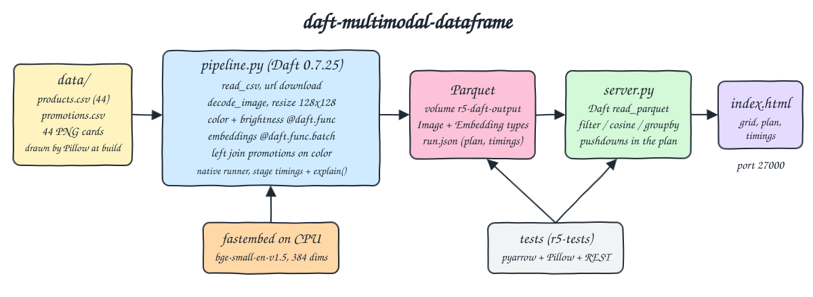
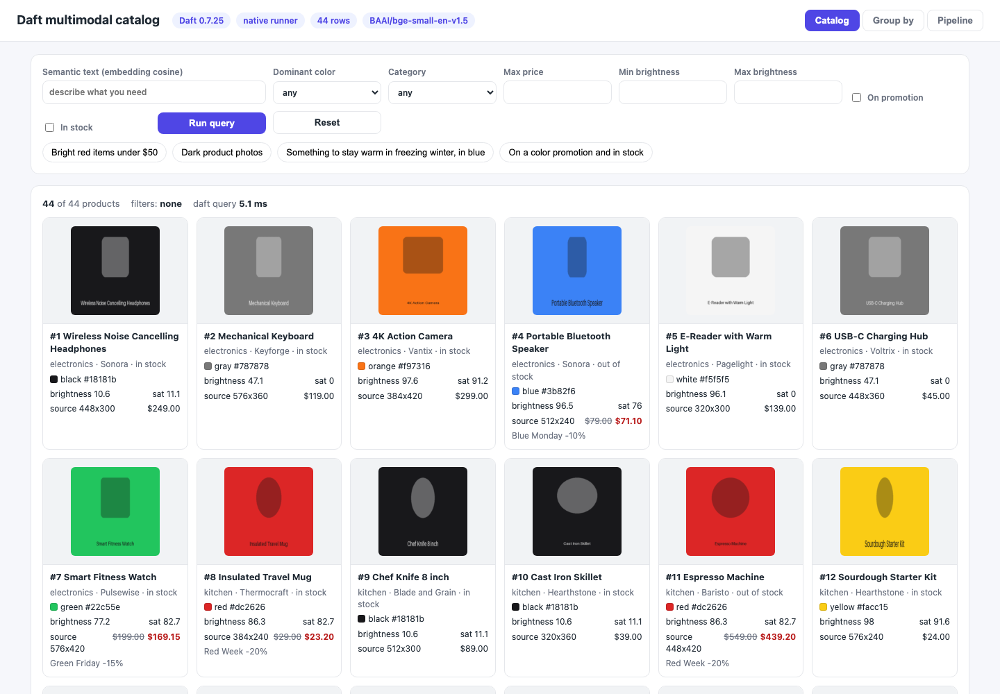
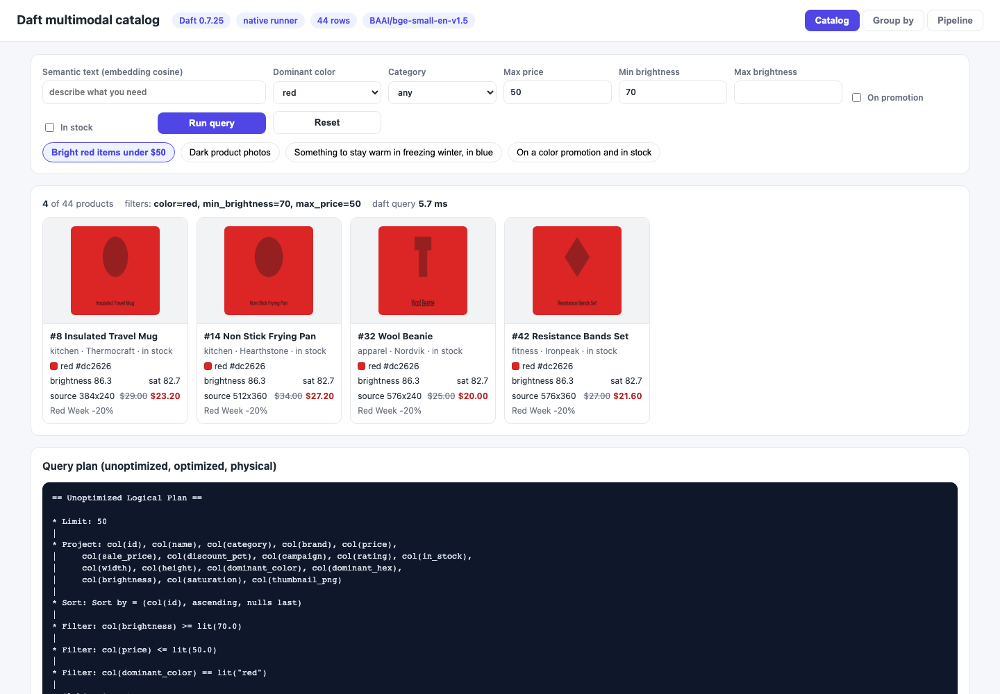
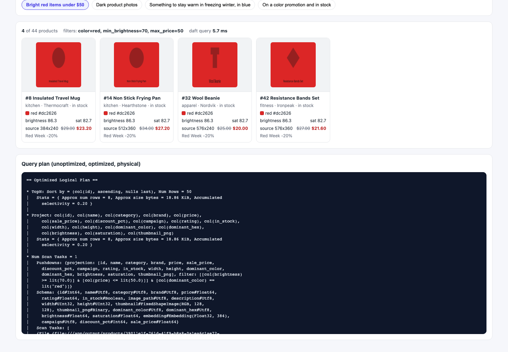
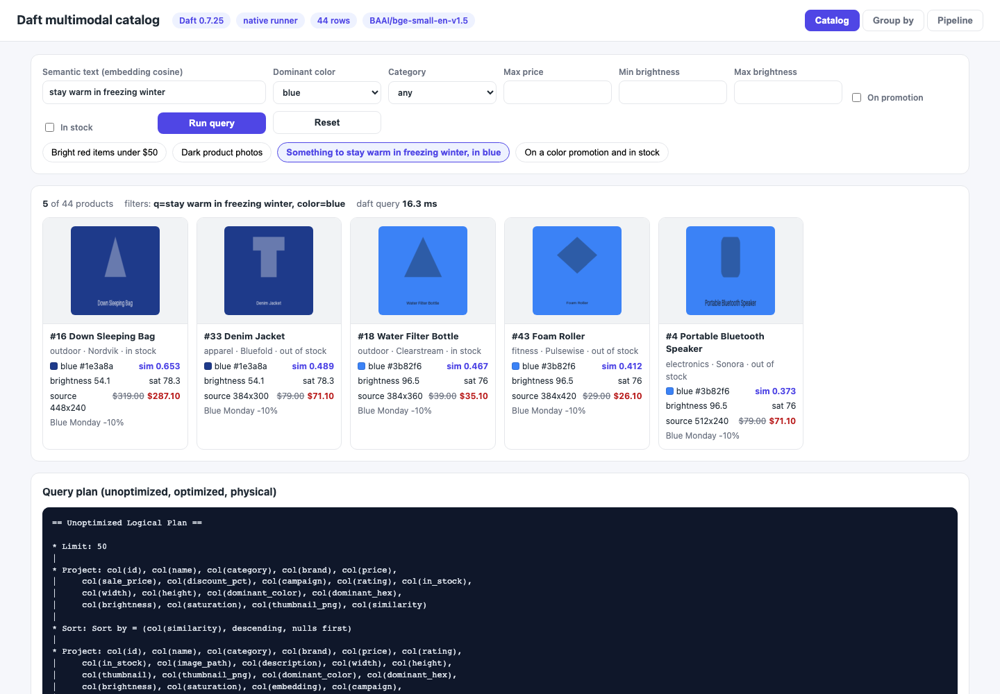
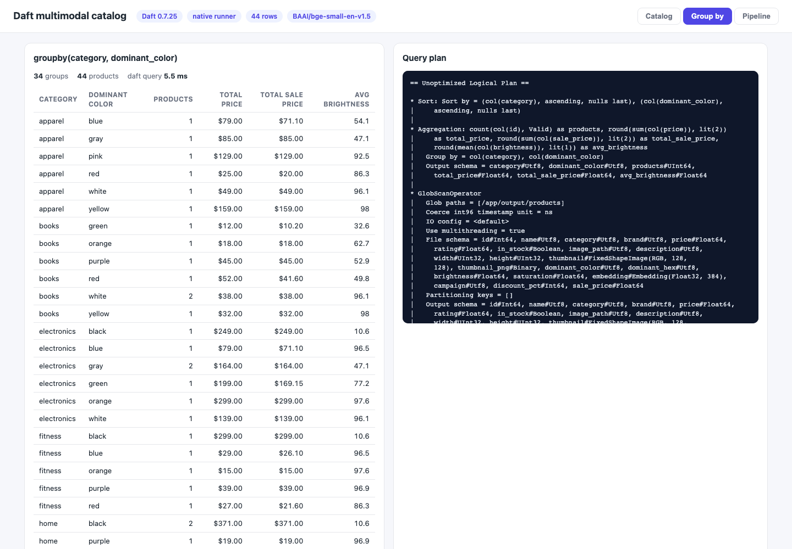
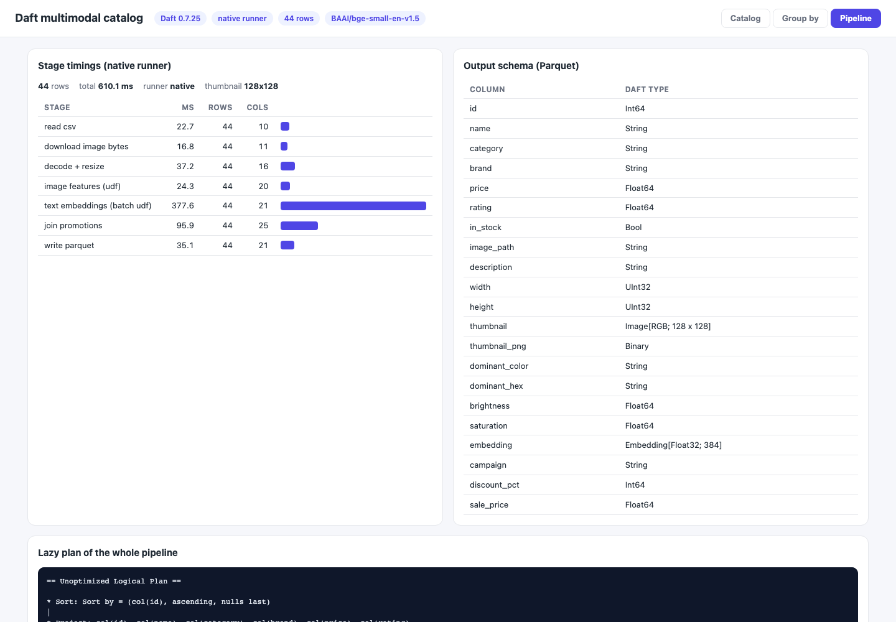
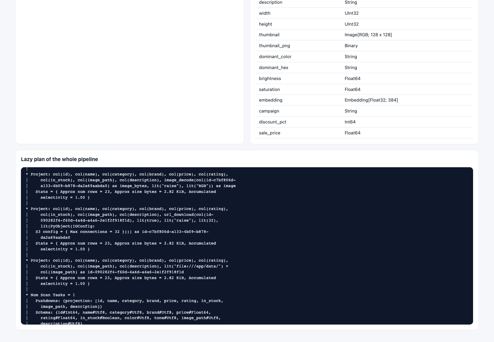

<p align="center"></p>

# daft-multimodal-dataframe

Daft (Rust core, Python API, by Eventual) as one dataframe for tabular rows, images and text embeddings together. The 44 products of `data/products.csv` each have a product image, drawn deterministically with Pillow while the container image is built (no downloads). One Daft pipeline reads the CSV, downloads the image bytes by URL, decodes them, resizes them to 128x128 thumbnails, derives the dominant color and brightness from the pixels, embeds the product text on CPU, joins a promotions table on the detected color and writes everything to Parquet. A small UI queries that Parquet with Daft, mixing image-derived, tabular and semantic filters ("bright red items under $50"), and shows the result grid with thumbnails, the query plan with its pushdowns, a groupby and the timing of each pipeline stage.

## How it Works

1. `app/generate_images.py` draws one PNG card per CSV row: a full-bleed background in the row's `color`/`tone`, a category shape and the product name. Sizes differ per product (320x240 up to 576x420). This runs in the `Containerfile`, so the images are part of the image.
2. `app/pipeline.py` reads the CSV with `daft.read_csv` and drops the `color` and `tone` columns right away. They are ground truth for the tests only, so every color the pipeline reports comes from pixels.
3. `col("image_url").download()` reads the bytes (`file://` here, the same call reads `s3://`, `gs://` or `https://`), `.decode_image(mode="RGB")` decodes them and `.resize(128, 128)` makes fixed-shape thumbnails, `.encode_image("PNG")` keeps a PNG copy for the browser. All of these run in Daft's Rust core.
4. `image_features` is a row-wise `@daft.func` UDF over the thumbnail (a numpy array): the most frequent quantized pixel is the dominant color, its HSV hue names the color, its HSV value (0-100) is the brightness.
5. `text_embedding` is a `@daft.func.batch` UDF that embeds `name. description` with fastembed (`BAAI/bge-small-en-v1.5`, 384 dims) into a Daft `Embedding[Float32; 384]` column.
6. `data/promotions.csv` is left-joined on the detected `dominant_color`, so the sale price of a product depends on what its image looks like.
7. Each stage is collected once and timed, the whole pipeline is also built lazily once and `explain(show_all=True)` is saved, then the result is written with `write_parquet(..., write_mode="overwrite")` into the `r5-daft-output` volume together with `run.json`.
8. `app/server.py` (stdlib `http.server`) answers every request with a new Daft query over the Parquet: filters, cosine similarity against the embedded query text, groupby. The plan of each query is returned next to its rows.

## Architecture



## Features

* One dataframe, three modalities: `Image[RGB; 128 x 128]`, `Embedding[Float32; 384]`, binary PNG and plain columns live in the same Daft table and the same Parquet file, so there is no side store for blobs or vectors.
* Image ops in the engine: download, decode, resize and encode are Daft expressions, they run in Rust in parallel and need no Pillow code in the pipeline.
* Features from pixels: dominant color, hex, brightness and saturation come from a UDF over the thumbnail, so filters like "red" or "bright" work on what the picture shows, not on a label someone typed.
* Semantic search in the dataframe: `col("embedding").cosine_similarity(query_vector)` ranks products inside the Daft query, and combines with pixel and price filters in the same plan.
* Multimodal join: the promotions table joins on the image-derived color, an ordinary relational join keyed by a value computed from images.
* Visible optimizer: the UI shows unoptimized, optimized and physical plans. Filters and column selections are pushed down into the Parquet scan, the CSV scan skips the dropped ground-truth columns, and `url_download` is split into its own projection before `image_decode` so the IO runs asynchronously apart from compute.
* Per-stage timings: read, download, decode + resize, image UDF, embedding UDF, join and write, each with its row and column count.
* Idempotent: the Parquet output is overwritten, a second pipeline run keeps 44 rows.
* Native runner on one node. The same code runs on a cluster with `daft.set_runner_ray()` (Ray runner), with no change to the expressions or UDFs; it is not used here.

## Stack

* Daft 0.7.25: latest release on PyPI, the one Python dependency that does the dataframe, the image ops, the UDFs, the joins and Parquet IO. The abi3 wheel runs on Python 3.14.
* Python 3.14.7 (`docker.io/library/python:3.14.7-slim`): pipeline, API and UI server in one image.
* fastembed 0.8.1 (onnxruntime 1.30.0): CPU embeddings without torch, the model is downloaded while the image is built and loaded with `HF_HUB_OFFLINE=1`.
* `BAAI/bge-small-en-v1.5` (about 67 MB, 384 dims): small, fast, good for short English product texts.
* Pillow 12.3.0: draws the product images at build time, and the tests use it to decode thumbnails independently of Daft.
* pyarrow 25.0.1 (pulled by Daft): the tests read the Parquet with it, not with Daft.
* Python stdlib `http.server` and plain HTML, CSS and JS: no web framework.
* podman + podman-compose: the one-shot pipeline, the UI and the test runner share one image and one volume.

## Contracts / APIs

| Method | Path | Description |
|---|---|---|
| GET | `/` | UI |
| GET | `/api/info` | Daft version, runner, model, Parquet row count and schema, preset queries, `run.json` (stage timings and lazy pipeline plan) |
| GET | `/api/products?color=&category=&max_price=&min_brightness=&max_brightness=&promo=true&in_stock=true&q=&limit=` | Daft query over the Parquet. `q` adds a `similarity` column (cosine to the embedded text) and sorts by it, otherwise rows are sorted by id. Returns rows with the thumbnail as a PNG data URI, the plan and the elapsed ms |
| GET | `/api/groupby` | `groupby(category, dominant_color)` with product count, total price, total sale price and average brightness, plus the plan |

```json
{"params": {"color": "red", "min_brightness": "70", "max_price": "50"}, "count": 4, "elapsed_ms": 6.2,
 "rows": [{"id": 8, "name": "Insulated Travel Mug", "category": "kitchen", "price": 29.0, "sale_price": 23.2,
           "discount_pct": 20, "campaign": "Red Week", "width": 384, "height": 240, "dominant_color": "red",
           "dominant_hex": "#dc2626", "brightness": 86.3, "saturation": 82.7, "thumbnail": "data:image/png;base64,..."}],
 "plan": "== Unoptimized Logical Plan == ..."}
```

The optimized plan of that query, the three filters and the column list end up inside the scan:

```
* Num Scan Tasks = 1
|   Pushdowns: {projection: [id, name, category, brand, price, sale_price,
|     discount_pct, campaign, rating, in_stock, width, height, dominant_color,
|     dominant_hex, brightness, saturation, thumbnail_png], filter: [[col(brightness)
|     >= lit(70.0)] & [col(price) <= lit(50.0)]] & [col(dominant_color) ==
|     lit("red")]}
```

## Key data structures and design decisions

* One Parquet row per product: CSV columns (minus `color` and `tone`), `width`/`height` of the source image, `thumbnail` (Daft `Image[RGB; 128 x 128]`, stored as a fixed size list of 49152 bytes with Daft extension metadata), `thumbnail_png`, `dominant_color`, `dominant_hex`, `brightness`, `saturation`, `embedding`, `campaign`, `discount_pct`, `sale_price`.
* Ground truth lives only in the CSV: `color` and `tone` say how each image was drawn. The pipeline never sees them, the tests compare the pixel-derived columns against them.
* Color naming is HSV based (saturation below 25 is black, gray or white by value, otherwise hue ranges), not a lookup of the generator palette. Brightness is the HSV value of the dominant color, so every light tone is at least 77 and every dark tone at most 63, and 70 splits them.
* Thumbnails are fixed 128x128 (Daft `resize` takes both sides), which makes a fixed-shape image column. Source aspect ratios are lost, the originals keep their `width` and `height`.
* Stage timings materialize after each stage on purpose (so each stage has a number), while the saved plan is the fully lazy version, which is what Daft would run in one go.
* The query vector is shortened to `Tensor([384 query floats])` in the plan text sent to the UI.
* Names: containers `r5-pipeline`, `r5-ui`, `r5-tests`, volume `r5-daft-output`, network `r5-net`. Port 27000 is the UI, nothing else is published.
* Memory: each container is capped (UI and pipeline 1 GB, tests 512 MB); the UI uses about 180 MB.

## How to run

Requirements: podman, podman-compose, curl, lsof and python3.

```bash
./scripts/setup.sh
./scripts/start-all.sh
./scripts/test-all.sh
./scripts/ui.sh
./scripts/stop-all.sh
```

`test-all.sh` compares the awk row count of the CSV with the Parquet row count, reruns the pipeline to prove the output is overwritten and not appended, then runs `tests/test_catalog.py` in the `r5-tests` container. The tests read the Parquet with pyarrow and decode images with Pillow, so they do not trust Daft to check Daft:

* Every CSV row is one Parquet row, every product has exactly one 128x128 thumbnail, and that thumbnail's most frequent pixel equals the one of that product's source file (no mixed up images). Source sizes really differ, so the resize matters.
* The detected color equals the color each image was drawn with, brightness splits light and dark tones, and the ground-truth columns are not in the output.
* The promotion join gives each product the discount of its drawn color, and `sale_price` matches.
* Embeddings have 384 dims and unit length.
* "Bright red under $50" returns exactly the 4 CSV rows that are red, light and at most $50; every thumbnail returned by the red filter decodes to a red pixel majority; the dark filter returns exactly the dark rows.
* The optimized plan has the filter and the projection pushed into the Parquet scan, and the embedding column is not read when it is not used.
* "stay warm in freezing winter" filtered to blue ranks the Down Sleeping Bag first with descending scores; "keep my head warm in snowy weather" ranks the Wool Beanie first, and a blue filter drops it because its image is red.
* Groupby counts and price totals per category match the CSV, and the (category, color) counts match the drawn colors.
* `run.json` holds the 7 stages with 44 rows each, the native runner and a plan with `url_download`, `image_resize` and a physical plan.

```
csv rows (awk): 44, parquet rows: 44
rerunning the pipeline to prove the parquet output is overwritten, not appended
running the daft pipeline: csv + images -> thumbnails, features, embeddings -> parquet
read csv                            39.2 ms  rows 44
download image bytes                17.2 ms  rows 44
decode + resize                     72.5 ms  rows 44
image features (udf)                32.6 ms  rows 44
text embeddings (batch udf)        437.2 ms  rows 44
join promotions                    107.8 ms  rows 44
write parquet                       41.0 ms  files 1
wrote 44 rows to /app/output/products
parquet rows after second run: 44
test_groupby_color_counts_match_the_drawn_colors ... ok
test_groupby_totals_per_category_match_the_csv ... ok
test_pipeline_recorded_every_stage_and_a_lazy_plan ... ok
test_brightness_separates_light_and_dark_images ... ok
test_detected_color_matches_the_color_the_image_was_drawn_with ... ok
test_embeddings_are_unit_vectors_of_the_model_size ... ok
test_every_csv_row_is_exactly_one_parquet_row ... ok
test_every_product_has_one_thumbnail_of_the_target_size ... ok
test_ground_truth_color_columns_are_not_copied_into_the_output ... ok
test_promotion_join_prices_follow_the_detected_color ... ok
test_source_images_have_different_sizes_so_resize_matters ... ok
test_thumbnail_is_the_resized_source_image_of_that_product ... ok
test_bright_red_under_50_returns_exactly_the_matching_products ... ok
test_color_filter_changes_the_semantic_winner ... ok
test_dark_filter_excludes_every_light_image ... ok
test_every_preset_runs_and_returns_rows ... ok
test_filters_are_pushed_down_into_the_parquet_scan ... ok
test_red_filter_thumbnails_are_really_red ... ok
test_semantic_query_with_color_filter_ranks_the_sleeping_bag_first ... ok
----------------------------------------------------------------------
Ran 19 tests in 1.289s
OK
all tests passed
```

## Printscreens

Catalog tab: all 44 products straight from the Parquet. Each card is the 128x128 thumbnail made by Daft, the detected color with its hex swatch, brightness and saturation from the image UDF, the source image size, and the sale price from the promotions join (Red Week -20%, Blue Monday -10%, Green Friday -15%). The header shows the Daft version, the native runner and the embedding model.



"Bright red items under $50": color from pixels, brightness at least 70 and price at most 50. Exactly 4 products; the dark red Electric Kettle ($49) and the bright red Espresso Machine ($549) are filtered out.



The optimized plan of that query: a TopN over a projection over the Parquet scan, with the three filters and the needed columns pushed into the scan (`Pushdowns: {projection: [...], filter: ...}`), so the 384-float embedding column is never read.



"Something to stay warm in freezing winter, in blue": the text is embedded, Daft computes the cosine similarity to every blue product's embedding and sorts by it. The Down Sleeping Bag wins with 0.653, followed by the Denim Jacket.



Group by tab: `groupby(category, dominant_color)` with product count, total price, total sale price (after the color promotion) and average brightness, 34 groups for 44 products, and the plan of the aggregation.



Pipeline tab: the time of each stage (the batch embedding UDF dominates), the row and column count after each stage, and the output schema with Daft's `Image[RGB; 128 x 128]` and `Embedding[Float32; 384]` types.



Lazy plan of the whole pipeline: the optimizer split `url_download` into its own projection before `image_decode`, so the IO step runs apart from the decode, and the CSV scan only reads the columns the pipeline uses (`color` and `tone` are pushed out of the projection).



## Scripts

All scripts live in `scripts/` and run from any directory of the repository.

| Script | What it does |
|---|---|
| `./scripts/setup.sh` | Pulls the Python base image and builds the app image with the fastembed model cached and the 44 product images generated inside |
| `./scripts/start-all.sh` | Runs the pipeline when the output volume has no result yet, starts the UI and prints the full link of each page and API |
| `./scripts/pipeline.sh` | Runs the Daft pipeline once in the `r5-pipeline` container and overwrites the Parquet output |
| `./scripts/status.sh` | Shows every service port as UP or DOWN |
| `./scripts/test-all.sh` | Checks row counts, reruns the pipeline for idempotency and runs the test suite in the `r5-tests` container |
| `./scripts/ui.sh` | Opens the UI in the browser and prints the tab links |
| `./scripts/stop-all.sh` | Stops every service |

Ports are declared in `scripts/ports.env` (ui 27000). The UI is at `http://localhost:27000`, the group by tab at `http://localhost:27000/#groupby` and the pipeline tab at `http://localhost:27000/#pipeline`.

```bash
./scripts/setup.sh
./scripts/start-all.sh
./scripts/status.sh
./scripts/ui.sh
./scripts/stop-all.sh
```
