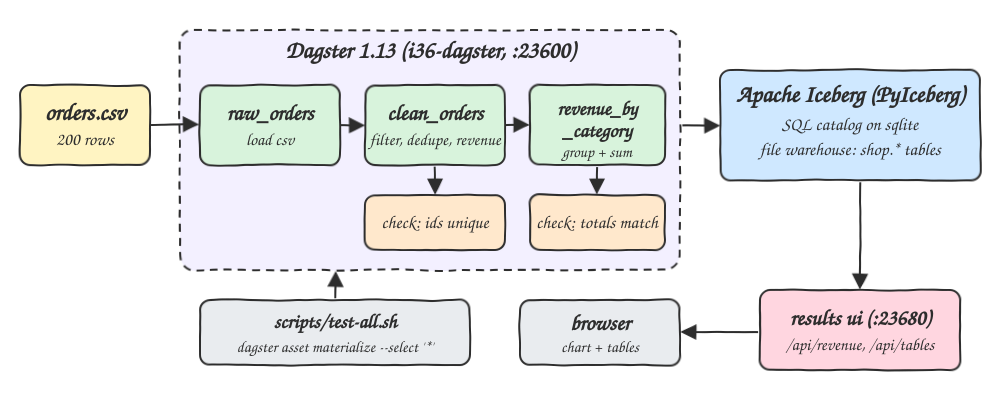
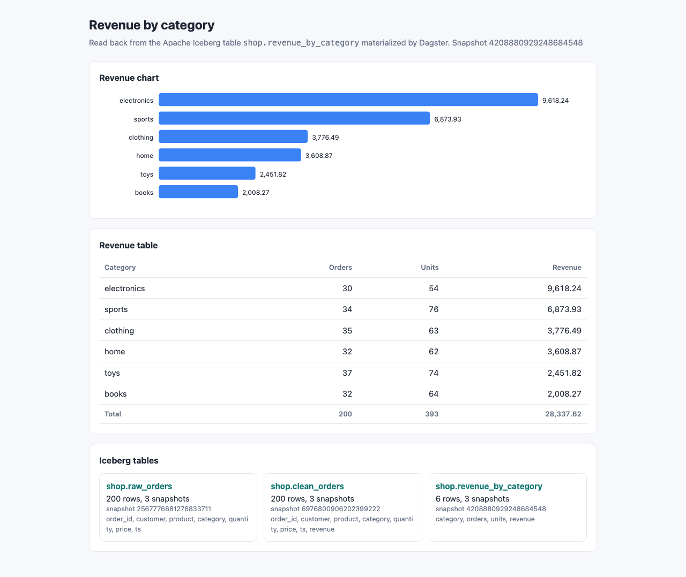
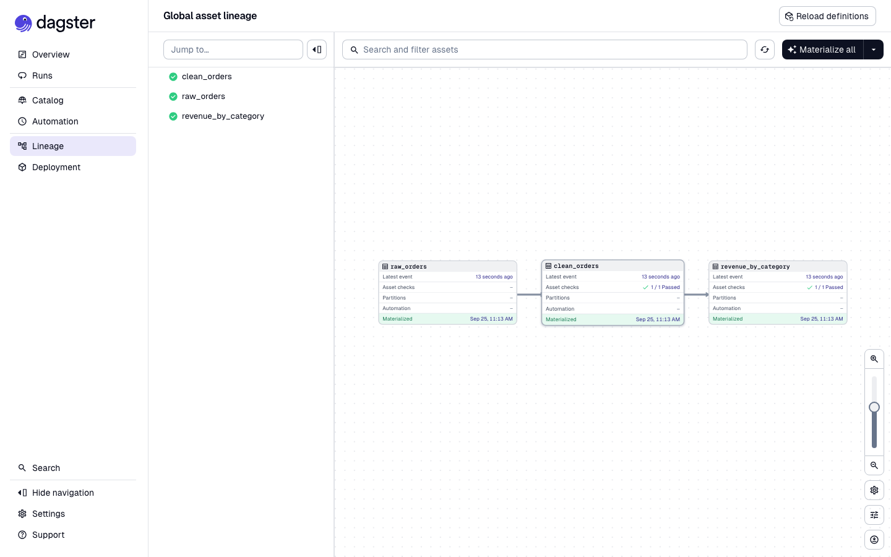
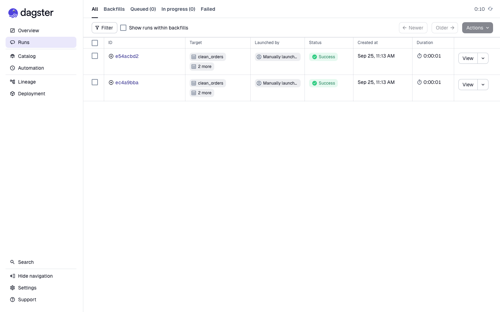
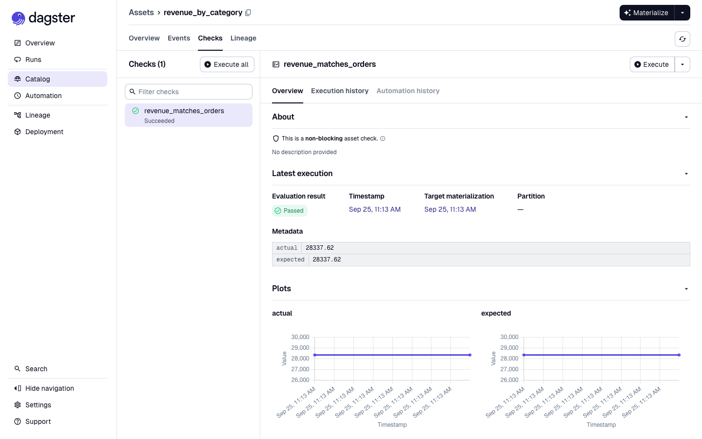

# dagster-assets-iceberg

Dagster software-defined assets on Python 3.14 that turn `data/orders.csv` into three Apache Iceberg tables (`raw_orders -> clean_orders -> revenue_by_category`) through PyIceberg, guarded by asset checks, plus a tiny results page that reads the revenue table back from Iceberg.

## How it Works

1. `raw_orders` reads the CSV with pyarrow and overwrites the Iceberg table `shop.raw_orders`.
2. `clean_orders` reads `shop.raw_orders`, drops non-positive quantity/price and null categories, keeps the first row per `order_id`, normalizes the category and adds `revenue = quantity * price`.
3. `revenue_by_category` reads `shop.clean_orders`, groups by category and writes orders, units and revenue.
4. Two asset checks run after their assets: `clean_orders_valid` (unique ids, positive revenue) and `revenue_matches_orders` (category totals equal the order total).
5. The Iceberg catalog is a PyIceberg `SqlCatalog` on sqlite with a local file warehouse under `lake/`, shared by both containers.
6. `scripts/start-all.sh` and `scripts/test-all.sh` materialize every asset with `dagster asset materialize --select '*'` inside the Dagster container, so runs show up in the Dagster UI.
7. The results UI (python stdlib `http.server` + PyIceberg) serves `/api/revenue` and `/api/tables` and a single `index.html`.
8. `scripts/test-all.sh` recomputes the aggregation with `awk` straight from the CSV and diffs it with what Iceberg returns.

## Architecture



## Features

- Software-defined assets with explicit lineage, so Dagster knows the order and can rematerialize any slice.
- Every asset persists as an Iceberg table with snapshots, so each materialization is a new, time-travelable snapshot.
- Asset checks attached to assets, so bad data is visible in the Dagster UI next to the asset it belongs to.
- CLI materialization from a script, so the pipeline runs without clicking in the UI.
- Results page reads Iceberg directly, proving the tables are readable outside Dagster.
- Independent awk verification, so the numbers are checked by a second implementation.

## Stack

- Python 3.14.7 (`python:3.14.7-slim`): Dagster 1.13 declares `requires_python >=3.10,<3.15`, so 3.14 is supported with no fallback.
- Dagster 1.13.24 + dagster-webserver 1.13.24: asset orchestration and UI.
- PyIceberg 0.12.0 (`sql-sqlite`, `pyarrow` extras): Iceberg catalog and table IO without a JVM.
- pyarrow 25.0.1: CSV parsing and columnar transforms, no pandas needed.
- pytest 9.1.1: unit tests for the transform logic.
- podman + podman-compose: runs the Dagster webserver and the results UI.

## Contracts / APIs

| Method | Path | Response |
|---|---|---|
| GET | `/` | results page |
| GET | `/api/revenue` | `{"snapshot_id": "...", "rows": [{"category", "orders", "units", "revenue"}]}` sorted by revenue desc |
| GET | `/api/tables` | `[{"table", "rows", "snapshots", "current_snapshot", "columns"}]` for the three Iceberg tables |

Both API paths return `404 {"error": "tables not materialized yet"}` before the first materialization.

## Key design decisions

- Assets pass data through Iceberg, not through Dagster IO managers: each asset reads its upstream table from the catalog, so Iceberg is the single source of truth.
- Each materialization uses `table.overwrite`, which keeps history as Iceberg snapshots instead of appending duplicates.
- The job uses `in_process_executor`: the default multiprocess executor forked one process per step and got OOM killed (SIGKILL) inside the 768 MB container limit.
- Revenue is rounded with Python `round(v, 2)` because `pyarrow.compute.round` returned `30.310000000000002` for `30.31`.
- One image (`localhost/i36-dagster-iceberg`) backs both containers; `lake/` is bind mounted at the same path in both so Iceberg metadata paths resolve everywhere.

## Verification

`./scripts/test-all.sh` output:

```
run 0165c46a-... SUCCESS
materialized raw_orders
materialized clean_orders
check clean_orders_valid PASSED
materialized revenue_by_category
check revenue_matches_orders PASSED
awk (from csv)            | iceberg (via api)
books 32 64 2008.27        | books 32 64 2008.27
clothing 35 63 3776.49     | clothing 35 63 3776.49
electronics 30 54 9618.24  | electronics 30 54 9618.24
home 32 62 3608.87         | home 32 62 3608.87
sports 34 76 6873.93       | sports 34 76 6873.93
toys 37 74 2451.82         | toys 37 74 2451.82
iceberg revenue matches awk
```

## Printscreens

Results page: revenue chart and table read from `shop.revenue_by_category`, plus row and snapshot counts of the three Iceberg tables.



Dagster asset lineage: `raw_orders -> clean_orders -> revenue_by_category`, all materialized, with asset checks passing on the two downstream assets.



Dagster runs: the CLI materializations launched by the scripts.



Asset check `revenue_matches_orders`: passed, with expected and actual totals (28337.62) recorded as metadata over time.



## Scripts

All scripts live in `scripts/` and run from any directory of the repository.

| Script | What it does |
|---|---|
| `./scripts/setup.sh` | Builds the container image and prepares the lake folder |
| `./scripts/start-all.sh` | Starts Dagster and the results UI, materializes the assets on first start, prints every link |
| `./scripts/status.sh` | Shows every service port as UP or DOWN |
| `./scripts/test-all.sh` | Runs unit tests, materializes all assets, checks asset checks, compares Iceberg with awk |
| `./scripts/ui.sh` | Opens the results UI and the Dagster UI in the browser |
| `./scripts/stop-all.sh` | Stops every service |

Ports are declared in `scripts/ports.env`: Dagster `23600`, results UI `23680`.

```bash
./scripts/setup.sh
./scripts/start-all.sh
./scripts/status.sh
./scripts/test-all.sh
./scripts/ui.sh
./scripts/stop-all.sh
```
