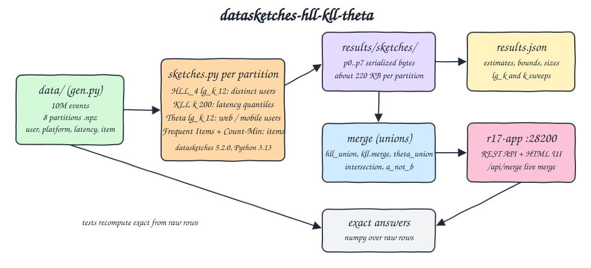
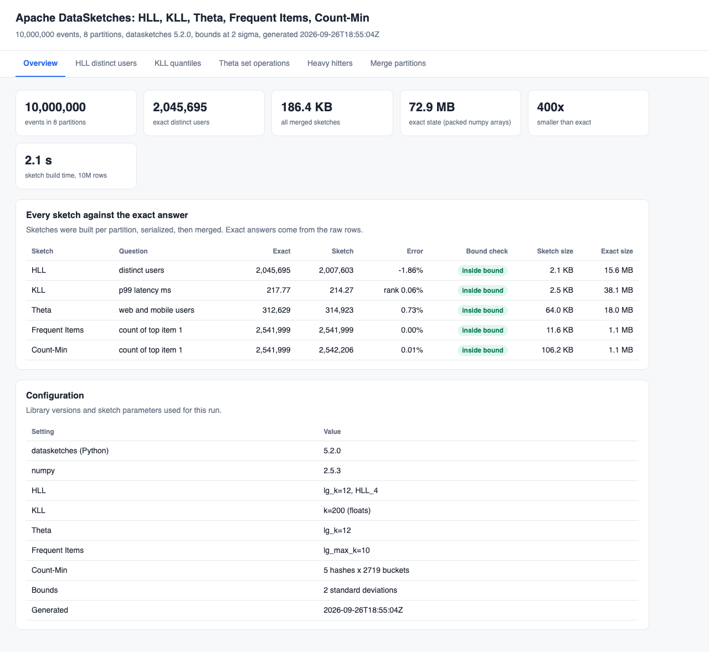
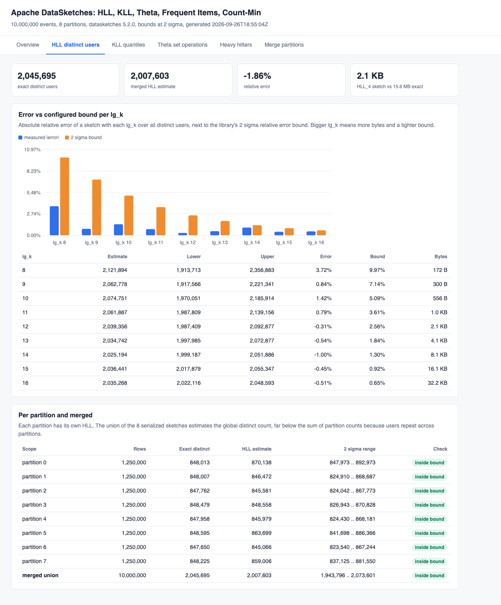
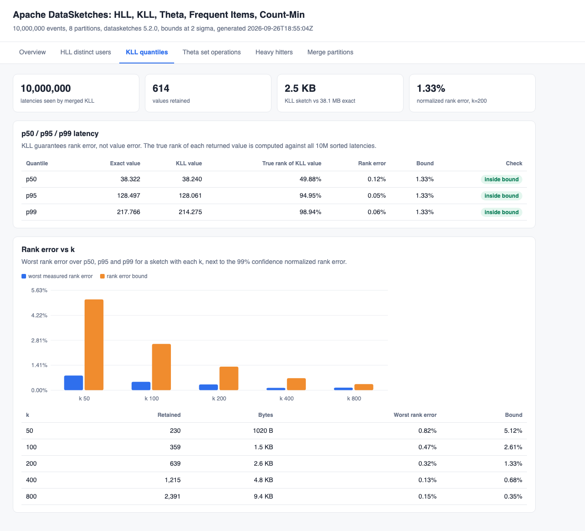
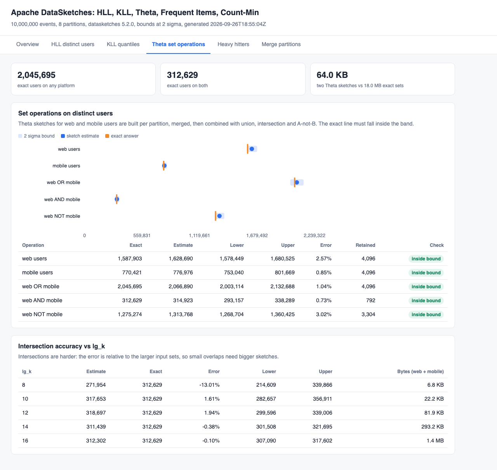
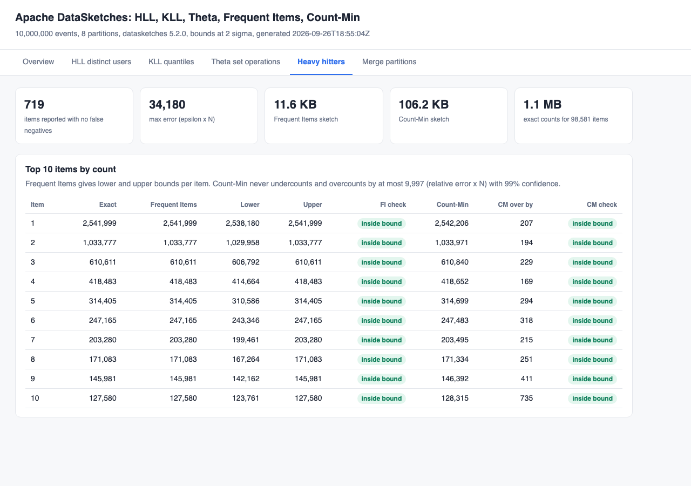
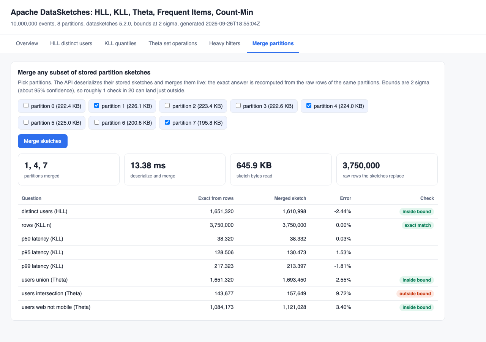

# datasketches-hll-kll-theta

Probabilistic sketches with Apache DataSketches 5.2.0 (Python bindings) over 10,000,000 generated events: HLL for distinct users, KLL for p50/p95/p99 latency, Theta for union / intersection / difference of web and mobile users, Frequent Items and Count-Min for heavy hitters. Every sketch is built per partition, serialized, merged, and checked against the exact answer computed from the raw rows: error vs the configured bound, sketch bytes vs exact memory, and mergeability across partitions.

## How it Works

1. `app/gen.py` writes 8 partitions of 1,250,000 events (`user`, `platform`, `latency`, `item`) into `data/` with a fixed seed. Users shift across partitions so they overlap, `user % 5` decides web only, mobile only or both, latency is lognormal, items are Zipf.
2. `app/sketches.py` builds one HLL, one KLL, two Theta (web and mobile users), one Frequent Items and one Count-Min sketch per partition and writes their serialized bytes to `results/sketches/`.
3. It then reads those bytes back, merges the 8 partitions (`hll_union`, `kll.merge`, `theta_union`, `merge`), runs Theta union, intersection and A-not-B, and computes the exact answers with numpy over all rows.
4. It sweeps HLL `lg_k` 8..16, KLL `k` 50..800 and Theta `lg_k` 8..16 to show error vs configured bound vs bytes, and writes `results/results.json`.
5. `app/server.py` serves the UI and a REST API. `/api/merge` deserializes and merges any subset of stored partition sketches live, `/api/exact` recomputes the exact answer from raw rows for the same subset.
6. `tests/test_sketches.py` recomputes every exact answer straight from the `.npz` files and checks the sketches against it.

## Architecture



## Features

* HLL distinct count: 2,045,695 exact users estimated in a 2.1 KB HLL_4 sketch, 7,800x smaller than the packed exact id array (15.6 MB).
* HLL `lg_k` sweep: measured error next to the library 2 sigma bound (`get_rel_err`) and the bytes for each `lg_k`, so the size vs accuracy trade is visible.
* KLL quantiles: p50/p95/p99 from a 2.5 KB sketch instead of 38.1 MB of latencies, checked by rank error (what KLL guarantees), not value error.
* KLL `k` sweep: worst measured rank error vs `get_normalized_rank_error(k)` for k 50..800.
* Theta set operations: union, intersection and web-not-mobile of distinct users, each with lower and upper bounds, from two 32 KB sketches instead of 18 MB of exact sets.
* Frequent Items: every item heavier than epsilon x N is reported (no false negatives), with lower and upper bounds per item in 11.6 KB.
* Count-Min: never undercounts, overcounts by at most relative error x N (99% confidence), 106 KB for 5 hashes x 2719 buckets.
* Mergeability: sketches are stored per partition and merged later, live, for any subset of partitions, in about 10 ms.

## Stack

* Apache DataSketches Python 5.2.0: official bindings over the C++ library, same binary format as the Java library.
* Python 3.13.15 (`python:3.13.15-slim`): datasketches 5.2.0 ships wheels up to cp313, there is no cp314 wheel yet.
* numpy 2.5.3: data generation and the exact answers.
* Python standard library `http.server`: REST API and static UI, no web framework.
* Plain HTML, CSS and JavaScript with inline SVG charts: no frontend libraries.
* podman and podman-compose: one container, `r17-app`, capped at 1 GB and 2 CPUs.

## REST API

| Method | Path | Returns |
|---|---|---|
| GET | `/` | UI |
| GET | `/api/health` | `{"status":"ok","results":true}` |
| GET | `/api/results` | full `results.json`: per partition, merged, exact, sweeps, config |
| GET | `/api/merge?partitions=1,4,6` | live merge of the stored sketches of those partitions: HLL, KLL, Theta ops, top items, bytes read, merge time |
| GET | `/api/exact?partitions=1,4,6` | exact distinct users, quantiles, set sizes and exact state bytes for those partitions |

`partitions` is optional (all 8 by default). A partition outside 0..7 returns 400.

```bash
curl -s "http://localhost:28200/api/merge?partitions=1,4,6"
```

## Key design decisions

* Bounds are shown at 2 standard deviations (about 95%). Tests use the same bounds except the HLL relative error check, which uses 3 sigma.
* KLL is checked by rank: the true rank of the returned value is computed against all sorted latencies and must be within `get_normalized_rank_error(k, false)` of the requested rank. A value can be a few ms off and still be correct.
* Exact memory is the packed numpy arrays (8 bytes per distinct user id, 4 bytes per latency, 12 bytes per item id and count). Python sets or hash maps would be several times bigger, so the reported ratios are conservative.
* Partitions store serialized bytes, not live objects, so the merge path is the same one a real pipeline would use (bytes in a table, merged at query time).
* The merged HLL loses the HIP estimator, so it can be slightly less accurate than a single-pass sketch (-1.86% vs -0.28% here). Both stay inside their bounds.
* Frequent Items is fed pre-aggregated `(item, count)` weights per partition; Count-Min, HLL and Theta are fed every row.
* KLL compaction is randomized, so quantile values move a little between runs; everything else is deterministic for the fixed seed.

## Results

From one run on 10,000,000 events, 8 partitions (sketch build time for all rows about 2.1 s):

| Sketch | Question | Exact | Sketch | Sketch size | Exact size |
|---|---|---|---|---|---|
| HLL lg_k 12 | distinct users | 2,045,695 | 2,007,603 (-1.86%) | 2.1 KB | 15.6 MB |
| KLL k 200 | p99 latency ms | 217.77 | 214.27 (true rank 98.94%, bound 1.33%) | 2.5 KB | 38.1 MB |
| Theta lg_k 12 | web AND mobile users | 312,629 | 314,923 (+0.73%) | 64 KB (two sketches) | 18.0 MB |
| Theta lg_k 12 | web NOT mobile users | 1,275,274 | 1,313,768 (+3.02%) | same | same |
| Frequent Items | count of item 1 | 2,541,999 | 2,541,999 | 11.6 KB | 1.1 MB |
| Count-Min | count of item 1 | 2,541,999 | 2,542,206 (+207) | 106 KB | 1.1 MB |

The merge tab shows one honest miss: for partitions 1, 4, 7 the Theta intersection is 9.7% high, just outside its 2 sigma band. Intersections of small overlaps from big sets have the widest error, which is expected about 1 time in 20 at 2 sigma; the intersection `lg_k` sweep shows the error shrinking with larger sketches.

## Tests

`./scripts/test-all.sh` rebuilds all sketches and then runs `tests/test_sketches.py` inside `r17-app`. The tests read the raw `.npz` partitions and compute every truth themselves:

* The merged sketches saw all 10,000,000 rows (KLL `n` and Frequent Items total weight are exact).
* The exact distinct user count is inside the merged HLL bounds and the relative error is under the 3 sigma bound for `lg_k` 12.
* For every `lg_k` in the sweep the error stays inside the bound, and `lg_k` 16 is 10x tighter and 100x bigger than `lg_k` 8.
* The true rank of the KLL p50/p95/p99 is within the normalized rank error, for the merged sketch and for every `k`.
* Theta union, intersection, web-not-mobile, web and mobile counts all fall inside their bounds.
* Every item heavier than epsilon x N is reported, each reported item's true count is inside its bounds, and the top 10 matches the true top 10.
* Count-Min never undercounts and overcounts by at most relative error x N.
* Sketches are at least 500x (HLL, KLL), 50x (Theta) and 5x (Frequent Items plus Count-Min) smaller than exact state.
* Each partition sketch holds its own partition's exact distinct count inside its bounds.
* A live `/api/merge` of partitions 1, 4, 6 matches the exact answer for exactly those rows (HLL, KLL rows and ranks, Theta intersection).
* The sum of partition distinct counts is more than 2x the true count, and the merged HLL is right, which is why distinct counts need mergeable sketches.
* The merged HLL agrees with a single-pass sketch over all rows.
* `/api/exact` matches the raw data, a bad partition returns 400, and the UI has every tab.

The tests were also run against a tampered `results.json` (HLL upper bound below the truth, Theta intersection lower bound above it, Count-Min below the true count) and 4 tests failed, as they should. Moving the p99 to 200.0 did not fail, because 200.0 is still within the 1.33% rank error of p99, which is exactly what KLL promises.

```
test_bad_partition_is_rejected ... ok
test_count_min_never_underestimates_and_stays_within_eps_n ... ok
test_each_partition_sketch_estimates_its_own_partition ... ok
test_exact_endpoint_matches_raw_data ... ok
test_frequent_items_has_no_false_negatives ... ok
test_hll_distinct_users_is_inside_its_error_bounds ... ok
test_hll_error_stays_inside_the_configured_bound_for_every_lg_k ... ok
test_kll_quantiles_are_within_the_rank_error_guarantee ... ok
test_kll_rank_error_bound_holds_for_every_k ... ok
test_merged_distinct_is_less_than_sum_of_partitions ... ok
test_merged_hll_agrees_with_a_single_pass_sketch ... ok
test_merging_stored_partition_sketches_answers_any_subset ... ok
test_row_count_is_the_whole_generated_dataset ... ok
test_sketches_are_orders_of_magnitude_smaller_than_exact_state ... ok
test_theta_set_operations_contain_the_exact_answer ... ok
test_ui_page_has_every_tab ... ok
----------------------------------------------------------------------
Ran 16 tests in 19.179s

OK
all tests passed
```

## Printscreens

Overview: dataset size, total bytes of all merged sketches vs the exact state (about 400x smaller), and one row per sketch with the exact answer, the estimate, the error, the bound check and both sizes.



HLL: measured error vs the 2 sigma bound for `lg_k` 8..16 with bytes per sketch, then every partition's HLL and the merged union against the exact distinct count.



KLL: p50/p95/p99 exact vs sketch with the true rank of the sketch value, then the worst rank error per `k` next to the guarantee.



Theta: for each set operation the band is the 2 sigma bound, the dot is the estimate and the orange line is the exact answer. Below, the intersection error for `lg_k` 8..16.



Heavy hitters: the top 10 items with exact counts, Frequent Items estimate and bounds, and the Count-Min estimate with how much it overcounts.



Merge: pick partitions, the API merges their stored sketches in about 10 ms and the exact answer is recomputed from the raw rows. Partitions 1, 4, 7 show the Theta intersection just outside its 2 sigma band.



## Scripts

All scripts live in `scripts/` and run from any directory of the repository.

| Script | What it does |
|---|---|
| `./scripts/setup.sh` | Pulls the Python image, builds the app image, generates the 10M event dataset when missing |
| `./scripts/start-all.sh` | Starts the app, builds the sketches when there are no results, prints every link |
| `./scripts/sketch.sh` | Rebuilds every sketch, the merge, the sweeps and the exact answers into `results/` |
| `./scripts/status.sh` | Shows every service port as UP or DOWN |
| `./scripts/test-all.sh` | Rebuilds the sketches and runs the tests |
| `./scripts/ui.sh` | Opens the UI in the browser |
| `./scripts/stop-all.sh` | Stops the container and waits until the port is free |

Ports are declared in `scripts/ports.env`: UI and REST API 28200 (`http://localhost:28200`).

```bash
./scripts/setup.sh
./scripts/start-all.sh
./scripts/status.sh
./scripts/test-all.sh
./scripts/ui.sh
./scripts/stop-all.sh
```
