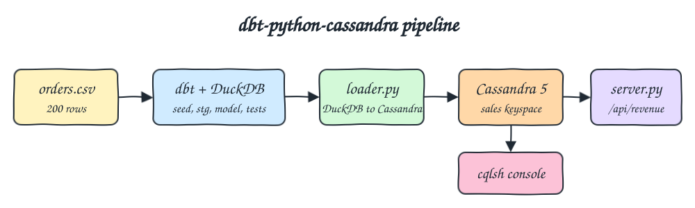
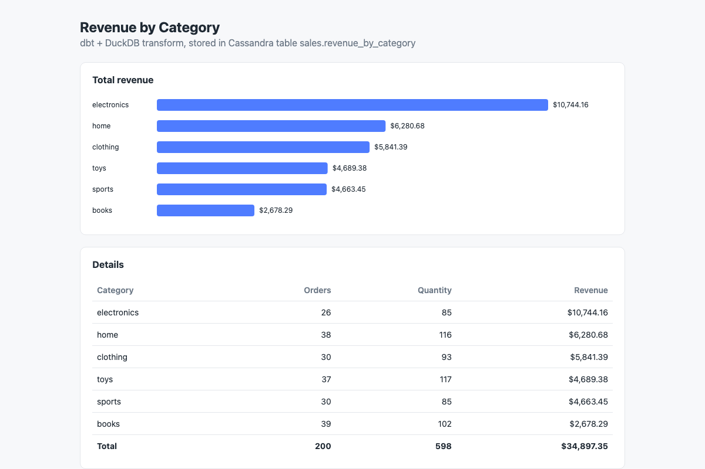

# dbt-python-cassandra

A small batch pipeline: `data/orders.csv` is transformed with dbt into revenue per category, the result is stored in Cassandra, and a tiny Python web app reads Cassandra and shows a table and a bar chart.

## How it Works

1. `dbt seed` loads `data/orders.csv` (200 orders, 6 categories) into DuckDB as the `orders` table.
2. `dbt run` builds `stg_orders` (clean types, normalized category) and `revenue_by_category` (count, sum of quantity, sum of quantity * price rounded to 2 decimals).
3. `dbt test` runs `not_null`, `unique` and `accepted_values` data tests.
4. `app/loader.py` reads `revenue_by_category` from the DuckDB file and upserts every row into `sales.revenue_by_category` in Cassandra.
5. `app/server.py` serves `index.html` on `/` and `GET /api/revenue` straight from Cassandra.

All of that runs in containers with podman-compose: `p5-cassandra`, a one-shot `p5-pipeline` and `p5-ui`.

## Architecture



## Why dbt + DuckDB and not a dbt Cassandra adapter

- There is no usable dbt adapter for Cassandra. The `dbt-cassandra` name on PyPI is only a reserved, empty `0.0.0` placeholder by dbt Labs, and Cassandra is not in the dbt supported data platforms list.
- Cassandra has no `GROUP BY` over arbitrary columns, no joins and no `CREATE TABLE AS SELECT`, which is exactly what dbt models need.
- So dbt does what it is good at (SQL models plus tests) on DuckDB, an in-process database with no server, and a small loader moves the final table into Cassandra. Cassandra stays the serving store the UI reads from.
- Upserts are natural in Cassandra (`INSERT` on the same primary key overwrites), so rerunning the pipeline is idempotent.

## Features

- dbt seed + staging model + mart model: the transform is plain SQL, versioned and testable.
- dbt data tests: `not_null` and `unique` on `category`, plus order id and category checks on staging, so bad data stops the pipeline before it reaches Cassandra.
- Idempotent loader: prepared `INSERT` statements keyed by category, safe to rerun.
- Single self-contained UI: `index.html` with plain JS and SVG, no framework.
- Independent check: `test-all.sh` recomputes the numbers with `awk` over the CSV and compares them with the API.

## Stack

- Python 3.14.7 (`python:3.14.7-slim` image): dbt-core 1.12.5 and cassandra-driver 3.30.1 declare 3.14 support and install cleanly on it.
- dbt-core 1.12.5: SQL transforms and data tests.
- dbt-duckdb 1.11.0 + duckdb 1.5.5: fast local engine for dbt, no server needed. dbt-duckdb does not list 3.14 in its classifiers yet, but it is pure Python and runs fine on 3.14.7.
- cassandra-driver 3.30.1: official Python driver, used by both the loader and the web app.
- Cassandra 5.0.9 (`cassandra:5.0.9` image): the serving store, heap limited to 512M.
- Python stdlib `http.server`: tiny backend, zero web framework.
- podman + podman-compose: runs everything.

## Contracts / APIs

`GET /` returns the UI.

`GET /api/revenue` returns the rows of `sales.revenue_by_category`, sorted by revenue:

```json
[
  {"category": "electronics", "total_orders": 26, "total_quantity": 85, "total_revenue": 10744.16},
  {"category": "home", "total_orders": 38, "total_quantity": 116, "total_revenue": 6280.68}
]
```

Cassandra table:

```sql
CREATE KEYSPACE IF NOT EXISTS sales WITH replication = {'class': 'SimpleStrategy', 'replication_factor': 1};
CREATE TABLE IF NOT EXISTS sales.revenue_by_category (category text PRIMARY KEY, total_orders bigint, total_quantity bigint, total_revenue double);
```

## Key design decisions

- `price` is seeded as `decimal(10,2)` so `sum(quantity * price)` is exact before rounding, then cast to `double` to match the Cassandra column.
- The DuckDB file lives only inside the pipeline container; Cassandra is the only persisted state (volume `p5-cassandra-data`).
- One image serves both the pipeline and the UI, which keeps the build to a single `Containerfile`.
- All container, network and volume names start with `p5-`, and host ports are 15042 (Cassandra) and 15080 (UI).

## Layout

```
data/orders.csv                 input data
dbt/dbt_project.yml             dbt project, seeds read from data/
dbt/profiles.yml                duckdb profile
dbt/models/stg_orders.sql       staging model
dbt/models/revenue_by_category.sql
dbt/models/schema.yml           data tests
app/loader.py                   DuckDB to Cassandra upsert
app/cassandra_store.py          connection and query
app/server.py                   http backend
app/index.html                  UI
pipeline.sh                     dbt seed, run, test, then loader
Containerfile / podman-compose.yml
```

## How to run

```bash
./scripts/setup.sh
./start.sh
./test.sh
./stop.sh
```

`start.sh` starts Cassandra, runs the pipeline, starts the UI and prints the links. `test.sh` runs `dbt build` and compares `/api/revenue` against an `awk` calculation over the CSV:

```
books 39 102 2678.29
clothing 30 93 5841.39
electronics 26 85 10744.16
home 38 116 6280.68
sports 30 85 4663.45
toys 37 117 4689.38
all tests passed
```

## Printscreens



The single page of the UI. The top card is an SVG bar chart of total revenue per category, sorted from highest to lowest. The bottom card is the table with orders, quantity and revenue per category plus a total row (200 orders, 598 items, $34,897.35). All numbers come from `GET /api/revenue`, which reads Cassandra.

## Scripts

All scripts live in `scripts/` and run from any directory of the repository.

| Script | What it does |
|---|---|
| `./scripts/setup.sh` | Pulls the Cassandra image and builds the pipeline and UI image |
| `./scripts/start-all.sh` | Starts Cassandra, runs the dbt pipeline and loader, starts the UI and prints the full link of each one |
| `./scripts/status.sh` | Shows every service port as UP or DOWN |
| `./scripts/test-all.sh` | Runs dbt build with data tests and checks the API against the CSV |
| `./scripts/ui.sh` | Opens the UI in the browser |
| `./scripts/stop-all.sh` | Stops every service |
| `./scripts/sql-console.sh` | Opens cqlsh on the `sales` keyspace |

Ports are declared in `scripts/ports.env`. `start.sh`, `stop.sh` and `test.sh` at the root call the matching script.

```bash
./scripts/setup.sh
./scripts/start-all.sh
./scripts/status.sh
./scripts/ui.sh
./scripts/stop-all.sh
```
