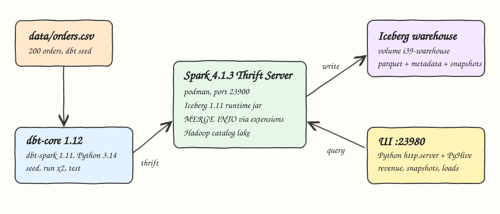
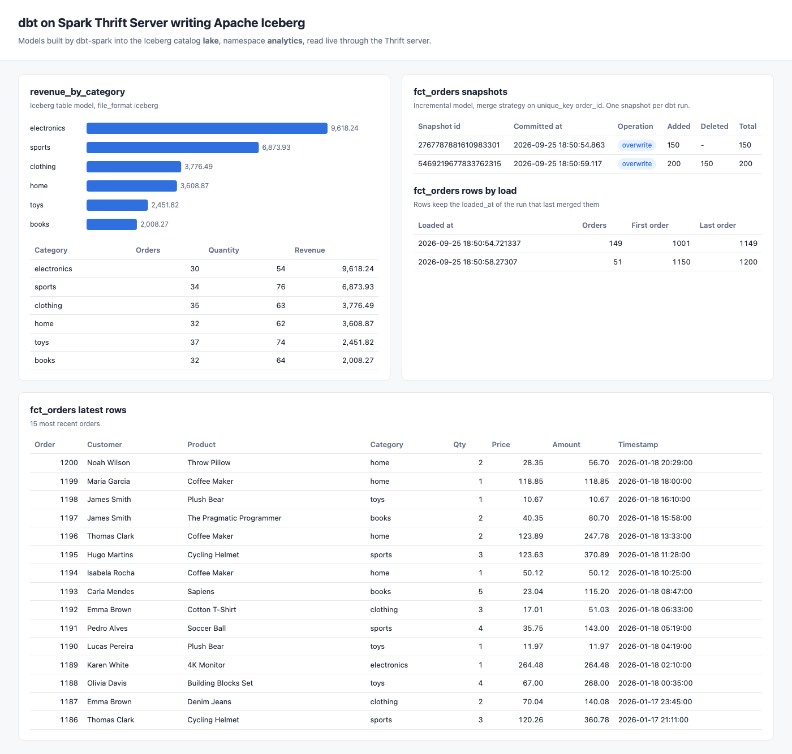

# dbt-spark-iceberg

dbt (dbt-core 1.12.5 + dbt-spark 1.11.0 on Python 3.14) runs models on a Spark 4.1.3 Thrift Server that writes Apache Iceberg 1.11.0 tables. The orders CSV is seeded, staged, merged incrementally into `fct_orders` and aggregated into `revenue_by_category`. A tiny Python UI reads the results and the Iceberg snapshots of the incremental model through the Thrift server.

## How it Works

1. A stock `apache/spark:4.1.3-scala2.13-java21-ubuntu` container starts the Spark Thrift Server with the Iceberg runtime jar mounted on the driver classpath.
2. The Iceberg catalog `lake` (Hadoop catalog, warehouse on the podman volume `i39-warehouse`) is the default catalog, so dbt schemas become Iceberg namespaces.
3. dbt connects with the `thrift` method (PyHive, pure SASL) and runs `dbt seed` to load `data/orders.csv` as an Iceberg table.
4. Run 1 uses `--vars cutoff` so only the first 150 orders (up to `2026-01-15 11:44:00`) flow into the models. `fct_orders` is created: snapshot 1.
5. Run 2 has no cutoff. `fct_orders` is incremental with `incremental_strategy='merge'`, it selects rows with `ts >= max(ts)` (51 rows, one overlapping) and issues `MERGE INTO` on `order_id`: snapshot 2, 200 rows, no duplicates.
6. `dbt test` runs 9 schema tests plus 2 singular tests.
7. The UI queries `revenue_by_category`, `fct_orders` and the `fct_orders.snapshots` metadata table via PyHive.
8. `scripts/test-all.sh` checks every number against awk over the raw CSV.

## Architecture



## Features

* Spark Thrift Server from a stock image: no custom image build, the Iceberg jar is mounted, keeps disk usage low.
* Iceberg seeds and models: `+file_format: iceberg` on seeds and models, `format=iceberg/parquet`, format version 2.
* Incremental merge: `fct_orders` upserts on `order_id` through Iceberg `MERGE INTO`, rerun overlap is updated, not duplicated.
* Snapshot history: each dbt run is an Iceberg snapshot, visible via `analytics.fct_orders.snapshots`.
* Deterministic reset: the `reset_schema` macro drops every table in the namespace so each start produces the same two snapshots.
* dbt tests: not_null, unique, accepted_values and two singular reconciliation tests.
* Independent verification: awk recomputes revenue per category, snapshot totals and merge counts from the CSV.

## Stack

* dbt-core 1.12.5: transformations, tests, incremental logic.
* dbt-spark 1.11.0 with PyHive 0.7.0: `thrift` connection method. PyPI classifiers list up to Python 3.13, it installs and runs fine on Python 3.14.7.
* Python 3.14.7: dbt runtime and the UI backend (stdlib `http.server`).
* Apache Spark 4.1.3 (Java 21 image): Thrift server, SQL engine. Iceberg 1.11.0 ships Spark runtimes only up to 4.1, so Spark 4.2 is not used.
* Apache Iceberg 1.11.0 (`iceberg-spark-runtime-4.1_2.13`): table format, Hadoop catalog, SQL extensions for `MERGE INTO`.
* podman + podman-compose: runs the Thrift server.

## Contracts / APIs

The UI server listens on `http://localhost:23980`.

| Method | Path | Returns |
|---|---|---|
| GET | `/` | the UI page |
| GET | `/api/revenue` | `[{category, total_orders, total_quantity, total_revenue}]` from `revenue_by_category` |
| GET | `/api/snapshots` | `[{snapshot_id, committed_at, operation, added_records, deleted_records, total_records}]` from `fct_orders.snapshots`, ids as strings |
| GET | `/api/loads` | `[{loaded_at, orders, first_order, last_order}]` rows of `fct_orders` grouped by the run that last wrote them |
| GET | `/api/orders` | latest 15 rows of `fct_orders` |

Thrift JDBC: `jdbc:hive2://localhost:23900/default`. Spark UI: `http://localhost:23901`.

## Key design decisions

* Hadoop catalog instead of REST: one container, warehouse in a named volume. The Hadoop catalog has no `DROP NAMESPACE CASCADE`, so `reset_schema` drops tables one by one.
* The entrypoint creates `/warehouse/iceberg/default` because PyHive opens every session with `USE default` and the Iceberg catalog is the default catalog.
* The Iceberg jar goes on `spark.driver.extraClassPath`, not `--jars`: with `--jars` the Thrift session classloader cannot see `org.apache.iceberg.catalog.TableIdentifier`.
* Run 1 and run 2 differ only in the `cutoff` var, which simulates late arriving data without a second input file.
* `fct_orders` stores `loaded_at = current_timestamp()`. After run 2, 149 rows keep the run 1 value and 51 rows carry the run 2 value, which proves the overlapping order 1150 was merged.
* Snapshot 2 is `overwrite` with added=200 deleted=150: Iceberg's default copy-on-write merge rewrites the single data file.

## Models

| Model | Materialization | Description |
|---|---|---|
| `orders` (seed) | iceberg table | raw `data/orders.csv` |
| `stg_orders` | table, iceberg | typed orders plus `amount = quantity * price`, filtered by `cutoff` |
| `fct_orders` | incremental, merge, iceberg | orders keyed by `order_id` with `loaded_at` |
| `revenue_by_category` | table, iceberg | orders, quantity and revenue per category |

## How to run

```bash
./scripts/setup.sh
./scripts/start-all.sh
./scripts/test-all.sh
./scripts/ui.sh
./scripts/stop-all.sh
```

`start-all.sh` prints the Iceberg snapshots of `fct_orders` after the two runs:

```
2767787881610983301 2026-09-25 18:50:54.863 overwrite added=150 deleted=None total=150
5469219677833762315 2026-09-25 18:50:59.117 overwrite added=200 deleted=150 total=200
```

`test-all.sh` output:

```
revenue_by_category vs awk over data/orders.csv
books 32 64 2008.27
clothing 35 63 3776.49
electronics 30 54 9618.24
home 32 62 3608.87
sports 34 76 6873.93
toys 37 74 2451.82
snapshot total-records: 150 200, awk expects: 150 200
rows per loaded_at: 149 51, awk expects: 149 51
all tests passed
```

## Printscreens



The single page shows the `revenue_by_category` model as a bar chart and a table (top left), the two Iceberg snapshots of `fct_orders` created by the two dbt runs with added, deleted and total records (top right), the row count per `loaded_at` showing 149 rows from run 1 and 51 merged by run 2, and the latest 15 rows of `fct_orders` (bottom).

## Scripts

All scripts live in `scripts/` and run from any directory of the repository.

| Script | What it does |
|---|---|
| `./scripts/setup.sh` | Creates the Python 3.14 venv, installs dbt, downloads the Iceberg jar, pulls the Spark image |
| `./scripts/start-all.sh` | Starts the Thrift server, runs dbt seed and two dbt runs, starts the UI and prints the full link of each service |
| `./scripts/status.sh` | Shows every service port as UP or DOWN |
| `./scripts/test-all.sh` | Runs dbt test and the awk verification |
| `./scripts/ui.sh` | Opens the UI in the browser |
| `./scripts/stop-all.sh` | Stops every service |
| `./scripts/sql-console.sh` | Opens beeline on the Spark Thrift Server |

Ports are declared in `scripts/ports.env`.

```bash
./scripts/setup.sh
./scripts/start-all.sh
./scripts/status.sh
./scripts/ui.sh
./scripts/stop-all.sh
```
