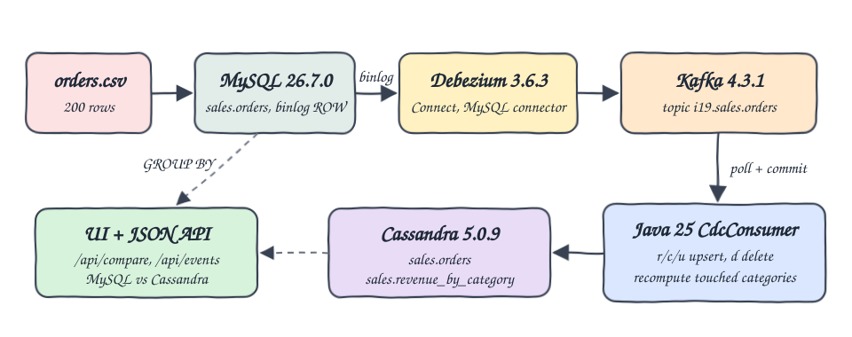
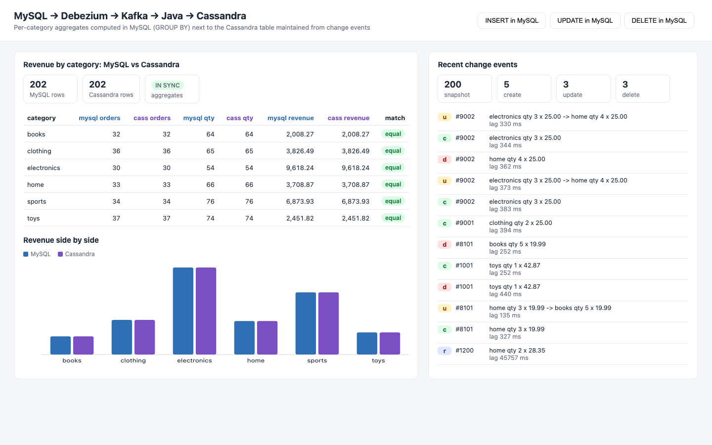

# debezium-kafka-cassandra

Change data capture from MySQL into Cassandra. MySQL holds `sales.orders` loaded from `data/orders.csv`, Debezium streams every row change from the binlog into Apache Kafka, and a plain Java 25 consumer applies those change events to Cassandra 5, keeping `sales.orders` and `sales.revenue_by_category` in sync. A small UI shows MySQL and Cassandra per-category aggregates side by side, plus the most recent change events.

## How it Works

1. MySQL 26.7.0 starts with `binlog_format=ROW`, `binlog_row_image=FULL` and loads the 200 CSV rows with `LOAD DATA INFILE`.
2. Kafka Connect with the Debezium 3.6.3 MySQL connector is registered through the Connect REST API (`connect/mysql-orders.json`).
3. Debezium takes an initial snapshot (`op=r` for every row), then tails the binlog and emits `c`, `u` and `d` events to topic `i19.sales.orders` as schemaless JSON.
4. `CdcConsumer` (kafka-clients + Jackson) polls a batch, upserts `after` for `r/c/u`, deletes by `before.order_id` for `d`, and collects every category touched (both `before` and `after`, so a category move updates two categories).
5. After the batch it recomputes only the touched categories from the Cassandra `sales.orders` rows and writes `sales.revenue_by_category` (or deletes the category when it has no rows), then commits offsets.
6. Every step is idempotent (upsert, delete, full recompute), so at-least-once delivery and replays converge to the same state.
7. The UI server queries MySQL with `GROUP BY` and Cassandra `revenue_by_category`, and flags each category as equal or diff.

## Architecture



## Features

* Initial snapshot lands in Cassandra: all 200 CSV rows arrive as `op=r` events before any live change.
* Live INSERT, UPDATE and DELETE propagation, including an UPDATE that moves an order across categories.
* Exact revenue: `DECIMAL(10,2)` in MySQL, Debezium `decimal.handling.mode=string`, Cassandra `decimal`, so totals compare as exact strings.
* Recompute per touched category instead of counters, so replays and retries never double count.
* UI buttons run INSERT/UPDATE/DELETE in MySQL (ids from 9001 up only) to watch the change flow live.
* Recent change events with op, order, before/after summary and source-to-apply lag.

## Stack

* MySQL 26.7.0 (innovation release, `docker.io/library/mysql:26.7.0`): source of truth with ROW binlog.
* Debezium 3.6.3.Final (`quay.io/debezium/connect:3.6.3.Final`): Kafka Connect image with the MySQL connector preinstalled, heap `-Xmx384m`.
* Apache Kafka 4.3.1 (`docker.io/apache/kafka:4.3.1`, KRaft single node): change event log, heap `-Xmx384m`.
* Cassandra 5.0.9: sink tables, `MAX_HEAP_SIZE=512M`.
* Java 25 (Amazon Corretto 25.0.4), Maven: consumer and UI server.
* kafka-clients 4.3.1, Jackson 3.2.3 (`tools.jackson`), DataStax/Apache java-driver-core 4.19.3, mysql-connector-j 26.7.0.
* JDK built-in `HttpServer` and a single plain HTML/JS/SVG page, no frameworks.

## Contracts

Change event (value of topic `i19.sales.orders`, schemas disabled):

```json
{
  "before": null,
  "after": {"order_id": 1001, "customer": "Emma Brown", "product": "Building Blocks Set", "category": "toys", "quantity": 1, "price": "42.87", "ts": "2026-01-05T10:05:00Z"},
  "source": {"connector": "mysql", "db": "sales", "table": "orders"},
  "op": "r",
  "ts_ms": 1790000000000
}
```

REST API served on the `ui` port:

| Method | Path | Description |
|---|---|---|
| GET | `/` | UI page |
| GET | `/api/compare` | `mysqlRows`, `cassandraRows`, `allMatch` and per category `mysql` / `cassandra` `{orders, quantity, revenue}` plus `match` |
| GET | `/api/events` | `counts` per op (`r`, `c`, `u`, `d`) and the 50 most recent applied events |
| POST | `/api/mysql/insert` | Inserts a new order with id 9001 and up into MySQL |
| POST | `/api/mysql/update` | Increments quantity and moves category of the highest UI order |
| POST | `/api/mysql/delete` | Deletes the highest UI order |

Cassandra tables:

```sql
CREATE TABLE sales.orders (order_id int PRIMARY KEY, customer text, product text, category text, quantity int, price decimal, ts text);
CREATE TABLE sales.revenue_by_category (category text PRIMARY KEY, total_orders bigint, total_quantity bigint, total_revenue decimal);
```

## Key Design Decisions

* Kafka Connect image over Debezium Server: one REST `PUT` registers the connector and it writes straight to Kafka with no extra sink config.
* Recompute over counters: a Cassandra counter table cannot be made idempotent under redelivery; recomputing a touched category from its rows always converges. At 200 rows a table scan per poll batch is cheap; a larger table would use a `category`-keyed table instead.
* Offsets are committed only after Cassandra writes and the recompute succeed.
* `tombstones.on.delete=false`: the consumer only needs the `d` event with `before`.
* No volumes: every `start-all.sh` gives a fresh MySQL loaded from the CSV, a fresh Kafka and a fresh Cassandra, so the snapshot is replayed from scratch every time.
* UI mutations only touch ids from 9001 up, and `test-all.sh` removes ids from 8000 up before checking, so the CSV baseline stays verifiable.

## How to run

```bash
./scripts/setup.sh
./scripts/start-all.sh
./scripts/test-all.sh
./scripts/ui.sh
./scripts/stop-all.sh
```

`test-all.sh` computes the expected per-category totals with `awk` over the CSV (and over a copy edited alongside every mutation) and requires both MySQL and Cassandra to match exactly after: the initial snapshot, an INSERT, an UPDATE that moves an order from `home` to `books`, a DELETE, and a restore back to the CSV.

```
== initial snapshot equals csv
awk over expected csv
books 32 64 2008.27
clothing 35 63 3776.49
electronics 30 54 9618.24
home 32 62 3608.87
sports 34 76 6873.93
toys 37 74 2451.82
PASS initial snapshot equals csv
PASS 200 rows in mysql and cassandra
PASS INSERT order 8101 into home
PASS UPDATE order 8101 moved home to books with quantity 5
PASS DELETE order 1001 from toys
PASS restore back to csv
events applied r c u d: 200 2 1 2
PASS all
```

## Printscreens



The left panel lists every category with MySQL `GROUP BY` totals next to Cassandra `sales.revenue_by_category`, all marked equal, with a bar chart of both revenues side by side. The row counters show 202 rows on both sides after a few UI inserts. The right panel counts applied events per op (200 snapshot reads, then creates, updates and deletes) and lists the latest events, including the `u` event that moved order 9002 from electronics to home, with the lag from the MySQL commit to the Cassandra write.

## Scripts

All scripts live in `scripts/` and run from any directory of the repository.

| Script | What it does |
|---|---|
| `./scripts/setup.sh` | Pulls images and builds the Java app |
| `./scripts/start-all.sh` | Starts MySQL, Kafka, Kafka Connect, Cassandra, registers the Debezium connector, starts the app and prints the full link of each service |
| `./scripts/status.sh` | Shows every service port as UP or DOWN, plus the connector state |
| `./scripts/test-all.sh` | Verifies snapshot, INSERT, UPDATE, DELETE against awk |
| `./scripts/ui.sh` | Opens the UI in the browser |
| `./scripts/stop-all.sh` | Stops every service |
| `./scripts/sql-console.sh` | Opens a console on MySQL (default) or `cassandra` |

Ports are declared in `scripts/ports.env`: mysql 21906, kafka 21992, connect 21983, cassandra 21942, ui 21980.

```bash
./scripts/setup.sh
./scripts/start-all.sh
./scripts/status.sh
./scripts/ui.sh
./scripts/stop-all.sh
```
