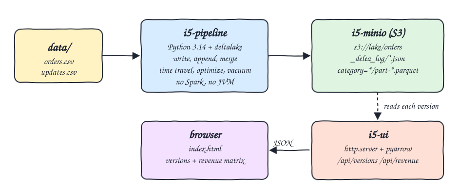
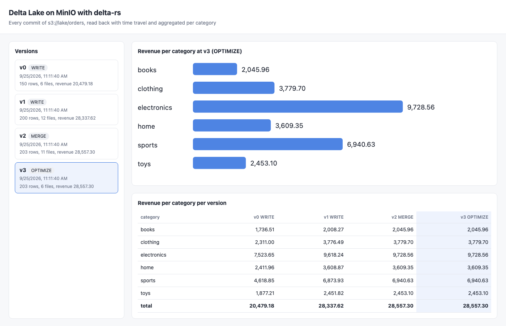
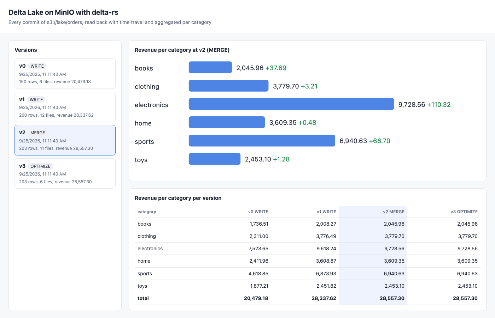
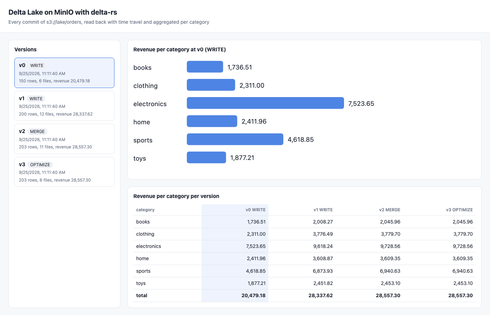

# delta-rs-python

A Delta Lake table managed from pure Python 3.14 with the `deltalake` package (delta-rs, Rust core). No Spark and no JVM. The table lives on MinIO (S3) running in podman. The pipeline writes orders, appends more, runs a MERGE upsert that changes prices and inserts new orders, time travels back to version 0, prints the table history, compacts the files and runs vacuum. A small UI lists every version with its revenue per category.

## How it Works

1. `scripts/start-all.sh` starts MinIO and creates the bucket `lake` with the `mc` client bundled in the MinIO image.
2. `app/pipeline.py` runs in the `i5-pipeline` container against `s3://lake/orders`, partitioned by `category`.
3. v0: `write_deltalake` of the first 150 rows of `data/orders.csv`.
4. v1: `write_deltalake(mode="append")` of the remaining 50 rows.
5. v2: `DeltaTable.merge` with `data/updates.csv` on `order_id`: 8 matched rows get a new price, 3 new orders are inserted.
6. Time travel: `DeltaTable(uri, version=0)` is read back and aggregated.
7. v3: `optimize.compact()` rewrites 11 small files into 6 (one per category partition).
8. Vacuum: a dry run with 0h retention lists the 17 files no longer referenced, then a real vacuum runs with the default 7 day retention.
9. `app/server.py` (`i5-ui`) reads `history()`, opens every version with time travel, aggregates it with `pyarrow` `group_by` and serves JSON plus `index.html`.

## Architecture



## Features

* Pure Python Delta Lake: delta-rs does the transaction log, parquet IO and S3 access, so no Spark cluster or JVM is needed.
* S3 on MinIO: the table is plain `_delta_log/*.json` plus partitioned parquet in a bucket, the same layout Spark or Databricks would read.
* MERGE upsert: updates prices of matching orders and inserts unmatched ones in one atomic commit.
* Time travel: any version can be opened by number, the UI and `/api/revenue?version=N` use it.
* History: every commit with operation, parameters and metrics comes from `DeltaTable.history()`.
* Optimize and vacuum: compaction shrinks the file count, vacuum shows which old files are eligible for deletion.
* Independent verification: `test-all.sh` recomputes every version with awk straight from the CSV files.

## Stack

* Python 3.14.7 (`python:3.14.7-slim`): runtime for the pipeline and the UI backend.
* deltalake 1.6.6: Python bindings of delta-rs for Delta Lake read, write, merge, optimize and vacuum.
* pyarrow 25.0.1: CSV parsing and the per-category aggregation (`Table.group_by`).
* MinIO `pgsty/minio:RELEASE.2026-08-04T00-00-00Z`: S3 storage for the table. The official `minio/minio` images are no longer pullable from Docker Hub or anonymously from quay.io, so the maintained community fork is used.
* Python stdlib `http.server`: the tiny JSON backend, no web framework.
* podman and podman-compose: run MinIO, the pipeline and the UI.

## Contracts / APIs

| Method | Path | Returns |
|---|---|---|
| GET | `/` | the UI |
| GET | `/api/versions` | every table version: `version`, `timestamp`, `operation`, `parameters`, `metrics`, `files`, `rows`, `revenue`, `categories[]` |
| GET | `/api/revenue` | latest version: `{version, categories[]}` |
| GET | `/api/revenue?version=N` | the same, read with time travel at version N |

Each category entry is `{category, total_orders, total_quantity, total_revenue}` where revenue is `sum(quantity * price)`.

## Design decisions

* The table is partitioned by `category`, so appends and merges leave several small files per partition and compaction has something visible to do.
* The MERGE only updates `price` on match (`when_matched_update`) and inserts full rows otherwise (`when_not_matched_insert_all`).
* Vacuum with 0h retention would delete the parquet files of v0 to v2, and time travel to those versions would then fail. To keep every version readable in the UI the pipeline only lists those 17 files (dry run) and runs the real vacuum with the default retention, which deletes nothing today and removes them after 7 days.
* S3 commits use `AWS_CONDITIONAL_PUT=etag`, which MinIO supports, so no external lock table is needed.
* `start-all.sh` recreates the bucket before running the pipeline, so every run starts from version 0 and the version numbers are stable.

## Verification

`./scripts/test-all.sh` compares the API against awk over `data/orders.csv` and `data/updates.csv`:

```
operations: WRITE WRITE MERGE OPTIMIZE
PASS commit log is write, append, merge, optimize
PASS optimize compacted to one file per category partition
PASS v0 initial 150 orders match awk
PASS v1 append of all 200 orders matches awk
PASS v2 merge upsert matches awk join of updates.csv
PASS v3 optimize keeps the data of v2
PASS latest version matches merged awk
PASS time travel /api/revenue?version=0 matches awk
merged per category (category orders quantity revenue):
books 33 65 2045.96
clothing 35 63 3779.70
electronics 31 55 9728.56
home 32 62 3609.35
sports 35 78 6940.63
toys 37 74 2453.10
all tests passed
```

Total revenue per version: v0 20,479.18, v1 28,337.62, v2 and v3 28,557.30.

## Printscreens

Latest version (v3 OPTIMIZE): same numbers as v2 but 6 files instead of 11. The matrix shows every version side by side.



v2 MERGE selected: the green numbers are the revenue change against v1 caused by the price updates and the 3 inserted orders.



v0 WRITE selected: the table as it was before the append, read with time travel.



## Scripts

All scripts live in `scripts/` and run from any directory of the repository.

| Script | What it does |
|---|---|
| `./scripts/setup.sh` | Pulls MinIO and builds the pipeline and UI image |
| `./scripts/start-all.sh` | Starts MinIO, runs the pipeline, starts the UI and prints the full link of each one |
| `./scripts/status.sh` | Shows every service port as UP or DOWN |
| `./scripts/test-all.sh` | Verifies every version against awk |
| `./scripts/ui.sh` | Opens the UI in the browser |
| `./scripts/stop-all.sh` | Stops every service |

Ports are declared in `scripts/ports.env`: MinIO S3 20500, MinIO console 20501, UI 20502.

```bash
./scripts/setup.sh
./scripts/start-all.sh
./scripts/status.sh
./scripts/test-all.sh
./scripts/ui.sh
./scripts/stop-all.sh
```
