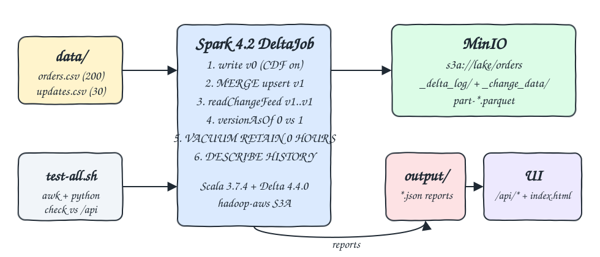
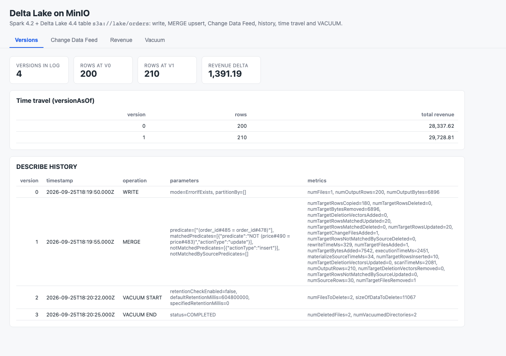
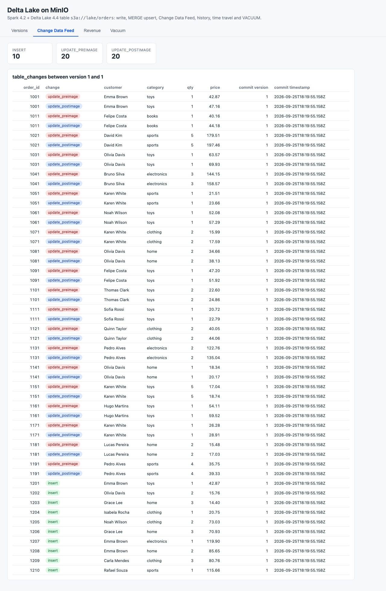
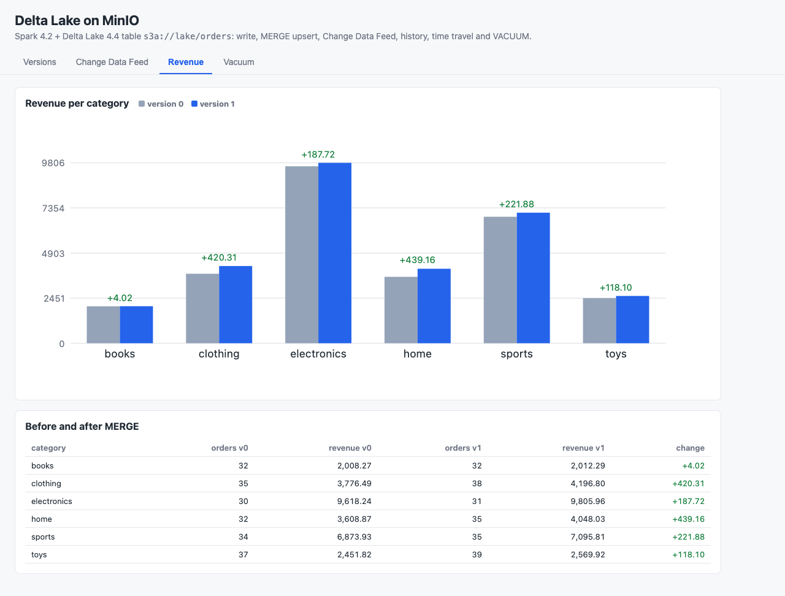
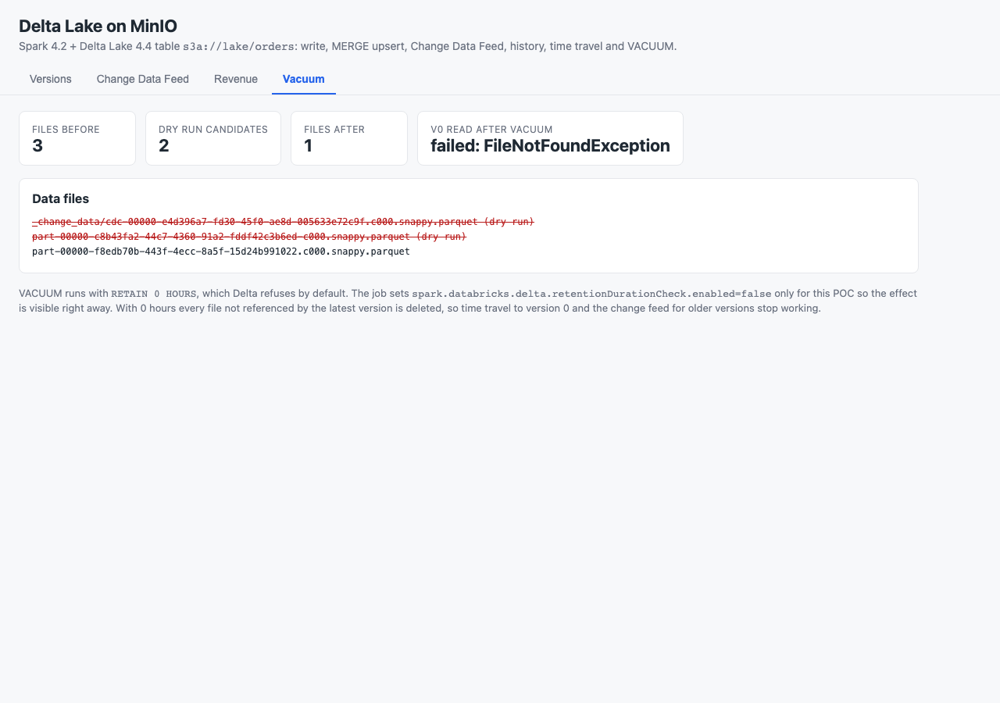

# delta-spark-minio

Spark 4.2 (Scala 3) job that keeps an `orders` Delta Lake table on MinIO through S3A and walks the Delta feature set end to end: initial write, MERGE upsert, Change Data Feed, DESCRIBE HISTORY, time travel and VACUUM. A small UI shows the versions, the CDF rows and the per-category revenue before and after the MERGE.

## How it Works

1. `scripts/start-all.sh` starts MinIO, creates the `lake` bucket and starts the UI server.
2. `scripts/pipeline.sh` runs `DeltaJob` in Spark local mode against `s3a://lake/orders`.
3. Version 0: `data/orders.csv` (200 rows) is written as Delta with `enableChangeDataFeed` on by default.
4. Version 1: `data/updates.csv` (30 rows) is merged: 20 existing orders get a 10% higher price, 10 new orders are inserted.
5. The change feed is read for version 1..1, giving `update_preimage`, `update_postimage` and `insert` rows.
6. `versionAsOf 0` and `versionAsOf 1` are aggregated to compare revenue per category.
7. `VACUUM ... RETAIN 0 HOURS DRY RUN` lists candidates, then VACUUM deletes them, and a read of version 0 is attempted again to show it now fails.
8. `DESCRIBE HISTORY` (WRITE, MERGE, VACUUM START, VACUUM END) and every result are written as JSON into `output/`, which the UI serves under `/api/*`.
9. `scripts/test-all.sh` recomputes everything from the CSV files with awk and Python and compares it with the API.

## Architecture



## Features

- Initial write with Change Data Feed on: `spark.databricks.delta.properties.defaults.enableChangeDataFeed=true` makes version 0 already CDF enabled.
- MERGE upsert: `whenMatched("t.price <> s.price")` updates only changed prices, `whenNotMatched().insertAll()` adds new orders.
- Change Data Feed: `readChangeFeed` between versions shows pre and post images of each updated row plus inserts.
- DESCRIBE HISTORY: operation, parameters and metrics for every commit including vacuum commits.
- Time travel: `versionAsOf` reads version 0 and 1 side by side for the revenue comparison.
- VACUUM with retention check disabled: shows dry run, deleted files and the loss of time travel afterwards.
- Independent verification: 28 checks in `scripts/verify.py` plus awk totals in `scripts/test-all.sh`.

## VACUUM retention check

Delta refuses `RETAIN 0 HOURS` because readers or writers still using older snapshots could lose files. This POC sets `spark.databricks.delta.retentionDurationCheck.enabled=false` so the effect is visible in seconds. It also sets `spark.databricks.delta.vacuum.logging.enabled=true` because vacuum commits are not logged on S3 paths by default. After VACUUM the latest version still has 210 rows, while reading version 0 fails with `FileNotFoundException` and the `_change_data` file that backs the version 1 change feed is deleted as well. Never disable the check on a shared production table; keep the default 7 days or more.

## Stack

| Component | Version | Why |
|---|---|---|
| Apache Spark | 4.2.0 | Latest stable Spark, local mode is enough for 200 rows |
| Delta Lake | 4.4.0 (`delta-spark_4.2_2.13`) | Latest Delta release, built for Spark 4.2 |
| Scala | 3.7.4 | Scala 3 with `_2.13` Spark artifacts via `CrossVersion.for3Use2_13`; 3.8+ breaks Spark through scala-reflect |
| Java | 25 | JDK 25 with `--add-opens` flags for Spark |
| sbt | 2.0.9 | Build and run both subprojects |
| hadoop-aws | 3.5.0 | S3A filesystem matching Spark's Hadoop 3.5.0 client |
| MinIO | `pgsty/minio:RELEASE.2026-08-04T00-00-00Z` | S3 compatible storage; official `minio/minio` images are no longer published, this is a drop-in community build with `mc` |
| JDK HttpServer | built in | UI backend with no extra libraries |
| Python 3 + awk | system | Independent verification without dependencies |

## Contracts / APIs

UI server on port 20280, every endpoint returns JSON produced by the job.

| Endpoint | Content |
|---|---|
| `GET /` | Single page UI |
| `GET /api/versions` | `version`, `rows`, `revenue` for version 0 and 1 (time travel) |
| `GET /api/history` | DESCRIBE HISTORY: `version`, `timestamp`, `operation`, `operationParameters`, `operationMetrics` |
| `GET /api/changes` | CDF rows: `order_id`, `customer`, `category`, `quantity`, `price`, `_change_type`, `_commit_version`, `_commit_timestamp` |
| `GET /api/change_summary` | Count per `_change_type` |
| `GET /api/revenue` | Per category `orders_before`, `revenue_before`, `orders_after`, `revenue_after`, `revenue_change` |
| `GET /api/vacuum` | `files_before`, `dry_run`, `files_after`, `latest_rows_after_vacuum`, `version0_after_vacuum` |

## Key design decisions

- Prices are `DECIMAL(10,2)`, so revenue sums are exact and compared to Python `Decimal` values with no rounding.
- The job resets the table path before each run, so every run produces the same versions 0 to 3.
- The UI reads JSON files written by the job instead of running Spark itself, keeping the UI JVM at 128 MB.
- CDF and time travel are read before VACUUM; after VACUUM the job proves version 0 is no longer readable.
- Table layout on MinIO: `_delta_log/` JSON commits, `_change_data/` CDF files written by MERGE and `part-*.parquet` data files.

## Verification output

```
awk revenue per category after merge
  books         32    2012.29
  clothing      38    4196.80
  electronics   31    9805.96
  home          35    4048.03
  sports        35    7095.81
  toys          39    2569.92
OK   version 0 rows: expected=200 actual=200
OK   version 1 rows: expected=210 actual=210
OK   version 0 revenue: expected=28337.62 actual=28337.62
OK   version 1 revenue: expected=29728.81 actual=29728.81
OK   cdf change types: expected={'insert': 10, 'update_preimage': 20, 'update_postimage': 20}
OK   history has vacuum: expected=True actual=True
OK   version 0 unreadable after vacuum: expected=True actual=True
all checks passed
```

The job log contains an expected `FileNotFoundException` stack trace: it is the deliberate read of version 0 after VACUUM.

## How to run

```bash
./scripts/setup.sh
./scripts/start-all.sh
./scripts/test-all.sh
./scripts/ui.sh
./scripts/stop-all.sh
```

`./scripts/pipeline.sh` runs only the Delta job, and `./scripts/test-all.sh` runs it and then verifies the results.

## Printscreens

Versions tab: time travel row counts and revenue for version 0 and 1, and DESCRIBE HISTORY with WRITE, MERGE, VACUUM START and VACUUM END plus their metrics.



Change Data Feed tab: the 50 CDF rows of version 1, each updated order shows its pre image and post image price, and the 10 inserted orders.



Revenue tab: per category revenue at version 0 and version 1 as bars and as a table with the change caused by the MERGE.



Vacuum tab: data files before VACUUM, the dry run candidates crossed out, the single file that remains, and the failed read of version 0.



## Scripts

All scripts live in `scripts/` and run from any directory of the repository.

| Script | What it does |
|---|---|
| `./scripts/setup.sh` | Pulls images, installs Java 25 through sdkman when missing and compiles |
| `./scripts/start-all.sh` | Starts MinIO, creates the bucket, starts the UI and prints the full link of each service |
| `./scripts/pipeline.sh` | Runs the Delta job against MinIO and writes the reports |
| `./scripts/status.sh` | Shows every service port as UP or DOWN |
| `./scripts/test-all.sh` | Runs the pipeline and verifies it with awk and Python |
| `./scripts/ui.sh` | Opens the UI in the browser |
| `./scripts/stop-all.sh` | Stops every service |

Ports are declared in `scripts/ports.env`: MinIO API 20200, MinIO console 20201, UI 20280.

```bash
./scripts/setup.sh
./scripts/start-all.sh
./scripts/status.sh
./scripts/ui.sh
./scripts/stop-all.sh
```
