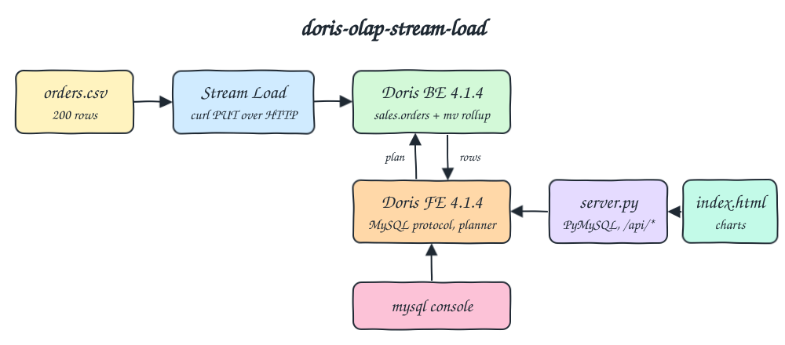
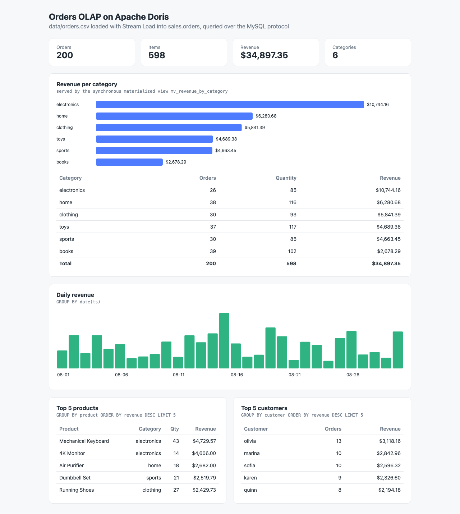

# doris-olap-stream-load

Real-time OLAP with Apache Doris: `data/orders.csv` is pushed into a Doris table with Stream Load over HTTP, a synchronous materialized view keeps revenue per category pre-aggregated, and a tiny Python backend queries Doris through the MySQL protocol to show revenue per category plus a few analytical queries in a single `index.html`.

## How it Works

1. `podman-compose` starts one Doris FE (metadata, SQL planner, MySQL protocol) and one Doris BE (storage and execution) on a private network with static IPs.
2. `scripts/pipeline.sh` creates the `sales` database and the `sales.orders` table (duplicate key model), then the synchronous materialized view `mv_revenue_by_category` when it does not exist yet.
3. It truncates `sales.orders` and sends the CSV with `curl -T` to the BE Stream Load endpoint `/api/sales/orders/_stream_load` with a unique label and `format: csv_with_names`.
4. Doris writes the rows and updates the materialized view in the same transaction, so the rollup is never stale.
5. `app/server.py` (Python stdlib `http.server`) serves `index.html` and four JSON endpoints. Each one runs a SQL query on the FE over the MySQL protocol with PyMySQL.
6. For `GROUP BY category` the Doris planner rewrites the query to read `mv_revenue_by_category` instead of the base table.

## Architecture



## Features

* Stream Load over HTTP: one synchronous `PUT` loads the whole CSV and returns a JSON report with loaded and filtered rows.
* Synchronous materialized view (rollup): revenue per category is pre-aggregated at load time and picked automatically by the planner.
* MySQL protocol: the UI, the tests and the console all talk to Doris with plain MySQL clients.
* Idempotent pipeline: truncate plus a fresh label on every run, so rerunning never duplicates rows.
* Four analytical queries: revenue per category, daily revenue, top 5 products and top 5 customers.
* Single self-contained UI: plain JS and SVG charts, no framework.
* Independent checks: `test-all.sh` recomputes every query with `awk` over the CSV and checks `EXPLAIN` uses the materialized view.

## Stack

* Apache Doris 4.1.4 (`apache/doris:fe-4.1.4` and `apache/doris:be-4.1.4`): latest stable release, official images, 1 FE + 1 BE.
* Python 3.14.7 (`python:3.14.7-slim`): runs the UI backend with the stdlib HTTP server.
* PyMySQL 1.2.3: pure Python MySQL protocol client, the only library in the project.
* curl: sends the Stream Load request.
* podman 5 + podman-compose 1.5: runs everything.

## Contracts / APIs

`GET /` returns the UI.

| Endpoint | Query |
|---|---|
| `GET /api/revenue` | orders, quantity and revenue per category, sorted by revenue |
| `GET /api/daily` | orders and revenue per day |
| `GET /api/top-products` | top 5 products by revenue |
| `GET /api/top-customers` | top 5 customers by revenue |

```json
[
  {"category": "electronics", "total_orders": 26, "total_quantity": 85, "total_revenue": 10744.16},
  {"category": "home", "total_orders": 38, "total_quantity": 116, "total_revenue": 6280.68}
]
```

Stream Load:

```bash
curl --location-trusted -u root: \
  -H "label: orders_<timestamp>" -H "format: csv_with_names" -H "column_separator: ," \
  -T data/orders.csv http://localhost:26240/api/sales/orders/_stream_load
```

Doris schema, from `doris/schema.sql` and `doris/materialized-view.sql`:

```sql
CREATE TABLE IF NOT EXISTS sales.orders (
  order_id INT NOT NULL, customer VARCHAR(64) NOT NULL, product VARCHAR(128) NOT NULL,
  category VARCHAR(32) NOT NULL, quantity INT NOT NULL, price DECIMAL(10, 2) NOT NULL, ts DATETIME NOT NULL
)
DUPLICATE KEY(order_id)
DISTRIBUTED BY HASH(order_id) BUCKETS 1
PROPERTIES ("replication_num" = "1");

CREATE MATERIALIZED VIEW mv_revenue_by_category AS
SELECT category AS mv_category, count(order_id) AS mv_orders, sum(quantity) AS mv_quantity,
       sum(quantity * price) AS mv_revenue
FROM sales.orders
GROUP BY category;
```

## Key design decisions

* Duplicate key model keeps every raw order, so any ad hoc query still works, and the synchronous materialized view gives the aggregate model speed for the hot query.
* Doris 4 requires aliases on every materialized view column and has no working `IF NOT EXISTS` for it, so the pipeline checks `DESC sales.orders ALL` before creating it.
* `price` is `DECIMAL(10,2)`, so `sum(quantity * price)` is exact; the backend turns decimals into JSON numbers.
* Stream Load goes straight to the BE HTTP port. Sent to the FE, the request is redirected to the BE container IP, which the host cannot reach.
* The FE image asks for the IP of every node (`FE_SERVERS`, `BE_ADDR`), so `q3-net` uses a fixed subnet `172.30.62.0/24`.
* Memory is kept low: FE heap 1 GB (container limit 1600m), BE `mem_limit = 2G` and JNI heap 256m (container limit 2600m), UI 128m. Both are patched in the entrypoint with `sed`, no custom image.
* The BE refuses to start when `vm.max_map_count` is below 2000000. `setup.sh` and `start-all.sh` raise it inside the podman machine with `podman machine ssh sudo sysctl -w vm.max_map_count=2000000`. It is not persisted, so a restart of the podman machine resets it and the next `start-all.sh` raises it again. The BE also requires swap off and at least 60000 open files, which the podman machine already satisfies (no swap, 524288 files).
* Every container, volume and network starts with `q3-`: `q3-doris-fe`, `q3-doris-be`, `q3-ui`, `q3-net`, `q3-doris-fe-meta`, `q3-doris-be-storage`.

| Service | Host port | Container port |
|---|---|---|
| Doris FE HTTP | 26230 | 8030 |
| Doris FE MySQL protocol | 26231 | 9030 |
| Doris BE HTTP (Stream Load) | 26240 | 8040 |
| UI | 26280 | 26280 |

## Layout

```
data/orders.csv                  input data, 200 orders
doris/schema.sql                 database and orders table
doris/materialized-view.sql      synchronous materialized view
app/doris_store.py               MySQL protocol connection and queries
app/server.py                    http backend
app/index.html                   UI
scripts/pipeline.sh              schema, truncate, Stream Load
Containerfile / podman-compose.yml
```

## How to run

```bash
./scripts/setup.sh
./scripts/start-all.sh
./scripts/test-all.sh
./scripts/stop-all.sh
```

`test-all.sh` reruns the pipeline to prove it is idempotent, then compares every API result with `awk` over the CSV:

```
rerunning the stream load pipeline to prove it is idempotent
applying doris/schema.sql
truncating sales.orders so the load is idempotent
stream load of data/orders.csv with label orders_20260925210250_87354
stream load loaded 200 rows in 29 ms
PASS row count after two loads equals csv rows
  200
PASS revenue per category is answered by the synchronous materialized view
  mv_revenue_by_category
PASS revenue per category matches awk over the csv
  electronics|26|85|10744.16
  home|38|116|6280.68
  clothing|30|93|5841.39
  toys|37|117|4689.38
  sports|30|85|4663.45
  books|39|102|2678.29
PASS top 5 products by revenue match awk
  Mechanical Keyboard|electronics|43|4729.57
  4K Monitor|electronics|14|4606.00
  Air Purifier|home|18|2682.00
  Dumbbell Set|sports|21|2519.79
  Running Shoes|clothing|27|2429.73
PASS daily revenue matches awk
  2026-08-01|5|888.74
  ...
  2026-08-30|7|1829.44
PASS top 5 customers by revenue match awk
  olivia|13|3118.16
  marina|10|2842.96
  sofia|10|2596.32
  karen|9|2326.60
  quinn|8|2194.18
all tests passed
```

## Printscreens



The single page of the UI. The KPI cards on top sum the category rows: 200 orders, 598 items, $34,897.35 of revenue and 6 categories. The first card is revenue per category as a bar chart and a table with a total row; this query is answered by the materialized view. The green column chart is revenue per day for the 30 days in the CSV (hover a column to see the exact value). The two bottom tables are the top 5 products and the top 5 customers by revenue, both computed on the base table. Every number comes from Doris over the MySQL protocol.

## Scripts

All scripts live in `scripts/` and run from any directory of the repository.

| Script | What it does |
|---|---|
| `./scripts/setup.sh` | Raises `vm.max_map_count` in the podman machine, pulls the Doris images and builds the UI image |
| `./scripts/start-all.sh` | Starts Doris FE and BE, runs the pipeline, starts the UI and prints the full link of each one |
| `./scripts/pipeline.sh` | Creates the schema and materialized view, truncates and Stream Loads the CSV |
| `./scripts/status.sh` | Shows every service port as UP or DOWN |
| `./scripts/test-all.sh` | Reruns the pipeline and checks every API result and the materialized view against the CSV |
| `./scripts/ui.sh` | Opens the UI in the browser |
| `./scripts/stop-all.sh` | Stops every service |
| `./scripts/sql-console.sh` | Opens a mysql client on the `sales` database |

Ports are declared in `scripts/ports.env`.

```bash
./scripts/setup.sh
./scripts/start-all.sh
./scripts/status.sh
./scripts/ui.sh
./scripts/stop-all.sh
```
