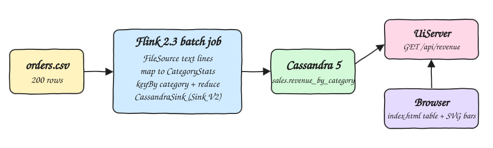
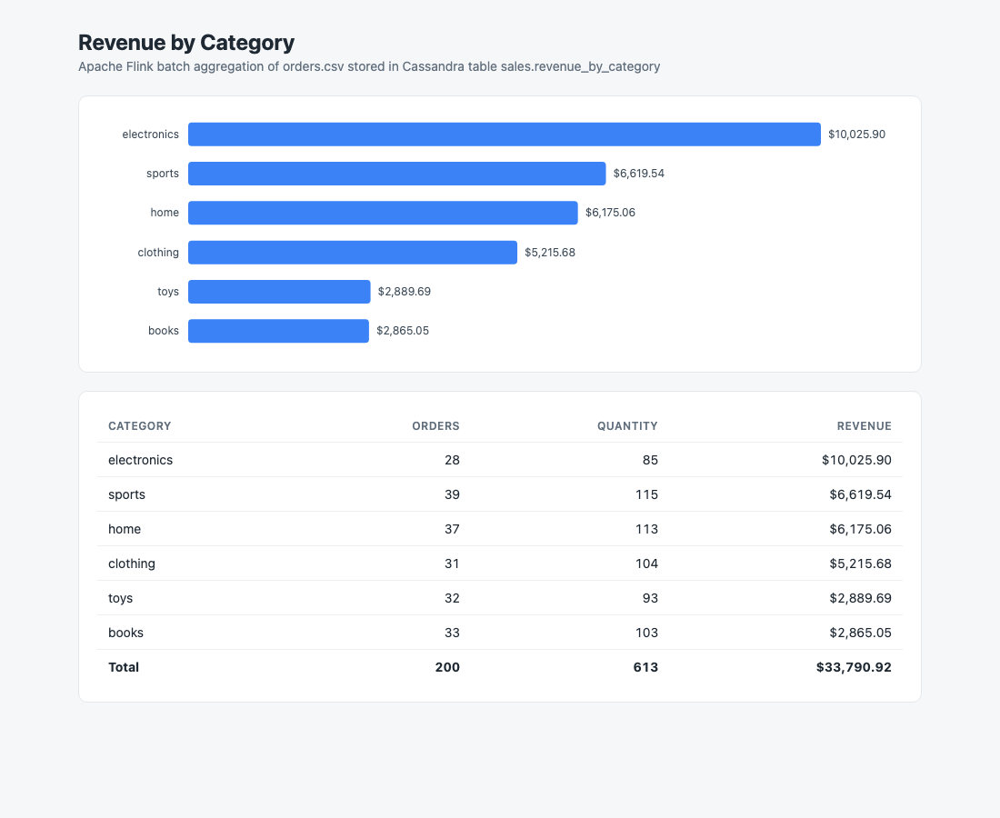

# flink-java-cassandra

An Apache Flink 2.3 batch pipeline written in Java 25 that reads `data/orders.csv`, aggregates revenue per product category, stores the result in Cassandra 5, and shows it in a small web UI served by a JDK built-in HTTP server.

## How it Works

1. `scripts/start-all.sh` starts Cassandra with podman-compose and waits until CQL answers.
2. `Pipeline` creates the keyspace `sales` and table `revenue_by_category` when missing.
3. Flink runs locally (embedded MiniCluster) in `BATCH` mode and reads the CSV with a bounded `FileSource`.
4. The header is filtered out, every line becomes a `CategoryStats` with one order, its quantity and `quantity * price`.
5. Records are keyed by category and reduced, so each category emits one final row.
6. A custom Sink V2 (`CassandraSink`) upserts the rows with revenue rounded to 2 decimals.
7. `UiServer` serves `index.html` at `/` and reads Cassandra on every `GET /api/revenue`.

## Architecture



## Features

* Bounded Flink job in batch mode: final aggregates only, no intermediate updates written to Cassandra.
* Custom Cassandra sink on the DataStax/Apache java driver: `flink-connector-cassandra` has no Flink 2.x release yet.
* Idempotent writes: `category` is the primary key, so rerunning the pipeline overwrites the same 6 rows.
* Self-contained UI: plain JS table plus an SVG bar chart, no frameworks.
* End to end test that cross-checks the API with an independent `awk` calculation over the CSV.

## Stack

* Java 25: target release of the code and runtime.
* Apache Flink 2.3.0 (`flink-streaming-java`, `flink-clients`, `flink-connector-files`): pipeline and local execution.
* Apache Cassandra java driver 4.19.3: schema creation, sink writes and UI reads.
* Cassandra 5.0.9 on podman-compose: result store, host port 12042.
* JDK `com.sun.net.httpserver`: tiny backend without extra libraries, port 12080.
* Maven 3.9: build and dependency copy into `target/lib`.

## Data Model

```sql
CREATE KEYSPACE sales WITH replication = {'class': 'SimpleStrategy', 'replication_factor': 1};
CREATE TABLE sales.revenue_by_category (
  category text PRIMARY KEY,
  total_orders bigint,
  total_quantity bigint,
  total_revenue double
);
```

`CategoryStats` is a Java record used both as the Flink stream element and as the reduce accumulator, `merge` sums the three measures and `rounded` rounds revenue to 2 decimals right before the write.

## API

| Method | Path | Response |
|---|---|---|
| GET | `/` | the `index.html` UI |
| GET | `/api/revenue` | JSON array sorted by revenue desc |

```json
[{"category":"electronics","total_orders":28,"total_quantity":85,"total_revenue":10025.90}]
```

## How to Run

Requirements: podman, podman-compose, Java 25, Maven.

```bash
./scripts/setup.sh
./scripts/start-all.sh
./scripts/test-all.sh
./scripts/ui.sh
./scripts/stop-all.sh
```

`./scripts/pipeline.sh` reruns only the Flink job against a running Cassandra.

Verified result for the committed `data/orders.csv`:

| category | total_orders | total_quantity | total_revenue |
|---|---|---|---|
| electronics | 28 | 85 | 10025.90 |
| sports | 39 | 115 | 6619.54 |
| home | 37 | 113 | 6175.06 |
| clothing | 31 | 104 | 5215.68 |
| toys | 32 | 93 | 2889.69 |
| books | 33 | 103 | 2865.05 |

## Printscreens



The UI after the pipeline ran: the bar chart ranks the 6 categories by revenue and the table lists orders, quantity and revenue per category with a total row (200 orders, 613 items, $33,790.92). All numbers are read live from Cassandra through `/api/revenue`.

## Scripts

All scripts live in `scripts/` and run from any directory of the repository.

| Script | What it does |
|---|---|
| `./scripts/setup.sh` | Pulls the Cassandra image and builds the app |
| `./scripts/start-all.sh` | Starts Cassandra, runs the Flink pipeline, starts the UI and prints the full link of each one |
| `./scripts/status.sh` | Shows every service port as UP or DOWN |
| `./scripts/test-all.sh` | Compares `/api/revenue` with an independent calculation on the CSV |
| `./scripts/ui.sh` | Opens the UI in the browser |
| `./scripts/stop-all.sh` | Stops every service |
| `./scripts/sql-console.sh` | Opens cqlsh on the `sales` keyspace |

Ports are declared in `scripts/ports.env`.

```bash
./scripts/setup.sh
./scripts/start-all.sh
./scripts/status.sh
./scripts/ui.sh
./scripts/stop-all.sh
```
