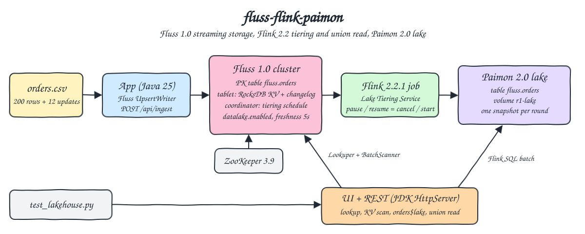
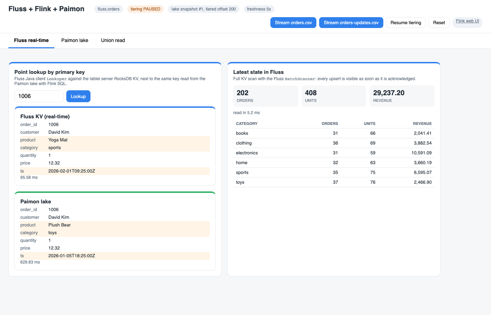
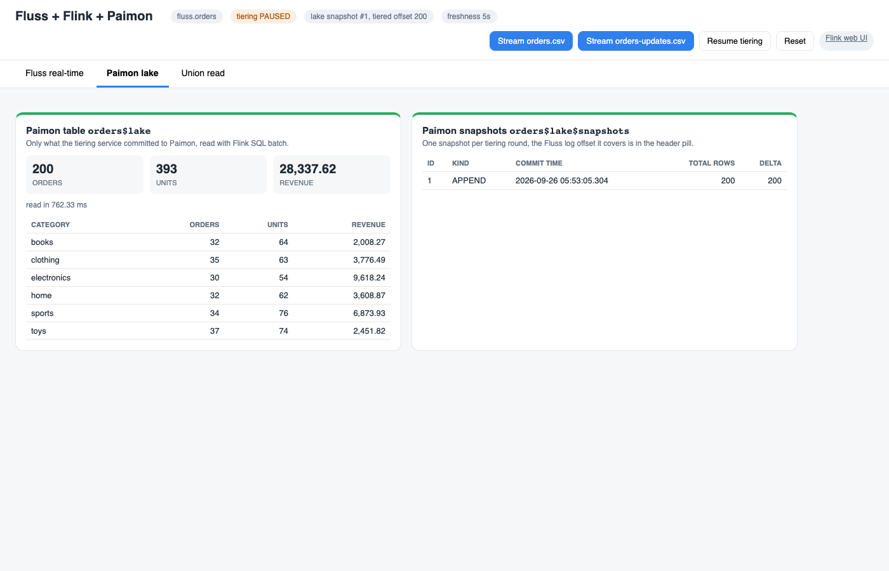
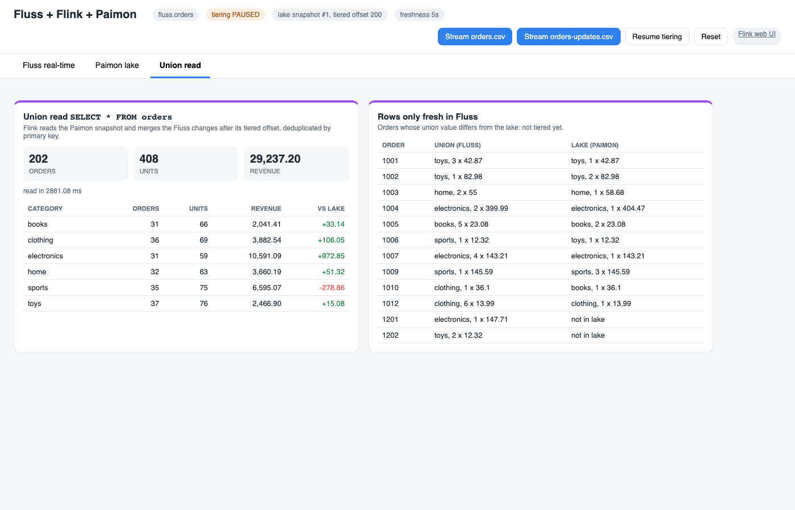
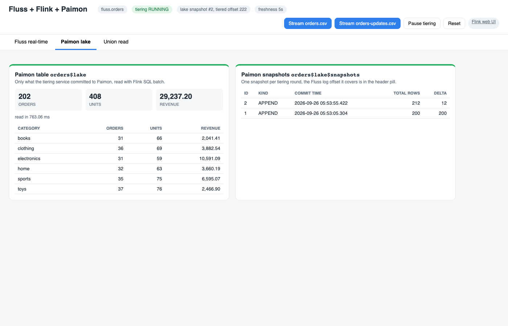
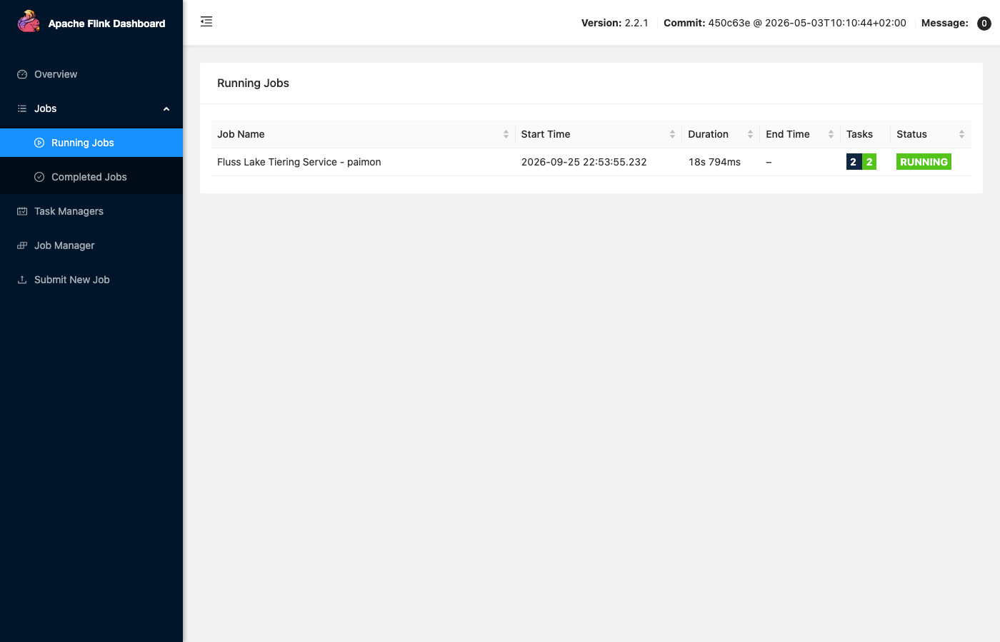

<p align="center"></p>

# fluss-flink-paimon

A real-time lakehouse built on Apache Fluss 1.0.0 (streaming storage), Apache Flink 2.2.1 and Apache Paimon 2.0.0, with a Java 25 app. The orders in `data/orders.csv` are upserted into a Fluss primary-key table with `table.datalake.enabled = true`. A Flink job running the Fluss Lake Tiering Service copies the table into a Paimon table on a local volume. The UI shows three views of the same table: Fluss point lookups and the latest KV state (fresh as soon as a write is acknowledged), the Paimon lake snapshot (only what has been tiered), and the Flink union read that merges the two.

## How it Works

1. `podman-compose` starts ZooKeeper, a Fluss coordinator, a Fluss tablet server and the `r1-app` container (Java 25). The Fluss servers run with `datalake.format: paimon` and a Paimon filesystem warehouse at `file:///lake/paimon` on the shared volume `r1-lake`.
2. On boot the app creates `fluss.orders` (primary key `order_id`, 1 bucket, `table.datalake.enabled = true`, `table.datalake.freshness = 5s`) with the Fluss Admin API. Fluss creates the matching Paimon table.
3. The app starts the tiering service in-process as a Flink 2.2.1 job built with `LakeTieringJobBuilder`, the same builder the `fluss-flink-tiering` entrypoint uses. The job runs on a local MiniCluster whose web UI is published.
4. `POST /api/ingest?file=orders.csv` reads the CSV and upserts each row with the Fluss `UpsertWriter`. The tablet server writes the row to RocksDB (KV) and to the changelog.
5. Each round, the coordinator hands the table to the tiering job. The job reads the changelog from the last tiered offset, writes Paimon files, commits a Paimon snapshot and reports the new offset back to Fluss.
6. Reads: point lookups use the Fluss `Lookuper`, the latest state uses the Fluss `BatchScanner` over the KV, the lake view is Flink SQL on `orders$lake`, and the union read is Flink SQL on `orders`.
7. Pause tiering cancels the Flink job and resume starts a new one. While tiering is paused, new upserts show up in Fluss and in the union read but not in Paimon.

## Architecture



## Features

* Primary-key streaming storage: upserts are acknowledged by Fluss and can be looked up by key right away. The table itself is the serving layer, so no Kafka and no separate KV store are needed.
* Lakehouse tiering as a plain Flink job: the Fluss Lake Tiering Service writes Paimon snapshots every `freshness` interval. You can see it, pause it and resume it from the Flink web UI and the app.
* Union read: `SELECT * FROM orders` in Flink batch mode reads the Paimon snapshot plus the Fluss changes after the tiered offset, deduplicated by primary key. The result is fresh even while the lake is behind.
* Lake-only read: `orders$lake` and `orders$lake$snapshots` expose the Paimon table and its snapshots through the Fluss catalog.
* Side-by-side lookup: the same `order_id` is read from Fluss and from Paimon, and fields that are not tiered yet are highlighted.
* A "fresh in Fluss" list shows exactly which rows the lake still lacks. It is the union read minus the lake read.
* Reset drops and recreates the Fluss table and the Paimon table, so the tests start from a known state.

## Stack

* Apache Fluss 1.0.0 (`docker.io/apache/fluss:1.0.0`): coordinator and tablet server. Fluss 1.0 is the first release as an Apache top-level project.
* fluss-flink-2.2 1.0.0: Fluss client, Flink catalog and connector, and `LakeTieringJobBuilder` in one shaded jar. Fluss 1.0 ships connectors for Flink 1.18, 1.19, 1.20, 2.2 and 2.3.
* fluss-lake-paimon 1.0.0: the Paimon lake plugin used by the tiering job and the union read (its transitive test and provided deps are excluded).
* Apache Flink 2.2.1: newest Flink with both a Fluss 1.0 connector and a Paimon 2.0 connector (`paimon-flink-2.3` does not exist yet). It runs as local MiniClusters inside the app, on Java 25.
* Apache Paimon 2.0.0 (`paimon-flink-2.2`): the lake format, which is also the version that Fluss 1.0 builds and tests against.
* flink-connector-files 2.2.1 and flink-runtime-web 2.2.1: the Paimon Flink source needs `BulkFormat` at runtime, and runtime-web serves the Flink web UI for the tiering job.
* Hadoop client 3.5.0 (api + runtime): Paimon's Flink classes reference Hadoop `Configuration`, even for a local warehouse.
* ZooKeeper 3.9.5 (`docker.io/library/zookeeper:3.9.5`): Fluss cluster metadata.
* Java 25 (`docker.io/library/eclipse-temurin:25.0.4_7-jre` at runtime, built with Maven on JDK 25): the app.
* JDK `HttpServer` + plain HTML/CSS/JS: the UI and REST API, no web framework.
* Local podman volume `r1-lake`: holds both the Fluss remote data dir and the Paimon warehouse, and is shared by the Fluss servers and the app. No object store is needed.
* podman + podman-compose: runs the four containers.

## Contracts / APIs

| Method | Path | Description |
|---|---|---|
| GET | `/` | UI |
| GET | `/api/status` | table, freshness, tiering job status and id, latest lake snapshot id and tiered offset per bucket (from Fluss `getLatestLakeSnapshot`), Flink web UI link |
| GET | `/api/lookup?id=` | the row for `order_id` from the Fluss `Lookuper` and from `orders$lake`, with the latency of each (`null` when absent, 400 when `id` is not an integer) |
| GET | `/api/fluss` | totals and per-category orders, units and revenue from a Fluss `BatchScanner` KV scan |
| GET | `/api/lake` | the same from `orders$lake`, plus `orders$lake$snapshots` |
| GET | `/api/union` | the same from the union read `orders`, the lake numbers, and `fresh`: rows whose union value differs from the lake |
| POST | `/api/ingest?file=orders.csv\|orders-updates.csv` | upserts the file into Fluss (any other file is rejected with 400) |
| POST | `/api/tiering/pause` | cancels the tiering Flink job |
| POST | `/api/tiering/resume` | starts a new tiering Flink job |
| POST | `/api/reset` | pauses tiering, drops the Fluss and Paimon tables, recreates the table, resumes tiering |

```json
{"id":1006,
 "fluss":{"order_id":1006,"customer":"David Kim","product":"Yoga Mat","category":"sports","quantity":1,"price":12.32,"ts":"2026-02-01T09:25:00Z"},"fluss_ms":88.26,
 "lake":{"order_id":1006,"customer":"David Kim","product":"Plush Bear","category":"toys","quantity":1,"price":12.32,"ts":"2026-01-05T18:25:00Z"},"lake_ms":772.15}
```

```json
{"table":"fluss.orders","freshness":"5s","tiering":{"running":true,"status":"RUNNING","jobId":"65a2dd0e8be350067c7e5098903fdad5"},
 "lakeSnapshot":{"id":2,"offsets":[{"bucket":0,"offset":222}]}}
```

Errors come back as `{"error": "..."}` with 400 (bad input) or 500.

## Key data structures and design decisions

```java
Schema.newBuilder()
    .column("order_id", DataTypes.INT()).column("customer", DataTypes.STRING())
    .column("product", DataTypes.STRING()).column("category", DataTypes.STRING())
    .column("quantity", DataTypes.INT()).column("price", DataTypes.DECIMAL(10, 2))
    .column("ts", DataTypes.STRING())
    .primaryKey("order_id").build();
TableDescriptor.builder().schema(schema).distributedBy(1, "order_id")
    .property("table.datalake.enabled", "true")
    .property("table.datalake.freshness", "5s").build();
```

* Primary-key table, not a log table: updates to an `order_id` replace the row, lookups hit RocksDB, and the union read deduplicates by key. The 12 rows of `orders-updates.csv` (10 updates, 1 category move, 2 new orders) produce 22 changelog records (`-U`/`+U` per update, `+I` per insert). That is why the tiered offset goes from 200 to 222.
* `DECIMAL(10, 2)` for money keeps sums exact, and the tests compare revenue per category to the cent.
* Freshness 5 s keeps the lake close to Fluss for the tests. The gap between the lake and Fluss is shown by pausing tiering, not by waiting on a long freshness.
* One process, several MiniClusters: the tiering job keeps a MiniCluster with the web UI on port 8081, and each Flink SQL batch query starts a short-lived one. Managed memory is 32 MB and network memory 16 MB per MiniCluster, so the app fits in its 1600 MB limit (1.36 GB peak measured during the tests).
* All HTTP requests run on one thread. The Flink planner keeps thread-local state, and one thread also serializes pause, resume and reset.
* The Fluss tablet server has `server.data-disk.write-limit-ratio: 0.99`. Fluss 1.0 rejects writes when the data disk is above 85% by default. The shared podman VM disk was at 87 to 90%, which made every upsert hang until this was raised.
* Every container, volume and network starts with `r1-` (`r1-zookeeper`, `r1-fluss-coordinator`, `r1-fluss-tablet`, `r1-app`, volumes `r1-zk-data`, `r1-zk-datalog`, `r1-fluss-data`, `r1-lake`, network `r1-net`). Host ports are the UI on 26600 and the Flink web UI on 26601. The Fluss RPC port is internal only.
* Memory limits: ZooKeeper 256 MB, coordinator 448 MB, tablet server 640 MB, app 1600 MB, about 2.9 GB in total.
* Known Fluss 1.0 behavior: when the tiering job is cancelled in the middle of a round, the coordinator keeps the table assigned to it until its hard-coded 2 minute tiering heartbeat timeout (`LakeTableTieringManager.TIERING_SERVICE_TIMEOUT_MS`, logged as `The lake tiering service for table fluss.orders(..) is timeout, change it to PENDING`). After a resume, the next Paimon snapshot can take up to about 2 minutes. When the cancel lands between rounds, it takes a few seconds. The resume test allows 240 s.

## How to run

Requirements: podman, podman-compose, Java 25, Maven 3.9, curl, lsof and python3 (the tests use only the standard library).

```bash
./scripts/setup.sh
./scripts/start-all.sh
./scripts/test-all.sh
./scripts/ui.sh
./scripts/stop-all.sh
```

`test-all.sh` resets the tables and checks, against the two CSV files as the independent source:

* After the first batch is tiered, the per-category orders, units and revenue from the Fluss KV scan, from the Paimon lake and from the union read all equal the values computed from `orders.csv`. The lake snapshot holds 200 rows, and no row is "fresh only in Fluss".
* A point lookup returns the CSV row from Fluss and the same row from Paimon. A missing key returns `null` in both, and a bad id or an unknown ingest file is rejected with 400.
* With tiering paused, `orders-updates.csv` is visible in Fluss immediately: order 1006 is `sports` in the Fluss lookup and still `toys` in Paimon. The lake offset does not move for 10 s, and the lake still equals `orders.csv`. The union read equals the merged CSVs, and the fresh rows are exactly the 12 changed ids, 2 of them not in the lake at all.
* After resume the lake catches up: a new snapshot, lake numbers equal the merged CSVs, order 1006 is `sports` in Paimon, and the fresh list is empty.
* The Flink web UI lists exactly one running job, `Fluss Lake Tiering Service - paimon`, with the job id the app reports.

```
test_1_first_batch_is_the_same_in_fluss_lake_and_union ... ok
test_2_point_lookup_reads_the_primary_key_from_fluss ... ok
test_3_paused_tiering_leaves_the_lake_stale_while_union_read_is_fresh ... ok
test_4_resumed_tiering_catches_the_lake_up ... ok
test_5_tiering_is_a_flink_job_visible_in_the_flink_web_ui ... ok
----------------------------------------------------------------------
Ran 5 tests in 74.833s

OK
all tests passed
```

## Printscreens

Fluss real-time tab, with tiering paused after `orders-updates.csv` was streamed. The lookup for order 1006 returns the fresh row from the Fluss KV in about 90 ms (Yoga Mat, `sports`, February timestamp). Paimon still has the tiered version (Plush Bear, `toys`), and the changed fields are highlighted. On the right, the `BatchScanner` KV scan already counts 202 orders and 29,237.20 revenue. The header shows tiering PAUSED and lake snapshot #1 at tiered offset 200.



Paimon lake tab at the same moment: `orders$lake` still has the first batch (200 orders, 28,337.62), and `orders$lake$snapshots` has a single APPEND snapshot of 200 rows.



Union read tab at the same moment: `SELECT * FROM orders` returns 202 orders and 29,237.20. The "vs lake" column shows what the union adds on top of Paimon: electronics +972.85, and sports -278.86 because order 1009 went from 3 rackets to 1 while 1006 moved in from toys. The right card lists the 12 rows that are only fresh in Fluss, including 1201 and 1202 which are not in the lake at all.



After resuming tiering, the lake catches up: snapshot #2 (212 total rows, delta 12) at tiered offset 222, and `orders$lake` now matches the union read.



The Flink web UI (linked from the header) with the `Fluss Lake Tiering Service - paimon` job running on Flink 2.2.1.



## Scripts

All scripts live in `scripts/` and run from any directory of the repository.

| Script | What it does |
|---|---|
| `./scripts/setup.sh` | Pulls the Fluss, ZooKeeper and JRE images, builds the app with Maven on Java 25 and builds the app image |
| `./scripts/start-all.sh` | Starts the four containers, waits for the app and the Flink web UI, streams `orders.csv` when the table is empty, waits for the first Paimon snapshot and prints every link |
| `./scripts/status.sh` | Shows the UI and Flink ports and every `r1-` container as UP or DOWN |
| `./scripts/test-all.sh` | Resets the tables and runs the lakehouse tests |
| `./scripts/ui.sh` | Opens the UI in the browser and prints the Flink web UI link |
| `./scripts/stop-all.sh` | Stops every container and waits for the ports to close |

Ports are declared in `scripts/ports.env` (ui 26600, flink 26601).

```bash
./scripts/setup.sh
./scripts/start-all.sh
./scripts/status.sh
./scripts/ui.sh
./scripts/stop-all.sh
```
