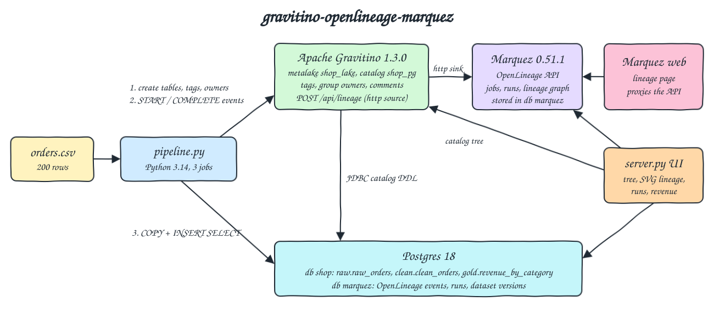
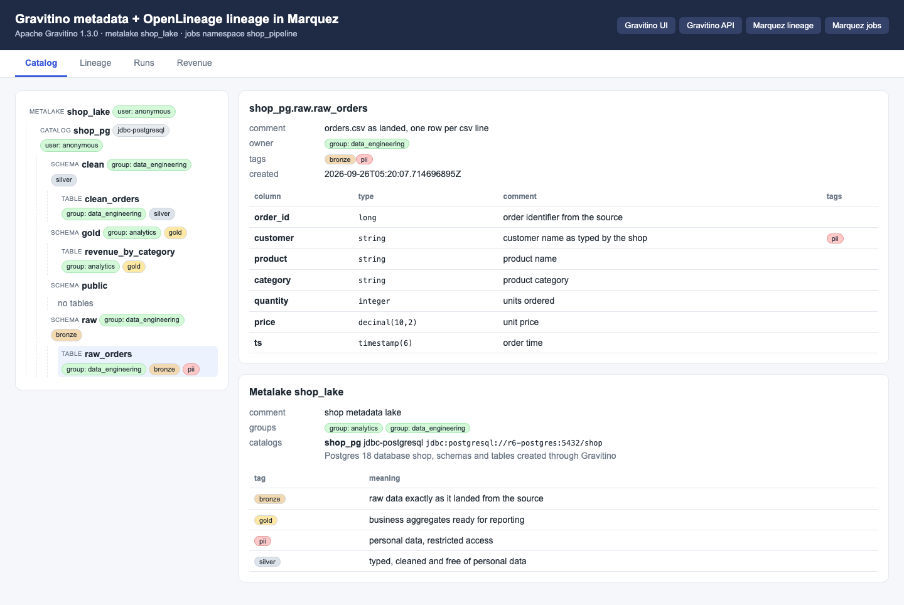
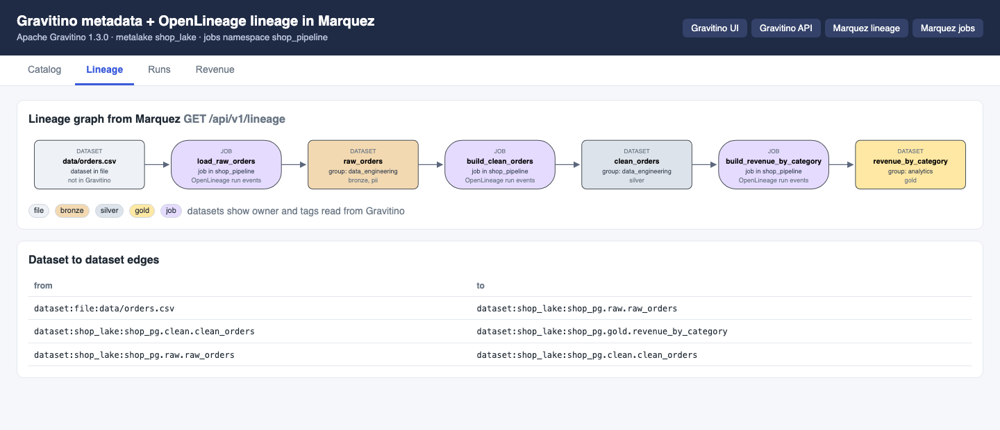
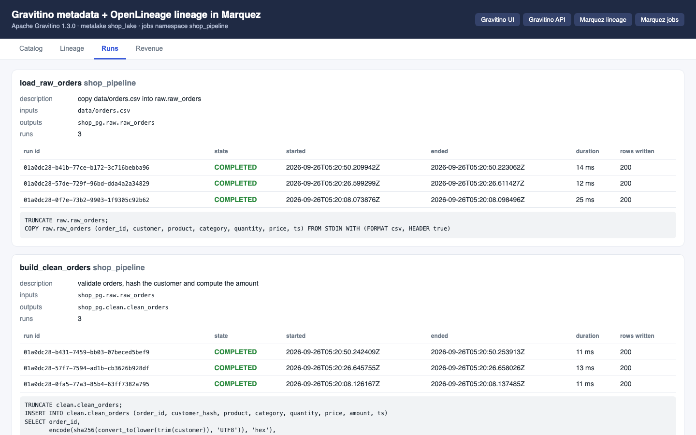
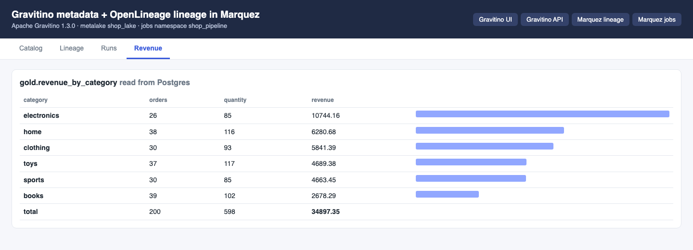
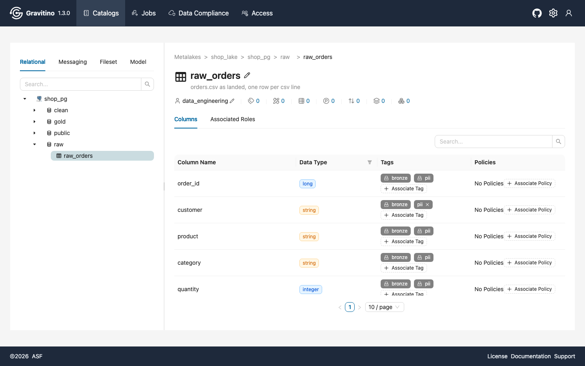
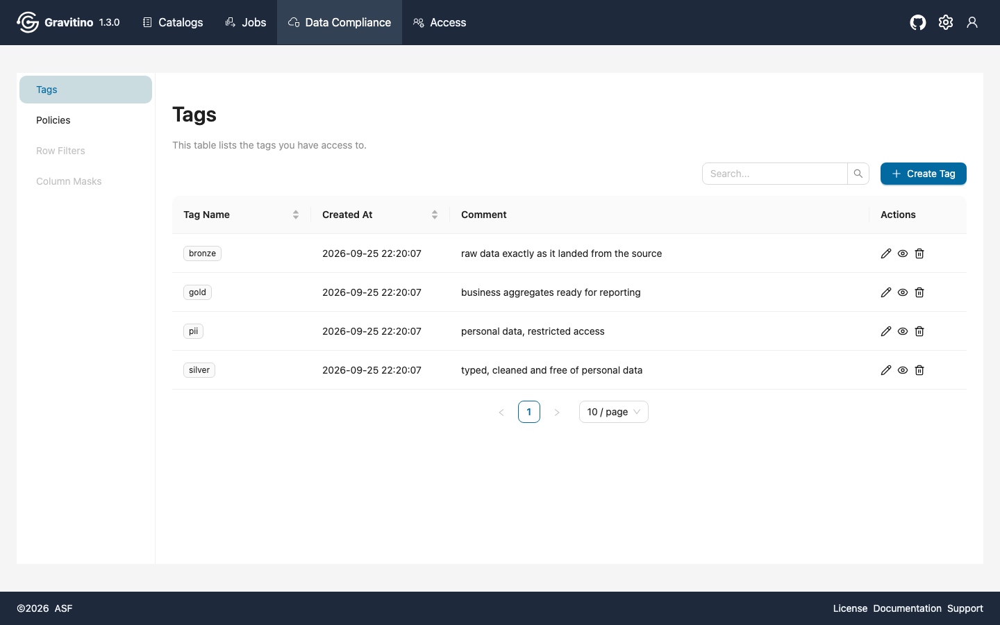
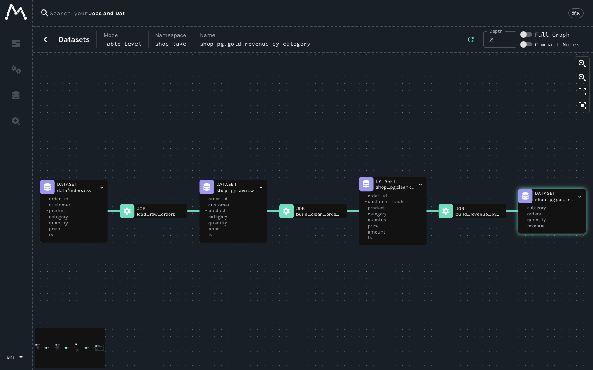

<p align="center">
  
  &nbsp;&nbsp;
  
  &nbsp;&nbsp;
  
</p>

# gravitino-openlineage-marquez

Metadata, governance and lineage on one small stack. Apache Gravitino 1.3.0 is the unified metadata catalog: it holds a metalake `shop_lake` with a Postgres JDBC catalog `shop_pg`, the schemas `raw`, `clean` and `gold` and their tables, all created through Gravitino's REST API with comments, group owners and tags (`bronze`, `silver`, `gold`, `pii`). A Python 3.14 pipeline moves `data/orders.csv` through `raw_orders -> clean_orders -> revenue_by_category`, and every job run posts OpenLineage START/COMPLETE events to Gravitino's own lineage endpoint (`POST /api/lineage`). Gravitino forwards them with its built-in OpenLineage HTTP sink to Marquez 0.51.1, which builds the lineage graph. A single page UI shows the Gravitino tree with owners and tags, the runs and the lineage graph read from the Marquez API (drawn with plain SVG), and links to the Gravitino web UI and the Marquez web UI.

## How it Works

1. `r6-postgres` (Postgres 18) holds two databases: `shop` for the data and `marquez` for Marquez.
2. `r6-gravitino` runs the official `apache/gravitino:1.3.0` image with a mounted `conf/gravitino.conf`: authorization on (needed for owners), lineage source `http`, sinks `log,http`, http sink url `http://r6-marquez:5000`.
3. `app/pipeline.py` makes the catalog idempotently through the Gravitino REST API: metalake, groups `data_engineering` and `analytics`, tags, the `jdbc-postgresql` catalog, schemas and tables (Gravitino runs the `CREATE SCHEMA` / `CREATE TABLE` in Postgres), owners (`PUT /owners/...`) and tags on schemas, tables and the `customer` column.
4. Then it runs 3 jobs: `load_raw_orders` (COPY the CSV), `build_clean_orders` (validate, sha256 the customer, compute the amount) and `build_revenue_by_category` (aggregate).
5. Each job gets a UUIDv7 run id and sends START before and COMPLETE (or FAIL with an error facet) after the SQL to `POST http://r6-gravitino:8090/api/lineage`.
6. Input/output datasets use Gravitino naming: namespace = metalake, name = `catalog.schema.table`. Their schema, documentation and ownership facets are built from the table loaded back from Gravitino, the output carries `outputStatistics.rowCount`, the job carries the SQL facet.
7. Gravitino queues the events and its `LineageHttpSink` (OpenLineage Java client) posts them to Marquez `/api/v1/lineage`. The pipeline waits (60 tries max) until Marquez reports every run as COMPLETED and fails loud otherwise.
8. `app/server.py` (stdlib `http.server`) reads the tree from Gravitino, jobs/runs and `GET /api/v1/lineage` from Marquez, and the gold table from Postgres, and `app/index.html` renders them.

## Architecture



## Features

* Gravitino as the single catalog: every dataset the pipeline writes is created through Gravitino first, so there is no table without an owner, a tier tag and comments.
* Governance metadata: group owners per schema and table, medallion tier tags, a `pii` tag on the `customer` column, comments on every table and column.
* PII never leaves bronze: the clean layer stores a sha256 hash, and the tests check that `clean` and `gold` have no `customer` column and no `pii` tag.
* Gravitino's own OpenLineage support: the pipeline never talks to Marquez to write, it only knows Gravitino. Swapping Marquez for another OpenLineage backend is a config change in `gravitino.conf`.
* Catalog backed facets: the schema facet sent to Marquez is the schema Gravitino returns, so Marquez shows the same columns and types as the catalog.
* Real run lifecycle: START, COMPLETE or FAIL, row counts, SQL, UUIDv7 run ids, and a bounded wait that proves Marquez recorded the runs.
* Idempotent: catalog objects are created only when missing, tables are truncated and reloaded, a rerun adds one new run per job and no new dataset.
* Lineage graph drawn with plain SVG from the Marquez API, colored by the Gravitino tier tag, with the Gravitino owner on each dataset.

## Stack

* Apache Gravitino 1.3.0 (`apache/gravitino:1.3.0`, latest release): metadata lake, JDBC Postgres catalog, tags, owners, web UI and the OpenLineage http source and sink, capped at 896 MB (heap 512 MB).
* Marquez 0.51.1 (`marquezproject/marquez:0.51.1`, `marquezproject/marquez-web:0.51.1`, latest images): OpenLineage backend and lineage UI, search disabled so no OpenSearch is needed, capped at 768 MB and 256 MB.
* OpenLineage spec 2-0-2 run events with standard facets (schema, documentation, ownership, jobType, sql, outputStatistics, errorMessage).
* Postgres 18.6 (`postgres:18.6-alpine`): data tables and the Marquez store in one container, capped at 256 MB.
* Python 3.14.7 (`python:3.14.7-slim`): pipeline and UI server in one image, `uuid.uuid7()` from the stdlib for run ids.
* psycopg 3.3.6 (binary): the only Python dependency, for COPY and SQL. Gravitino, OpenLineage and Marquez calls use `urllib`, no `openlineage-python` needed.
* Plain HTML, CSS and JS for the UI, no framework.
* podman + podman-compose: every container, volume and network is prefixed `r6-`, total memory limits about 2.5 GB.

## Contracts / APIs

POC UI (`http://localhost:27104`):

| Method | Path | Description |
|---|---|---|
| GET | `/` | UI with the Catalog, Lineage, Runs and Revenue tabs |
| GET | `/api/info` | Gravitino version, metalake, job namespace and links |
| GET | `/api/catalog` | Metalake tree: catalogs, schemas, tables, columns, owners, direct tags, comments, groups and tag definitions |
| GET | `/api/lineage` | Marquez lineage graph from `dataset:shop_lake:shop_pg.gold.revenue_by_category`: nodes, edges and derived dataset to dataset edges |
| GET | `/api/runs` | Marquez jobs with inputs, outputs, SQL and runs (state, start, end, duration, rows written) |
| GET | `/api/revenue` | Rows of `gold.revenue_by_category` |

Gravitino and Marquez APIs used:

| Method | Path | Used for |
|---|---|---|
| GET/POST | `gravitino /api/metalakes` | list and create the metalake |
| POST | `gravitino /api/metalakes/{m}/groups`, `/tags`, `/catalogs`, `.../schemas`, `.../tables` | create groups, tags, the JDBC catalog, schemas and tables |
| PUT | `gravitino /api/metalakes/{m}/owners/{type}/{name}` | set the owning group of a schema or table |
| POST | `gravitino /api/metalakes/{m}/objects/{type}/{name}/tags` | attach tags to schema, table or column |
| GET | `gravitino /api/metalakes/{m}/objects/{type}/{name}/tags?details=true` | direct and inherited tags |
| POST | `gravitino /api/lineage` | OpenLineage run events in (http source) |
| POST | `marquez /api/v1/lineage` | OpenLineage run events out of Gravitino (http sink) |
| GET | `marquez /api/v1/lineage?nodeId=&depth=` | lineage graph |
| GET | `marquez /api/v1/namespaces/{ns}/jobs`, `.../jobs/{job}/runs`, `/jobs/runs/{id}`, `/namespaces/{ns}/datasets` | jobs, runs and datasets |

COMPLETE event sent by `build_clean_orders` (facets shortened):

```json
{"eventType": "COMPLETE", "eventTime": "2026-09-26T05:20:50.25Z",
 "producer": "urn:gravitino-openlineage-marquez:pipeline:1.0",
 "schemaURL": "https://openlineage.io/spec/2-0-2/OpenLineage.json#/$defs/RunEvent",
 "run": {"runId": "01a0dc28-b431-7459-bb03-07beced5bef9", "facets": {}},
 "job": {"namespace": "shop_pipeline", "name": "build_clean_orders",
         "facets": {"jobType": {"processingType": "BATCH", "integration": "PYTHON", "jobType": "JOB"}, "sql": {"query": "TRUNCATE clean.clean_orders; INSERT ..."}}},
 "inputs": [{"namespace": "shop_lake", "name": "shop_pg.raw.raw_orders", "facets": {"schema": {"fields": [{"name": "order_id", "type": "long"}, "..."]}}}],
 "outputs": [{"namespace": "shop_lake", "name": "shop_pg.clean.clean_orders",
              "facets": {"schema": {"...": "..."}, "documentation": {"description": "valid orders with ..."},
                         "ownership": {"owners": [{"name": "group:data_engineering", "type": "GROUP"}]}},
              "outputFacets": {"outputStatistics": {"rowCount": 200}}}]}
```

## Key data structures and design decisions

* One source of truth for the catalog: `app/model.py` declares groups, tags, schemas, tables, columns, owners and tags. `gravitino.ensure_catalog()` applies it, the pipeline reads the registered tables back from Gravitino to build facets.
* Dataset identity follows the Gravitino OpenLineage convention: namespace `shop_lake` (the metalake) and name `shop_pg.<schema>.<table>`, so a Marquez dataset maps 1:1 to a Gravitino table. The CSV input is `file:data/orders.csv` and is not a catalog table.
* The JDBC catalog writes a Gravitino id into each Postgres schema and table comment (`From Gravitino, DO NOT EDIT: gravitino.v1.uid...`), the tests check that all three tables carry it.
* Owners need `gravitino.authorization.enable = true`. With it off, users, groups and owners answer HTTP 405. With it on and the default simple authenticator, calls run as `anonymous`, which is a service admin and the metalake owner.
* Tags are read with `?details=true` and filtered on `inherited == false`, otherwise a column also reports the tags of its table and the pipeline would skip attaching `pii` to `customer`.
* The metalake is checked with `GET /api/metalakes` (list), because with authorization on, `GET /api/metalakes/{missing}` answers 403, not 404.
* `SKIP_CONFIG_REWRITE=true`: the image entrypoint rewrites `gravitino.conf` from env vars and has no env var for lineage, so the whole file is mounted read only.
* Iceberg REST and Lance REST auxiliary services of the image are not started, to save memory. The catalog is JDBC Postgres only.

What did not work out of the box, and what was changed:

* Gravitino entity cache: with `gravitino.cache.enabled = true` (default), owners set with `PUT /owners` disappeared from `GET /owners` after listing schemas or tables, while a restart showed them again (the store was right, the cache was stale). The cache is disabled in `conf/gravitino.conf`, and owners are stable across runs and restarts.
* Gravitino's lineage http sink uses the OpenLineage client with its default 5 second timeout and has no setting to change it. Marquez runs amd64 only images under emulation on arm64, and the first events after a cold start can take longer: Gravitino logs `Read timed out` for them (2 in a fresh start) while Marquez still stores the event. The pipeline does not trust the sink: it waits until Marquez lists every run as COMPLETED, and `test-all.sh` checks the runs, their row counts and their presence in Gravitino's lineage log.
* Marquez images are published for amd64 only, podman runs them with emulation, start takes about 20 to 40 seconds.

## How to run

Requirements: podman, podman-compose, curl, lsof and python3 (the tests use only the standard library).

```bash
./scripts/setup.sh
./scripts/start-all.sh
./scripts/test-all.sh
./scripts/ui.sh
./scripts/stop-all.sh
```

`test-all.sh` reruns the pipeline and checks, with the CSV, the Gravitino API, the Marquez API and Postgres as independent sources:

* A rerun adds exactly one run per job and no dataset to Marquez, and the Marquez namespace holds exactly the three tables.
* The latest run of each job appears twice (START and COMPLETE) in Gravitino's lineage log, so it went through Gravitino and not straight to Marquez.
* The three Postgres tables carry the Gravitino id in their comment, `raw_orders` has every CSV row, `clean_orders` only has 64 char sha256 hashes.
* Every dataset the pipeline writes is a Gravitino table with a group owner and exactly one tier tag, owners match the team of each layer.
* `pii` is on `raw_orders` and its `customer` column, and neither `clean` nor `gold` has a `customer` column or a `pii` tag. Every table and column has a comment.
* Marquez lineage has exactly the edges `raw_orders -> clean_orders -> revenue_by_category` plus `orders.csv -> raw_orders`, and the Marquez schema facet equals the Gravitino columns.
* Latest runs are COMPLETED, had a START, run in lineage order, and wrote 200, 200 and 6 rows.
* Revenue, orders and quantity per category and the total equal the CSV computed with `Decimal`.

Changing an owner or removing the `pii` column tag in the Gravitino UI makes the owner and pii tests fail (checked). The next pipeline run puts the declared governance back.

```
runs before: load_raw_orders=3 build_clean_orders=3 build_revenue_by_category=3
registering metadata in gravitino, running raw -> clean -> revenue_by_category and emitting openlineage events
gravitino 1.3.0 at http://r6-gravitino:8090
metalake  shop_lake                            exists
group     data_engineering                     exists
group     analytics                            exists
tag       bronze                               exists
tag       silver                               exists
tag       gold                                 exists
tag       pii                                  exists
catalog   shop_pg                              exists
schema    shop_pg.raw                          exists
schema    shop_pg.clean                        exists
schema    shop_pg.gold                         exists
table     shop_pg.raw.raw_orders               exists
table     shop_pg.clean.clean_orders           exists
table     shop_pg.gold.revenue_by_category     exists
load_raw_orders             run 01a0dc30-1016-705a-9fec-02fd0cb05187  rows  200     13.8 ms  START+COMPLETE sent to gravitino
build_clean_orders          run 01a0dc30-1045-77a5-872d-d0b232b22446  rows  200     14.0 ms  START+COMPLETE sent to gravitino
build_revenue_by_category   run 01a0dc30-106e-7308-a2a6-40574239a426  rows    6     12.7 ms  START+COMPLETE sent to gravitino
marquez recorded 3 runs as COMPLETED after 8.9 s (gravitino lineage http sink)
runs after:  load_raw_orders=4 build_clean_orders=4 build_revenue_by_category=4
PASS a rerun adds exactly one run per job
PASS a rerun does not duplicate datasets in marquez
PASS marquez namespace shop_lake holds the three tables
PASS latest load_raw_orders run reached marquez through the gravitino lineage endpoint (START and COMPLETE in its lineage log)
PASS latest build_clean_orders run reached marquez through the gravitino lineage endpoint (START and COMPLETE in its lineage log)
PASS latest build_revenue_by_category run reached marquez through the gravitino lineage endpoint (START and COMPLETE in its lineage log)
PASS raw, clean and gold tables in postgres were created by gravitino
PASS raw_orders holds every csv row
PASS clean_orders holds no customer names, only 64 char sha256 hashes
test_every_dataset_the_pipeline_writes_is_registered_in_gravitino_with_owner_and_tier ... ok
test_every_table_and_column_has_a_comment ... ok
test_owners_follow_the_team_responsible_for_each_layer ... ok
test_pii_is_tagged_at_the_source_and_does_not_reach_clean_or_gold ... ok
test_latest_runs_completed_and_row_counts_match_the_csv ... ok
test_marquez_lineage_has_exactly_the_raw_clean_revenue_edges ... ok
test_marquez_namespace_holds_only_datasets_registered_in_gravitino ... ok
test_marquez_schema_facet_is_the_gravitino_table_schema ... ok
test_runs_of_one_pipeline_execution_happen_in_lineage_order ... ok
test_revenue_per_category_matches_the_csv ... ok
test_total_revenue_matches_the_csv ... ok
Ran 11 tests in 2.006s
OK
all tests passed
```

## Printscreens

Catalog tab: the Gravitino tree of metalake `shop_lake` with the JDBC catalog `shop_pg` and the schemas `clean`, `gold`, `public` (the default Postgres schema, listed by the JDBC catalog but not managed) and `raw`, each with its owning group and tier tag. The selected table `raw_orders` shows its comment, owner, tags and columns, with `pii` only on `customer`. Below: groups, catalog and the tag definitions.



Lineage tab: the graph returned by Marquez `GET /api/v1/lineage`, drawn with SVG. Jobs are purple, datasets are colored by their Gravitino tier tag and show the Gravitino owner and tags. The table lists the dataset to dataset edges derived from the job nodes.



Runs tab: every job with its inputs, outputs, runs (three pipeline executions, all COMPLETED, 200, 200 and 6 rows written, from the `outputStatistics` facet) and the SQL from the `sql` job facet.



Revenue tab: `gold.revenue_by_category` read from Postgres, 200 orders and 34897.35 in total, the same numbers the tests compute from the CSV.



Gravitino web UI (log in with user `anonymous`) on `shop_lake / shop_pg / raw / raw_orders`: comment, owner `data_engineering`, and per column the inherited tags (locked) plus the direct `pii` tag on `customer`.



Gravitino web UI, Data Compliance > Tags: the four tags of the metalake with their comments.



Marquez web UI lineage page for `shop_pg.gold.revenue_by_category`: the same chain `data/orders.csv -> load_raw_orders -> raw_orders -> build_clean_orders -> clean_orders -> build_revenue_by_category -> revenue_by_category`, with the columns from the schema facets.



## Scripts

All scripts live in `scripts/` and run from any directory of the repository.

| Script | What it does |
|---|---|
| `./scripts/setup.sh` | Pulls Postgres, Gravitino, Marquez, Marquez web and Python images and builds the app image |
| `./scripts/start-all.sh` | Starts Postgres, Gravitino, Marquez and Marquez web, runs the pipeline when the gold table is empty, starts the UI and prints the full link of each service |
| `./scripts/pipeline.sh` | Registers the catalog in Gravitino, runs the 3 jobs and emits their OpenLineage events |
| `./scripts/status.sh` | Shows every service port as UP or DOWN |
| `./scripts/test-all.sh` | Reruns the pipeline and checks idempotency, the lineage path, governance, lineage edges and revenue |
| `./scripts/ui.sh` | Opens the UI and prints the Gravitino and Marquez UI links |
| `./scripts/sql-console.sh` | Opens psql on the `shop` database |
| `./scripts/stop-all.sh` | Stops every service |

Ports are declared in `scripts/ports.env`: gravitino 27100 (API and web UI at `/ui`), marquez 27101 (API), marquez_web 27102, postgres 27103, ui 27104.

```bash
./scripts/setup.sh
./scripts/start-all.sh
./scripts/status.sh
./scripts/ui.sh
./scripts/sql-console.sh
./scripts/stop-all.sh
```
