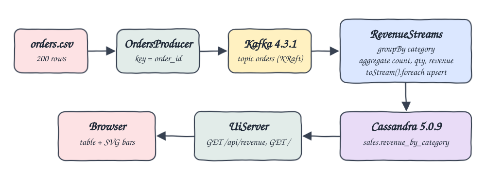
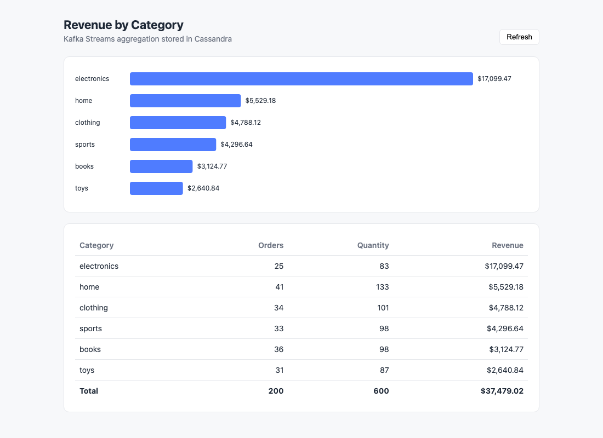

# kafka-streams-java-cassandra

A Kafka Streams pipeline in Java 25 that reads orders from a CSV file, aggregates revenue per category, stores the result in Cassandra and shows it in a small web UI.

## How it Works

1. `OrdersProducer` reads `data/orders.csv` (200 orders) and sends each row to the Kafka topic `orders`, keyed by `order_id`.
2. `RevenueStreams` consumes `orders`, re-keys every record by `category` with `groupBy` and runs `aggregate`.
3. The aggregate keeps `total_orders`, `total_quantity` and revenue in cents, so money sums never drift.
4. Every KTable update goes through `toStream().foreach` and is upserted into `sales.revenue_by_category` in Cassandra.
5. `UiServer` (JDK `com.sun.net.httpserver`) serves `index.html` at `/` and reads Cassandra on `GET /api/revenue`.
6. The page renders a table and an SVG bar chart with plain JavaScript.

## Architecture



## Features

* CSV to Kafka producer: loads the shared order file into the `orders` topic once.
* Stateful aggregation with Kafka Streams: `groupBy` + `aggregate` keeps totals per category in a state store.
* Upserts to Cassandra: the category is the primary key, so each update overwrites the last value.
* Exact revenue: totals are summed as integer cents and written as a 2 decimal double.
* Self-contained UI: one HTML file, no frameworks, table plus bar chart.
* Idempotent scripts: running start twice does not produce the CSV twice.

## Stack

* Java 25 (Amazon Corretto via sdkman): target release 25.
* Apache Kafka 4.3.1 (`apache/kafka` image, KRaft single node): no ZooKeeper to run.
* Kafka Streams 4.3.1: groupBy and aggregate with a local state store.
* Apache Cassandra 5.0.9: sink table keyed by category.
* Apache Cassandra Java driver 4.19.3: CQL session and prepared upserts.
* Maven 3.9: build and copy of runtime dependencies to `target/lib`.
* podman and podman-compose: run Kafka and Cassandra.

## Contracts

Input CSV header:

```
order_id,customer,product,category,quantity,price,ts
```

Cassandra table:

```sql
CREATE TABLE sales.revenue_by_category (
  category text PRIMARY KEY,
  total_orders bigint,
  total_quantity bigint,
  total_revenue double
);
```

REST API:

| Method | Path | Response |
|---|---|---|
| GET | `/` | the UI page |
| GET | `/api/revenue` | JSON array sorted by revenue, highest first |

```json
[{"category":"electronics","total_orders":25,"total_quantity":83,"total_revenue":17099.47}]
```

## Key Design Decisions

* The aggregate value is a `Totals` record serialized as the string `orders,quantity,revenueCents`, so only `Serdes.String()` is needed and no custom serde class exists.
* The Kafka Streams state directory lives in `.run/kafka-streams` and is deleted by `stop-all.sh`, because the Kafka container keeps no volume and the local state must not outlive the topic.
* Kafka has two listeners: `PLAINTEXT` advertised on the host port for the Java apps and `INTERNAL` for the admin tools that run inside the container.
* The keyspace and table are created with `IF NOT EXISTS` by the apps when they connect.

## How to run

Requirements: podman with a started podman machine, podman-compose, Maven, Java 25 (`sdk install java 25.0.4-amzn`).

```bash
./scripts/setup.sh
./scripts/start-all.sh
./scripts/test-all.sh
./scripts/ui.sh
./scripts/stop-all.sh
```

`test-all.sh` computes the expected totals from `data/orders.csv` with awk and compares them to `GET /api/revenue`:

```
books 36 98 3124.77
clothing 34 101 4788.12
electronics 25 83 17099.47
home 41 133 5529.18
sports 33 98 4296.64
toys 31 87 2640.84
PASS
```

## Printscreens



The UI after the pipeline processed all 200 orders. The bar chart ranks the 6 categories by revenue, and the table shows orders, quantity and revenue per category with a total row (200 orders, 600 items, $37,479.02). The Refresh button reloads `/api/revenue` from Cassandra.

## Scripts

All scripts live in `scripts/` and run from any directory of the repository.

| Script | What it does |
|---|---|
| `./scripts/setup.sh` | Pulls the images and builds the app |
| `./scripts/start-all.sh` | Starts Kafka, Cassandra, the streams app and the UI, produces the CSV once, prints every link |
| `./scripts/status.sh` | Shows every service port as UP or DOWN |
| `./scripts/test-all.sh` | Checks the API totals against the CSV |
| `./scripts/ui.sh` | Opens the UI in the browser |
| `./scripts/stop-all.sh` | Stops every service |
| `./scripts/sql-console.sh` | Opens cqlsh on the `sales` keyspace |

Ports are declared in `scripts/ports.env`: Kafka 13092, Cassandra 13042, UI 13080.

```bash
./scripts/setup.sh
./scripts/start-all.sh
./scripts/status.sh
./scripts/ui.sh
./scripts/stop-all.sh
```
