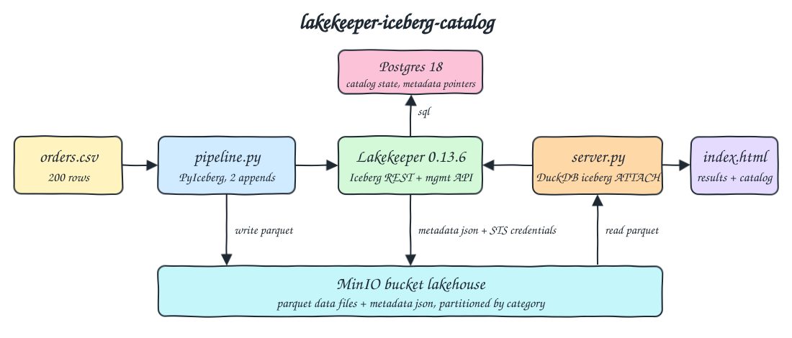
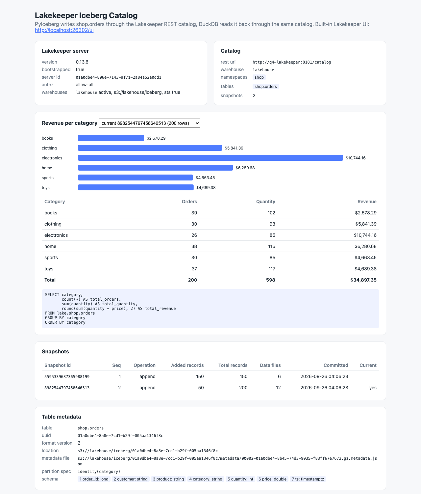
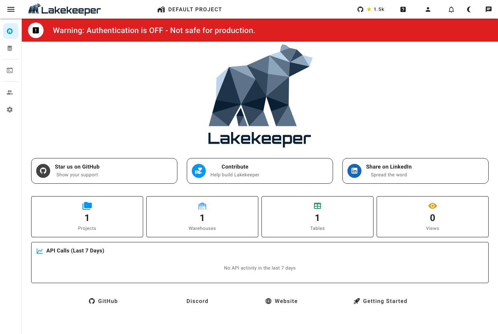

# lakekeeper-iceberg-catalog

Lakekeeper is an Apache Iceberg REST catalog written in Rust. This POC runs Lakekeeper on a Postgres backend with MinIO (S3) as storage, bootstraps it and creates a warehouse through its management API, then writes `data/orders.csv` as an Iceberg table with PyIceberg through the REST catalog. DuckDB attaches the same catalog, computes revenue per category (current snapshot and time travel), and a tiny Python `http.server` backend shows the results plus catalog info (warehouse, namespaces, tables, snapshots, metadata).

## How it Works

1. `q4-minio` holds the bucket `lakehouse`; `q4-postgres` stores the whole catalog state of Lakekeeper.
2. `q4-migrate` runs `lakekeeper migrate` once to create the Lakekeeper schema in Postgres, then `q4-lakekeeper` runs `lakekeeper serve`.
3. `q4-pipeline` calls the management API: `GET /management/v1/info`, `POST /management/v1/bootstrap` when not bootstrapped yet, and `POST /management/v1/warehouse` to create warehouse `lakehouse` (S3 storage profile on MinIO, `s3-compat` flavor, STS enabled, hard delete profile) when it does not exist.
4. The pipeline then uses PyIceberg against `/catalog` with `warehouse=lakehouse`: creates namespace `shop`, purges and recreates `shop.orders` partitioned by `identity(category)`, and appends 150 rows, then 50 rows (2 snapshots).
5. Lakekeeper writes the metadata json files to MinIO and keeps the current metadata pointer in Postgres (table `tabular`).
6. Readers and writers never get S3 keys from config: Lakekeeper vends short lived STS credentials from MinIO on every table load.
7. `q4-ui` (`app/server.py`) runs DuckDB `ATTACH 'lakehouse' AS lake (TYPE iceberg, ENDPOINT '.../catalog')` and `FROM lake.shop.orders [AT (VERSION => id)]`, and reads catalog info with PyIceberg plus the management API.
8. `scripts/test-all.sh` checks the catalog state and compares the DuckDB results against `awk` over the raw CSV.

## Architecture



## Features

- Lakekeeper management API: bootstrap and warehouse creation are code, idempotent on every run.
- Iceberg REST catalog: PyIceberg (writer) and DuckDB (reader) share one catalog service, no Hive metastore, no JVM.
- Postgres backend: catalog state survives restarts in volume `q4-postgres-data`, and can be inspected with `psql`.
- Credential vending: the UI container has no S3 keys at all, it reads data files with STS credentials handed out by Lakekeeper.
- Snapshots and time travel: two appends give two snapshots, DuckDB reads either one with `AT (VERSION => id)`.
- Partitioning by category: data files land in `data/category=<name>/` on MinIO, checked by the tests.
- Built-in Lakekeeper UI at `/ui` and Swagger UI at `/swagger-ui`, shipped inside the Lakekeeper binary.
- Independent verification: `awk` recomputes the per category totals for both snapshots.

## Stack

- Lakekeeper 0.13.6 (`quay.io/lakekeeper/catalog:v0.13.6`): Rust Iceberg REST catalog with management API and built-in UI, latest release.
- Postgres 18.6 (`postgres:18.6-alpine`): Lakekeeper catalog backend (Lakekeeper needs Postgres 15+).
- MinIO (`pgsty/minio` community build, RELEASE.2026-08-04): S3 compatible storage with STS `AssumeRole` for vended credentials.
- Python 3.14.7 (`python:3.14.7-slim`): runtime for the pipeline and the UI backend.
- PyIceberg 0.12.0 (`pyiceberg[pyarrow]`, declares Python 3.14 support): writes the table through the REST catalog.
- pyarrow 25.0.1: reads the CSV into an Arrow table for PyIceberg.
- DuckDB 1.5.5 + `iceberg`, `httpfs` and `avro` extensions: reads the table through the same REST catalog.
- Python stdlib `http.server` and `urllib`: UI backend and management API client, no web framework.
- podman + podman-compose: runs everything with small memory limits (256m to 512m per container).

## Contracts / APIs

UI backend:

| Method | Path | Description |
|---|---|---|
| GET | `/` | UI (`app/index.html`) |
| GET | `/api/revenue` | Revenue per category on the current snapshot: `{snapshot_id, sql, rows: [{category, total_orders, total_quantity, total_revenue}]}` |
| GET | `/api/revenue?snapshot=<id>` | Same, at an older snapshot with DuckDB time travel |
| GET | `/api/catalog` | Lakekeeper server info, warehouses, namespaces, tables, schema, partition spec, metadata location and snapshots |

Lakekeeper endpoints used:

| Method | Path | Used by |
|---|---|---|
| GET | `/management/v1/info` | pipeline (bootstrapped?), UI, tests |
| POST | `/management/v1/bootstrap` | pipeline, body `{"accept-terms-of-use": true}` |
| GET / POST | `/management/v1/warehouse` | pipeline creates `lakehouse`, UI and tests list it |
| GET | `/catalog/v1/config?warehouse=lakehouse` | PyIceberg, DuckDB, tests (returns the warehouse id as `prefix`) |
| * | `/catalog/v1/{prefix}/namespaces/...` | Iceberg REST namespace and table operations |

Snapshot ids are returned as strings because they are 64 bit and do not fit a JavaScript number.

## Key design decisions

- Table schema: `order_id long, customer string, product string, category string, quantity int, price double, ts timestamptz`, partition spec `identity(category)`.
- Warehouse storage profile: bucket `lakehouse`, key prefix `iceberg`, `path-style-access`, `flavor: s3-compat`, `sts-enabled: true`. Only the pipeline holds the MinIO keys, and only to register them in the warehouse, where Lakekeeper stores them encrypted in Postgres.
- `delete-profile: hard` so `purge_table` really drops the table and the pipeline can recreate `shop.orders` on every run (the default soft delete keeps it around for a while).
- Migration runs as a one-shot container before `serve`; the Lakekeeper image is distroless, so there is no shell to chain the two commands.
- The UI is started only after the pipeline wrote the table; `start-all.sh` skips the pipeline when the UI already answers, so it is safe to run twice. `scripts/pipeline.sh` reruns it on demand.
- `sql-console.sh` opens `psql` on the Lakekeeper Postgres, since that is where the catalog lives (tables `warehouse`, `namespace`, `tabular`, `table_snapshot`, ...).
- All container, network and volume names start with `q4-`, host ports are 26300 to 26304.

## How to run

```bash
./scripts/setup.sh
./scripts/start-all.sh
./scripts/test-all.sh
./scripts/ui.sh
./scripts/stop-all.sh
```

Test output:

```
PASS lakekeeper is bootstrapped
PASS lakekeeper version
PASS management api has warehouse lakehouse on s3 bucket lakehouse with sts
PASS iceberg rest config maps warehouse lakehouse to its warehouse id prefix
PASS iceberg rest lists namespace shop
PASS iceberg rest lists table shop.orders
PASS two append snapshots with 150 then 200 records
PASS only the last snapshot is current
PASS lakekeeper postgres holds the current metadata pointer of shop.orders
PASS data files on minio are partitioned by category
PASS ui container has no s3 keys, it reads with credentials vended by lakekeeper
PASS duckdb revenue per category on the current snapshot == awk over all 200 csv rows
PASS duckdb time travel to the first snapshot == awk over the first 150 csv rows
current snapshot per category (category orders quantity revenue):
books 39 102 2678.29
clothing 30 93 5841.39
electronics 26 85 10744.16
home 38 116 6280.68
sports 30 85 4663.45
toys 37 117 4689.38
first snapshot per category (category orders quantity revenue):
books 29 72 1972.22
clothing 20 61 4334.04
electronics 20 64 7897.34
home 30 88 4793.32
sports 22 63 3703.58
toys 29 88 3738.49
all tests passed
```

Inspect the catalog in Postgres:

```bash
./scripts/sql-console.sh -c "select name, metadata_location from tabular"
```

## Printscreens



The POC UI. The top cards show the Lakekeeper server (version 0.13.6, bootstrapped, `allow-all` authz, warehouse `lakehouse` on `s3://lakehouse/iceberg` with STS) and the catalog view (REST uri, namespace `shop`, table `shop.orders`, 2 snapshots). The middle card is the DuckDB revenue per category with the SQL it ran; the dropdown switches between the current snapshot (200 orders, $34,897.35) and the first snapshot (150 orders) through time travel. Below are the snapshot list (two appends of 150 and 50 records, 6 then 12 data files, one per category per append) and the table metadata: uuid, format version 2, table location, current metadata file, `identity(category)` partition spec and schema.



The built-in Lakekeeper UI served by the same binary at `http://localhost:26302/ui`. It shows 1 project, 1 warehouse and 1 table, and the API call chart for the requests made by the pipeline and the POC UI. The red banner is expected: authentication is off in this POC. The sidebar leads to the warehouse browser, where namespaces, tables, schema and snapshots can be explored.

## Scripts

All scripts live in `scripts/` and run from any directory of the repository.

| Script | What it does |
|---|---|
| `./scripts/setup.sh` | Pulls the Lakekeeper, Postgres and MinIO images and builds the pipeline/UI image |
| `./scripts/start-all.sh` | Starts MinIO and Postgres, migrates and starts Lakekeeper, runs the pipeline, starts the UI and prints the full link of each one |
| `./scripts/status.sh` | Shows every service port as UP or DOWN |
| `./scripts/test-all.sh` | Checks Lakekeeper, the REST catalog, Postgres, MinIO and DuckDB results against awk |
| `./scripts/pipeline.sh` | Reruns bootstrap check, warehouse check and the table rewrite |
| `./scripts/ui.sh` | Opens the UI in the browser |
| `./scripts/stop-all.sh` | Stops every service |
| `./scripts/sql-console.sh` | Opens psql on the Lakekeeper Postgres catalog database |

Ports are declared in `scripts/ports.env`: MinIO 26300, MinIO console 26301, Lakekeeper 26302 (UI at `/ui`), Postgres 26303, UI 26304.

```bash
./scripts/setup.sh
./scripts/start-all.sh
./scripts/status.sh
./scripts/ui.sh
./scripts/stop-all.sh
```
