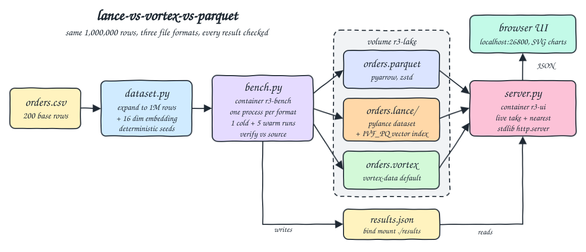
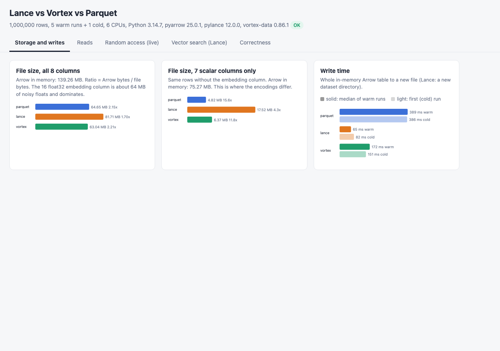
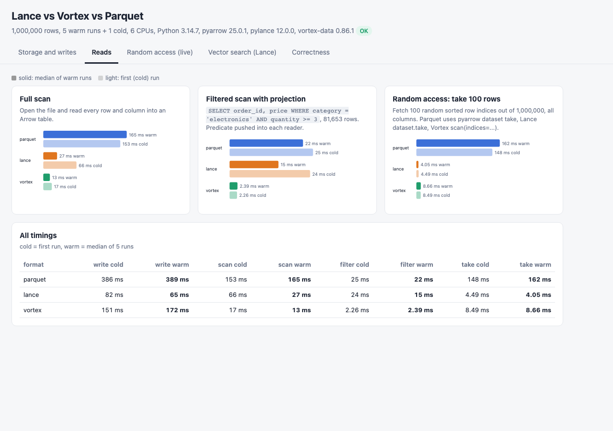
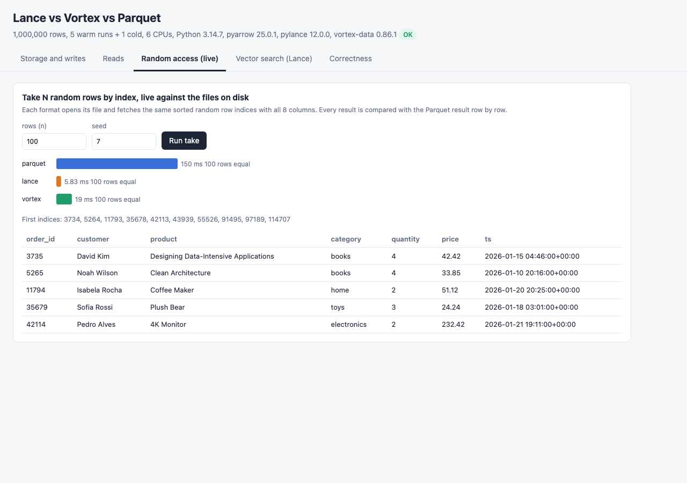
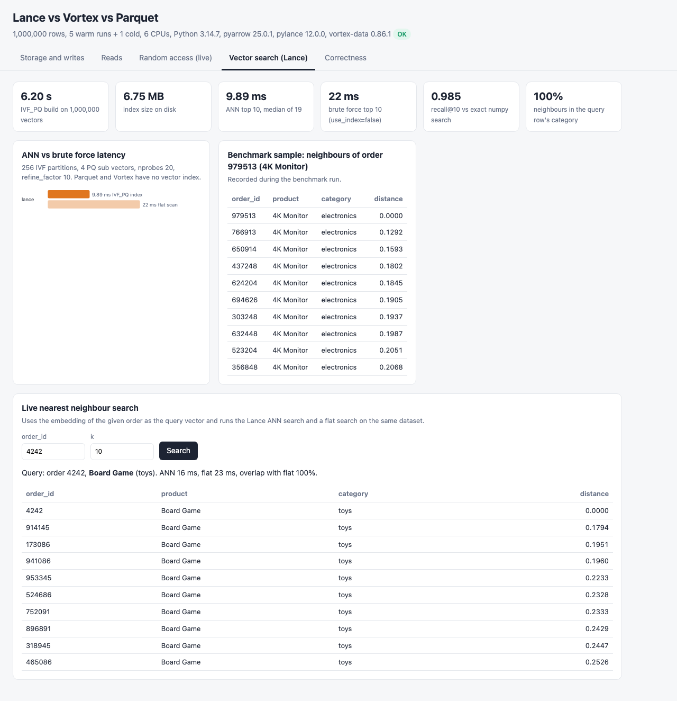
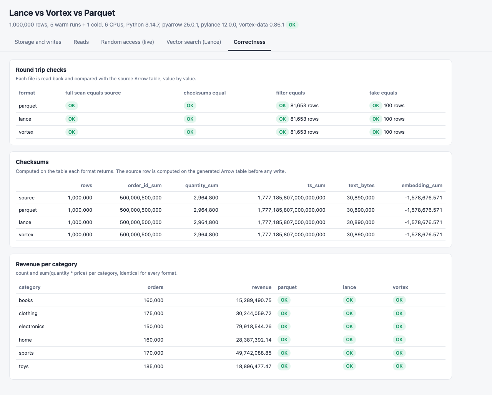

<p>
  
  &nbsp;&nbsp;&nbsp;
  
</p>

# lance-vs-vortex-vs-parquet

Benchmark of two new columnar file formats, Lance (`pylance`) and Vortex (`vortex-data`, a Linux Foundation LF AI & Data project), against Apache Parquet (pyarrow, zstd), on the same deterministic 1,000,000 row orders dataset with a 16 dimension embedding column. It measures file size and compression ratio, write time, full scan, filtered scan with projection and random access (take 100 random rows by index), as one cold run plus the median of 5 warm runs. It also builds a Lance IVF_PQ vector index and runs nearest neighbour search, which neither Parquet nor Vortex can do. Every format must read back exactly the same data, value by value, or the run fails. A small UI shows everything with plain SVG charts and runs random access and vector search live.

## How it Works

1. `data/orders.csv` (200 orders, the same base file as `parquet-vs-orc-vs-avro`) is expanded to 1,000,000 rows: row `i` copies base row `i % 200`, gets `order_id = i + 1`, `quantity + k % 3`, `price * (100 + k % 7) / 100` and `ts + k hours`, with `k = i / 200`.
2. Each row gets a 16 dim float32 `embedding`: a fixed center per category, plus a fixed offset per product, plus seeded noise. Rows of the same product cluster together, so nearest neighbour results can be checked.
3. `bench.py` runs each step in its own Python process (source, parquet, lance, vortex, vector). This isolates the Rust allocators of Lance and Vortex from each other, and makes the cold run a real first run in a fresh process.
4. For each format: 1 cold + 5 warm iterations of write (from the in-memory Arrow table), full scan, filtered scan with projection (`SELECT order_id, price WHERE category = 'electronics' AND quantity >= 3`, pushed into each reader) and take of 100 sorted random row indices.
5. After the timings each file is read back: the full scan must `equals()` the source table, checksums (row count, sums of ids, quantities, timestamps, text bytes, embedding values, revenue per category) must match, the filter must return the exact expected rows and take must return the exact requested rows.
6. The vector step builds an IVF_PQ index on the Lance dataset, runs 20 queries with and without the index, and computes recall@10 against an exact numpy search.
7. Results go to `results/results.json`. The data files stay in the podman volume `r3-lake`, which the UI container also mounts to run take and nearest searches live.

## Architecture



## Features

* Same data in every format, same Arrow table as input: differences come from the format and its library, not from the data.
* Cold run and median of warm runs, with every raw run kept in `results.json`: shows first run cost and steady state.
* Size with and without the embedding column: the noisy float vectors dominate the file size and hide how well each format encodes the scalar columns.
* Random access benchmark: the case Lance was designed for, shown next to scans where it is not the winner.
* Lance vector index: IVF_PQ build time, index size, ANN vs brute force latency and recall@10 against exact search.
* Correctness first: value by value equality, checksums, exact filter rows and exact take rows for every format. A fast wrong answer fails the run.
* Live UI: take any number of random rows from all three files and compare, or search the nearest neighbours of any order.
* Everything runs in podman with memory caps (bench 1536 MB, UI 960 MB, 2.5 GB total).

## Stack

* Python 3.14.7 (`docker.io/library/python:3.14.7-slim`): all three libraries ship abi3 wheels that install on 3.14.
* pyarrow 25.0.1: Parquet reader and writer, and the Arrow table every format reads from and returns.
* pylance 12.0.0: Lance datasets, `take`, filter pushdown and the IVF_PQ vector index.
* vortex-data 0.86.1: Vortex files with `vx.io.write`, `VortexFile.to_arrow(projection, expr)` and `VortexFile.scan(indices=...)`.
* numpy 2.5.3: data generation and the exact nearest neighbour search used to measure recall.
* Python stdlib `http.server`: serves the UI and the JSON API, no web framework.
* Plain HTML, CSS, JS and SVG: charts without a chart library.
* podman + podman-compose: one image for the benchmark and the UI.

## Contracts / APIs

| Method | Path | Description |
|---|---|---|
| GET | `/` | UI |
| GET | `/api/health` | `{"status": "UP"}` |
| GET | `/api/results` | `results.json`: rows, iterations, versions, source checksums, per format sizes, timings, checks, vector results, `all_ok` |
| GET | `/api/take?n=100&seed=7` | Live take of `n` (1 to 10000) sorted random row indices from every file, time per format and whether each result equals the Parquet result |
| GET | `/api/nearest?order_id=4242&k=10` | Live Lance nearest neighbours of the order's embedding, ANN and flat latency, overlap between the two |

```json
{"n": 100, "seed": 7, "indices": [3734, 5264, 11793],
 "results": [{"name": "parquet", "ms": 161.5, "rows": 100, "same_as_parquet": true},
             {"name": "lance", "ms": 6.673, "rows": 100, "same_as_parquet": true},
             {"name": "vortex", "ms": 18.487, "rows": 100, "same_as_parquet": true}]}
```

Each entry of `formats[]` in `/api/results` has `name`, `settings`, `size_bytes`, `scalar_size_bytes`, `write_ms`, `scan_ms`, `filter_ms`, `take_ms` (each `{cold, median, runs}`), `checks` (`scan_equal`, `checksums`, `checksums_equal`, `filter_rows`, `filter_equal`, `take_rows`, `take_equal`) and `ok`.

## Key data structures and design decisions

* One class per format in `app/formats.py` with `write`, `scan`, `filter`, `take`. Each uses the library's own API and defaults, nothing tuned, so the numbers show what you get out of the box.
* Parquet is written by pyarrow with zstd and the default row group size, which puts all 1,000,000 rows in one row group. pyarrow `Dataset.take` then decodes that whole row group to return 100 rows, which is why Parquet random access costs about as much as a full scan (and peaks at about 570 MB RSS). Smaller row groups would help Parquet here. That is a tuning choice the other two formats do not need.
* Vortex `scan(indices=...)` requires strictly increasing indices. The benchmark sorts the random indices for all three formats, so the comparison is fair.
* Lance is a directory (data files plus manifest). The benchmark removes and rewrites it on every write so old versions do not add to the size. The index size is measured as the directory growth after `create_index`.
* The filter is expressed three times: a pyarrow `filters` list, a Lance SQL string and a Vortex expression `(col("category") == "electronics") & (col("quantity") >= 3)`. All three must return the same 81,653 rows.
* Vortex has no vector index API, so the vector search is Lance only. Parquet has none either. Vortex files are read back with `string_view` columns, and the check casts them to the source schema before comparing.
* Cold means the first run in a fresh process, with library initialization and first file open. The OS page cache is not dropped (that needs a privileged container), so cold is not a disk read.
* Names: containers `r3-bench` and `r3-ui`, volume `r3-lake`, compose project `r3-lance-vs-vortex-vs-parquet`. The only host port is 26800.

## How to run

Requirements: podman, podman-compose, curl, lsof and python3 (the host tests use only the standard library).

```bash
./scripts/setup.sh
./scripts/start-all.sh
./scripts/test-all.sh
./scripts/ui.sh
./scripts/stop-all.sh
```

`start-all.sh` runs the benchmark only when `results/results.json` or the `r3-lake` volume is missing. Run it again with `RERUN=1 ./scripts/start-all.sh` or `./scripts/bench.sh`. `ROWS`, `ITERATIONS` and `TAKE_N` are read from the environment.

`test-all.sh` runs two suites:

* Inside `r3-bench` (pylance and vortex-data are needed): the expansion is deterministic, embeddings cluster by product (so vector results mean something), a single changed price changes the checksums, every format reads back exactly the written table, filter pushdown returns exactly the matching rows with only the projected columns, take returns exactly the requested rows in order, columnar encodings are smaller than raw Arrow, the Lance IVF_PQ index finds each stored vector first with recall@10 >= 0.9, and `results.json` covers all formats with every check passed.
* On the host against the UI: the results API reports all three formats verified, order ids are exactly 1..1,000,000 in every file, live take returns identical rows from every format, a different seed fetches different rows, a live nearest search returns the query row first with distance 0 and neighbours of the same product, and bad input is a 400.

A mutation check makes Vortex `take` drop one row and removes the quantity predicate from the Lance filter: the round trip suite then fails 2 tests.

```
format, dataset and results tests inside r3-bench
test_checksums_catch_a_single_changed_value (test_formats.DatasetTest.test_checksums_catch_a_single_changed_value) ... ok
test_embeddings_cluster_by_product_so_vector_search_has_meaning (test_formats.DatasetTest.test_embeddings_cluster_by_product_so_vector_search_has_meaning) ... ok
test_expansion_is_deterministic_so_runs_are_comparable (test_formats.DatasetTest.test_expansion_is_deterministic_so_runs_are_comparable) ... ok
test_take_indices_are_sorted_unique_and_repeatable (test_formats.DatasetTest.test_take_indices_are_sorted_unique_and_repeatable) ... ok
test_ivf_pq_index_finds_the_exact_neighbours (test_formats.LanceVectorTest.test_ivf_pq_index_finds_the_exact_neighbours) ... ok
test_results_cover_every_format_and_every_check_passed (test_formats.ResultsTest.test_results_cover_every_format_and_every_check_passed) ... ok
test_columnar_encodings_beat_the_raw_arrow_size_on_scalar_columns (test_formats.RoundTripTest.test_columnar_encodings_beat_the_raw_arrow_size_on_scalar_columns) ... ok
test_every_format_reads_back_exactly_the_written_table (test_formats.RoundTripTest.test_every_format_reads_back_exactly_the_written_table) ... ok
test_filter_pushdown_returns_exactly_the_matching_rows (test_formats.RoundTripTest.test_filter_pushdown_returns_exactly_the_matching_rows) ... ok
test_take_returns_the_requested_rows_in_order (test_formats.RoundTripTest.test_take_returns_the_requested_rows_in_order) ... ok

----------------------------------------------------------------------
Ran 10 tests in 2.361s

OK
api tests against http://localhost:26800
test_bad_input_is_a_client_error (tests.test_api.LiveNearestTest.test_bad_input_is_a_client_error) ... ok
test_query_row_is_its_own_nearest_neighbour_and_neighbours_share_its_product (tests.test_api.LiveNearestTest.test_query_row_is_its_own_nearest_neighbour_and_neighbours_share_its_product) ... ok
test_different_seed_fetches_different_rows (tests.test_api.LiveTakeTest.test_different_seed_fetches_different_rows) ... ok
test_live_take_returns_identical_rows_from_every_format (tests.test_api.LiveTakeTest.test_live_take_returns_identical_rows_from_every_format) ... ok
test_every_format_holds_the_same_rows_in_the_ui_lake (tests.test_api.ResultsApiTest.test_every_format_holds_the_same_rows_in_the_ui_lake) ... ok
test_health (tests.test_api.ResultsApiTest.test_health) ... ok
test_results_show_three_formats_all_verified (tests.test_api.ResultsApiTest.test_results_show_three_formats_all_verified) ... ok

----------------------------------------------------------------------
Ran 7 tests in 0.549s

OK
all tests passed
```

## Results

1,000,000 rows, 8 columns (7 scalar + 16 dim float32 embedding), Arrow in memory 139.3 MB (75.3 MB without the embedding). 1 cold run and median of 5 warm runs, one process per format, 6 CPUs available to the podman VM, warm OS page cache. Python 3.14.7, pyarrow 25.0.1, pylance 12.0.0, vortex-data 0.86.1. Times are cold / warm median.

| format | size | ratio | size, scalar only | ratio | write | full scan | filter + projection | take 100 rows | checks |
|---|---|---|---|---|---|---|---|---|---|
| parquet (zstd) | 64.65 MB | 2.15x | 4.82 MB | 15.6x | 386 / 389 ms | 153 / 165 ms | 25 / 22 ms | 148 / 162 ms | OK |
| lance | 81.71 MB | 1.70x | 17.52 MB | 4.3x | 82 / 65 ms | 66 / 27 ms | 24 / 15 ms | 4.49 / 4.05 ms | OK |
| vortex | 63.04 MB | 2.21x | 6.37 MB | 11.8x | 151 / 172 ms | 17 / 13 ms | 2.26 / 2.39 ms | 8.49 / 8.66 ms | OK |

Lance vector search (Lance only, 16 dims, IVF_PQ with 256 partitions and 4 sub vectors, nprobes 20, refine_factor 10):

| metric | value |
|---|---|
| index build on 1,000,000 vectors | 6.20 s |
| index size on disk | 6.75 MB |
| ANN top 10, median of 19 queries | 9.89 ms |
| flat (brute force) top 10, median | 21.79 ms |
| recall@10 vs exact numpy search | 0.985 |
| neighbours in the query row's category | 100% |

All three formats return the same table, the same checksums, the same 81,653 filtered rows and the same 100 taken rows (`all_ok: true`).

Takeaways:
* Random access is Lance's win: 4 ms to take 100 rows out of 1,000,000, about 40x faster than Parquet with default row groups and about 2x faster than Vortex. In the live UI run Lance was 5.8 ms, Vortex 19 ms and Parquet 150 ms.
* Vortex is the fastest reader here: full scan in 13 ms and the filtered scan in about 2 ms, around 10x faster than Parquet and 6x faster than Lance on the filter. It is also the smallest file overall (63.0 MB) and close to Parquet on scalar columns (6.4 MB vs 4.8 MB).
* Parquet zstd has the best compression on the scalar columns (15.6x), but the slowest write. Most of its scan time is the embedding column: reading the 7 scalar columns takes about 21 ms, the `fixed_size_list<float>` column alone about 150 ms.
* Lance writes fastest (65 ms) but its default encodings are the weakest on the scalar columns here (17.5 MB, 3.6x Parquet).
* The noisy float embeddings barely compress in any format (about 57 to 64 MB of the 64 MB raw), so the full file sizes are close.
* With 16 dims, a flat Lance search over 1,000,000 vectors is only about 2x slower than the index. The index matters more as dimensions and row counts grow. With refine_factor 10 the index keeps recall@10 at 0.985.
* Numbers come from one machine inside a podman VM with a warm page cache. They show relative behaviour, not absolute throughput.

## Printscreens

Storage and writes. Left: file size with all 8 columns and the ratio against the Arrow in-memory size. The three formats are close because the embedding floats dominate. Middle: the same rows without the embedding, where Parquet zstd (4.82 MB) and Vortex (6.37 MB) clearly out-encode Lance (17.52 MB). Right: write time, cold run (light) and warm median (solid). Lance writes fastest.



Reads. Full scan, filtered scan with projection, and random access of 100 rows, cold and warm, plus a table with every timing. Vortex wins the scans. On random access Lance takes 4 ms while Parquet needs about 160 ms because it decodes its single 1,000,000 row group.



Random access (live). The UI server takes 100 random rows (seed 7) from each file on disk: Lance 5.8 ms, Vortex 19 ms, Parquet 150 ms, and every format returns rows equal to the Parquet result. The table shows the first rows returned.



Vector search (Lance). Index build time and size, ANN vs brute force median latency, recall@10 0.985 against exact search, and 100% of neighbours in the query's category. The sample from the benchmark finds other 4K Monitor orders. The live search for order 4242 (Board Game) returns the order itself at distance 0 and nine other Board Game orders, with 100% overlap with the flat search.



Correctness. Every format passes the full scan equality, checksum, filter and take checks. The checksum table shows the source values next to what each format returned, and the revenue per category matches for all three.



## Scripts

All scripts live in `scripts/` and run from any directory of the repository.

| Script | What it does |
|---|---|
| `./scripts/setup.sh` | Pulls the Python base image and builds the `r3-lance-vs-vortex-vs-parquet` image |
| `./scripts/start-all.sh` | Runs the benchmark when results or the lake volume are missing, starts the UI and prints the full link of each endpoint |
| `./scripts/bench.sh` | Runs the benchmark in the one-shot `r3-bench` container and writes `results/results.json` |
| `./scripts/status.sh` | Shows every service port as UP or DOWN |
| `./scripts/test-all.sh` | Runs the format tests inside `r3-bench` and the API tests against the UI |
| `./scripts/ui.sh` | Opens the UI in the browser |
| `./scripts/stop-all.sh` | Stops every service |

Ports are declared in `scripts/ports.env` (UI on 26800).

```bash
./scripts/setup.sh
./scripts/start-all.sh
./scripts/status.sh
./scripts/ui.sh
./scripts/stop-all.sh
```
