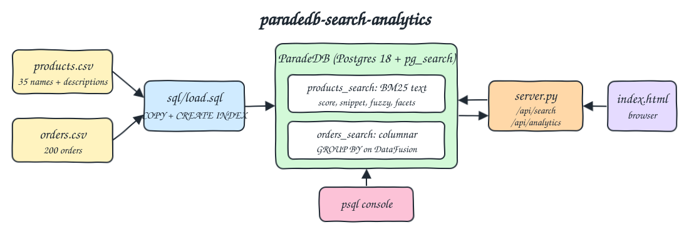
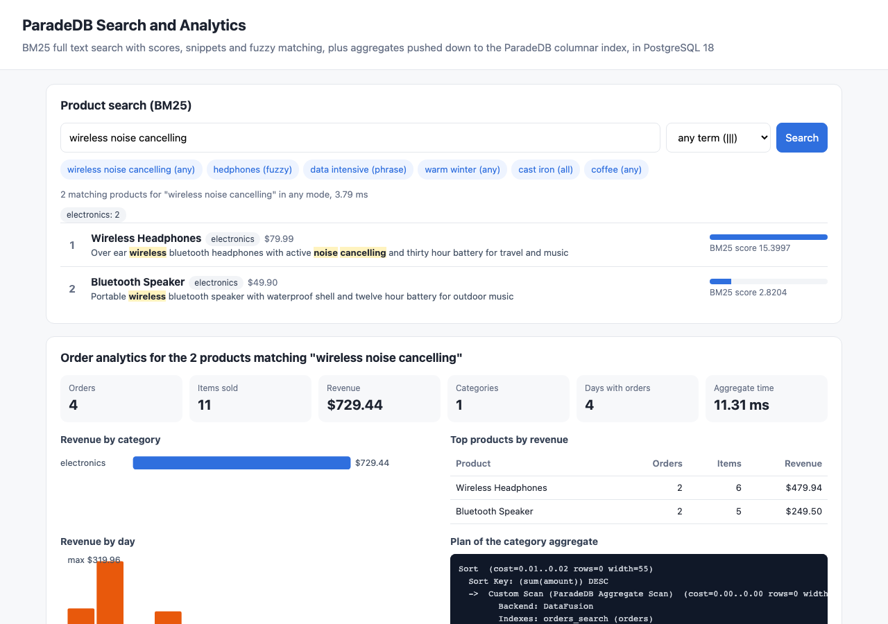
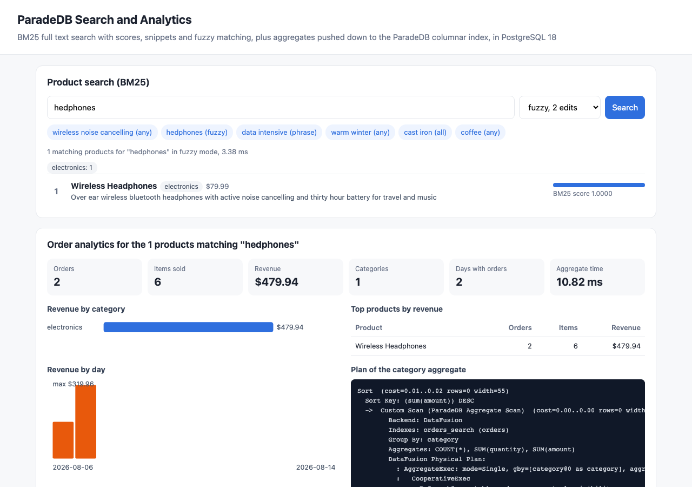
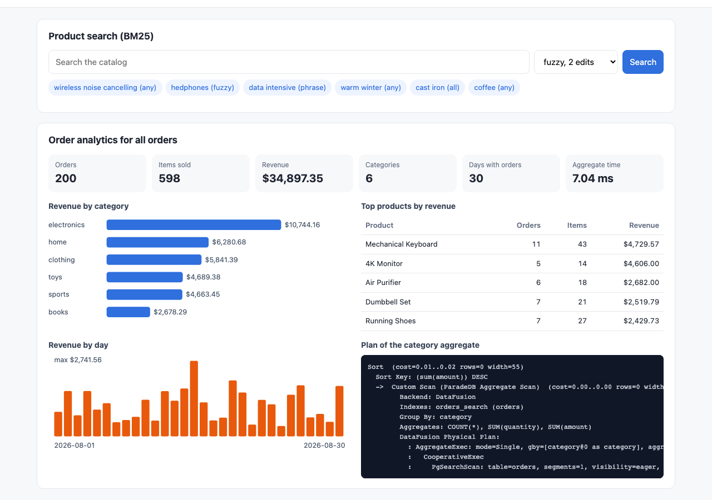

# paradedb-search-analytics

Full text search and analytics inside one PostgreSQL 18 with ParadeDB. A 35 product catalog (`data/products.csv`, names plus real descriptions) gets a BM25 index and is searched with scores, highlighted snippets, phrase and fuzzy queries and category facets. The 200 orders of `data/orders.csv` get a second ParadeDB index whose numeric and date columns are stored column oriented, so `COUNT`, `SUM` and `GROUP BY` run inside the index. A tiny Python backend serves one `index.html` with a search box and an analytics panel that follows the search.

## How it Works

1. `podman-compose` starts `q5-paradedb` (the official ParadeDB image) and `q5-ui` (Python stdlib `http.server` + psycopg).
2. `scripts/pipeline.sh` runs `sql/load.sql` in the database: it recreates `products` and `orders`, loads both CSV files with server side `COPY` and creates the two ParadeDB indexes.
3. `products_search` indexes `name` and `description` with the default unicode tokenizer (BM25), `category` as a literal and `price` as a columnar field.
4. `orders_search` indexes `customer`, `product` and `category` as literals and `quantity`, `price`, `amount`, `ts`, `day` as columnar fields.
5. `/api/search` runs one SQL query that returns the top k products ordered by `pdb.score(id)`, a `pdb.snippet(description)` per hit and a `pdb.agg` terms facet over every match, computed in the same scan.
6. `/api/analytics` runs totals, revenue per category, top products and revenue per day. With an empty query it scans every order with `pdb.all()`; with a query it filters orders with a term set of the product names that matched the search.
7. The planner turns those `GROUP BY` queries into a `ParadeDB Aggregate Scan` executed by DataFusion over the columnar index, the UI prints that plan.

## Architecture



## What ParadeDB ships for analytics today

* `pg_analytics` (DuckDB inside Postgres for lake files) is discontinued and its repository was archived in March 2025. ParadeDB moved its analytics work into `pg_search`.
* `pg_duckdb` is not in the official image. The extensions available in `paradedb/paradedb:0.25.10-pg18` are `pg_search 0.25.10`, `vector 0.8.4`, `postgis 3.6.4`, `pg_ivm 1.13`, `pg_cron 1.6`, `fuzzystrmatch` and `pg_stat_statements` (checked with `pg_available_extensions`).
* Analytics now means aggregates over the ParadeDB index: non text columns are stored column oriented (the old "fast fields"), and plain SQL aggregates with `GROUP BY` are pushed into a custom scan when the query has a ParadeDB predicate. In 0.25 that scan runs on an embedded DataFusion engine (`Backend: DataFusion` in `EXPLAIN`).
* `pdb.agg('<json>')` exposes Elasticsearch style aggregations (terms, stats, histogram, ...) and, used as `pdb.agg(...) OVER ()`, returns facets next to the top k rows of a search.
* The index access method is now called `paradedb` (`USING paradedb`), `USING bm25` still works as an alias.

## Features

* BM25 ranking with `pdb.score`, `name` matches boosted x2 with `::pdb.boost(2)`, ties broken by `id` for stable order.
* Four query modes: any term (`|||`), all terms (`&&&`), phrase (`###`) and fuzzy (`::pdb.fuzzy(2)`, Levenshtein distance 2) so typos still find products.
* Highlighted snippets from `pdb.snippet(description)`, rendered safely in the UI (only `<b>` survives escaping).
* Category facets from `pdb.agg` in the same query as the top k, no second round trip.
* Order analytics (totals, per category, top 5 products, per day) as plain SQL, pushed down to the columnar index.
* Analytics follow the search: typing a query shows the orders of only the products that matched it.
* Idempotent load: `load.sql` drops and recreates tables and indexes, `start-all.sh` loads only when the indexes are missing.
* Tests check intent against independent `awk` computations over the CSV files.

## Stack

* ParadeDB 0.25.10 on PostgreSQL 18.6 (`paradedb/paradedb:0.25.10-pg18`): latest stable ParadeDB release, 0.26.0 is only a release candidate.
* pg_search 0.25.10: BM25 index built on Tantivy, columnar aggregates with DataFusion.
* Python 3.14.7 (`python:3.14.7-slim-trixie`): the UI backend with stdlib `http.server`, no web framework.
* psycopg 3.3.6 (binary): the only Python dependency.
* Plain HTML, JS and SVG for the UI.
* podman + podman-compose: two containers, Postgres capped at 768 MB and the UI at 128 MB.

## Contracts / APIs

| Method | Path | Description |
|---|---|---|
| GET | `/` | UI |
| GET | `/api/search?q=&mode=any\|all\|phrase\|fuzzy&k=` | Top k products (1 to 35, default 10) with BM25 score, snippet and category facets |
| GET | `/api/analytics?q=&mode=` | Totals, revenue per category, top 5 products, revenue per day and the plan of the category aggregate. Empty `q` means all orders |

```json
{"query": "wireless noise cancelling", "mode": "any", "ms": 2.88, "total": 2,
 "facets": [{"category": "electronics", "count": 2}],
 "results": [{"id": 17, "name": "Wireless Headphones", "category": "electronics", "price": 79.99, "score": 15.3997,
   "snippet": "Over ear <b>wireless</b> bluetooth headphones with active <b>noise</b> <b>cancelling</b> and thirty hour battery for travel and music"}]}
```

```json
{"query": "", "products": null, "ms": 7.6,
 "totals": {"orders": 200, "items": 598, "revenue": 34897.35, "first": "2026-08-01T08:37:00", "last": "2026-08-30T23:53:00"},
 "by_category": [{"category": "electronics", "orders": 26, "items": 85, "revenue": 10744.16}],
 "top_products": [{"product": "Mechanical Keyboard", "orders": 11, "items": 43, "revenue": 4729.57}],
 "by_day": [{"day": "2026-08-01", "orders": 5, "revenue": 888.74}],
 "plan": ["Sort ...", "  ->  Custom Scan (ParadeDB Aggregate Scan) ..."]}
```

The search SQL, for mode `any`:

```sql
SELECT id, name, category, price, description, pdb.score(id) AS score,
       pdb.snippet(description) AS snippet,
       pdb.agg('{"terms": {"field": "category"}}') OVER () AS facets
FROM products
WHERE name ||| $1::text::pdb.boost(2) OR description ||| $1
ORDER BY pdb.score(id) DESC, id
LIMIT $2;
```

## Key data structures and design decisions

* `products(id, name, category, price, description)` with `CREATE INDEX products_search ON products USING paradedb (id, name, description, (category::pdb.literal), price) WITH (key_field = 'id')`.
* `orders(order_id, customer, product, category, quantity, price, ts, amount, day)` where `amount = quantity * price` and `day = ts::date` are stored generated columns. Aggregate pushdown needs bare indexed columns: `SUM(quantity * price)` and `GROUP BY date(ts)` fell back to plain Postgres in this version (the planner warns `Aggregate Scan not used`), the generated columns keep both on the index.
* Text columns used for grouping or exact filtering (`category`, `product`, `customer`) use the `pdb.literal` tokenizer so the whole value is one term.
* Search driven analytics use `product === ARRAY[...]` (a term set) so they stay on the aggregate scan instead of a join.
* Fuzzy results all score `1.0`: ParadeDB scores fuzzy terms as constant, and highlighting is not supported for fuzzy queries, so the UI shows the plain description.
* A query parameter must be cast to `text` before `::pdb.boost(n)` (`$1::text::pdb.boost(2)`), a direct cast of an untyped parameter fails with `invalid typemod`.
* `pdb.agg` over a `NUMERIC` column with a `stats` spec is rejected in this version, so money totals use SQL `SUM`, which is pushed down.
* Container, network and volume names start with `q5-`, host ports are 26400 (Postgres) and 26401 (UI).

## Layout

```
data/products.csv          catalog with descriptions
data/orders.csv            200 orders
sql/load.sql               tables, COPY, ParadeDB indexes
app/queries.py             search and analytics SQL
app/server.py              http backend
app/index.html             UI
Containerfile / podman-compose.yml
scripts/                   setup, start, stop, status, test, ui, sql console, pipeline
```

## How to run

```bash
./scripts/setup.sh
./scripts/start-all.sh
./scripts/test-all.sh
./scripts/ui.sh
./scripts/stop-all.sh
```

`test-all.sh` output:

```
load
ok   products rows equal products.csv lines: 35
ok   orders rows equal orders.csv lines: 200
search relevance
ok   the product whose name and description both hold the terms ranks first: Wireless Headphones
ok   a partial match ranks below the full match: True
ok   all terms mode keeps only documents with every term: Cast Iron Skillet
ok   phrase mode finds the words in order: Designing Data-Intensive Applications
ok   phrase mode rejects the words in the wrong order: 0
ok   a typo finds nothing without fuzzy: 0
ok   a typo finds the product with fuzzy distance 2: Wireless Headphones
ok   snippet highlights the matched term: True
ok   category facet count equals products.csv lines with the term: 2
analytics against awk over orders.csv
ok   total orders, items and revenue: 200 598 34897.35
ok   orders, items and revenue per category: books 39 102 2678.29;clothing 30 93 5841.39;electronics 26 85 10744.16;home 38 116 6280.68;sports 30 85 4663.45;toys 37 117 4689.38;
ok   top product by revenue: Mechanical Keyboard
ok   days with orders: 30
ok   revenue of orders for products matching the search: 4 729.44
ok   category aggregate runs inside the ParadeDB index: True
all 17 tests passed
```

Every expected value on the left side is computed by `awk` over the CSV files, never by the database.

## Printscreens

Search for `wireless noise cancelling` in any term mode. Wireless Headphones scores 15.40 because it holds all three terms and `wireless` also in the boosted name, the Bluetooth Speaker only holds `wireless` and scores 2.82. Matched terms are highlighted by `pdb.snippet`, the facet chip shows both hits are in electronics. The analytics panel below is already scoped to the orders of those two products: 4 orders, 11 items, $729.44.



Fuzzy search for the typo `hedphones`. The exact modes return nothing, fuzzy distance 2 finds Wireless Headphones. The score is the constant 1.0 of a fuzzy term and there is no highlight, as described above. The analytics show the 2 orders of that product.



Analytics for all orders (empty search box): 200 orders, 598 items, $34,897.35 across 6 categories and 30 days, revenue per category, top 5 products, revenue per day and the `EXPLAIN` of the category query, which shows the `ParadeDB Aggregate Scan` with the DataFusion physical plan reading the `orders_search` index.



## Scripts

All scripts live in `scripts/` and run from any directory of the repository.

| Script | What it does |
|---|---|
| `./scripts/setup.sh` | Pulls the ParadeDB image and builds the UI image |
| `./scripts/start-all.sh` | Starts ParadeDB and the UI, loads the data when needed and prints the full link of each one |
| `./scripts/pipeline.sh` | Reloads both CSV files and rebuilds the ParadeDB indexes |
| `./scripts/status.sh` | Shows every service port as UP or DOWN |
| `./scripts/test-all.sh` | Checks search relevance and analytics against the CSV files |
| `./scripts/ui.sh` | Opens the UI in the browser |
| `./scripts/stop-all.sh` | Stops every service |
| `./scripts/sql-console.sh` | Opens psql on the `shop` database |

Ports are declared in `scripts/ports.env` (postgres 26400, ui 26401).

```bash
./scripts/setup.sh
./scripts/start-all.sh
./scripts/status.sh
./scripts/ui.sh
./scripts/stop-all.sh
```
