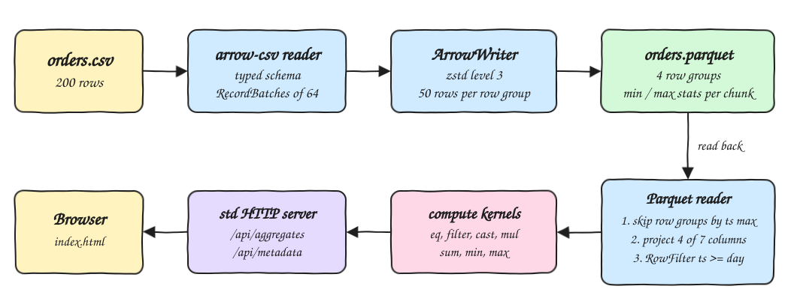
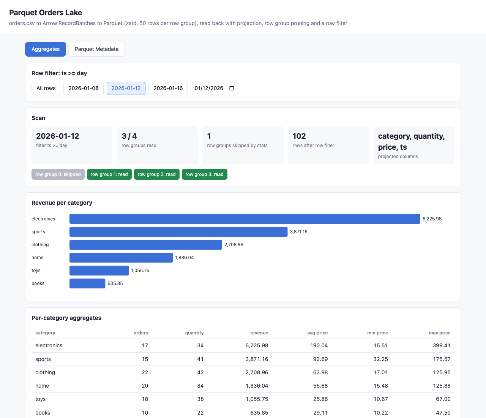
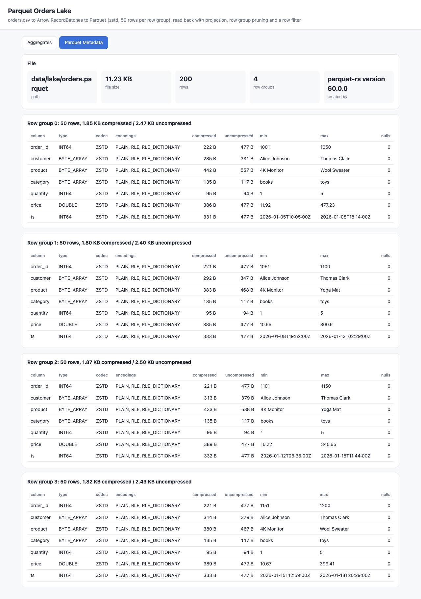

# parquet-rust-arrow

A Rust 2024 program built on arrow-rs (`arrow` and `parquet` 60.0.0) that reads `data/orders.csv` into Arrow RecordBatches, writes a zstd compressed Parquet file split in row groups, reads it back with column projection, row group pruning from statistics and a row filter, and computes per-category aggregates with Arrow compute kernels. A tiny HTTP server built only on the Rust standard library serves a UI with the aggregates and the Parquet file metadata.

## How it Works

1. On startup the binary reads the CSV with `arrow::csv::ReaderBuilder` and a typed schema (`ts` is `Timestamp(ms)`), producing RecordBatches of 64 rows.
2. `ArrowWriter` writes `data/lake/orders.parquet` with `ZSTD(3)`, 50 rows per row group and chunk level statistics, through a staging file plus rename.
3. A scan opens the file with `ParquetRecordBatchReaderBuilder` and reads the `ts` min/max statistics of every row group.
4. Row groups whose `ts` max is before the requested day are skipped (`with_row_groups`), so they are never decoded.
5. A `ProjectionMask` keeps only `category, quantity, price, ts`, and an `ArrowPredicateFn` row filter keeps `ts >= day`.
6. `aggregate::by_category` computes revenue with `cast` + `mul`, then per category uses `eq`, `filter`, `sum`, `min`, `max`.
7. `GET /api/aggregates?from=YYYY-MM-DD` runs a fresh scan and `GET /api/metadata` returns row groups, column stats and sizes.

## Architecture



## Features

* Columnar ingestion: CSV parsed straight into typed Arrow arrays, no row structs.
* zstd + row groups: 4 row groups of 50 rows, each column chunk carries min/max/null count statistics.
* Predicate pushdown: row groups are pruned by `ts` statistics before any page is read, then a row filter drops the remaining rows.
* Column projection: only 4 of 7 columns are decoded for aggregation.
* Vectorized aggregates: all math runs through Arrow compute kernels.
* Metadata explorer: row group sizes, codec, encodings, physical type and min/max per column chunk.
* Verified against awk: `test-all.sh` compares the aggregates with an independent awk computation for 4 different filters.

## Stack

* Rust 1.98.1 (latest stable), edition 2024, pinned in `rust-toolchain.toml`.
* `arrow` 60.0.0 (feature `csv` only): CSV reader, arrays and compute kernels.
* `parquet` 60.0.0 (features `arrow`, `zstd`): writer, reader, row filter and metadata.
* Rust `std::net::TcpListener`: the HTTP server, no web framework and no JSON library.
* Plain HTML, JS and SVG for the UI, embedded in the binary with `include_str!`.
* Containerfile (`rust:1.98.1-slim` build, `debian:trixie-slim` runtime) and `podman-compose.yml` as an optional way to run it.

## API

| Method | Path | Response |
|---|---|---|
| GET | `/` | the UI |
| GET | `/api/aggregates` | aggregates over all rows |
| GET | `/api/aggregates?from=2026-01-12` | aggregates for orders with `ts >= 2026-01-12T00:00:00Z` |
| GET | `/api/metadata` | Parquet file, row group and column chunk metadata |

```json
{"from":"2026-01-16","projection":["category","quantity","price","ts"],"row_groups_total":4,"row_groups_read":[3],"rows_read":42,
 "aggregates":[{"category":"sports","orders":8,"quantity":22,"revenue":1997.50,"avg_price":94.02,"min_price":35.75,"max_price":123.63}]}
```

An invalid `from` returns `400` with `{"error":"invalid day ..., expected YYYY-MM-DD"}`.

## Design Decisions

* Revenue is `quantity * price`, the same rule used by the other POCs in this repo.
* Pruning is done by hand from `Statistics::Int64` of the `ts` chunk, so the UI can show which row groups were skipped; the row filter still guarantees exact results inside the kept groups.
* The CSV is sorted by `ts`, so row groups have disjoint time ranges and pruning is effective.
* The Parquet file is rebuilt on every start and every CLI run, making each run reproducible from the CSV.
* `CategoryAgg` is a plain struct; JSON is written with `format!` and a small string escaper to avoid extra crates.

## Verification

`./scripts/test-all.sh` runs 10 cargo unit tests and then compares the CLI output (`parquet-rust-arrow aggregates [day]`) with awk:

| from | row groups read | rows | electronics revenue | books revenue |
|---|---|---|---|---|
| all | 0,1,2,3 | 200 | 9618.24 | 2008.27 |
| 2026-01-08 | 0,1,2,3 | 161 | 8470.21 | 1310.18 |
| 2026-01-12 | 1,2,3 | 102 | 6225.98 | 635.85 |
| 2026-01-16 | 3 | 42 | 844.89 | 235.08 |

Every category row (orders, quantity, revenue) matched awk for all four filters.

## Printscreens

### Aggregates



Filter `ts >= 2026-01-12`: row group 0 (ts up to 2026-01-08) is skipped by its statistics, groups 1 to 3 are read, and the row filter leaves 102 rows. The chart and table show revenue, orders, quantity and price stats per category.

### Parquet Metadata



File size, row count, writer version and, for each of the 4 row groups, every column chunk with codec (ZSTD), encodings, compressed and uncompressed bytes, min, max and null count.

## Run

```bash
./scripts/setup.sh
./scripts/start-all.sh
./scripts/test-all.sh
./scripts/stop-all.sh
```

CLI only:

```bash
cargo run --release -- aggregates 2026-01-12
```

Container:

```bash
podman-compose up -d --build
podman-compose down
```

## Scripts

All scripts live in `scripts/` and run from any directory of the repository.

| Script | What it does |
|---|---|
| `./scripts/setup.sh` | Installs the Rust toolchain, fetches crates and builds the release binary |
| `./scripts/start-all.sh` | Starts the server and prints the full link of each endpoint |
| `./scripts/status.sh` | Shows every service port as UP or DOWN |
| `./scripts/test-all.sh` | Runs cargo tests and the awk comparison, plus API checks when the server is up |
| `./scripts/ui.sh` | Opens the UI in the browser |
| `./scripts/stop-all.sh` | Stops the server and the container when it runs |

Ports are declared in `scripts/ports.env` (`ui=21280`).

```bash
./scripts/setup.sh
./scripts/start-all.sh
./scripts/status.sh
./scripts/ui.sh
./scripts/stop-all.sh
```
