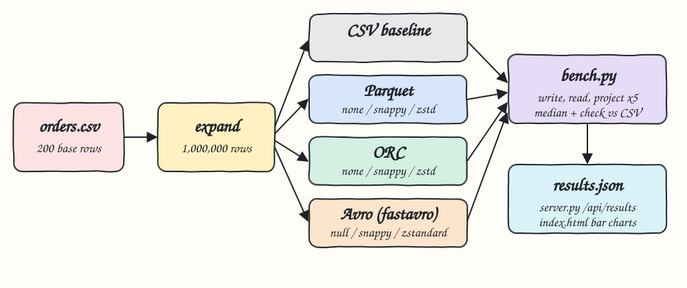
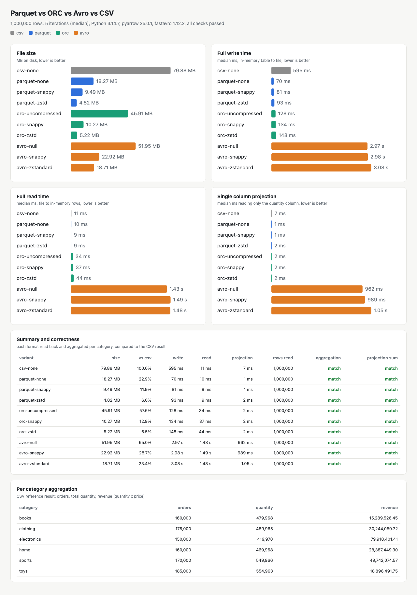

# parquet-vs-orc-vs-avro

Benchmark of Parquet, ORC and Avro, with CSV as the baseline, on the same 1,000,000 row orders dataset.
It measures file size per compression codec, full write time, full read time and single column projection
read time, runs every measurement 5 times, reports the median, and proves every format returns the same
per category totals as the CSV file.

## How it Works

1. `data/orders.csv` (200 orders) is loaded with pyarrow and deterministically expanded to 1,000,000 rows:
   row `i` copies base row `i % 200`, gets `order_id = i + 1`, `quantity + k % 3`, `price * (100 + k % 7) / 100`
   and `ts + k hours` where `k = i / 200`. Same input, same output, every run.
2. The in-memory Arrow table is written to 10 variants in `.lake/`: CSV, Parquet (none, snappy, zstd),
   ORC (uncompressed, snappy, zstd) and Avro (null, snappy, zstandard).
3. For each variant, 5 iterations of: full write, full read, projection read of the `quantity` column.
4. The median of each metric plus the file size are stored in `results/results.json`.
5. Every variant is read back and aggregated per category (orders, total quantity, revenue). Each result must
   equal the CSV result, the row count must be 1,000,000 and the projected column sum must match.
6. `test-all.sh` also recomputes the CSV aggregation with `awk` as an independent check.
7. A tiny Python HTTP server exposes `results.json` at `/api/results` and serves a bar chart UI.

## Architecture



## Results

1,000,000 rows, 5 iterations, median, Python 3.14.7, pyarrow 25.0.1, fastavro 1.12.2, 16 core machine, warm OS page cache.

| variant | size | vs csv | write | read | projection |
|---|---|---|---|---|---|
| csv-none | 79.88 MB | 100.0% | 595 ms | 11 ms | 7 ms |
| parquet-none | 18.27 MB | 22.9% | 70 ms | 10 ms | 1.5 ms |
| parquet-snappy | 9.49 MB | 11.9% | 81 ms | 9 ms | 1.4 ms |
| parquet-zstd | 4.82 MB | 6.0% | 93 ms | 9 ms | 1.5 ms |
| orc-uncompressed | 45.91 MB | 57.5% | 128 ms | 34 ms | 2.0 ms |
| orc-snappy | 10.27 MB | 12.9% | 134 ms | 37 ms | 2.0 ms |
| orc-zstd | 5.22 MB | 6.5% | 148 ms | 44 ms | 2.0 ms |
| avro-null | 51.95 MB | 65.0% | 2.97 s | 1.43 s | 962 ms |
| avro-snappy | 22.92 MB | 28.7% | 2.98 s | 1.49 s | 989 ms |
| avro-zstandard | 18.71 MB | 23.4% | 3.08 s | 1.48 s | 1.05 s |

All 10 variants return the same per category totals as the CSV file (`all_ok: true`).

Takeaways:
* Parquet zstd is the smallest file (6% of CSV) and the fastest projection. Parquet dictionary encodes the
  low cardinality string columns, which is why even uncompressed Parquet is 4x smaller than CSV.
* ORC zstd is close on size (6.5%), but in pyarrow its reads are about 4x slower than Parquet.
* Columnar formats read one column in 1-2 ms. CSV and Avro must decode every row to get one column.
* Avro numbers are dominated by fastavro turning every row into a Python dict (row oriented, no vectorized
  reader in pyarrow). This is how Avro behaves from Python, not a limit of the Avro binary format itself.
* CSV reads are fast here only because pyarrow parses CSV with all 16 cores; on 1 thread it takes about 115 ms.

## Features

* Deterministic data expansion: runs are comparable across machines and over time.
* 10 variants, 3 codecs per binary format: shows the trade off between codec and size or speed.
* Median of N iterations with every raw run kept: resistant to one slow run, still auditable.
* Projection benchmark: shows the main reason columnar formats exist.
* Correctness check per variant against CSV and against awk: a fast format that loses data fails the run.
* Bar chart UI per metric: compare formats at a glance.
* Containerized runner: the same benchmark runs inside a Python 3.14.7 container.

## Stack

* Python 3.14.7: required language version, runs everything with the fewest moving parts.
* pyarrow 25.0.1: native, vectorized Parquet, ORC and CSV readers and writers.
* fastavro 1.12.2: the fastest maintained Avro library for Python.
* cramjam 2.12.1 and zstandard 0.25.0: snappy and zstandard codecs for fastavro.
* Python `http.server`: serves the UI and API with no web framework.
* Plain HTML, JS and SVG: bar charts without a charting library.
* podman: optional containerized benchmark runner.

## API

| Method | Path | Response |
|---|---|---|
| GET | `/` | the UI |
| GET | `/api/results` | `results.json`: rows, iterations, versions, `csv_reference`, `results[]`, `all_ok` |
| GET | `/api/health` | `{"status":"UP"}` |

Each entry of `results[]` has `name`, `format`, `codec`, `size_bytes`, `write_ms`, `read_ms`, `project_ms`
(each `{median, runs}`), `rows_read`, `projected_sum`, `aggregation`, `aggregation_matches_csv`, `rows_ok`,
`projection_ok`.

## Design decisions

* One class per format with `write`, `read` and `project`: adding a format is one class and one line in `VARIANTS`.
* Write time is measured from the same in-memory Arrow table for every format. For Avro this includes the
  Arrow to Python dict conversion, since fastavro only accepts dicts.
* Read time is file to in-memory data: an Arrow table for CSV, Parquet and ORC, a list of dicts for Avro.
* Avro projection uses a reader schema with only `quantity`; fastavro still has to walk every record.
* CSV has no codec: it is the uncompressed baseline everything is compared to.
* Revenue totals are compared with a 0.01 tolerance because float sums differ in the last bits by order.
* Files stay in `.lake/` (git ignored) so the awk check can read the CSV output.

## How to run

```bash
./scripts/setup.sh
./scripts/start-all.sh
./scripts/test-all.sh
./scripts/ui.sh
./scripts/stop-all.sh
```

`start-all.sh` runs the benchmark only when `results/results.json` is missing. Run it again with
`RERUN=1 ./scripts/start-all.sh`. Size and iterations come from `ROWS` (default 1000000) and `ITERATIONS` (default 5).

Containerized runner:

```bash
podman build -t i11-bench .
podman run --rm --name i11-bench -e ROWS=1000000 -e ITERATIONS=5 i11-bench
```

## Printscreens



The header shows the row count, iterations, library versions and whether all checks passed. The four bar
charts show file size, full write time, full read time and single column projection time for every variant,
colored by format. The summary table lists each metric with the size relative to CSV and whether each format's
per category aggregation and projected column sum match the CSV result. The last table is the CSV reference
aggregation per category.

## Scripts

All scripts live in `scripts/` and run from any directory of the repository.

| Script | What it does |
|---|---|
| `./scripts/setup.sh` | Creates the Python 3.14 virtualenv and installs dependencies |
| `./scripts/start-all.sh` | Runs the benchmark when needed, starts the UI and prints the full link of each service |
| `./scripts/status.sh` | Shows every service port as UP or DOWN |
| `./scripts/test-all.sh` | Runs the unit tests, the awk check and the API check |
| `./scripts/ui.sh` | Opens the UI in the browser |
| `./scripts/stop-all.sh` | Stops every service |

Ports are declared in `scripts/ports.env` (UI on 21100).

```bash
./scripts/setup.sh
./scripts/start-all.sh
./scripts/status.sh
./scripts/ui.sh
./scripts/stop-all.sh
```
