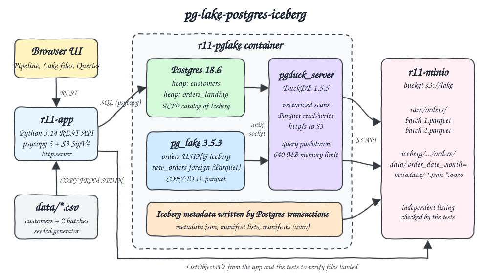
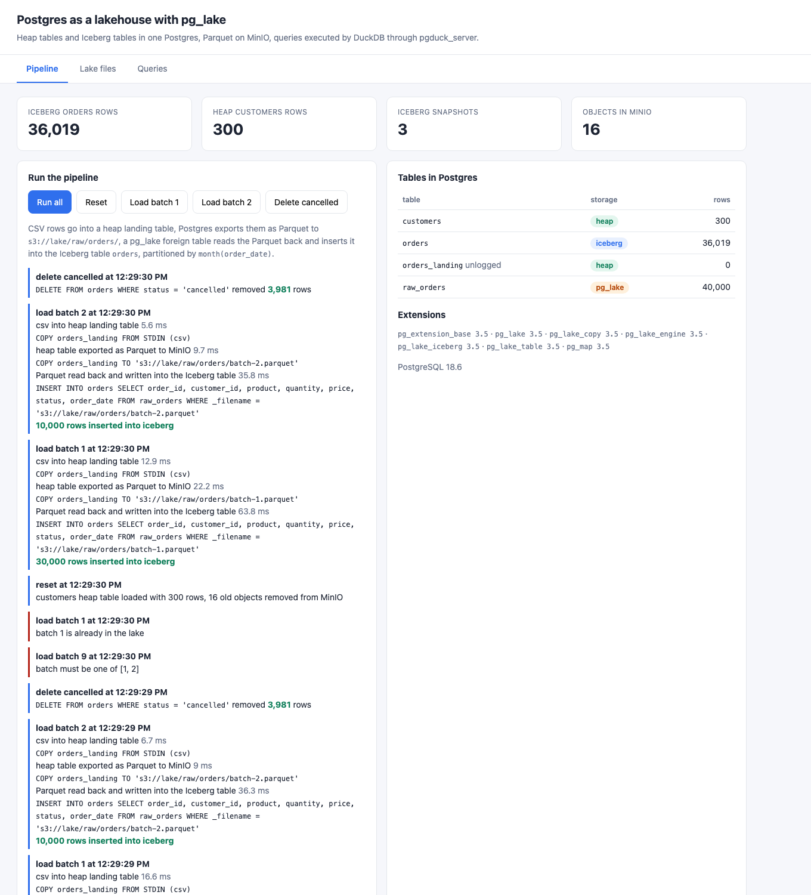
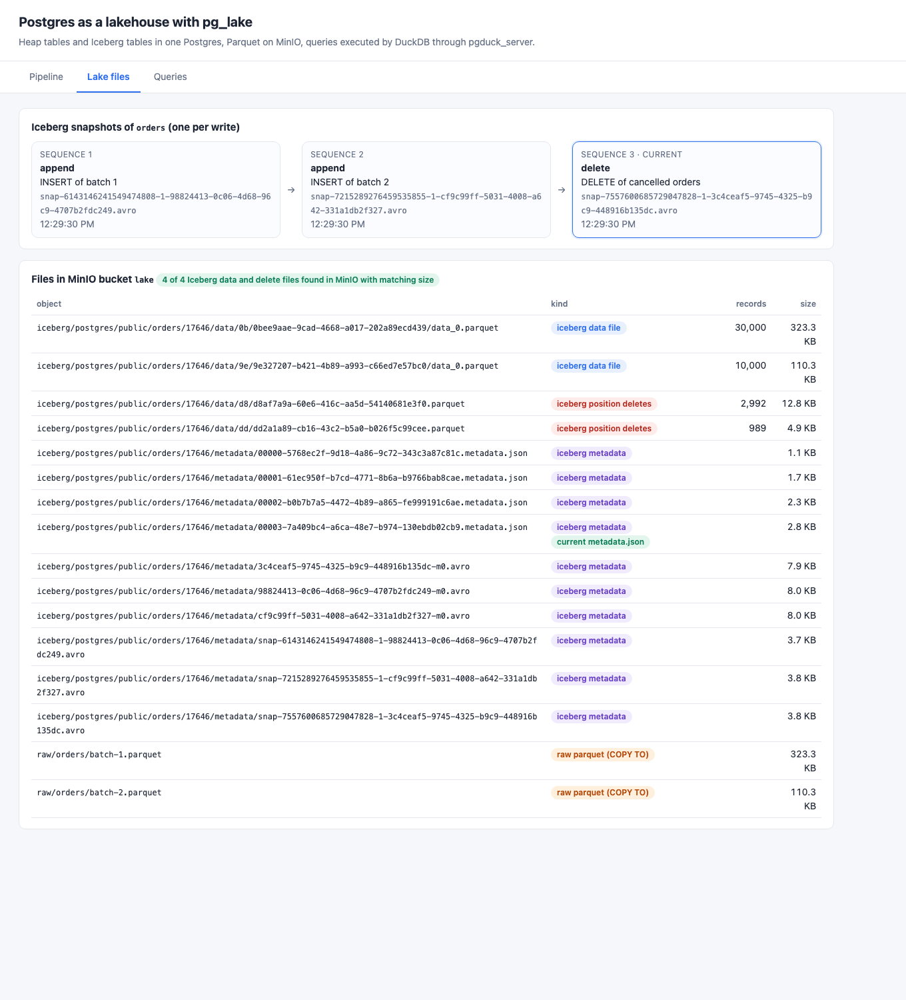
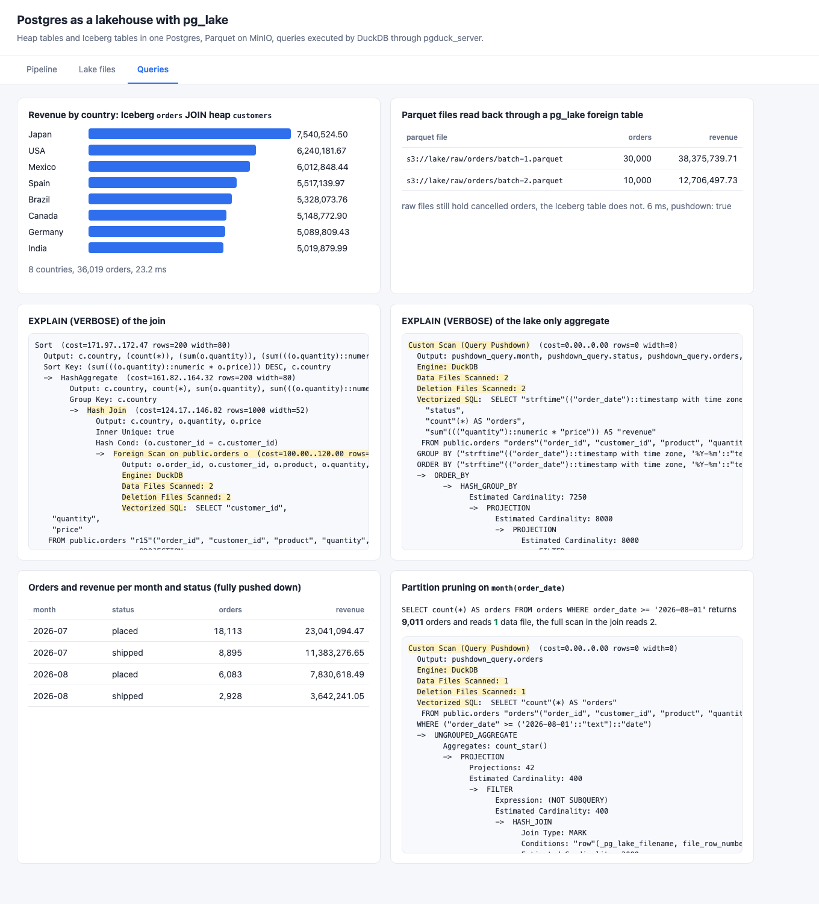

<p align="center"></p>

# pg-lake-postgres-iceberg

Postgres as a lakehouse with pg_lake. One Postgres 18.6 server with the pg_lake 3.5.3 extensions keeps regular heap tables next to Apache Iceberg tables whose Parquet data and metadata live in a MinIO bucket. Postgres writes Parquet files to S3 with `COPY ... TO 's3://...parquet'`, reads them back through a pg_lake foreign table, inserts them into a partitioned Iceberg table, deletes rows from it, and joins it with a heap table. Scans and aggregates on lake data run in DuckDB 1.5.5 through `pgduck_server`. A small web UI shows the tables, the Iceberg snapshots, every object in MinIO and the query plans, and the tests recompute every number from the CSV input.

## Why pg_lake

| Extension | Latest stable | Iceberg write | Iceberg read | Parquet write to S3 | Parquet read from S3 | Verdict |
|---|---|---|---|---|---|---|
| pg_lake (Snowflake Labs) | 3.5.3 | yes, `CREATE TABLE ... USING iceberg`, INSERT, UPDATE, DELETE | yes | yes, `COPY TO` | yes, foreign tables | picked |
| pg_duckdb | 1.1.1 | no | read only through `iceberg_scan` | yes, `COPY TO` | yes, `read_parquet` | no Iceberg writes |
| pg_mooncake | 0.2 preview | mirrors heap tables to Iceberg, no stable release | through DuckDB | no | no | preview only |

pg_lake is the only one of the three that can create and write Iceberg tables and Parquet files on S3 from plain Postgres SQL. There is no official pg_lake container image, so `pglake/Containerfile` builds Postgres 18.6, pg_lake 3.5.3 and `pgduck_server` (DuckDB 1.5.5 with httpfs, aws and azure linked in, dependencies from vcpkg 2025.10.17) from source.

## How it Works

1. `app/gen.py` writes `data/customers.csv` (300 rows), `data/orders-batch-1.csv` (30,000 July orders) and `data/orders-batch-2.csv` (10,000 August orders) from `random.Random(2026)`.
2. `r11-pglake` runs `postgres` and `pgduck_server` in one container. Postgres talks to `pgduck_server` over a unix socket, and `pgduck_server` holds a DuckDB S3 secret for `s3://lake` on `r11-minio`.
3. `POST /api/reset` creates the `pg_lake` extension, the heap table `customers` (loaded with `COPY FROM STDIN`), the unlogged heap table `orders_landing` and the Iceberg table `orders ... USING iceberg WITH (partition_by = 'month(order_date)')`.
4. `POST /api/load?batch=N` copies the CSV into `orders_landing`, runs `COPY orders_landing TO 's3://lake/raw/orders/batch-N.parquet'`, then `INSERT INTO orders SELECT ... FROM raw_orders WHERE _filename = ...`, where `raw_orders` is a pg_lake foreign table over `s3://lake/raw/orders/*.parquet`.
5. `POST /api/delete-cancelled` runs a plain `DELETE` on the Iceberg table, which commits a new Iceberg snapshot.
6. `GET /api/query/revenue` joins Iceberg `orders` with heap `customers`. The Iceberg scan runs in DuckDB (reading data files and applying position deletes), the join with the heap table and the aggregate run in Postgres. `GET /api/query/monthly` touches only Iceberg and is pushed down completely (`Custom Scan (Query Pushdown)`).
7. `GET /api/lake` reads `iceberg_tables`, `lake_iceberg.metadata()` and `lake_iceberg.files()`, and lists the bucket through the S3 API (stdlib SigV4 in `app/s3.py`), so the UI can show that each data file Iceberg references is really in MinIO.

## Architecture



## Features

* Iceberg tables from `CREATE TABLE`: `USING iceberg` makes a normal looking table whose data is Parquet in MinIO and whose catalog is Postgres itself, committed in the same transaction as the SQL.
* Parquet written by Postgres: `COPY table TO 's3://.../file.parquet'` exports a heap table into the lake with no extra tool.
* Parquet read by Postgres: a pg_lake foreign table with a glob path and `filename 'true'` reads every raw file and tells which file each row came from.
* Row level DELETE on Iceberg: `DELETE FROM orders WHERE status = 'cancelled'` is a new `delete` snapshot that adds position delete files and leaves the data files untouched.
* Hidden partitioning: `partition_by = 'month(order_date)'` writes one data file per month, and the August query plan shows `Data Files Scanned: 1` instead of 2.
* DuckDB execution: `EXPLAIN (VERBOSE)` shows `Engine: DuckDB` and the vectorized SQL that ran in `pgduck_server`.
* Lake meets heap: the revenue by country query joins the Iceberg fact table with a regular Postgres dimension table in one SQL statement.
* Independent verification: tests read the CSV files and MinIO directly and compare them with what Postgres answers.
* Lean: MinIO 384 MB, Postgres with pg_lake and DuckDB 1280 MB (DuckDB capped at 640 MB), app 256 MB.

## Stack

* PostgreSQL 18.6, built from source in `pglake/Containerfile` on AlmaLinux 9.8, the platform pg_lake builds and tests on.
* pg_lake 3.5.3 (`pg_lake`, `pg_lake_table`, `pg_lake_iceberg`, `pg_lake_copy`, `pg_lake_engine`), the Iceberg and data lake extensions.
* pgduck_server with DuckDB 1.5.5, the vectorized engine that reads and writes Parquet on S3 for Postgres.
* MinIO `RELEASE.2026-08-04T00-00-00Z` (`pgsty/minio` community build), the S3 compatible object store.
* Python 3.14.7 with psycopg 3.3.6, the only third party library, for the REST API and the UI server (`http.server`).
* Plain HTML, CSS and JavaScript for the UI, no framework.
* podman and podman-compose for every container.

## Contracts / APIs

| Method | Path | What it does |
|---|---|---|
| GET | `/` | the UI |
| GET | `/api/status` | Postgres version, pg_lake extension versions, every table with storage (`heap`, `pg_lake_iceberg`, `pg_lake`) and row count |
| GET | `/api/lake` | Iceberg catalog rows, snapshots, partition specs, data and delete files, and every object in the bucket |
| GET | `/api/query/revenue` | Iceberg `orders` JOIN heap `customers` by country, with timing and `EXPLAIN (VERBOSE)` |
| GET | `/api/query/monthly` | orders and revenue per month and status, fully pushed down to DuckDB |
| GET | `/api/query/august` | count of August orders, shows partition pruning in the plan |
| GET | `/api/query/raw` | rows and revenue per raw Parquet file through the foreign table |
| POST | `/api/reset` | drops the tables, empties `raw/` and `iceberg/` in the bucket, recreates the tables and loads `customers` |
| POST | `/api/load?batch=1\|2` | CSV to heap landing, Parquet export to MinIO, Parquet read back into Iceberg. 400 for a bad batch, 409 when it is already in the lake |
| POST | `/api/delete-cancelled` | `DELETE` of cancelled orders from the Iceberg table |
| POST | `/api/run` | reset, load batch 1, load batch 2, delete cancelled |

Errors are JSON `{"error": "..."}` with 400, 404, 409 or 500.

## Key data structures and design decisions

* `orders` is Iceberg, `customers` is heap: facts go to the lake in columnar Parquet, small mutable dimensions stay in Postgres, and SQL joins them.
* Raw files are kept: `raw/orders/batch-N.parquet` is the landing zone, the Iceberg table is the curated copy, so raw still has cancelled orders and Iceberg does not.
* Postgres is the Iceberg catalog: pg_lake stores the current `metadata_location` in Postgres, so a commit to Iceberg and a commit to a heap table are one transaction. There is no REST catalog container.
* One container for Postgres and `pgduck_server`: they must share a unix socket and a temp directory, so running both in one container is simpler than two containers with shared volumes.
* S3 listing without an SDK: `app/s3.py` signs ListObjectsV2, GET, PUT and DELETE with SigV4 using only the standard library, and the tests use it to read MinIO without going through pg_lake.
* Money is `numeric(10,2)` in Postgres, `decimal(10,2)` in Iceberg and `Decimal` in the tests, so sums compare exactly.
* A reset deletes the bucket prefixes directly, because `DROP TABLE` on an Iceberg table only queues its files for deletion.

## How to run

```bash
./scripts/setup.sh
./scripts/start-all.sh
./scripts/test-all.sh
./scripts/ui.sh
./scripts/stop-all.sh
```

`setup.sh` builds the pg_lake image from source the first time. That compiles Postgres, the vcpkg dependencies (aws-sdk-cpp, azure sdk, curl, openssl) and DuckDB, about 35 minutes on 3 build jobs. Later runs reuse the image (418 MB). At start `pgduck_server` downloads the DuckDB `spatial` extension from extensions.duckdb.org, as upstream pg_lake does, so the first start needs internet access.

`start-all.sh` runs the pipeline once when the Iceberg table does not exist yet. Resource use after the pipeline: MinIO about 100 MB, Postgres with pg_lake and DuckDB about 85 MB idle, app about 35 MB.

## Tests

`tests/test_lakehouse.py` resets the lake, loads both batches, deletes cancelled orders, and checks every answer against the CSV files and against MinIO read directly with SigV4, never trusting pg_lake alone.

| Test | What it proves |
|---|---|
| `test_1` | every CSV row reaches the Iceberg table, batch by batch (30,000 then 40,000) |
| `test_2` | `DELETE` on Iceberg removes exactly the cancelled orders counted in the CSV (3,981) |
| `test_3` | the Parquet files Postgres wrote read back with the same row count and revenue per file as the CSV |
| `test_4` | Iceberg `orders` JOIN heap `customers` gives the same orders, units and revenue per country as a Python join of the CSV files, the plan runs the Iceberg side in DuckDB |
| `test_5` | orders and revenue per month and status match the CSV, and the plan is `Custom Scan (Query Pushdown)` |
| `test_6` | the partition spec is `month(order_date)`, there is one data file per month, and the August query scans 1 data file while the full scan reads 2 |
| `test_7` | every data and position delete file in the Iceberg manifests exists in MinIO with the same size, and so does the current `metadata.json` |
| `test_8` | the `metadata.json` fetched from MinIO lists snapshots `append, append, delete`, data files hold all 40,000 rows and delete files hold exactly the 3,981 cancelled ones |
| `test_9` | batch 9 and `abc` return 400, loading batch 1 twice returns 409, an unknown query returns 404, and none of them changes the table |

```
test_1_every_csv_row_reaches_the_iceberg_table_batch_by_batch ... ok
test_2_delete_on_iceberg_removes_exactly_the_cancelled_orders ... ok
test_3_parquet_files_written_by_postgres_read_back_equal_to_the_csv ... ok
test_4_join_of_iceberg_orders_with_heap_customers_matches_the_csv ... ok
test_5_lake_only_aggregate_is_fully_pushed_down_to_duckdb ... ok
test_6_month_partitioning_prunes_data_files ... ok
test_7_every_iceberg_file_is_really_in_minio ... ok
test_8_metadata_json_in_minio_records_one_snapshot_per_write ... ok
test_9_bad_input_is_rejected ... ok
----------------------------------------------------------------------
Ran 9 tests in 0.449s

OK
```

## Printscreens

### Pipeline



Row counts per table with their storage: `customers` and `orders_landing` are heap, `orders` is Iceberg, `raw_orders` is a pg_lake foreign table over the raw Parquet files (40,000 rows, cancelled orders included). The log shows each step with its SQL and time: CSV into the heap landing table, `COPY ... TO 's3://lake/raw/orders/batch-N.parquet'`, and the `INSERT ... SELECT` from the Parquet files into Iceberg, then the `DELETE`. Red entries are the rejected requests sent by the tests.

### Lake files



The three Iceberg snapshots of `orders` read from the current `metadata.json`: two appends and one delete, each with its manifest list. Below is the real content of the MinIO bucket from ListObjectsV2: two data files (30,000 and 10,000 rows, one per month), two position delete files (2,992 and 989 rows), four `metadata.json` versions, manifests and manifest lists in Avro, and the two raw Parquet files. The green badge confirms that every file the Iceberg manifests reference exists in MinIO with the same size.

### Queries



Revenue by country joins Iceberg `orders` with heap `customers`. Its plan shows a Postgres `Hash Join` over a `Seq Scan` of `customers` and a `Foreign Scan` of `orders` that runs in DuckDB, since heap tables cannot be pushed down. The lake only aggregate per month and status runs entirely in DuckDB (`Custom Scan (Query Pushdown)`). The Parquet card reads the raw files through the foreign table grouped by file name, and the pruning card shows the August filter reading 1 data file.

## Scripts

All scripts live in `scripts/` and run from any directory of the repository.

| Script | What it does |
|---|---|
| `./scripts/setup.sh` | Pulls images, builds the pg_lake and app images, generates the CSV input |
| `./scripts/start-all.sh` | Starts MinIO, Postgres with pg_lake and the app, runs the pipeline once, prints the full link of each service |
| `./scripts/status.sh` | Shows every service port as UP or DOWN |
| `./scripts/test-all.sh` | Runs the lakehouse tests |
| `./scripts/ui.sh` | Opens the UI in the browser |
| `./scripts/stop-all.sh` | Stops every service |
| `./scripts/sql-console.sh` | Opens psql on Postgres with pg_lake |

Ports are declared in `scripts/ports.env`.

| Service | Port | Link |
|---|---|---|
| postgres | 27600 | `postgresql://postgres@localhost:27600/postgres` |
| minio | 27601 | `http://localhost:27601` |
| console | 27602 | `http://localhost:27602` |
| ui | 27603 | `http://localhost:27603` |
