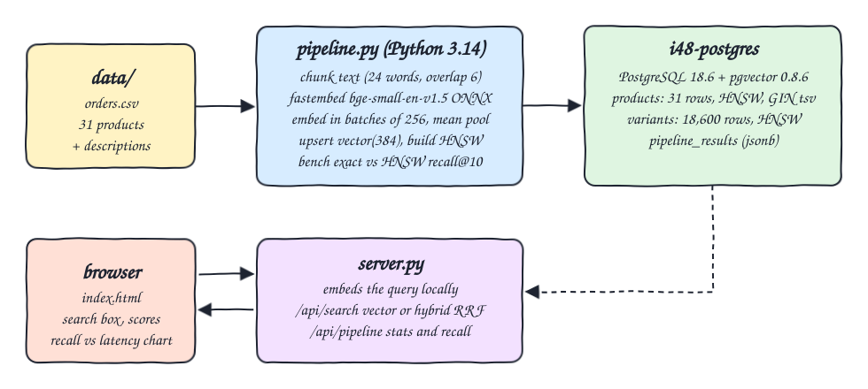
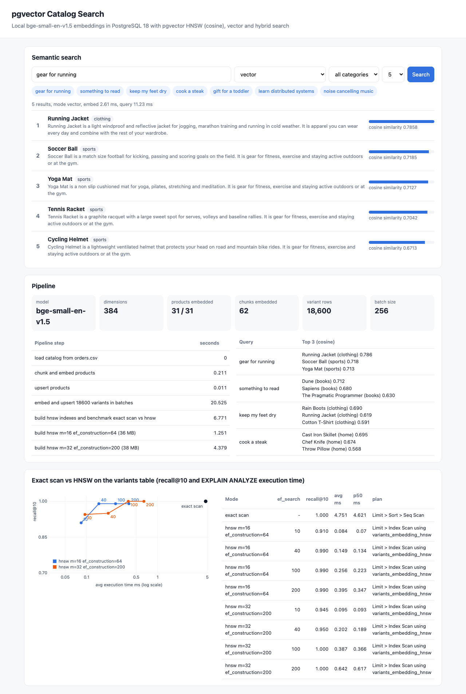
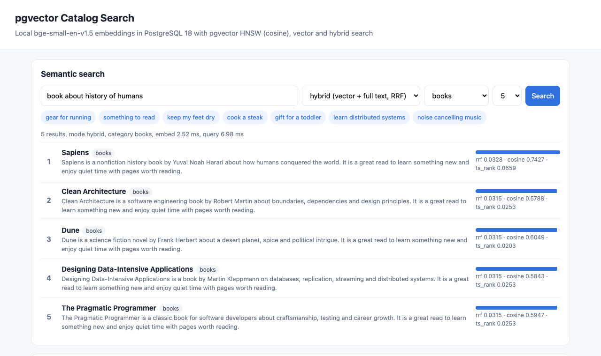

# pgvector-embeddings-pipeline

Local embeddings pipeline into PostgreSQL 18 with pgvector. The products of `data/orders.csv` become a small catalog with deterministic descriptions, get embedded on the laptop with `BAAI/bge-small-en-v1.5` (ONNX through fastembed, no API keys, no external model APIs), are upserted into a `vector(384)` column with an HNSW cosine index, and are searched from a small UI. A second, larger table of 18,600 generated SKU variants is used to measure exact scan vs HNSW recall@10 and latency with `EXPLAIN ANALYZE`.

## How it Works

1. `catalog.py` reads `data/orders.csv`, keeps the 31 distinct products with category, order count and revenue, and composes a description from a fixed feature sentence plus a category sentence.
2. `embed.py` chunks each document into 24 word windows with 6 words of overlap (every product yields 2 chunks, 62 in total), embeds them in batches of 256, mean pools the chunks and normalizes the result to a unit vector.
3. `pipeline.py` upserts the 31 products (`ON CONFLICT DO UPDATE`), then generates 600 variants per product (brand x color x edition = 18,600 rows), embeds them in batches and upserts them.
4. `bench.py` embeds 20 natural language queries, computes the exact top 10 with a forced `Seq Scan`, builds two HNSW indexes (`m=16, ef_construction=64` and `m=32, ef_construction=200`), and for `hnsw.ef_search` 10, 40, 100, 200 records recall@10 and the `EXPLAIN (ANALYZE)` execution time.
5. Results go into `pipeline_results` (jsonb). `server.py` embeds the user query locally and serves `/api/search` (vector or hybrid) and `/api/pipeline`.

## Architecture



## Features

* Local embeddings: fastembed runs bge-small-en-v1.5 with onnxruntime on CPU, the model (about 64 MB) is cached in the gitignored `.models/` folder.
* Chunk, embed in batches, upsert: the pipeline is idempotent, a rerun updates rows in place instead of duplicating them.
* HNSW cosine index on `products` and `variants`, GIN full text index on a generated `tsvector` column, btree on `category`.
* Vector search with an optional category filter, cosine similarity shown as the score.
* Hybrid search: vector top 20 and full text top 20 (terms OR-ed) fused with Reciprocal Rank Fusion (k=60), with the same category filter.
* Exact vs HNSW benchmark: recall@10 per query and per `ef_search`, average and p50 execution time taken from `EXPLAIN ANALYZE`, and the plan node chain to prove which access path ran.
* UI with a search box, query chips, scored results, pipeline timings and a recall vs latency chart.

## Stack

* PostgreSQL 18.6 with pgvector 0.8.6 (`pgvector/pgvector:0.8.6-pg18-trixie`): latest pgvector on the latest stable Postgres.
* Python 3.14.7: pipeline, benchmark, API and tests.
* fastembed 0.8.1 + onnxruntime 1.30.0: smallest install that runs a sentence embedding model on Python 3.14, no torch needed.
* psycopg 3.3.6 (binary): Postgres driver with `executemany` for batched upserts.
* numpy 2.5.3: mean pooling and the independent brute force check in the tests.
* podman / podman-compose: runs only Postgres, the Python side runs in a local venv to keep the shared podman VM disk small.
* Plain HTML, JS and SVG for the UI, Python `http.server` for the backend.

## Contracts / APIs

| Method | Path | Description |
|---|---|---|
| GET | `/` | UI |
| GET | `/api/search?q=&mode=vector\|hybrid&category=&k=` | Top k products. Vector mode returns `score` as cosine similarity. Hybrid mode returns `score` as RRF plus `cosine` and `rank` (ts_rank) |
| GET | `/api/pipeline` | Model, counts, step timings, index sizes, benchmark modes with recall and latency, sample searches |

```json
{"query": "something to read", "mode": "vector", "category": null, "embed_ms": 2.6, "query_ms": 6.1,
 "results": [{"id": 15, "name": "Dune", "category": "books", "description": "...", "score": 0.7117}]}
```

## Key data structures and design decisions

* `products(id, name, category, description, orders, revenue, chunks, tsv tsvector generated, embedding vector(384))`: one row and one embedding per product, so the embedding row count equals the product count.
* `variants(id, product_id, title, embedding vector(384))`: 18,600 near duplicate SKUs, enough rows that an exact scan costs milliseconds and HNSW has something to approximate.
* bge queries use the `Represent this sentence for searching relevant passages:` prefix, passages do not, as the model card recommends.
* Exact scan is forced with `SET LOCAL enable_indexscan = off` inside a transaction, HNSW width with `SET LOCAL hnsw.ef_search`.
* The HNSW index is dropped and rebuilt for each configuration, the last one (`m=32, ef_construction=200`) is the one that stays.
* HNSW builds are randomized (level assignment), so recall numbers move a little between runs. On clustered, near duplicate data the default `m=16, ef_construction=64` graph can leave a query stuck in the wrong cluster regardless of `ef_search` (one run measured 0.85 recall at every `ef_search`), the denser `m=32, ef_construction=200` graph reached 0.995 to 1.0 at `ef_search >= 100` in every run.
* No Containerfile: the only container is the stock pgvector image. The Python app runs from a venv to avoid building a 400+ MB image on a shared, disk constrained podman VM.

## Results (one run, HNSW numbers vary a little between builds)

| Mode | ef_search | recall@10 | avg ms |
|---|---|---|---|
| exact scan (Seq Scan + Sort) | - | 1.000 | 4.751 |
| hnsw m=16 ef_construction=64 | 10 | 0.910 | 0.084 |
| hnsw m=16 ef_construction=64 | 40 | 0.990 | 0.149 |
| hnsw m=16 ef_construction=64 | 100 | 0.990 | 0.256 |
| hnsw m=16 ef_construction=64 | 200 | 0.990 | 0.395 |
| hnsw m=32 ef_construction=200 | 10 | 0.945 | 0.095 |
| hnsw m=32 ef_construction=200 | 40 | 0.950 | 0.202 |
| hnsw m=32 ef_construction=200 | 100 | 1.000 | 0.387 |
| hnsw m=32 ef_construction=200 | 200 | 1.000 | 0.642 |

Sample searches: `gear for running` returns Running Jacket, Soccer Ball, Yoga Mat. `something to read` returns Dune, Sapiens, The Pragmatic Programmer.

## How to run

```bash
./scripts/setup.sh
./scripts/start-all.sh
./scripts/test-all.sh
./scripts/ui.sh
./scripts/stop-all.sh
```

`test-all.sh` checks, against independent sources:

* awk distinct products in `orders.csv` (31) equals the embedded rows in Postgres, and every vector has 384 dimensions.
* Revenue per product matches the CSV, variants are 31 x 600, every product vector is a unit vector built from more than one chunk.
* Postgres exact scan matches a numpy brute force top 10, and the planner uses the HNSW index without hints.
* Recall numbers exist for 8 HNSW modes, equal the mean of the per query recall, every HNSW mode is faster than the exact scan, and the tuned index reaches recall@10 >= 0.95 at `ef_search=100`.
* `something to read` puts books in all top 3 places, `gear for running` ranks Running Jacket first, the category filter only returns that category, and hybrid search finds `Designing Data-Intensive Applications` for `Kleppmann` through full text.

## Printscreens

Vector search for `gear for running`, the pipeline card (31 of 31 products embedded, 62 chunks, 18,600 variants, step timings, HNSW build time and size) and the exact vs HNSW benchmark with the recall vs latency chart and the plan of each mode.



Hybrid search for `book about history of humans` restricted to the `books` category. Sapiens wins because it is first in both the vector list and the full text list, the score column shows RRF, cosine and ts_rank.



## Scripts

All scripts live in `scripts/` and run from any directory of the repository.

| Script | What it does |
|---|---|
| `./scripts/setup.sh` | Creates the Python 3.14 venv, installs dependencies, downloads the model, pulls the pgvector image |
| `./scripts/start-all.sh` | Starts Postgres, runs the pipeline once, starts the API and UI and prints the full link of each one |
| `./scripts/status.sh` | Shows every service port as UP or DOWN |
| `./scripts/test-all.sh` | Runs every test suite |
| `./scripts/ui.sh` | Opens the UI in the browser |
| `./scripts/stop-all.sh` | Stops every service |
| `./scripts/sql-console.sh` | Opens a psql console on the catalog database |

Ports are declared in `scripts/ports.env` (postgres 24800, ui 24801).

```bash
./scripts/setup.sh
./scripts/start-all.sh
./scripts/status.sh
./scripts/ui.sh
./scripts/stop-all.sh
```
