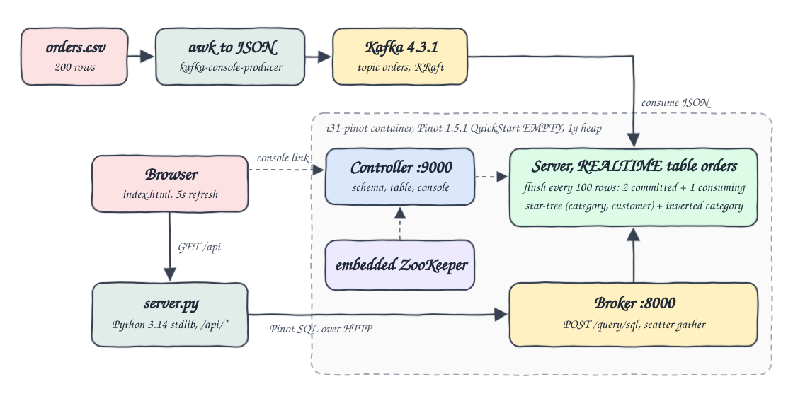
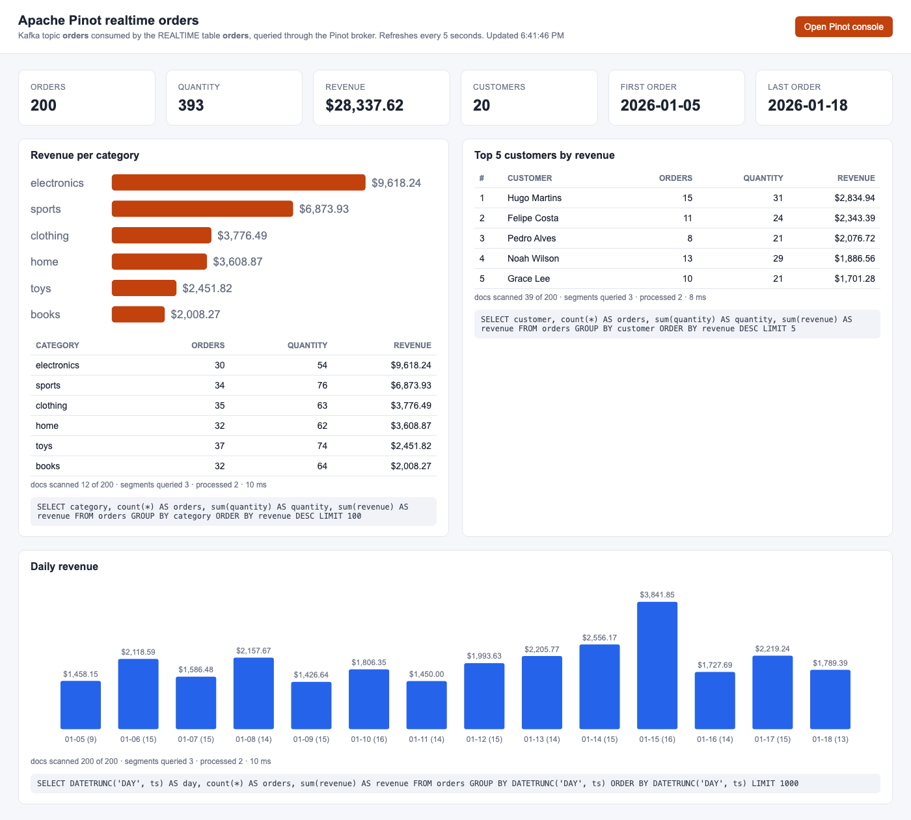
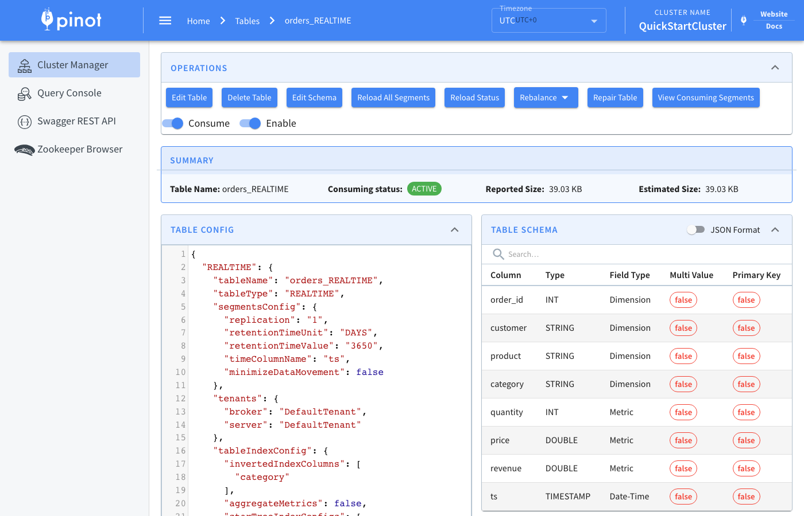

# pinot-realtime-olap

A real-time OLAP pipeline on a laptop. The 200 orders from `data/orders.csv` are turned into JSON and produced into the Apache Kafka topic `orders`. An Apache Pinot REALTIME table consumes the topic, indexes it with a star-tree index and an inverted index on `category`, and answers SQL through the Pinot broker. A tiny Python 3.14 stdlib backend calls the broker and serves a single `index.html` with per-category aggregates, the top customers and daily revenue, plus a link to the Pinot console.

## How it Works

1. `scripts/start-all.sh` starts Kafka 4.3.1 (KRaft, 384m heap) and one Pinot 1.5.1 container with `podman-compose`.
2. The Pinot container runs `QuickStart -type EMPTY`: embedded ZooKeeper, controller, broker and server in one JVM with a 1g heap, no tables.
3. The script creates the topic `orders` and registers `pinot/orders_schema.json` and `pinot/orders_table.json` with `pinot-admin.sh AddTable`.
4. `awk` converts every CSV row into one JSON line and pipes them into `kafka-console-producer.sh` inside the Kafka container.
5. The Pinot server consumes the topic from the earliest offset with the `kafka30` consumer and the JSON decoder.
6. An ingestion transform computes `revenue = quantity * price`; the ISO `ts` string lands in a `TIMESTAMP` time column.
7. Segments flush every 100 rows, so the 200 orders become 2 committed segments (with star-tree index) and 1 consuming segment.
8. `server.py` sends SQL to the broker `POST /query/sql` and returns rows plus query stats as JSON under `/api/*`.
9. `scripts/test-all.sh` compares every API result with an independent `awk` aggregation of the CSV and checks the query plans.

## Architecture



## Features

* Real-time ingestion: rows are queryable seconds after they hit Kafka, no batch job in between.
* Star-tree index on `(category, customer)` with `COUNT(*)`, `SUM(quantity)`, `SUM(revenue)`: category aggregates read 12 pre-aggregated records instead of 200 docs.
* Inverted index on `category`: filters by category use a bitmap lookup instead of a scan.
* Time column `ts` as `TIMESTAMP`: daily buckets with `DATETRUNC('DAY', ts)`.
* Derived `revenue` column computed at ingestion time, so queries never multiply at read time.
* UI shows the SQL and the broker stats (docs scanned, segments, ms) of every panel, and refreshes every 5 seconds.
* Link to the Pinot console for the table, segments, schema and ad hoc SQL.
* Idempotent scripts: the topic is produced once, the table is added once.
* End to end test against `awk` plus `EXPLAIN PLAN` checks that the indexes are actually used.

## Stack

* Apache Pinot 1.5.1 (`apachepinot/pinot:1.5.1-25-amazoncorretto`, Java 25): latest stable release; the `latest` tag is a 1.6.0 SNAPSHOT nightly.
* Apache Kafka 4.3.1 (`apache/kafka:4.3.1`, KRaft): latest stable, same as the `latest` tag.
* Python 3.14 stdlib (`http.server`, `urllib`): the whole UI backend, no dependencies.
* Plain HTML, CSS, JS and SVG: single self-contained light-theme `index.html`.
* awk: CSV to JSON for the producer and the independent check in the tests.
* podman and podman-compose: run Kafka and Pinot, about 1.2G of memory in total.

## Contracts

UI backend on `http://localhost:23180`:

| Method | Path | Returns |
|---|---|---|
| GET | `/` | `index.html` |
| GET | `/api/config` | `{"console": "...", "broker": "..."}` |
| GET | `/api/stats` | orders, quantity, revenue, distinct customers, first and last `ts` |
| GET | `/api/categories` | per category orders, quantity, revenue ordered by revenue |
| GET | `/api/customers` | top 5 customers by revenue |
| GET | `/api/daily` | revenue and orders per day (`day` is epoch millis) |

Every `/api/*` query answer has the shape:

```json
{
  "sql": "SELECT category, count(*) AS orders, ... FROM orders GROUP BY category ORDER BY revenue DESC LIMIT 100",
  "rows": [{"category": "electronics", "orders": 30, "quantity": 54, "revenue": 9618.24}],
  "stats": {"totalDocs": 200, "numDocsScanned": 12, "numSegmentsQueried": 3, "numSegmentsProcessed": 2, "timeUsedMs": 9}
}
```

Errors return HTTP 502 with `{"error": "..."}`.

Pinot endpoints: controller and console on `http://localhost:23100`, broker SQL on `http://localhost:23101/query/sql`.

## Key data structures and design decisions

* Schema `orders`: dimensions `order_id`, `customer`, `product`, `category`; metrics `quantity`, `price`, `revenue`; date time `ts` (`TIMESTAMP`, millis).
* Kafka message: one JSON object per order, `{"order_id":1001,"customer":"...","product":"...","category":"toys","quantity":1,"price":42.87,"ts":"2026-01-05T10:05:00Z"}`.
* QuickStart `EMPTY` instead of four containers (ZooKeeper, controller, broker, server): one JVM, one heap, the lowest memory topology that still has every Pinot role.
* `realtime.segment.flush.threshold.rows = 100` is small on purpose so segments get committed and the star-tree index is built during the run. A consuming segment has no star-tree, so its rows are scanned.
* Revenue is rounded to 2 decimals in `server.py`, Pinot keeps full `DOUBLE` precision.
* `ORDER BY revenue` uses the alias; `ORDER BY sum(revenue)` fails in Pinot 1.5.1 when the alias equals the column name.
* No volumes: `stop-all.sh` removes the containers, the next start rebuilds the table from the topic.

## How to run

```bash
./scripts/setup.sh
./scripts/start-all.sh
./scripts/test-all.sh
./scripts/sql-console.sh "SELECT category, count(*) FROM orders GROUP BY category"
./scripts/stop-all.sh
```

Test output:

```
PASS every csv row reached pinot through kafka
PASS totals match awk                              200 393 28337.62 20
PASS per category aggregates match awk
PASS top 5 customers by revenue match awk
PASS daily revenue buckets match awk
PASS category aggregation is answered by the star-tree index
PASS category filter uses the inverted index
all tests passed
```

## Printscreens

### Orders dashboard



KPI cards on top come from one aggregate query over the REALTIME table. Revenue per category is answered by the star-tree index: the broker stats show 12 docs scanned out of 200. The top 5 customers panel and the daily revenue chart group by `customer` and `DATETRUNC('DAY', ts)`. Each panel prints its SQL and the broker stats. The button on the top right opens the Pinot console.

### Pinot console



The `orders_REALTIME` table in the Pinot console: consuming status ACTIVE, the table config with the inverted index and star-tree index, and the schema with `revenue` as a metric and `ts` as the `TIMESTAMP` date time column.

## Scripts

All scripts live in `scripts/` and run from any directory of the repository.

| Script | What it does |
|---|---|
| `./scripts/setup.sh` | Checks tools and pulls the Kafka and Pinot images |
| `./scripts/start-all.sh` | Starts Kafka, Pinot and the UI, creates the table, produces the orders and prints the full link of each service |
| `./scripts/status.sh` | Shows every service port as UP or DOWN |
| `./scripts/test-all.sh` | Compares the API with awk and checks the index plans |
| `./scripts/ui.sh` | Opens the UI in the browser |
| `./scripts/stop-all.sh` | Stops every service |
| `./scripts/sql-console.sh` | Runs SQL against the Pinot broker, one statement per line or as an argument |

Ports are declared in `scripts/ports.env`: kafka 23192, pinot-controller 23100, pinot-broker 23101, ui 23180.

```bash
./scripts/setup.sh
./scripts/start-all.sh
./scripts/status.sh
./scripts/ui.sh
./scripts/stop-all.sh
```
