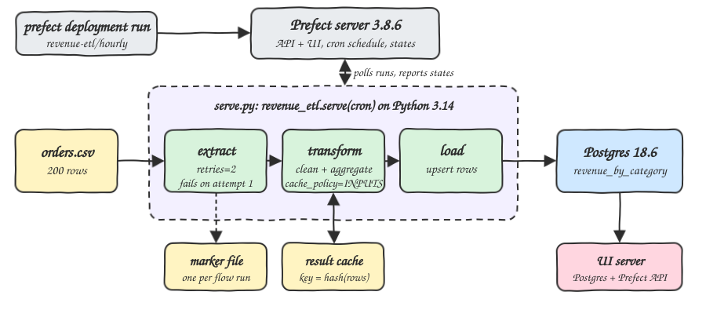
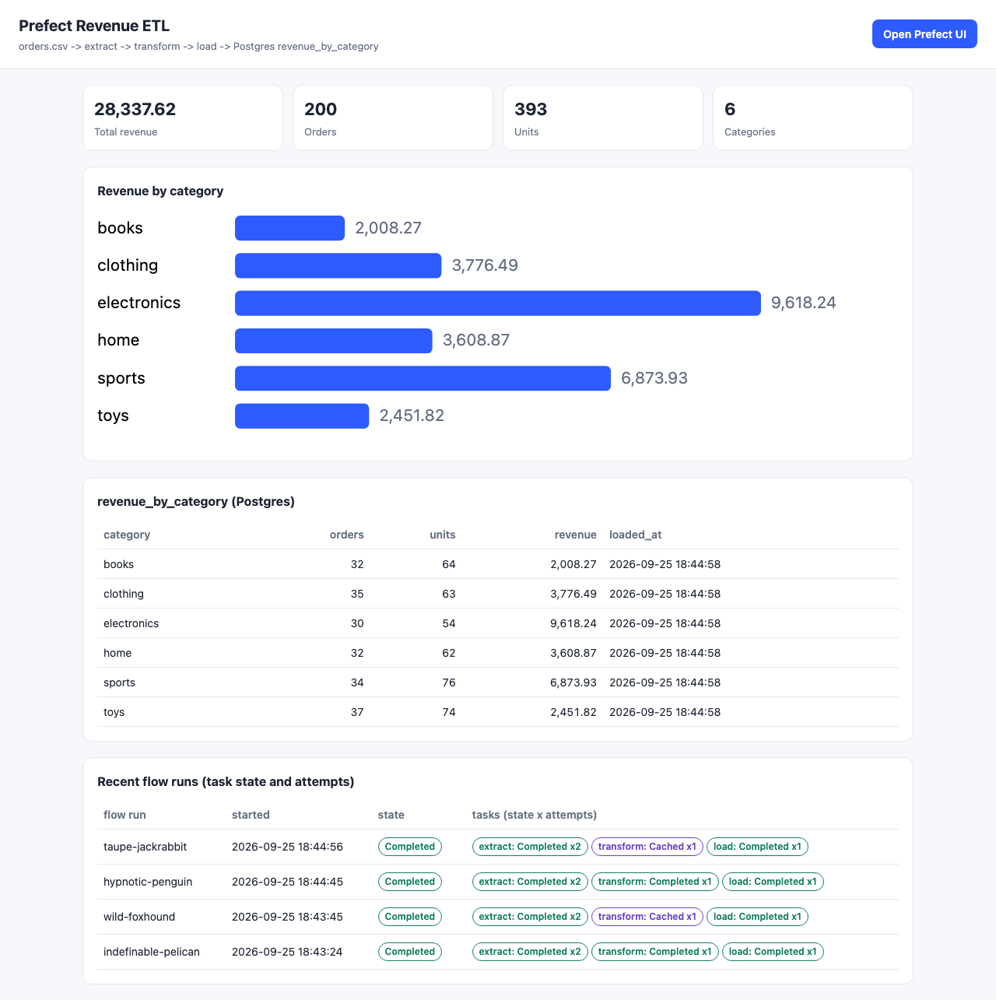
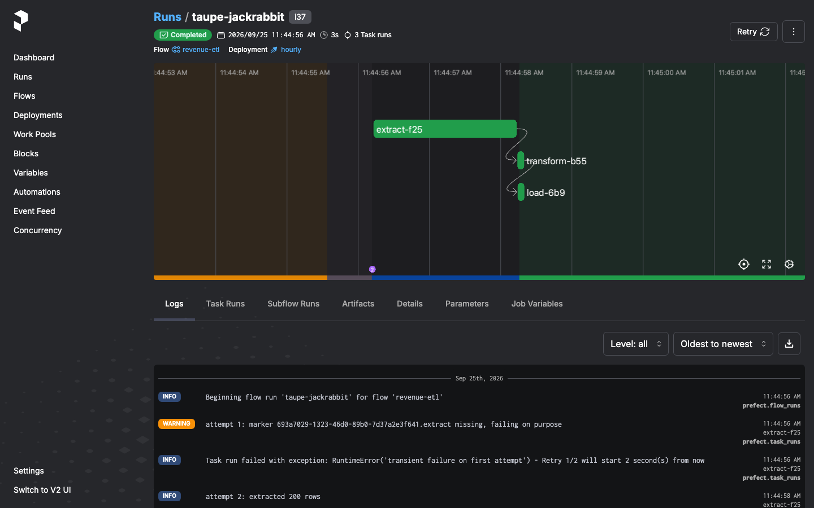
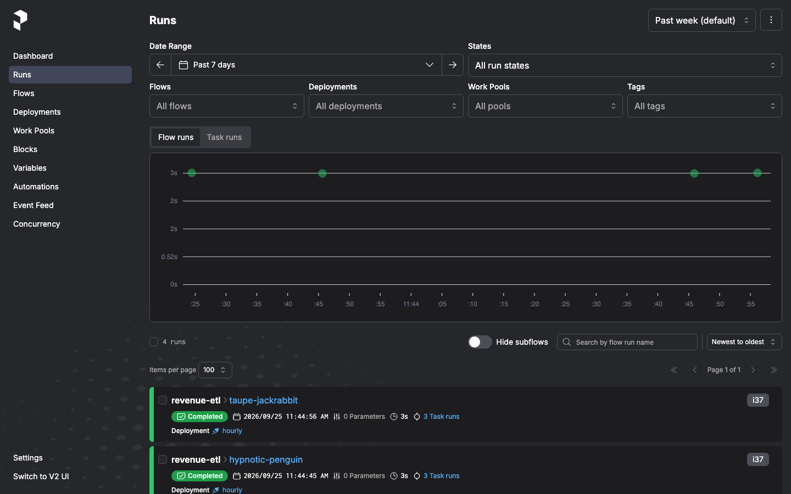

# prefect-python-314-etl

An ETL pipeline orchestrated by Prefect 3 on Python 3.14. The flow reads `data/orders.csv`, cleans the rows, aggregates orders, units and revenue per category, and loads the result into the Postgres table `revenue_by_category`. It shows three Prefect features: task retries, task result caching on an input hash, and a deployment served with a cron schedule and triggered with `prefect deployment run`. A small web page shows the Postgres table, the last flow runs with each task state, and links to the Prefect UI.

## How it Works

1. `podman-compose` starts `i37-postgres` (Postgres 18.6) and `i37-prefect` (Prefect server 3.8.6 on Python 3.14, API and UI).
2. `etl/serve.py` runs locally on Python 3.14 and calls `revenue_etl.serve(name="hourly", cron="0 * * * *")`. This registers the deployment `revenue-etl/hourly` and polls the server for runs.
3. `scripts/run-flow.sh` triggers the deployment with `prefect deployment run revenue-etl/hourly --watch`.
4. `extract` (`retries=2`) looks for a marker file named after the current flow run id. On attempt 1 it is missing, so the task creates it and raises. Prefect retries after 2 seconds and attempt 2 reads the CSV. Every run shows the retry, always in the same way.
5. `transform` (`cache_policy=INPUTS`, `persist_result=True`) cleans and aggregates. Its cache key is a hash of its input rows. The same CSV gives the same key, so the next run gets the stored result and the task ends in state `Cached` without running its body.
6. `load` creates the table if needed and upserts one row per category in a single transaction.
7. `ui/server.py` serves `index.html` and JSON from Postgres and from the Prefect REST API.

## Architecture



## Features

* **Deterministic retry**: a marker file per flow run makes attempt 1 of `extract` fail and attempt 2 succeed, so `run_count` is always 2.
* **Input hash caching**: `transform` uses `cache_policy=INPUTS`. Run 2 reports `Cached(type=COMPLETED)` and skips the `transform computed` log line.
* **Served deployment with a schedule**: `flow.serve(cron=...)` creates `revenue-etl/hourly`. Prefect also puts the next hourly runs on the schedule.
* **CLI trigger**: every run in the tests goes through `prefect deployment run`, the same path a scheduled run takes.
* **Exact money math**: `Decimal` sums, stored as `NUMERIC(14,2)`, so the totals match `awk` to the cent.
* **Idempotent load**: upsert on `category` plus delete of stale categories, all in one transaction.
* **Proof in tests**: `test-all.sh` clears the cache, runs the flow twice and checks each task state and attempt count in the Prefect API.

## Stack

* **Python 3.14.7**: runs the flow, the serve process and the UI server. Prefect 3.8.6 lists 3.14 as supported (`requires_python <3.15,>=3.10`).
* **Prefect 3.8.6**: orchestrator. The server runs from image `prefecthq/prefect:3.8.6-python3.14`, the client from pip.
* **PostgreSQL 18.6** (`postgres:18.6-alpine`): target database.
* **psycopg 3.3.6** (binary): Postgres driver, ships cp314 wheels.
* **http.server (stdlib)**: serves the UI and the JSON API with no web framework.
* **podman / podman-compose**: runs Postgres and the Prefect server.

## Contracts/APIs

| Method | Path | Response |
|---|---|---|
| GET | `/` | the `index.html` page |
| GET | `/api/revenue` | `[{"category","orders","units","revenue","loaded_at"}]` from `revenue_by_category` |
| GET | `/api/runs` | last 10 non scheduled `revenue-etl` flow runs with `tasks: [{"task","state","run_count"}]` |
| GET | `/api/config` | `{"prefect_ui": "<url>"}` used by the "Open Prefect UI" button |

Table:

```sql
CREATE TABLE revenue_by_category (
    category TEXT PRIMARY KEY,
    orders INTEGER NOT NULL,
    units INTEGER NOT NULL,
    revenue NUMERIC(14, 2) NOT NULL,
    loaded_at TIMESTAMPTZ NOT NULL DEFAULT now()
)
```

## Design decisions

* The flow code runs in a local serve process, not in the server container. The server only keeps state, so the containers stay small and the flow uses the local Python 3.14 venv.
* `PREFECT_HOME` and `PREFECT_LOCAL_STORAGE_PATH` point into `.run/`, so the result cache and Prefect profile stay inside the project.
* `extract` gets a file name, not a path. The CSV is resolved under `data/`, so the deployment parameters hold no machine path.
* `revenue.py` holds pure functions (`read_orders`, `clean`, `aggregate`) that the unit tests call without Prefect.

## How to run

```bash
./scripts/setup.sh
./scripts/start-all.sh
./scripts/run-flow.sh
./scripts/test-all.sh
./scripts/ui.sh
./scripts/stop-all.sh
```

Output of `./scripts/test-all.sh`:

```
flow run hypnotic-penguin Completed: extract=Completed x2, transform=Completed x1, load=Completed x1
flow run taupe-jackrabbit Completed: extract=Completed x2, transform=Cached x1, load=Completed x1
serve.log lines for this test
  WARNING | Task run 'extract-8a0' - attempt 1: marker 803b9544-....extract missing, failing on purpose
  INFO    | Task run 'extract-8a0' - Task run failed with exception: RuntimeError('transient failure on first attempt') - Retry 1/2 will start 2 second(s) from now
  INFO    | Task run 'extract-8a0' - attempt 2: extracted 200 rows
  INFO    | Task run 'transform-500' - transform computed: 200 raw rows, 200 clean rows, 6 categories
  INFO    | Task run 'transform-500' - Finished in state Completed()
  WARNING | Task run 'extract-f25' - attempt 1: marker 693a7029-....extract missing, failing on purpose
  INFO    | Task run 'extract-f25' - attempt 2: extracted 200 rows
  INFO    | Task run 'transform-b55' - Finished in state Cached(type=COMPLETED)
expected from csv (awk)            actual from postgres
  books 32 64 2008.27                books 32 64 2008.27
  clothing 35 63 3776.49             clothing 35 63 3776.49
  electronics 30 54 9618.24          electronics 30 54 9618.24
  home 32 62 3608.87                 home 32 62 3608.87
  sports 34 76 6873.93               sports 34 76 6873.93
  toys 37 74 2451.82                 toys 37 74 2451.82
tests passed
```

## Printscreens

### Results page



The page reads `revenue_by_category` from Postgres: totals at the top, a bar chart per category, the raw table with `loaded_at`, and the last flow runs. In each run `extract` shows `x2` (the retry) and `transform` shows `Cached` from the second run on. The button at the top opens the Prefect UI.

### Prefect UI: flow run



The second run of `revenue-etl` from deployment `hourly`. The timeline shows `extract` taking about 2 seconds because of the retry delay, then `transform` (cached) and `load`. The logs show the failure on attempt 1 and the retry.

### Prefect UI: runs



The runs list with every run coming from deployment `hourly`, all `Completed`.

## Scripts

All scripts live in `scripts/` and run from any directory of the repository.

| Script | What it does |
|---|---|
| `./scripts/setup.sh` | Pulls the images, creates the Python 3.14 venv and installs Prefect and psycopg |
| `./scripts/start-all.sh` | Starts Postgres, the Prefect server, the serve process and the UI, and prints the full link of each one |
| `./scripts/run-flow.sh` | Triggers `prefect deployment run revenue-etl/hourly` and waits for the result |
| `./scripts/status.sh` | Shows every service port as UP or DOWN, plus the serve process |
| `./scripts/test-all.sh` | Runs the unit tests, then two flow runs checked for retry, cache and the awk totals |
| `./scripts/ui.sh` | Opens the UI in the browser |
| `./scripts/stop-all.sh` | Stops every service |
| `./scripts/sql-console.sh` | Opens a psql console on the `sales` database |

Ports are declared in `scripts/ports.env`: postgres `23732`, prefect `23742`, ui `23752`.

```bash
./scripts/setup.sh
./scripts/start-all.sh
./scripts/status.sh
./scripts/ui.sh
./scripts/stop-all.sh
```
