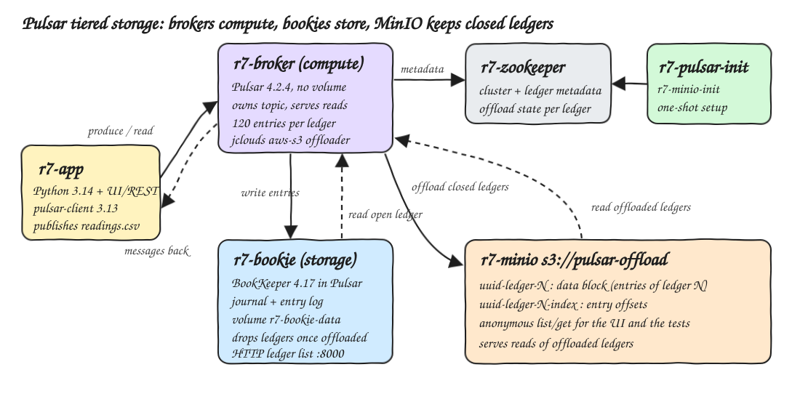
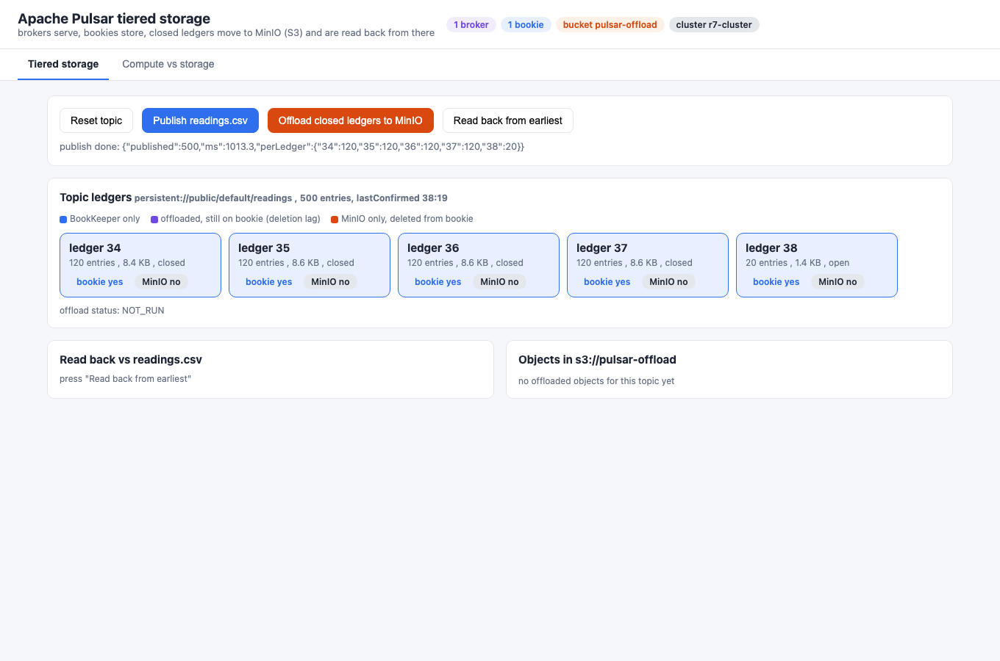
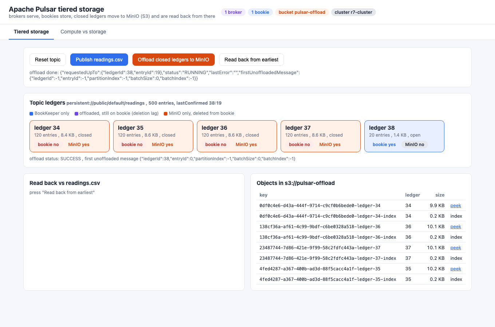
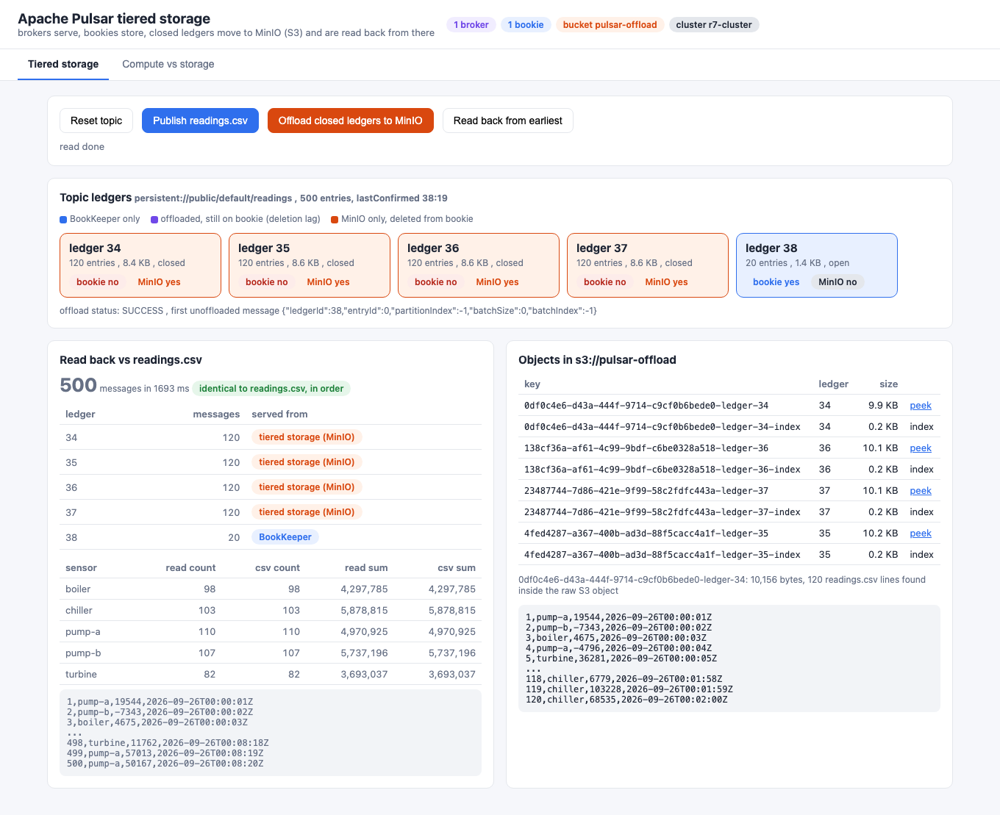
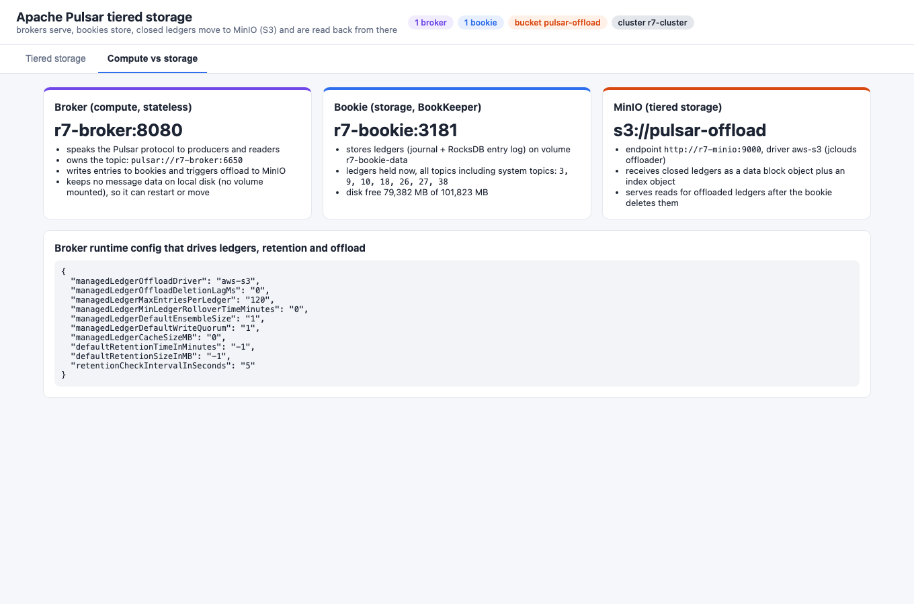

<p align="center"></p>

# pulsar-tiered-storage

Apache Pulsar 4.2.4 with tiered storage offload to MinIO (S3 API), running the broker (compute) and the BookKeeper bookie (storage) as separate containers. A Python 3.14 app publishes the 500 rows of `data/readings.csv` to a topic. The broker rolls the topic into BookKeeper ledgers of 120 entries, offloads every closed ledger to `s3://pulsar-offload`, and the bookie then deletes those ledgers. A reader from the earliest message gets all 500 rows back, and 480 of them now come from MinIO. The UI shows where each ledger lives (bookie, MinIO or both), what is inside the S3 objects, and which node plays which role.

## How it Works

1. `start-all.sh` starts ZooKeeper and MinIO. A one-shot `r7-pulsar-init` writes the `r7-cluster` metadata, and a one-shot `r7-minio-init` creates the `pulsar-offload` bucket (anonymous list/get, so the UI and tests can read it without S3 signing).
2. The bookie `r7-bookie` is the only Pulsar node with a data volume (`r7-bookie-data`). The broker `r7-broker` has no volume and adds the `tiered-storage-jcloud` offloader to the stock image (`Containerfile.pulsar`), because the `apachepulsar/pulsar` image does not ship offloaders.
3. `POST /api/publish` sends each CSV line as one message with batching off, so 1 message = 1 BookKeeper entry. With `managedLedgerMaxEntriesPerLedger=120` the topic becomes 4 closed ledgers of 120 entries and 1 open ledger with 20 entries.
4. `POST /api/offload` reads `lastMessageId` and calls the admin `PUT .../offload`. The broker copies every ledger before the open one to MinIO as `<uuid>-ledger-<id>` (data block) and `<uuid>-ledger-<id>-index`, and marks them `offloaded` in the managed ledger metadata in ZooKeeper.
5. With `managedLedgerOffloadDeletionLagMs=0` and a 5 s retention check, the broker deletes the offloaded ledgers from the bookie. Infinite retention keeps them in the topic.
6. `GET /api/read` opens a reader at `MessageId.earliest`. The 4 offloaded ledgers are read from MinIO, and the open ledger is read from the bookie. The rows are compared with `readings.csv`.

## Architecture



## Features

* Manual offload by message id: shows the exact unit of tiering. Closed ledgers move, and the open ledger never does.
* Bookie cleanup after offload: the bookie's own ledger list (BookKeeper HTTP API) proves the data left BookKeeper.
* Read back through the broker: the same Pulsar reader API works whether a ledger is on a bookie or in S3.
* Peek into S3 objects: the app downloads a data block and finds the exact 120 CSV lines of that ledger in the raw bytes.
* Compute vs storage view: broker list, topic owner, bookie list, bookie disk, ledgers held, and the broker runtime config that drives it all.
* Reset: deletes the topic, and Pulsar also deletes its offloaded objects from the bucket.

## Stack

* Apache Pulsar 4.2.4 (`docker.io/apachepulsar/pulsar:4.2.4`): latest stable Pulsar (5.0.0 is only at milestone builds). It runs as ZooKeeper, bookie and broker containers.
* Pulsar offloaders 4.2.4 (`apache-pulsar-offloaders-4.2.4-bin.tar.gz`, only `tiered-storage-jcloud-4.2.4.nar` kept): the `aws-s3` offload driver.
* BookKeeper 4.17.3 (bundled in Pulsar): ledger storage, with its HTTP admin server on for the ledger list.
* MinIO `RELEASE.2026-08-04T00-00-00Z` (`docker.io/pgsty/minio`) and `mc` `RELEASE.2026-09-16T00-00-00Z` (`docker.io/pgsty/mc`): the S3-compatible tier. MinIO no longer publishes community images, so this uses the maintained community build the other POCs in this repo use.
* Python 3.14.7 (`python:3.14.7-slim`) + `pulsar-client` 3.13.0: producer and reader. Everything else, including the HTTP server, admin calls and S3 listing, is standard library.
* Plain HTML/CSS/JS UI: no framework.
* podman + podman-compose.

## Contracts / APIs

| Method | Path | Description |
|---|---|---|
| GET | `/` | UI |
| GET | `/api/topic` | ledgers of the topic from `internalStats`, with entries, size, offloaded flag, whether the bookie still has it, and its S3 objects |
| GET | `/api/cluster` | brokers, bookies, topic owner, bookie disk info, bookie ledger list, bucket, and the broker runtime config for offload, ledgers and retention |
| POST | `/api/publish` | publishes `readings.csv`, one message per row, and returns messages per ledger |
| POST | `/api/offload` | triggers offload up to the last message id |
| GET | `/api/offload` | offload status (`RUNNING`, `SUCCESS`, `ERROR`) and the first message that was not offloaded |
| GET | `/api/read` | reads the topic from earliest, then returns counts and sums per sensor next to the CSV values, `matches`, and per ledger where it was served from |
| GET | `/api/object?key=` | size of one S3 object and the CSV lines found inside its raw bytes |
| POST | `/api/reset` | force deletes the topic |

```json
{"ms":1408.2,"matches":true,
 "ledgers":[{"ledgerId":29,"messages":120,"servedFrom":"tiered storage (MinIO)"},
            {"ledgerId":33,"messages":20,"servedFrom":"BookKeeper"}],
 "read":{"messages":500,"valueMilliSum":24577758,"bySensor":{"boiler":{"count":98,"valueMilliSum":4297785}}}}
```

Pulsar's own endpoints that the app and tests use: `GET /admin/v2/persistent/public/default/readings/internalStats`, `PUT|GET .../offload`, `GET .../lastMessageId`, `GET .../ledger/{ledger}/entry/{entry}`, `GET /admin/v2/brokers/r7-cluster`, `GET /admin/v2/bookies/all`, `GET /lookup/v2/topic/...`, the bookie's `GET /api/v1/ledger/list/` and `GET /api/v1/bookie/info`, and the S3 `ListObjectsV2` on the bucket.

## Key data structures and design decisions

```yaml
PULSAR_PREFIX_managedLedgerMaxEntriesPerLedger: "120"
PULSAR_PREFIX_managedLedgerMinLedgerRolloverTimeMinutes: "0"
PULSAR_PREFIX_managedLedgerOffloadDriver: aws-s3
PULSAR_PREFIX_s3ManagedLedgerOffloadBucket: pulsar-offload
PULSAR_PREFIX_s3ManagedLedgerOffloadServiceEndpoint: http://r7-minio:9000
PULSAR_PREFIX_managedLedgerOffloadDeletionLagMs: "0"
PULSAR_PREFIX_defaultRetentionTimeInMinutes: "-1"
PULSAR_PREFIX_managedLedgerCacheSizeMB: "0"
PULSAR_PREFIX_brokerDeleteInactiveTopicsEnabled: "false"
```

* The ledger is the unit of everything: rollover, offload, deletion from bookies. Small ledgers (120 entries) make 500 rows produce 4 offloadable ledgers plus an open tail.
* Batching is off in the producer, so entry ids map 1:1 to CSV rows. That lets the tests fetch `ledger/<id>/entry/<n>` from the broker and compare it with a CSV row.
* The message payload is the raw CSV line. That makes the S3 data block greppable, and the tests can check that each object holds exactly its 120 rows.
* Retention is infinite and inactive topic deletion is off. Otherwise Pulsar would trim the ledgers (nobody subscribes) or delete the idle topic.
* The broker entry cache is 0 MB, so reads cannot be served from broker memory. They go to the bookie or to MinIO.
* Replication is 1/1/1 (one bookie) to keep the stack small. In production, ensemble, write and ack quorum would be at least 3/3/2.
* All names start with `r7-`: containers `r7-zookeeper`, `r7-pulsar-init`, `r7-bookie`, `r7-broker`, `r7-minio`, `r7-minio-init`, `r7-app`, volumes `r7-zk-data`, `r7-bookie-data`, `r7-minio-data`, network `r7-net`.
* Memory limits: ZooKeeper 256 MB, bookie 640 MB, broker 1 GB, MinIO 384 MB, app 256 MB (plus short-lived init containers). About 830 MB is used at runtime.
* The bookie ledger list also shows ledgers of Pulsar system topics (`__change_events`), so the tests only look at the topic's own ledger ids.

## How to run

Requirements: podman, podman-compose, curl, lsof and python3 (the tests use only the standard library).

```bash
./scripts/setup.sh
./scripts/start-all.sh
./scripts/test-all.sh
./scripts/ui.sh
./scripts/stop-all.sh
```

`test-all.sh` resets the topic, publishes `readings.csv` and checks each step against the CSV and against Pulsar, BookKeeper, MinIO and podman directly (not through the app):

* After publish: 4 closed ledgers of exactly 120 entries, an open ledger with 20, all on the bookie, none offloaded, nothing in MinIO. The first and last entry of each ledger (broker admin API) equal the matching CSV rows.
* After offload: status `SUCCESS`, and offload stops at the open ledger. Each closed ledger is marked `offloaded` and has one data object and one index object in the bucket. Each data object holds exactly its 120 CSV rows, and the open ledger has no object.
* The bookie's own ledger list drops the 4 offloaded ledgers and keeps the open one.
* With those ledgers gone from BookKeeper, a reader from earliest returns 500 rows equal to the CSV, in order, with count and sum per sensor equal to the CSV. The closed ledgers are served from tiered storage, and entries fetched by id from those ledgers equal the CSV rows.
* The broker has no volume. After `podman restart r7-broker` the full read still matches the CSV, and the ledgers are still marked offloaded.
* Roles: the one broker is the topic owner, the one bookie is `r7-bookie:3181`, and only the bookie has a data volume.

```
test_1_publish_splits_the_topic_into_bookkeeper_ledgers ... ok
test_2_offload_moves_every_closed_ledger_into_minio ... ok
test_3_bookie_drops_offloaded_ledgers_and_keeps_the_open_one ... ok
test_4_read_back_from_tiered_storage_equals_the_csv ... ok
test_5_broker_restart_loses_nothing_because_it_holds_no_data ... ok
test_6_broker_computes_bookie_stores ... ok
----------------------------------------------------------------------
Ran 6 tests in 13.201s

OK
all tests passed
```

## Printscreens

Right after publishing `readings.csv`: five ledgers, all blue (BookKeeper only). Ledgers 34 to 37 are closed at 120 entries each, and ledger 38 is open with 20. Nothing has been offloaded yet.



After "Offload closed ledgers to MinIO": offload status `SUCCESS`, with the first unoffloaded message at ledger 38 entry 0. The four closed ledgers are orange ("bookie no", "MinIO yes") because the bookie already deleted them. The bucket holds a data object and an index object per ledger, and the open ledger stays on the bookie.



Read back from earliest: 500 messages, identical to `readings.csv` and in order. Per ledger, 4 x 120 come from tiered storage and 20 from BookKeeper, and counts and sums per sensor match the CSV. On the right, "peek" on a data object finds exactly 120 CSV lines (rows 121 to 240) in its raw bytes.



Compute vs storage tab: the broker `r7-broker:8080` owns the topic and has no volume. The bookie `r7-bookie:3181` holds the ledgers on `r7-bookie-data`, with its current ledger ids and free disk. MinIO is the tier. Below is the broker runtime config that produces this behavior.



## Scripts

All scripts live in `scripts/` and run from any directory of the repository.

| Script | What it does |
|---|---|
| `./scripts/setup.sh` | Pulls images, builds the broker image with the offloader and the app image, generates `data/readings.csv` |
| `./scripts/start-all.sh` | Starts every service in order, publishes the CSV on first start, prints the full link of each one |
| `./scripts/status.sh` | Shows every service port as UP or DOWN and the state of each container |
| `./scripts/test-all.sh` | Runs the tiered storage tests |
| `./scripts/ui.sh` | Opens the UI in the browser |
| `./scripts/stop-all.sh` | Stops every service |

Ports are declared in `scripts/ports.env`: UI 27200, broker admin 27201, bookie HTTP 27202, MinIO S3 27203, MinIO console 27204.
