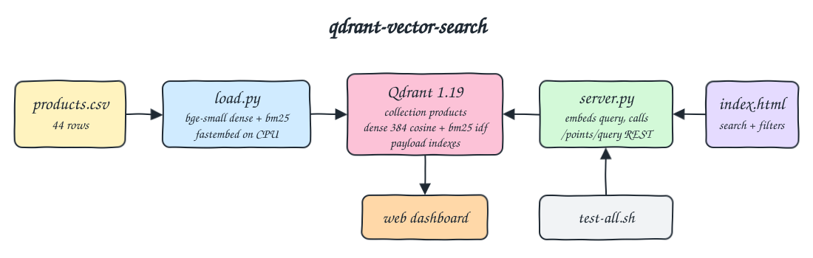
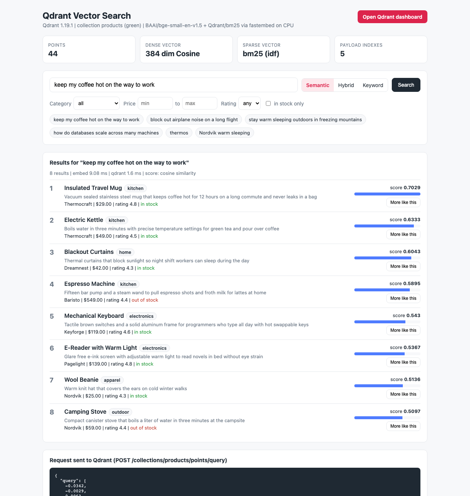
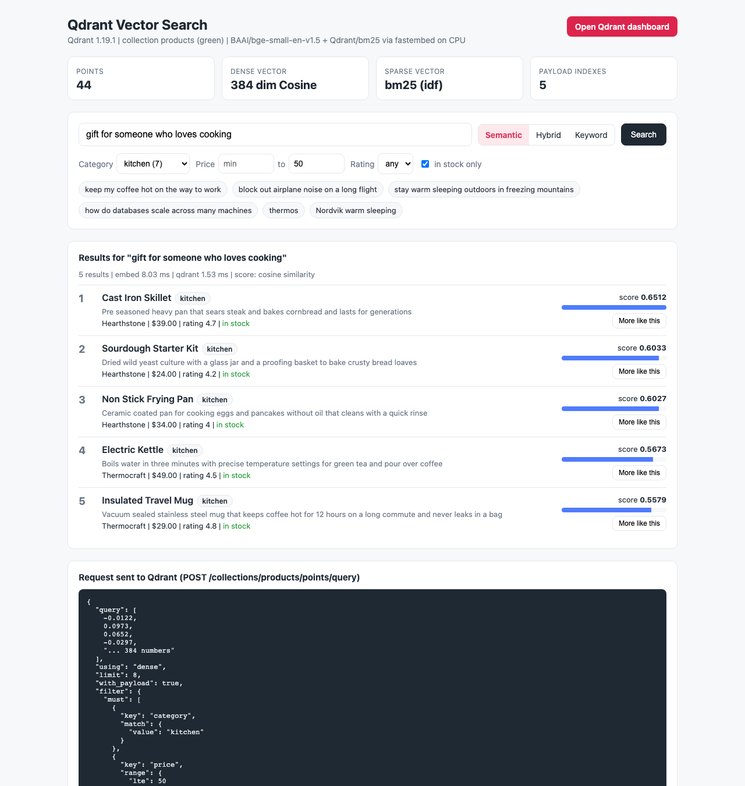
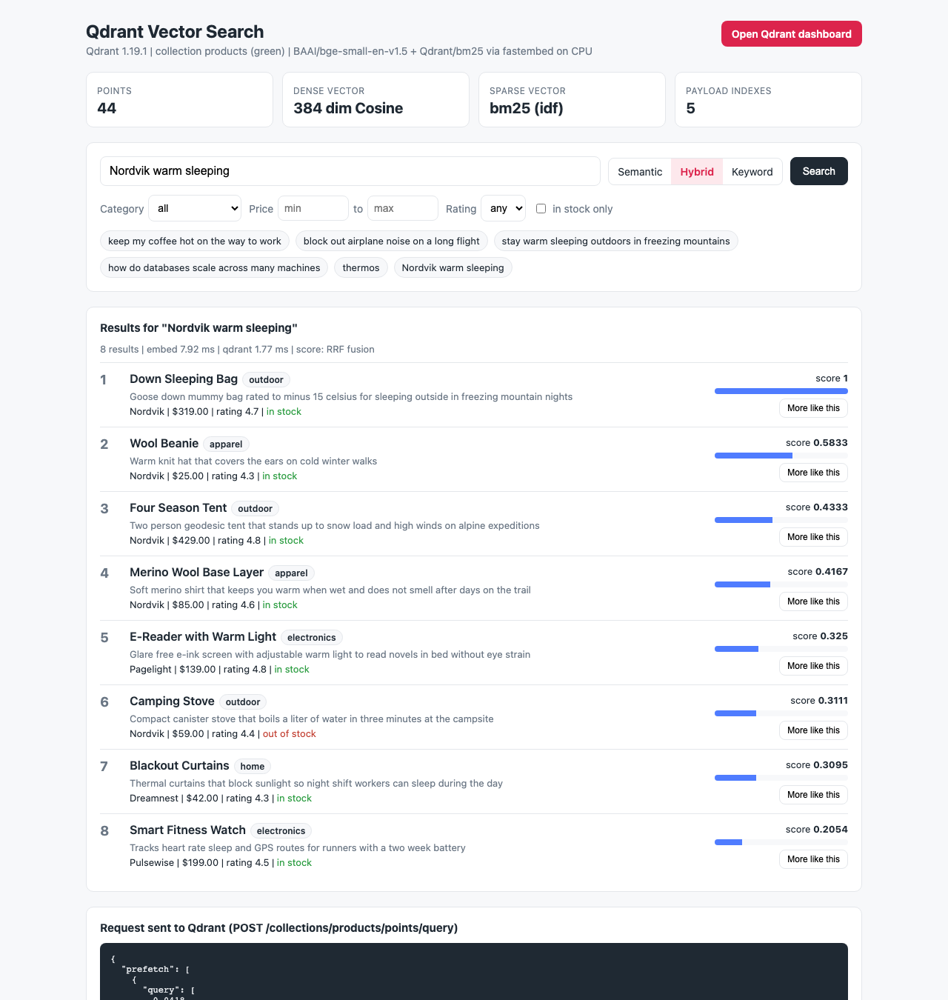
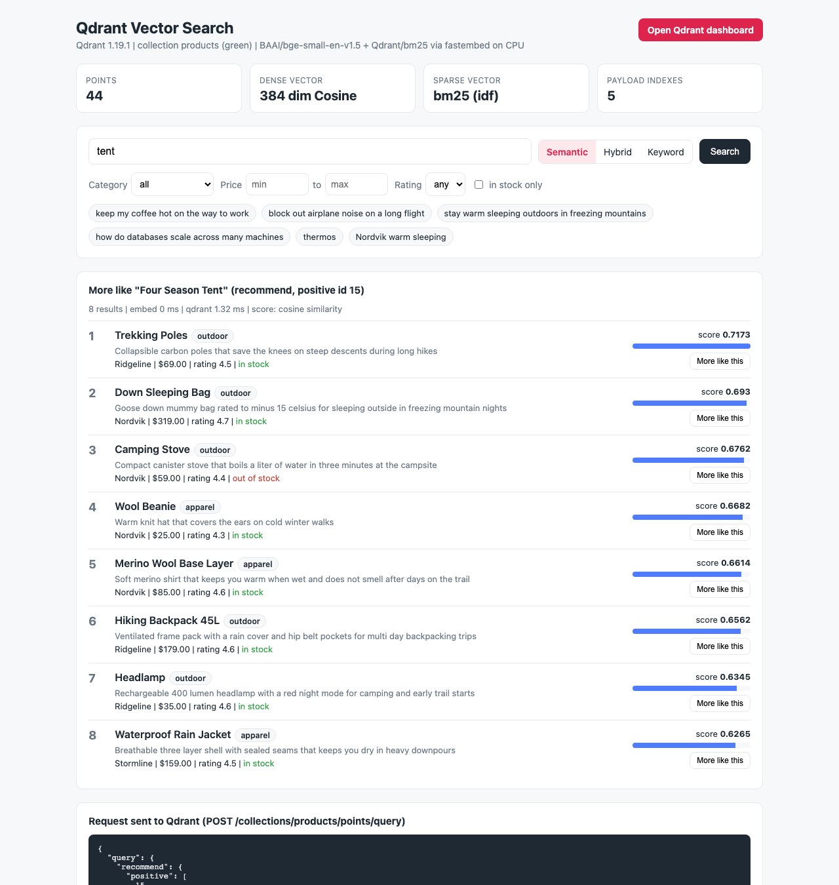
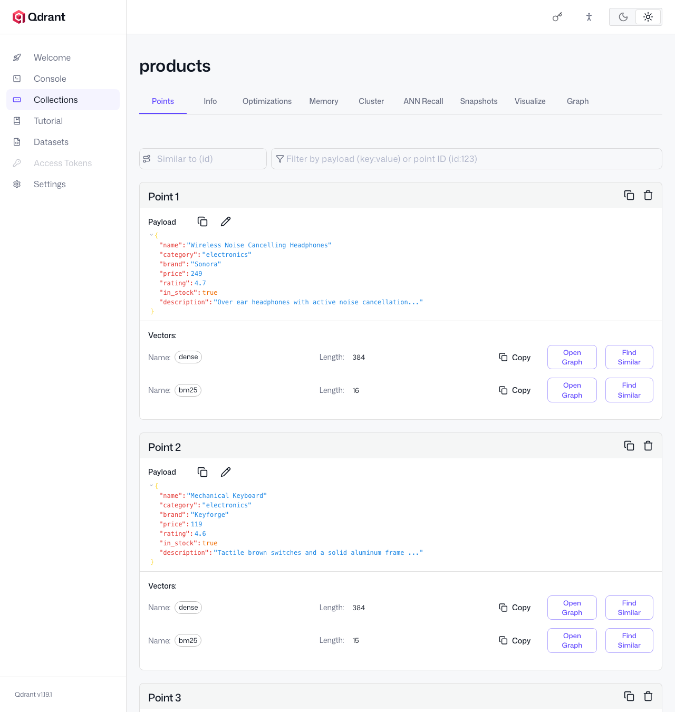

# qdrant-vector-search

Semantic product search on the Qdrant vector database. The 44 products of `data/products.csv` are embedded on CPU with a small local model (`BAAI/bge-small-en-v1.5` through fastembed, plus the `Qdrant/bm25` sparse model), upserted as points with their payload into a Qdrant collection, and searched from a single page UI with semantic, keyword and hybrid modes, payload filters (category, price range, rating, stock) and "more like this" recommendations. Qdrant's own web dashboard is linked from the UI.

## How it Works

1. `app/load.py` reads `data/products.csv` and creates the `products` collection when it does not exist: a named dense vector `dense` (384 dims, cosine) and a named sparse vector `bm25` with the `idf` modifier, so Qdrant computes IDF on the server.
2. It creates payload indexes on `category` and `brand` (keyword), `price` and `rating` (float) and `in_stock` (bool), so filters are resolved by the index instead of scanning payloads.
3. Every product becomes one text (`name by brand. description`), embedded once dense and once sparse, and upserted as a point whose id is the CSV id and whose payload is the CSV row. Upserts are keyed by id, so reruns overwrite instead of duplicating.
4. `app/server.py` (Python stdlib `http.server`) embeds the user query with the same models and calls Qdrant's Query API (`POST /collections/products/points/query`) over plain REST with `urllib`.
5. Semantic uses the dense vector, keyword uses the bm25 sparse vector, hybrid sends both as `prefetch` and fuses them with Reciprocal Rank Fusion (`"query": {"fusion": "rrf"}`), recommend uses `{"recommend": {"positive": [id]}}` on the dense vector. Filters go into the same request as a `filter` (inside each `prefetch` for hybrid).
6. The UI shows the ranked, scored results, the timings and the exact JSON sent to Qdrant (vectors shortened).

## Architecture



## Features

* Local embeddings on CPU: both models are downloaded while the image is built and loaded with `HF_HUB_OFFLINE=1` at runtime, so no GPU, no API key and no network access are needed to embed.
* Named dense + sparse vectors in one collection: one point holds both representations, so semantic, keyword and hybrid run against the same data.
* Payload filters: category, price range, minimum rating and in stock, backed by payload indexes, and exact (a filtered query returns every matching point, not an approximation).
* Hybrid search with server side RRF fusion through the Query API `prefetch`, no client side merge code.
* Recommendations: "More like this" on any result asks Qdrant for points close to that point, excluding the point itself, and still honors the filters.
* Facets: the category dropdown is filled from Qdrant's facet API with exact counts.
* Idempotent pipeline: collection and indexes are created only when missing, points are upserted by id.
* Link to the Qdrant dashboard to browse points, payloads and vectors.

## Stack

* Qdrant 1.19.1 (`qdrant/qdrant:v1.19.1`): latest stable Qdrant, REST on one port, dashboard included, capped at 512 MB.
* Python 3.14.7 (`python:3.14.7-slim`): loader, API and UI server in one image.
* fastembed 0.8.1 (brings onnxruntime 1.30.0, tokenizers 0.23.2, numpy 2.5.3): the only Python dependency. It runs ONNX models on CPU without torch, and ships the `Qdrant/bm25` sparse model, so both dense and sparse embeddings come from one small library. The alternative, sentence-transformers, pulls torch and makes the image several GB.
* `BAAI/bge-small-en-v1.5` (quantized ONNX, about 67 MB, 384 dims): small and fast on CPU, good quality for short English texts.
* No qdrant-client: the server calls Qdrant REST with `urllib`, which keeps dependencies to one and shows the raw API calls.
* Python stdlib `http.server`: serves `index.html` and the JSON API.
* Plain HTML, CSS and JS for the UI, no framework.
* podman + podman-compose: runs Qdrant, the one-shot loader and the UI.

## Contracts / APIs

| Method | Path | Description |
|---|---|---|
| GET | `/` | UI |
| GET | `/api/info` | Qdrant version, collection status, point count, vector config, payload schema, category facets, model names, dashboard link |
| GET | `/api/search?q=&mode=semantic\|keyword\|hybrid&category=&price_min=&price_max=&min_rating=&in_stock=true&limit=` | Top `limit` (default 8) points for the text. `score` is cosine similarity (semantic), BM25 (keyword) or RRF (hybrid) |
| GET | `/api/recommend?id=&category=&price_min=&price_max=&min_rating=&in_stock=true&limit=` | Points similar to point `id`, excluding it |

```json
{"query": "thermos", "mode": "semantic", "embed_ms": 8.1, "query_ms": 1.6,
 "request": {"query": [0.0269, 0.0473, -0.0095, 0.043, "... 384 numbers"], "using": "dense", "limit": 8, "with_payload": true},
 "results": [{"id": 8, "score": 0.6477, "name": "Insulated Travel Mug", "category": "kitchen", "brand": "Thermocraft",
              "price": 29.0, "rating": 4.8, "in_stock": true, "description": "..."}]}
```

Hybrid request sent to Qdrant for `tent` in the `outdoor` category:

```json
{"prefetch": [
   {"query": [0.0269, "... 384 numbers"], "using": "dense", "limit": 20, "filter": {"must": [{"key": "category", "match": {"value": "outdoor"}}]}},
   {"query": {"indices": [1433262701], "values": [1]}, "using": "bm25", "limit": 20, "filter": {"must": [{"key": "category", "match": {"value": "outdoor"}}]}}],
 "query": {"fusion": "rrf"}, "limit": 8, "with_payload": true}
```

Collection:

```json
{"vectors": {"dense": {"size": 384, "distance": "Cosine"}}, "sparse_vectors": {"bm25": {"modifier": "idf"}}}
```

## Key data structures and design decisions

* Point = CSV row: `id` is the CSV id, payload is `name, category, brand, price, rating, in_stock, description`, vectors are `dense` and `bm25`. So the point count must equal the CSV row count, which the tests check.
* bge queries get the `Represent this sentence for searching relevant passages:` prefix and documents do not, as the model card recommends. BM25 uses `query_embed` for queries (term presence) and `passage_embed` for documents (term frequency), IDF is applied by Qdrant.
* The keyword mode returns nothing when the query has no token that exists in any document (`thermos`), which is exactly where semantic search still finds the Insulated Travel Mug.
* One image serves the loader and the UI, the models are cached at `/models` in that image. fastembed does not find the cached BM25 files in offline mode by itself, so `embed.py` passes the cached snapshot folder with `specific_model_path`.
* Every container, volume and network starts with `q6-` (`q6-qdrant`, `q6-loader`, `q6-ui`, `q6-qdrant-data`, `q6-net`). Host ports: Qdrant 26500, UI 26501. The gRPC port is not published.
* Memory: Qdrant is capped at 512 MB (about 200 MB used), the UI at 768 MB (about 165 MB used).

## How to run

Requirements: podman, podman-compose, curl, lsof and python3 (the tests use only the standard library).

```bash
./scripts/setup.sh
./scripts/start-all.sh
./scripts/test-all.sh
./scripts/ui.sh
./scripts/stop-all.sh
```

`test-all.sh` checks, against the CSV as the independent source:

* awk row count of `products.csv` equals the exact point count, and still does after running the pipeline a second time (upserts do not duplicate).
* Every payload matches its CSV row (name, category, numeric price, boolean stock), the filtered fields are indexed with the right type, and the category facets equal the CSV counts.
* Natural language questions rank the right product first (coffee on the commute: Insulated Travel Mug, airplane noise: headphones, freezing mountains: Down Sleeping Bag, filming surfing: action camera, scaling databases: Designing Data-Intensive Applications, dog hair on the floor: Robot Vacuum).
* A category filter removes the best unfiltered match, a price range returns exactly the CSV rows in that range, stock and rating filters return exactly the matching rows.
* Keyword mode returns exactly the products of the `Nordvik` brand and nothing for `thermos`, while semantic finds the mug for `thermos`.
* Hybrid sends an RRF fusion, returns only points from the two prefetch lists, differs from both single lists, and ranks first the product both lists agree on.
* Recommend for the tent excludes the tent, returns mostly outdoor gear and honors a category filter.

```
csv rows (awk): 44, qdrant points: 44
rerunning the pipeline to prove upserts are idempotent
embedding data/products.csv and upserting into qdrant
read csv                    0.2 ms
ensure collection           8.1 ms
ensure payload indexes      8.2 ms
embed dense + bm25        612.7 ms
upsert points              14.9 ms
collection reused, csv rows 44, points 44
points after second run: 44
test_category_facets_match_csv ... ok
test_every_csv_row_is_one_point ... ok
test_filtered_fields_are_indexed ... ok
test_payload_matches_csv ... ok
test_category_filter_excludes_the_best_unfiltered_match ... ok
test_in_stock_and_rating_filters_drop_non_matching_payloads ... ok
test_price_range_returns_exactly_the_matching_rows ... ok
test_hybrid_fuses_both_lists_and_ranks_the_item_both_agree_on_first ... ok
test_keyword_mode_only_returns_documents_with_the_term ... ok
test_semantic_finds_what_keyword_cannot ... ok
test_more_like_a_tent_is_outdoor_gear_and_not_the_tent_itself ... ok
test_recommend_respects_filters ... ok
test_natural_language_question_ranks_the_right_product_first ... ok
test_scores_are_sorted_descending ... ok
Ran 14 tests in 0.187s
OK
all tests passed
```

## Printscreens

Semantic search for `keep my coffee hot on the way to work`. The header shows the Qdrant version, the collection status and the two models, the cards show 44 points, the 384 dim cosine dense vector, the bm25 sparse vector with IDF and the 5 payload indexes. The Insulated Travel Mug wins with cosine 0.70, followed by the Electric Kettle. The bottom card is the request sent to Qdrant.



Payload filters: `gift for someone who loves cooking` restricted to `kitchen`, price up to 50 and in stock only. Only 5 points qualify, the Espresso Machine (549, out of stock) and the Chef Knife (89) are filtered out by Qdrant, and the request card shows the `must` conditions.



Hybrid search for `Nordvik warm sleeping`. The dense and bm25 lists are fused with RRF, the Down Sleeping Bag is first in both lists and gets the top fused score, and the other Nordvik products (beanie, tent, base layer) come up through the brand term.



"More like this" on the Four Season Tent: Qdrant's recommend query returns trekking poles, the sleeping bag, the camping stove and other outdoor or cold weather gear, without the tent itself.



The Qdrant dashboard (linked from the UI) on the `products` collection: each point with its payload and its two named vectors, `dense` with 384 values and `bm25` with one entry per distinct term.



## Scripts

All scripts live in `scripts/` and run from any directory of the repository.

| Script | What it does |
|---|---|
| `./scripts/setup.sh` | Pulls the Qdrant image and builds the app image with the models cached inside |
| `./scripts/start-all.sh` | Starts Qdrant, runs the pipeline when the collection is not complete, starts the UI and prints the full link of each one |
| `./scripts/pipeline.sh` | Embeds the CSV and upserts every point into Qdrant |
| `./scripts/status.sh` | Shows every service port as UP or DOWN |
| `./scripts/test-all.sh` | Checks counts, idempotency, payloads, semantic ranking, filters, hybrid and recommend |
| `./scripts/ui.sh` | Opens the UI in the browser and prints the dashboard link |
| `./scripts/stop-all.sh` | Stops every service |

Ports are declared in `scripts/ports.env` (qdrant 26500, ui 26501). The Qdrant dashboard is at `http://localhost:26500/dashboard`.

```bash
./scripts/setup.sh
./scripts/start-all.sh
./scripts/status.sh
./scripts/ui.sh
./scripts/stop-all.sh
```
