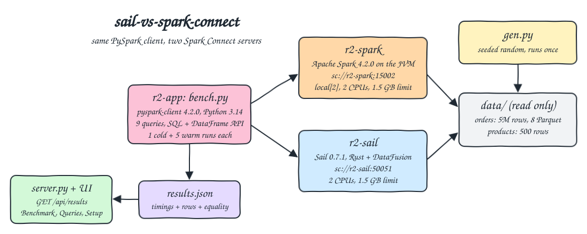
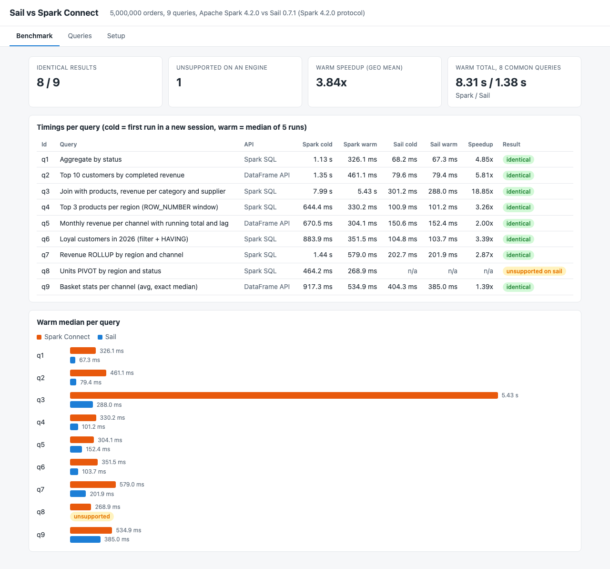
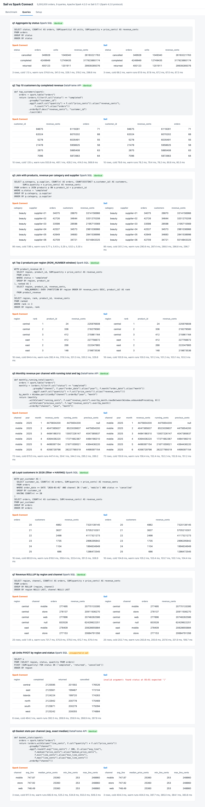
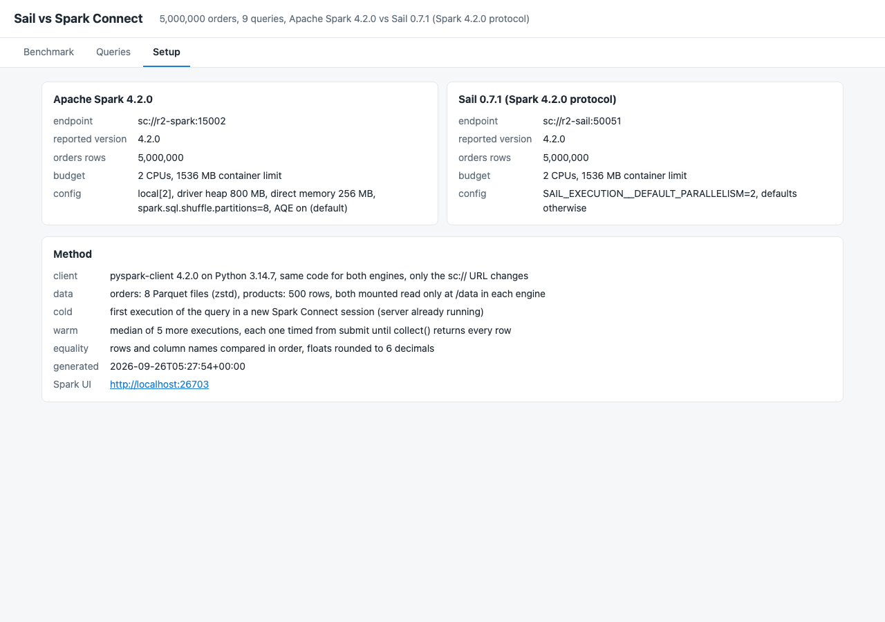

<p align="center"></p>

# sail-vs-spark-connect

Sail (LakeSail, `pysail`) is a Rust replacement for Apache Spark built on Apache DataFusion that speaks the Spark Connect protocol. This POC points the exact same PySpark client code (pyspark-client 4.2.0 on Python 3.14) at a real Apache Spark 4.2.0 Spark Connect server and at a Sail 0.7.1 server, runs 9 analytical queries (Spark SQL and DataFrame API: aggregates, a join, window functions, filters with HAVING, ROLLUP, PIVOT, exact median) over 5,000,000 generated orders in Parquet, records a cold run and the median of 5 warm runs per query, checks that both engines return identical rows, and shows it all in a small web UI. Queries an engine cannot run are shown as unsupported, with the engine's error.

## How it Works

1. `app/gen.py` writes `data/orders/` (5,000,000 rows, 8 zstd Parquet files, about 43 MB) and `data/products.parquet` (500 rows) from a seeded `random.Random(2026)`, so every run produces the same bytes.
2. `r2-spark` runs `start-connect-server.sh` from the official `spark:4.2.0` image, `r2-sail` runs `sail spark server` from `pysail`. Both mount `data/` read only at `/data` and get the same budget: 2 CPUs and a 1536 MB memory limit.
3. `app/bench.py` (in `r2-app`) opens `SparkSession.builder.remote(url)` for one engine, registers `orders` and `products` as temp views, and runs every query from `app/queries.py`: once cold, then 5 warm times. Each run is timed from submit until `collect()` returns every row.
4. The only thing that changes between engines is the `sc://` URL. If a query raises, it is recorded as unsupported with the first line of the error and no timing.
5. Rows are normalized (floats rounded to 6 decimals, decimals to int when integral, dates to ISO) and compared with the column names. Any difference fails the benchmark.
6. `results/results.json` is served by `app/server.py` (stdlib `http.server`) to `app/index.html`, which has three tabs: Benchmark, Queries and Setup.

## Architecture



## Features

* One client, two servers: the benchmark code has no engine specific branch, which is the promise of Spark Connect and the reason Sail can replace Spark without code changes.
* Same resources for both engines: 2 CPUs and 1536 MB per container (`local[2]` for Spark, `SAIL_EXECUTION__DEFAULT_PARALLELISM=2` for Sail), so the numbers compare engines, not machines.
* Cold and warm: cold is the first run of the query in a new session (planning, JIT and file metadata reads), warm is the median of 5 more runs.
* Result equality: every query is compared row by row between the engines, and the tests also recompute the key answers with pyarrow, so a bug shared by both engines is still caught.
* Honest unsupported: SQL `PIVOT` fails on Sail 0.7.1 and the UI shows it with the parser error instead of dropping it.
* Mixed APIs: 6 queries are Spark SQL, 3 are DataFrame API (functions), and the UI shows the exact text or Python source that ran.
* Deterministic data: a seeded generator, integer cents for money, and `date` instead of timestamps, so results never depend on float order or session time zone.
* Fail loud: the benchmark aborts after `BENCH_TIMEOUT` (900 s) instead of hanging if a server dies.

## Stack

* Apache Spark 4.2.0 (`docker.io/library/spark:4.2.0`, Java 21): latest Spark release, its image ships the Spark Connect server jar and `start-connect-server.sh`.
* Sail 0.7.1 (`pysail` on PyPI): latest Sail, a single Rust binary behind a Python wheel, serves Spark Connect over gRPC.
* pyspark-client 4.2.0: the thin Spark Connect only PySpark package (no JVM), same API as `pyspark`, supports Python 3.14.
* Python 3.14.7 (`docker.io/library/python:3.14.7-slim`): one image runs the Sail server, the generator, the benchmark, the tests and the UI.
* pandas 2.3.3: pinned because pyspark-client 4.2.0 warns that pandas 3 is not fully supported, 2.3.3 has Python 3.14 wheels.
* pyarrow 25.0.1 (pulled by pyspark-client): writes the Parquet files and recomputes answers in the tests.
* Python stdlib `http.server` + plain HTML, CSS and JS: the UI, no framework.
* podman + podman-compose: runs the three containers.

## Contracts / APIs

| Method | Path / endpoint | Description |
|---|---|---|
| gRPC | `sc://localhost:26700` | Apache Spark 4.2.0 Spark Connect |
| gRPC | `sc://localhost:26701` | Sail 0.7.1 Spark Connect |
| GET | `http://localhost:26703` | Spark UI of the Spark Connect server |
| GET | `/` | UI |
| GET | `/api/results` | `results.json` plus `spark_ui`, 404 with an `error` when no benchmark ran yet |

```json
{"generated_at": "2026-09-26T05:27:54+00:00", "python": "3.14.7", "client": "pyspark-client 4.2.0", "warm_runs": 5,
 "engines": {"spark": {"url": "sc://r2-spark:15002", "version": "4.2.0", "product": "Apache Spark 4.2.0", "orders_rows": 5000000},
             "sail": {"url": "sc://r2-sail:50051", "version": "4.2.0", "product": "Sail 0.7.1 (Spark 4.2.0 protocol)", "orders_rows": 5000000}},
 "queries": [{"id": "q1", "title": "Aggregate by status", "kind": "Spark SQL", "text": "SELECT status, ...", "identical": true, "speedup": 4.85,
              "engines": {"spark": {"supported": true, "cold_ms": 1133.1, "warm_ms": [374.8, 341.0, 326.1, 319.2, 298.6], "warm_median_ms": 326.1,
                                    "columns": ["status", "orders", "units", "revenue_cents"], "rows": [["cancelled", 349928, 1049340, 26183221763], "..."]},
                          "sail": {"supported": true, "cold_ms": 68.2, "warm_median_ms": 67.3, "...": "..."}}},
             {"id": "q8", "identical": null, "speedup": null,
              "engines": {"sail": {"supported": false, "error": "invalid argument: found status at 85:91 expected '('"}}}]}
```

## Key data structures and design decisions

* `orders`: `order_id` int64, `order_date` date, `customer_id` int32 (100,000 customers), `product_id` int32, `region` (6), `channel` (web, store, mobile), `status` (completed 85%, returned 8%, cancelled 7%), `quantity` 1..5, `price_cents` int64. `products`: `product_id`, `product_name`, `category` (8), `supplier` (12), `list_price_cents`.
* 8 files instead of one, so both engines can split the scan across their 2 cores the same way.
* A query is `{id, title, kind, run, text}`. For DataFrame queries `text` is `inspect.getsource` of the function that runs, so the UI can never show code that differs from what was timed.
* `identical` is `true`, `false`, or `null` when an engine failed, and `speedup` is Spark warm median divided by Sail warm median, `null` when an engine failed. The tests check both rules.
* Spark's JVM got OOM killed at 1 GB heap inside the 1536 MB limit (heap plus direct buffers plus metaspace), so Spark runs with an 800 MB heap, `-XX:MaxDirectMemorySize=256m`, `-XX:MaxMetaspaceSize=192m` and `spark.sql.shuffle.partitions=8` (AQE stays on). Sail needs about 240 MB for the same work.
* `spark.version` on a Sail session reports `4.2.0` (the protocol it implements), so the Sail version shown comes from the installed `pysail` package in the same image that runs the Sail server.
* Every container and the network start with `r2-` (`r2-spark`, `r2-sail`, `r2-app`, `r2-net`). Memory limits: 1536 + 1536 + 512 MB = 3.5 GB.

## How to run

Requirements: podman, podman-compose, curl and lsof. Python and every library run inside the containers.

```bash
./scripts/setup.sh
./scripts/start-all.sh
./scripts/test-all.sh
./scripts/ui.sh
./scripts/stop-all.sh
```

`test-all.sh` reruns the benchmark and then runs `tests/test_bench.py` inside `r2-app`. The tests check:

* Both engines counted all 5,000,000 generated rows, so no timing is for less data.
* q1 (status aggregate) and q2 (top 10 customers) equal an independent pyarrow recompute that reads the Parquet files one at a time, so a bug shared by both engines is caught.
* q7 ROLLUP grand total equals the whole revenue and each region subtotal equals the sum of its channels.
* q5 running total really accumulates per channel and lag points to the previous month, q4 keeps exactly ranks 1, 2, 3 per region in descending revenue.
* `identical` is true only when rows and columns match, and is null when an engine failed; unsupported queries carry an error and never a timing or speedup.
* `speedup` is the ratio of the warm medians and `warm_median_ms` is the median of the recorded warm runs.
* The same client code against the two live servers returns the same distinct customer count as pyarrow for a query that is not in the benchmark.
* The UI serves the same results the benchmark wrote and has the three tabs.

The tests were also run against a tampered `results.json` (one Sail revenue off by one cent, one speedup changed) and 3 tests failed, as they should.

```
running the benchmark with 5 warm runs per query, same pyspark client against spark and sail
spark q1 cold=1133.1ms warm_median=326.1ms rows=3
...
sail  q8 UNSUPPORTED invalid argument: found status at 85:91 expected '('
sail  q9 cold=404.3ms warm_median=385.0ms rows=3
identical: 8/9, different: none, unsupported: ['q8']
test_both_engines_scanned_every_generated_row ... ok
test_identical_flag_is_true_only_when_rows_and_columns_match ... ok
test_rollup_grand_total_is_the_whole_revenue ... ok
test_row_number_window_keeps_three_best_products_per_region ... ok
test_running_total_accumulates_and_lag_points_to_previous_month ... ok
test_speedup_is_spark_warm_median_over_sail_warm_median ... ok
test_status_aggregate_matches_an_independent_pyarrow_recompute ... ok
test_top_customers_match_an_independent_pyarrow_recompute ... ok
test_unsupported_queries_show_the_error_and_never_a_timing ... ok
test_warm_median_is_the_median_of_the_recorded_runs ... ok
test_same_client_code_gets_the_same_answer_from_both_live_servers ... ok
test_ui_page_has_every_tab ... ok
test_ui_serves_the_same_results_the_benchmark_wrote ... ok

----------------------------------------------------------------------
Ran 13 tests in 2.045s

OK
all tests passed
```

## Benchmark results

Laptop, podman VM, both engines capped at 2 CPUs and 1536 MB, 5,000,000 orders, 5 warm runs. Times in ms (cold / warm median).

| Id | Query | API | Spark 4.2.0 | Sail 0.7.1 | Warm speedup | Result |
|---|---|---|---|---|---|---|
| q1 | Aggregate by status | Spark SQL | 1133 / 326 | 68 / 67 | 4.85x | identical |
| q2 | Top 10 customers by completed revenue | DataFrame API | 1351 / 461 | 80 / 79 | 5.81x | identical |
| q3 | Join with products, revenue per category and supplier | Spark SQL | 7988 / 5428 | 301 / 288 | 18.85x | identical |
| q4 | Top 3 products per region (ROW_NUMBER window) | Spark SQL | 644 / 330 | 101 / 101 | 3.26x | identical |
| q5 | Monthly revenue per channel with running total and lag | DataFrame API | 671 / 304 | 151 / 152 | 2.00x | identical |
| q6 | Loyal customers in 2026 (filter + HAVING) | Spark SQL | 884 / 352 | 105 / 104 | 3.39x | identical |
| q7 | Revenue ROLLUP by region and channel | Spark SQL | 1439 / 579 | 203 / 202 | 2.87x | identical |
| q8 | Units PIVOT by region and status | Spark SQL | 464 / 269 | unsupported | n/a | unsupported on Sail |
| q9 | Basket stats per channel (avg, exact median) | DataFrame API | 917 / 535 | 404 / 385 | 1.39x | identical |

* Sail was faster on every query it ran: 3.84x geometric mean on warm medians, 8.31 s vs 1.38 s summed over the 8 common queries.
* The biggest gap is q3 (join plus `COUNT(DISTINCT customer_id)`): 5.4 s warm on Spark with its 800 MB heap vs 0.29 s on Sail. The Spark plan was not profiled here, so the exact cause is not claimed.
* The smallest gap is q9, where the exact median dominates on both engines.
* Sail's cold run is about the same as its warm run. Spark's cold run is 2x to 4x its warm run (JIT and planning warm up), so short interactive sessions favor Sail even more.
* Sail 0.7.1 does not parse the SQL `PIVOT` clause (`invalid argument: found status at 85:91 expected '('`). A manual check showed the DataFrame form `groupBy("region").pivot("status", [...]).sum("quantity")` does run on Sail and returns the same numbers as Spark's SQL PIVOT, but the benchmark keeps the SQL text and reports it as unsupported.
* Sail used about 240 MB, Spark about 1.3 GB, of the same 1536 MB limit.
* Other POCs were sharing the same podman VM, so the numbers move between runs (across 4 runs q1 went from 3.3x to 5.6x, q3 from 18.7x to 23.8x). Sail was faster on every common query in every run.

## Printscreens

Benchmark tab: tiles with identical results (8 of 9), the one query unsupported on an engine, the warm geometric mean speedup and the summed warm time. The table has cold and warm per engine, the speedup and the equality badge, and the bars compare warm medians (q3 is the long Spark bar, q8 has no Sail bar because it is unsupported).



Queries tab: for every query the exact Spark SQL text or DataFrame API source, the equality badge, and the first rows returned by Spark and by Sail side by side with the cold time and every warm run. q8 shows the Sail parser error next to Spark's PIVOT result.



Setup tab: product and version of each engine, the `sc://` endpoint, the rows each engine saw, the shared CPU and memory budget, the engine config, how cold, warm and equality are defined, and the link to the Spark UI.



## Scripts

All scripts live in `scripts/` and run from any directory of the repository.

| Script | What it does |
|---|---|
| `./scripts/setup.sh` | Pulls the Spark and Python images, builds the app image, generates the dataset when missing |
| `./scripts/start-all.sh` | Starts Spark Connect, Sail and the UI, waits for each, runs the benchmark when there are no results, prints every link |
| `./scripts/bench.sh` | Runs the benchmark against both engines and writes `results/results.json` (`BENCH_RUNS=9 ./scripts/bench.sh` for more warm runs) |
| `./scripts/status.sh` | Shows every service port as UP or DOWN |
| `./scripts/test-all.sh` | Reruns the benchmark and runs the tests |
| `./scripts/ui.sh` | Opens the UI in the browser and prints the Spark UI link |
| `./scripts/stop-all.sh` | Stops every container and waits until the ports are free |

Ports are declared in `scripts/ports.env`: Spark Connect 26700 (`sc://localhost:26700`), Sail 26701 (`sc://localhost:26701`), UI 26702 (`http://localhost:26702`), Spark UI 26703 (`http://localhost:26703`).

```bash
./scripts/setup.sh
./scripts/start-all.sh
./scripts/status.sh
./scripts/ui.sh
./scripts/stop-all.sh
```
