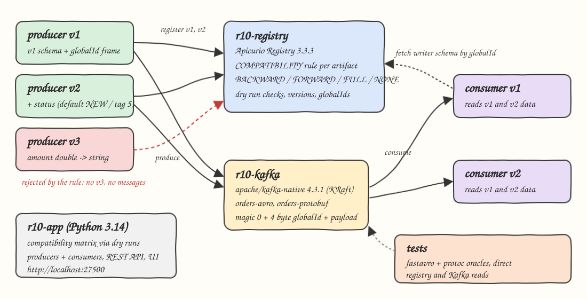
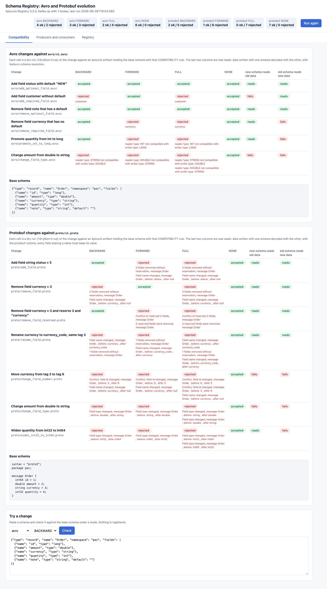
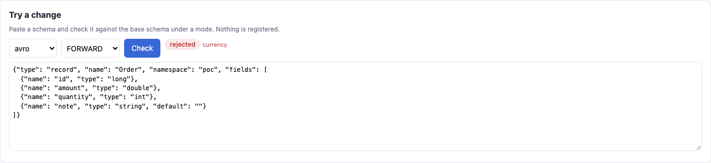
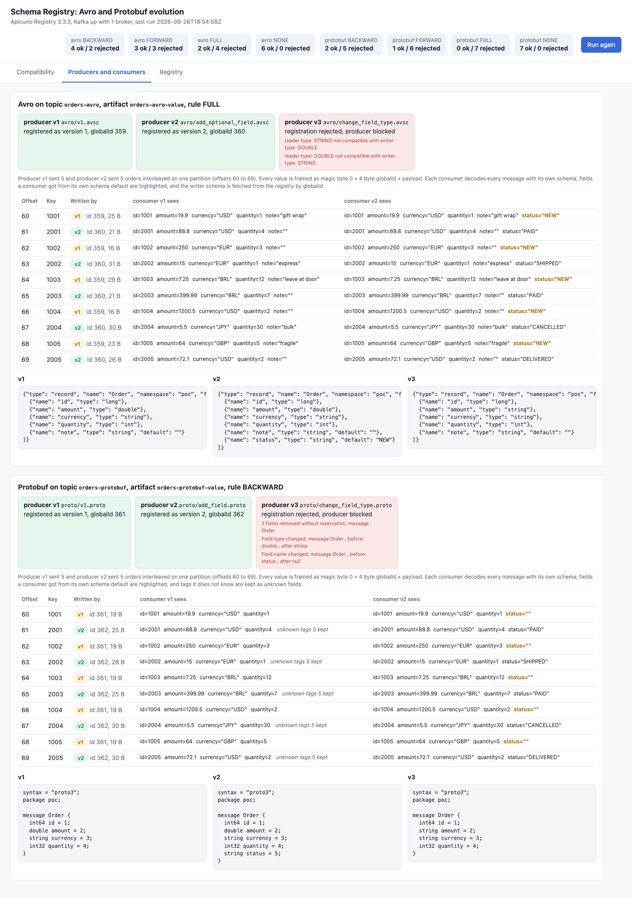
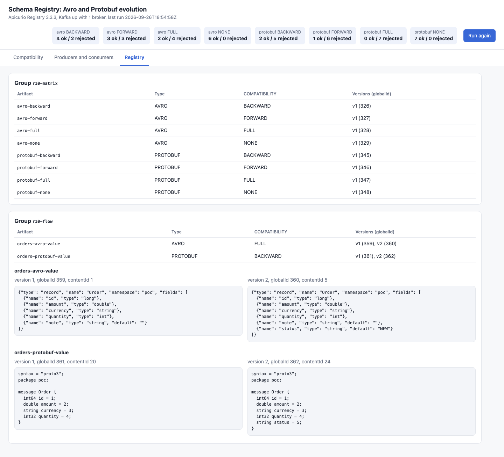

<p align="center"></p>

# schema-registry-avro-protobuf

Apicurio Registry 3.3.3 with Apache Kafka 4.3.1 (native image, KRaft), used to show how Avro and Protobuf schemas evolve under the four compatibility modes BACKWARD, FORWARD, FULL and NONE. A base schema is registered once per mode, 6 Avro and 7 Protobuf changes are checked against it with registry dry runs, and each verdict is shown next to what really happens when data written with one schema is read with the other. Then producers v1 and v2 write interleaved orders to one topic, a breaking producer v3 is blocked by the registry, and consumers v1 and v2 read each other's data. A small web UI and a REST API show all of it.

## How it Works

1. `schemas/changes.json` lists the base schemas (`avro/v1.avsc`, `proto/v1.proto`), the candidate changes and the producer/consumer flow.
2. `app/matrix.py` recreates group `r10-matrix` in Apicurio: one artifact per format and mode (`avro-backward`, `protobuf-full`, ...) holding the base schema with that `COMPATIBILITY` rule.
3. Each change is sent as `POST .../versions?dryRun=true`, so the registry runs the rule and returns accepted or a `RuleViolationException` with causes, and nothing is registered.
4. For each change the app also writes a record with one schema and decodes it with the other (fastavro schema resolution for Avro, the protobuf runtime for Protobuf), in both directions.
5. `app/flow.py` recreates group `r10-flow`, registers v1 and v2 of `orders-avro-value` (rule FULL) and `orders-protobuf-value` (rule BACKWARD), and tries a breaking v3, which is rejected.
6. Producers v1 and v2 send 5 orders each from `data/orders.json`, interleaved, framed as magic byte `0` + 4 byte big endian globalId + payload. Producer v3 has no registered schema, so it sends nothing.
7. Consumers v1 and v2 read every message of the run. Avro consumers fetch the writer schema by globalId (`GET /ids/globalIds/{id}`) and resolve it into their own reader schema. Protobuf consumers parse with their own compiled schema.
8. `app/server.py` (stdlib `http.server`) serves the REST API and `app/index.html`.

## Architecture



## Features

* Four modes side by side: the same change is checked under BACKWARD, FORWARD, FULL and NONE, so the difference between modes is one row.
* Dry run checks: `?dryRun=true` asks the registry for a verdict without creating a version. The tests prove the artifacts still hold one version.
* Verdict next to reality: the "new schema reads old data" and "old schema reads new data" columns are real decodes, so a rejection is never taken on faith.
* Mixed versions on one topic: v1 and v2 messages are interleaved on one partition and both consumers decode all 10.
* Breaking producer blocked: v3 (`amount` double to string) fails registration, so no incompatible bytes ever reach Kafka.
* Schema id in every message: the globalId in the 5 byte header lets a consumer fetch the exact writer schema.
* Try a change: paste any Avro or Protobuf schema in the UI and check it against the base under any mode.
* Rejection causes: every rejected cell shows the causes Apicurio returned, such as `reader type: STRING not compatible with writer type: DOUBLE`.

## Stack

* Apicurio Registry 3.3.3 (`docker.io/apicurio/apicurio-registry:3.3.3`): latest open source registry release, Avro and Protobuf compatibility rules, v3 REST API with dry runs, in-memory storage.
* Apache Kafka 4.3.1 (`docker.io/apache/kafka-native:4.3.1`): latest Kafka, GraalVM native image in KRaft mode, starts in about a second and fits in 512 MB.
* Python 3.14.7 (`docker.io/library/python:3.14.7-slim`): runs the app, the producers, the consumers and the tests.
* confluent-kafka 2.15.1: librdkafka based Kafka client with Python 3.14 wheels, used only as producer, consumer and admin client.
* fastavro 1.12.2: Avro binary encoding and writer to reader schema resolution.
* protobuf 7.36.2 and grpcio-tools 1.84.0: `protoc` compiles each `.proto` text into a descriptor at runtime, so every version is a real message class with no generated files.
* Stdlib `http.server`, `urllib` and plain HTML, CSS and JS: the REST API, the registry client and the UI, no framework.
* podman + podman-compose: runs the three containers.

## Contracts / APIs

| Method | Path | Description |
|---|---|---|
| GET | `/` | UI with the tabs Compatibility, Producers and consumers, Registry |
| GET | `/api/status` | Registry version, Kafka broker and topics, last run, accepted and rejected counts per format and mode |
| POST | `/api/run` | Recreates the registry groups, runs the matrix and the producer and consumer flow |
| GET | `/api/matrix` | Every change with its verdict and causes per mode, and the two real read checks |
| GET | `/api/flow` | Registration attempts, produced messages, offsets and what each consumer decoded per message |
| GET | `/api/registry` | Live listing of the `r10-matrix` and `r10-flow` groups: artifacts, rules, versions, globalIds and contents |
| POST | `/api/check` | Body `{"format": "avro", "mode": "FORWARD", "schema": "..."}`, dry run against the base, returns `{"accepted", "causes"}` |

Apicurio REST API v3 is at `http://localhost:27501/apis/registry/v3`. Kafka is at `localhost:27502`.

```json
{"id": "remove_required_field", "title": "Remove field currency that has no default", "file": "avro/remove_required_field.avsc",
 "results": {"BACKWARD": {"accepted": true, "causes": []}, "FORWARD": {"accepted": false, "causes": ["currency"]},
             "FULL": {"accepted": false, "causes": ["currency"]}, "NONE": {"accepted": true, "causes": []}},
 "new_reads_old": true, "old_reads_new": false}
```

```json
{"offset": 61, "key": "2001", "global_id": 362, "writer": "v2", "bytes": 25,
 "readers": {"consumer v1": {"ok": true, "record": {"id": 2001, "amount": 88.8, "currency": "USD", "quantity": 4}, "unknown_fields": [5]},
             "consumer v2": {"ok": true, "record": {"id": 2001, "amount": 88.8, "currency": "USD", "quantity": 4, "status": "PAID"}, "unknown_fields": []}}}
```

## Key data structures and design decisions

* Mode meaning: BACKWARD means consumers on the new schema can read data written with the old one, FORWARD means consumers on the old schema can read data written with the new one, FULL means both, NONE means no check at all.
* Avro results (registry verdicts, all equal to the real fastavro reads):

| Change | BACKWARD | FORWARD | FULL | NONE |
|---|---|---|---|---|
| Add field with default | accepted | accepted | accepted | accepted |
| Add field without default | rejected | accepted | rejected | accepted |
| Remove field that has a default | accepted | accepted | accepted | accepted |
| Remove field without default | accepted | rejected | rejected | accepted |
| Promote int to long | accepted | rejected | rejected | accepted |
| Change double to string | rejected | rejected | rejected | accepted |

* Protobuf results. Apicurio's Protobuf checker is stricter than the wire format. It compares the two schemas and needs removed fields to be `reserved`. It also runs FORWARD as the same check with old and new swapped, so adding a field under FORWARD shows up as "fields removed without reservation", and FULL rejects every change here:

| Change | BACKWARD | FORWARD | FULL | NONE | new reads old | old reads new |
|---|---|---|---|---|---|---|
| Add field `status = 5` | accepted | rejected | rejected | accepted | reads | reads |
| Remove `currency = 3` | rejected | accepted | rejected | accepted | reads | reads |
| Remove `currency = 3`, reserve 3 and name | accepted | rejected | rejected | accepted | reads | reads |
| Rename `currency` to `currency_code`, same tag | rejected | rejected | rejected | accepted | reads | reads |
| Move `currency` from tag 3 to tag 6 | rejected | rejected | rejected | accepted | fails | fails |
| Change `amount` double to string | rejected | rejected | rejected | accepted | fails | fails |
| Widen `quantity` int32 to int64 | rejected | rejected | rejected | accepted | reads | fails |

* Because of that, the Protobuf flow artifact uses BACKWARD (add a field) and the Avro flow artifact uses FULL (add a field with a default). v3 is rejected in both.
* A protobuf read "keeps data" when every field that exists by name in both schemas decodes to the value that was written. A tag move or a type change breaks that, a pure rename does not.
* Wire framing is the same for both formats: `0x00` + 4 byte globalId + payload. The globalId identifies one exact version, so an Avro consumer can always find the writer schema.
* The app keeps the last run in memory and the registry uses in-memory storage, so a restart gives a clean state. `start-all.sh` triggers a run when there is none.
* Every run deletes and recreates the `r10-matrix` and `r10-flow` groups (group deletion is enabled with `APICURIO_REST_DELETION_*`). Kafka topics are kept, and each run reads only its own offsets.
* Every container, the network and the volume start with `r10-`. Memory limits: Kafka 512 MB + Apicurio 768 MB (heap 384 MB) + app 384 MB = 1.6 GB.

## How to run

Requirements: podman, podman-compose, curl and lsof. Python and every library run inside the containers.

```bash
./scripts/setup.sh
./scripts/start-all.sh
./scripts/test-all.sh
./scripts/ui.sh
./scripts/stop-all.sh
```

`test-all.sh` runs `tests/test_registry.py` inside `r10-app`. The tests trigger a new run, then check it against their own sources of truth instead of trusting the app:

* Avro: the registry verdict for every change and mode equals what fastavro can really decode (BACKWARD = new reads old, FORWARD = old reads new, FULL = both, NONE = always), checked on artifacts the tests create themselves.
* Protobuf: every change the registry accepts keeps the data in the checked direction (protoc + protobuf runtime in the test). The two changes that corrupt data (tag move, type change) are rejected by BACKWARD, FORWARD and FULL. A removal is accepted under BACKWARD only when the tag and the name are reserved.
* NONE accepts every change, FULL never accepts what BACKWARD or FORWARD rejects, and dry runs never create a version.
* The app shows the same verdicts as the registry, and every rejection has a cause.
* Breaking v3 is rejected for both formats. The registry keeps only versions 1 and 2 with the expected rule, and producer v3 sent nothing.
* The tests read the topics straight from Kafka: all 10 orders of the run are there, each framed with the globalId of its producer's version. Decoding them independently gives back `data/orders.json`.
* Avro consumer v1 reads v2 orders without `status`, and consumer v2 reads v1 orders with `status` set to `NEW`. Protobuf consumer v1 keeps `status` as unknown tag 5, and consumer v2 reads v1 orders with an empty `status`.
* `/api/check` rejects a breaking change and accepts a safe one, and the UI has every tab.

I also ran the tests with the Avro flow rule switched to NONE. The v3 test failed, as it should, because the registry then accepts the breaking version.

```
test_app_matrix_shows_the_same_verdicts_as_the_registry ... ok
test_avro_matrix_has_accepted_and_rejected_cells_in_every_checked_mode ... ok
test_avro_messages_decode_independently_to_the_input_orders ... ok
test_avro_v1_consumer_reads_v2_orders_without_status ... ok
test_avro_v2_consumer_reads_v1_orders_with_status_defaulted_to_new ... ok
test_avro_verdict_in_every_mode_equals_what_a_real_avro_reader_can_decode ... ok
test_breaking_v3_is_rejected_and_the_registry_keeps_only_two_versions ... ok
test_check_endpoint_rejects_a_breaking_change_and_accepts_a_safe_one ... ok
test_dry_run_checks_never_register_a_version ... ok
test_full_accepts_only_what_both_backward_and_forward_accept ... ok
test_none_mode_accepts_every_change_even_the_corrupting_ones ... ok
test_protobuf_accepted_change_never_loses_data_in_the_checked_direction ... ok
test_protobuf_backward_removal_is_accepted_only_when_the_tag_and_name_are_reserved ... ok
test_protobuf_changes_that_corrupt_data_are_rejected_by_every_checked_mode ... ok
test_protobuf_messages_decode_independently_to_the_input_orders ... ok
test_protobuf_v1_consumer_reads_v2_orders_and_keeps_status_as_unknown_tag_5 ... ok
test_protobuf_v2_consumer_reads_v1_orders_with_empty_status ... ok
test_topic_holds_every_order_framed_with_the_global_id_of_its_producer_version ... ok
test_ui_page_has_every_tab ... ok

----------------------------------------------------------------------
Ran 19 tests in 0.703s

OK
all tests passed
```

## Printscreens

Compatibility tab. The tiles count accepted and rejected changes per format and mode. The Avro table shows each change under the four modes, with the registry's causes under each rejection and the two real read checks at the end. Every Avro verdict matches the reads. The Protobuf table shows how strict Apicurio is: FULL rejects all 7 changes, a removal passes BACKWARD only with `reserved`, and a rename is rejected even though the wire data survives.



Try a change, on the same tab: the currency field (no default) is removed and checked under FORWARD. The registry rejects it because a v1 consumer would have no value and no default for `currency`.



Producers and consumers tab. For each format: v1 and v2 registered with their globalIds, v3 rejected with the causes, and the 10 interleaved messages with the version that wrote each one. Consumer v1 reads v2 Avro orders without `status`, and consumer v2 fills `status="NEW"` from its default (highlighted). In Protobuf, consumer v1 keeps tag 5 as an unknown field and consumer v2 gets an empty `status` for v1 orders. The three schema versions are shown below each table.



Registry tab: a live read of Apicurio. It lists the 8 matrix artifacts (one per format and mode, each still holding only version 1 after all the dry runs) and the 2 flow artifacts with their rule, versions, globalIds, contentIds and stored schema text.



## Scripts

All scripts live in `scripts/` and run from any directory of the repository.

| Script | What it does |
|---|---|
| `./scripts/setup.sh` | Pulls the Kafka, Apicurio and Python images and builds the app image |
| `./scripts/start-all.sh` | Starts Kafka, Apicurio and the app, waits for each, runs the matrix and the flow when there is no run yet, prints every link |
| `./scripts/status.sh` | Shows every service port and container as UP or DOWN |
| `./scripts/test-all.sh` | Runs the tests inside the app container |
| `./scripts/ui.sh` | Opens the UI in the browser |
| `./scripts/stop-all.sh` | Stops every container and waits until the ports are free |

Ports are declared in `scripts/ports.env`: UI 27500 (`http://localhost:27500`), Apicurio Registry 27501 (`http://localhost:27501/apis/registry/v3`), Kafka 27502 (`localhost:27502`).

```bash
./scripts/setup.sh
./scripts/start-all.sh
./scripts/status.sh
./scripts/ui.sh
./scripts/stop-all.sh
```
