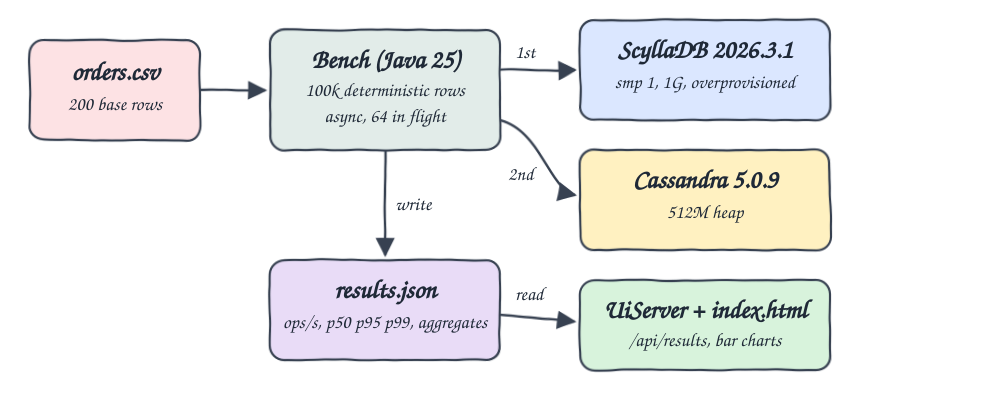
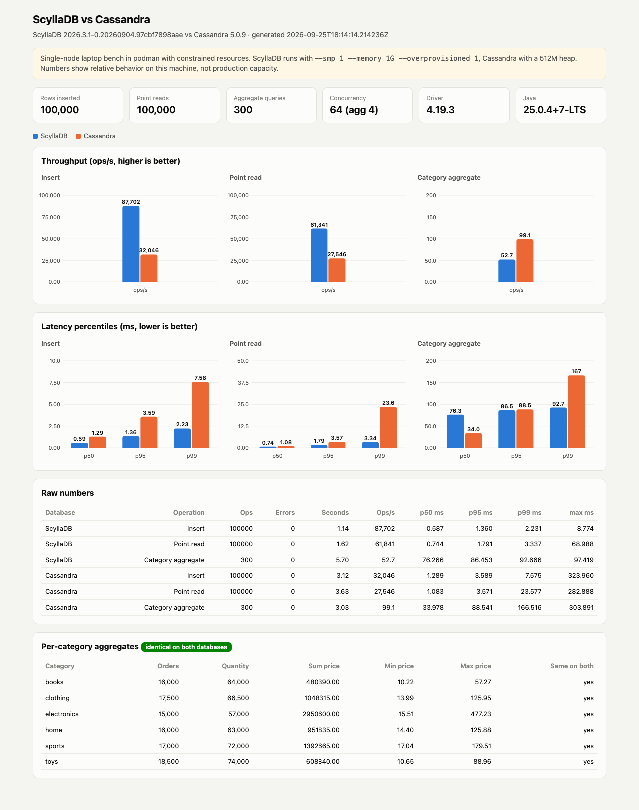

# scylladb-vs-cassandra-bench

> **This is a single-node laptop bench with constrained resources.** Both databases run as one node each inside podman on a shared laptop VM. ScyllaDB gets `--smp 1 --memory 1G --overprovisioned 1`, Cassandra gets `MAX_HEAP_SIZE=512M HEAP_NEWSIZE=128M`. The client, both databases and other workloads share the same CPUs. Numbers show relative behavior on this machine only. They are not production capacity numbers and they move noticeably between runs.

Runs the same workload against ScyllaDB and Apache Cassandra with one Java 25 client built on the Apache Cassandra java driver: insert 100k deterministic order rows, run 100k point reads by key, run 300 per-category aggregation reads. The client records throughput and p50/p95/p99 latency for each operation and database into `results.json`, checks that both databases return identical aggregates, and a small UI compares them with bar charts.

## How it Works

1. `Bench` expands `data/orders.csv` (200 rows) into 100,000 rows. Row `i` copies base row `i % 200`, gets `order_id = i + 1` and `quantity = base + (i / 200) % 5`. The result is written to `data/bench-orders.csv`.
2. For each database, one after the other (ScyllaDB first, then Cassandra), it drops and recreates keyspace `bench` and table `bench.orders`.
3. 10,000 warmup inserts run first and are not measured. Then all 100,000 rows are inserted with prepared statements, async, 64 requests in flight.
4. 100,000 point reads pick random keys with a fixed seed (42). 10,000 warmup reads run first. A read only counts as a success when the row comes back with the expected quantity.
5. 300 aggregation reads (50 rounds over 6 categories, 4 in flight) run `count(*), sum(quantity), sum(price), min(price), max(price)` on one category partition.
6. Latencies are kept per request in nanoseconds, sorted, and read at p50/p95/p99. Throughput is ops divided by wall time.
7. The final aggregates of both databases are compared. `results.json` is written and the run fails when they differ.
8. `UiServer` serves `index.html` and `results.json` as `/api/results`.

## Architecture



## Features

- **Same workload, same client**: one driver version, one statement set and one concurrency setting for both databases, so the database is the only variable.
- **Fixed-concurrency async load**: a semaphore keeps exactly 64 requests in flight, which gives a closed-loop load that does not overrun either node.
- **Deterministic data**: the 100k rows and the read keys are reproducible, so reruns and both databases see the same work.
- **Warmup phase**: inserts and reads warm up before measuring, so JIT and cache warmup do not end up in Cassandra's numbers only.
- **Per-operation percentiles**: p50/p95/p99 and max come from every recorded request, not from a sample.
- **Aggregate equality check**: the bench fails when ScyllaDB and Cassandra disagree on any per-category total.
- **Independent verification**: `test-all.sh` recomputes the totals with awk from the CSV and compares them with `results.json` and with a live `GROUP BY` on each database.
- **Comparison UI**: bar charts for throughput and latency per operation, raw numbers and the aggregates table.

## Stack

- **ScyllaDB 2026.3.1** (`docker.io/scylladb/scylla:2026.3.1`): latest stable ScyllaDB image.
- **Apache Cassandra 5.0.9** (`docker.io/library/cassandra:5.0.9`): latest 5.0.x release.
- **Java 25** (Amazon Corretto 25.0.4): the client and the UI server.
- **Apache Cassandra java driver 4.19.3** (`org.apache.cassandra:java-driver-core`): latest release, works against both databases over CQL.
- **JDK HttpServer**: serves the UI and JSON without an extra web framework.
- **Maven 3.9**: build and dependency copy.
- **podman / podman-compose**: runs both databases.

## Contracts / APIs

| Method | Path | Returns |
|---|---|---|
| GET | `/` | the comparison UI |
| GET | `/api/results` | the content of `results.json`, 404 when the bench has not run |

`results.json` shape:

```json
{
  "generated_at": "2026-09-25T18:14:14Z",
  "setup": { "rows": 100000, "reads": 100000, "warmup_ops": 10000, "aggregate_ops": 300, "categories": 6,
             "concurrency": 64, "aggregate_concurrency": 4, "driver": "org.apache.cassandra:java-driver-core:4.19.3",
             "java": "25.0.4+7-LTS", "note": "single-node laptop bench in podman with constrained resources" },
  "aggregates_match": true,
  "databases": [
    { "name": "scylladb", "version": "2026.3.1-...", "resources": "--smp 1 --memory 1G --overprovisioned 1",
      "operations": [ { "operation": "insert", "ops": 100000, "errors": 0, "seconds": 1.14, "throughput": 87701.7,
                        "p50_ms": 0.587, "p95_ms": 1.360, "p99_ms": 2.231, "max_ms": 8.774 } ],
      "aggregates": [ { "category": "books", "orders": 16000, "quantity": 64000, "price_sum": 480390.00,
                        "min_price": 10.22, "max_price": 57.27 } ] }
  ]
}
```

## Key Data Structures and Design Decisions

- **Table** `bench.orders (category text, order_id bigint, customer, product, quantity int, price decimal, ts, PRIMARY KEY ((category), order_id))`. Partitioning by category makes the aggregation a single-partition query on both databases (CQL only aggregates or groups by partition key without a full scan). A point read by key is `WHERE category = ? AND order_id = ?`. The downside: only 6 partitions, around 16k rows each.
- **`decimal` price**: sums are exact, so equality between the two databases is a strict comparison, not a float tolerance.
- **Keyspace uses `NetworkTopologyStrategy {'datacenter1': 1}`**: current ScyllaDB enables tablets by default and rejects `SimpleStrategy`. The same statement is used on Cassandra.
- **Databases run one after the other**: both containers are up, but only one is under load at a time.
- **`Runner`**: a semaphore with N permits plus a `CountDownLatch`. Each request records `System.nanoTime()` before `executeAsync` and in `whenComplete`.
- **Percentiles**: nearest-rank on the sorted latency array.

## Results of the last run

From `results.json` (100k rows, 64 in flight, laptop, other workloads running at the same time):

| Database | Operation | Ops/s | p50 ms | p95 ms | p99 ms |
|---|---|---|---|---|---|
| ScyllaDB | insert | 87,702 | 0.587 | 1.360 | 2.231 |
| ScyllaDB | point read | 61,841 | 0.744 | 1.791 | 3.337 |
| ScyllaDB | category aggregate | 52.7 | 76.266 | 86.453 | 92.666 |
| Cassandra | insert | 32,046 | 1.289 | 3.589 | 7.575 |
| Cassandra | point read | 27,546 | 1.083 | 3.571 | 23.577 |
| Cassandra | category aggregate | 99.1 | 33.978 | 88.541 | 166.516 |

In this run ScyllaDB is about 2-3x faster on inserts and point reads and has much tighter tail latency. On the 16k-row single-partition aggregation, Cassandra has the better median, but ScyllaDB has the tighter p99. ScyllaDB has only one shard (`--smp 1`), so each aggregation scans on one core. Across runs, absolute numbers changed by up to 2x.

Aggregates are identical on both databases and match the awk totals:

```
books 16000 64000 480390.00 10.22 57.27
clothing 17500 66500 1048315.00 13.99 125.95
electronics 15000 57000 2950600.00 15.51 477.23
home 16000 63000 951835.00 14.40 125.88
sports 17000 72000 1392665.00 17.04 179.51
toys 18500 74000 608840.00 10.65 88.96
```

## How to run

```bash
./scripts/setup.sh
./scripts/start-all.sh
./scripts/test-all.sh
./scripts/ui.sh
./scripts/stop-all.sh
```

`start-all.sh` runs the bench only when `results.json` or `data/bench-orders.csv` is missing. Use `BENCH_FORCE=1 ./scripts/start-all.sh` to run it again. You can change the workload with the environment variables `BENCH_ROWS`, `BENCH_READS`, `BENCH_AGG_ROUNDS`, `BENCH_CONCURRENCY` and `BENCH_AGG_CONCURRENCY`.

`test-all.sh` checks:
- the per-category totals from awk over `data/bench-orders.csv` match both databases in `results.json`
- a live `GROUP BY category` in cqlsh on each database matches the same totals
- no operation has errors, all 100k rows were inserted, and percentiles are in order
- the UI and `/api/results` respond

## Printscreens



The page starts with the constrained-resources warning and the run setup (rows, reads, aggregate queries, concurrency, driver and Java versions). Next come three throughput charts (insert, point read, category aggregate), one per operation. Each operation has its own chart because their scales differ by three orders of magnitude. Below them are the p50/p95/p99 latency charts per operation, blue for ScyllaDB and orange for Cassandra. Hover a bar to see its exact value. The raw numbers table lists every figure, including max latency. The last table shows the per-category aggregates with a badge confirming that they are identical on both databases.

## Scripts

All scripts live in `scripts/` and run from any directory of the repository.

| Script | What it does |
|---|---|
| `./scripts/setup.sh` | Pulls the images and builds the Java client |
| `./scripts/start-all.sh` | Starts both databases, runs the bench when needed, starts the UI and prints the full link of each service |
| `./scripts/status.sh` | Shows every service port as UP or DOWN |
| `./scripts/test-all.sh` | Verifies aggregates against awk and live queries, sanity checks results.json, checks the UI |
| `./scripts/ui.sh` | Opens the UI in the browser |
| `./scripts/stop-all.sh` | Stops every service |
| `./scripts/sql-console.sh` | Opens cqlsh on `scylla` (default) or `cassandra` |

Ports are declared in `scripts/ports.env`: ScyllaDB `cql://localhost:24742`, Cassandra `cql://localhost:24743`, UI `http://localhost:24780`.

```bash
./scripts/setup.sh
./scripts/start-all.sh
./scripts/status.sh
./scripts/ui.sh
./scripts/stop-all.sh
```
