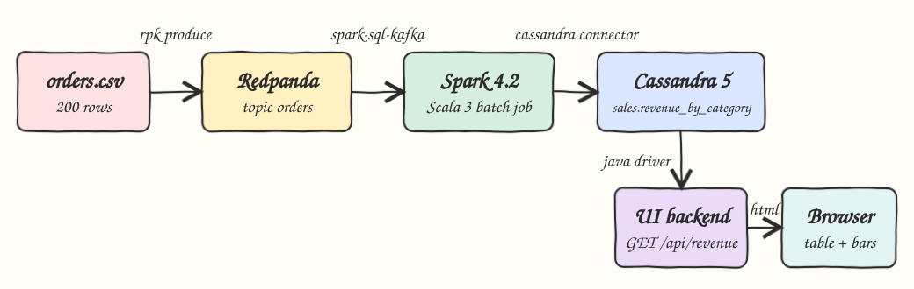
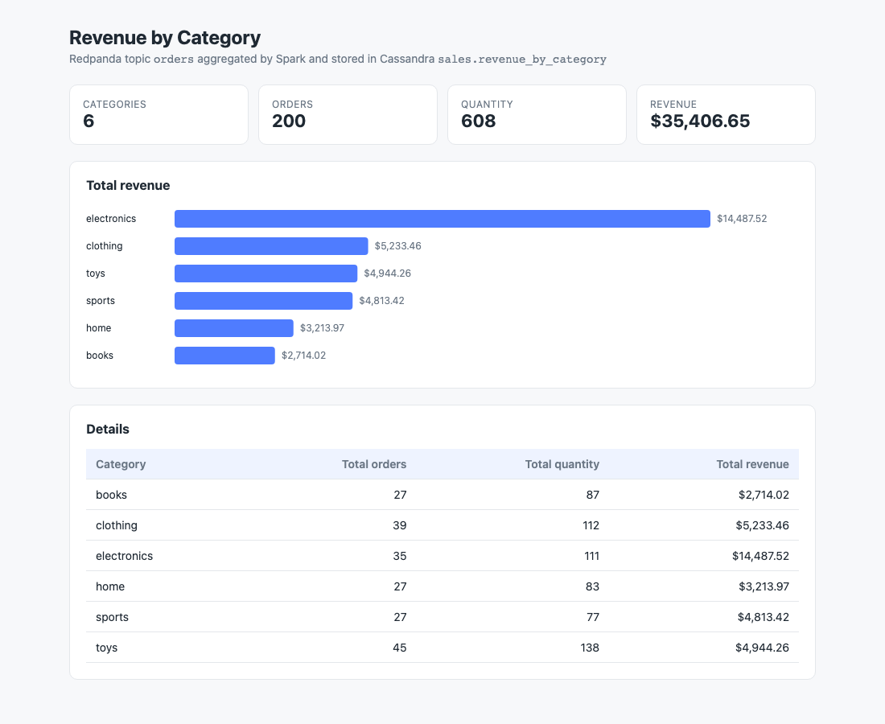

# spark-redpanda-cassandra

A batch pipeline: `data/orders.csv` is produced into the Redpanda topic `orders`, an Apache Spark job written in Scala 3 reads the topic, computes revenue per category and writes it to Cassandra. A small UI backend reads Cassandra and shows the result in a single `index.html`.

## How it Works

1. `scripts/start-all.sh` starts Cassandra and Redpanda with `podman-compose`, creates the `sales` keyspace and table, and starts the UI backend.
2. `scripts/pipeline.sh` recreates the `orders` topic and produces the 200 CSV rows with `rpk` inside the Redpanda container, one message per row.
3. The same script runs the Spark job (`job/`) in local mode. It reads the topic from the earliest to the latest offset with `spark-sql-kafka`, splits each value, and groups by category.
4. Per category it computes `total_orders` (count), `total_quantity` (sum of quantity) and `total_revenue` (sum of quantity * price, rounded to 2 decimals).
5. The result is written to `sales.revenue_by_category` with the `spark-cassandra-connector`. The category is the primary key, so every run is an upsert.
6. The UI backend (`ui/`) serves `index.html` at `/` and `GET /api/revenue`, which reads the table with the Cassandra Java driver.

## Architecture



## Features

* Kafka API ingestion through Redpanda, so the job reads a real topic and not the file.
* Spark batch read of the whole topic, so rerunning the job always gives the same totals.
* Idempotent pipeline: the topic is recreated before producing and Cassandra rows are upserts.
* One self-contained `index.html` with KPI cards, an SVG bar chart and a table, no frameworks.
* End to end test that compares the API output with an independent `awk` aggregation of the CSV.

## Stack

* Scala 3.7.4: latest Scala 3 line that still runs on the Scala 2.13 standard library Spark needs.
* Apache Spark 4.2.0 (`spark-sql`, `spark-sql-kafka-0-10`): latest Spark, consumed via `CrossVersion.for3Use2_13`.
* spark-cassandra-connector 3.5.1 + joda-time 2.14.4: latest connector, joda-time is required on Spark 4.
* Apache Cassandra Java driver 4.19.3: used by the UI backend, the only UI dependency.
* JDK `HttpServer`: serves the UI and the API without a web framework.
* Java 25 (Amazon Corretto 25.0.4): supported by Spark 4.2.
* sbt 2.0.9: build tool with two sub projects, `job` and `ui`.
* Redpanda v26.2.2: Kafka compatible broker, one core and 512M.
* Cassandra 5.0.9: result store with 512M heap.
* podman and podman-compose: run the infrastructure.

## Contracts

`GET /api/revenue` returns every row of `sales.revenue_by_category` sorted by category.

```json
[
  {"category":"books","total_orders":27,"total_quantity":87,"total_revenue":2714.02},
  {"category":"clothing","total_orders":39,"total_quantity":112,"total_revenue":5233.46}
]
```

`GET /` returns the UI page.

Cassandra schema, from `cassandra/schema.cql`:

```sql
CREATE KEYSPACE IF NOT EXISTS sales WITH replication = {'class': 'SimpleStrategy', 'replication_factor': 1};
CREATE TABLE IF NOT EXISTS sales.revenue_by_category (category text PRIMARY KEY, total_orders bigint, total_quantity bigint, total_revenue double);
```

Kafka message: the raw CSV line without header, `order_id,customer,product,category,quantity,price,ts`.

## Design Decisions

* Batch read instead of Structured Streaming: the input is finite, and `startingOffsets=earliest` plus `endingOffsets=latest` is the simplest way to read it all.
* Scala 3.8 and newer ship their own standard library, which breaks `scala-reflect` inside Spark, so the build stays on Scala 3.7.4.
* The connector has no Spark 4 release yet; the DataFrame write path works on Spark 4.2.0 once joda-time is on the classpath.
* Spark runs on the host through `sbt job/run` with forked JVM `--add-opens` flags in `build.sbt`.
* Every container, volume and network is prefixed with `p6-` and every host port is in the 16000 range.

| Service | Host port |
|---|---|
| Cassandra | 16042 |
| Redpanda Kafka | 16092 |
| UI | 16080 |

## How to Run

Requirements: podman, podman-compose, sbt and a JDK 25 (setup installs Corretto 25.0.4 with sdkman when missing), curl and python3 for the test.

```bash
./scripts/setup.sh
./scripts/start-all.sh
./scripts/pipeline.sh
./scripts/ui.sh
./scripts/test-all.sh
./scripts/stop-all.sh
```

Test output:

```
expected from csv
books 27 87 2714.02
clothing 39 112 5233.46
electronics 35 111 14487.52
home 27 83 3213.97
sports 27 77 4813.42
toys 45 138 4944.26
actual from api
books 27 87 2714.02
clothing 39 112 5233.46
electronics 35 111 14487.52
home 27 83 3213.97
sports 27 77 4813.42
toys 45 138 4944.26
tests passed
```

## Printscreens



The UI after the pipeline ran. The cards show 6 categories, 200 orders, 608 items and the total revenue. The bar chart ranks categories by revenue, electronics first. The table lists the exact values stored in Cassandra, the same numbers returned by `GET /api/revenue`.

## Scripts

All scripts live in `scripts/` and run from any directory of the repository.

| Script | What it does |
|---|---|
| `./scripts/setup.sh` | Pulls images, installs the JDK when missing and compiles the build |
| `./scripts/start-all.sh` | Starts Cassandra, Redpanda and the UI and prints the full link of each one |
| `./scripts/pipeline.sh` | Produces the CSV into Redpanda and runs the Spark job |
| `./scripts/status.sh` | Shows every service port as UP or DOWN |
| `./scripts/test-all.sh` | Runs the pipeline and checks the API against the CSV |
| `./scripts/ui.sh` | Opens the UI in the browser |
| `./scripts/stop-all.sh` | Stops every service |
| `./scripts/sql-console.sh` | Opens cqlsh on the `sales` keyspace |

Ports are declared in `scripts/ports.env`.

```bash
./scripts/setup.sh
./scripts/start-all.sh
./scripts/status.sh
./scripts/ui.sh
./scripts/stop-all.sh
```
