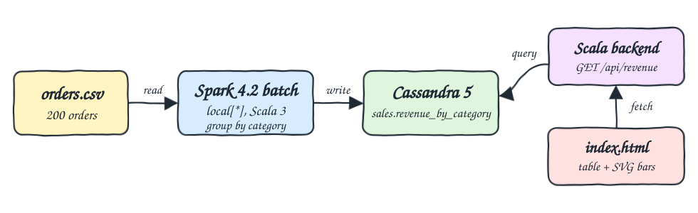
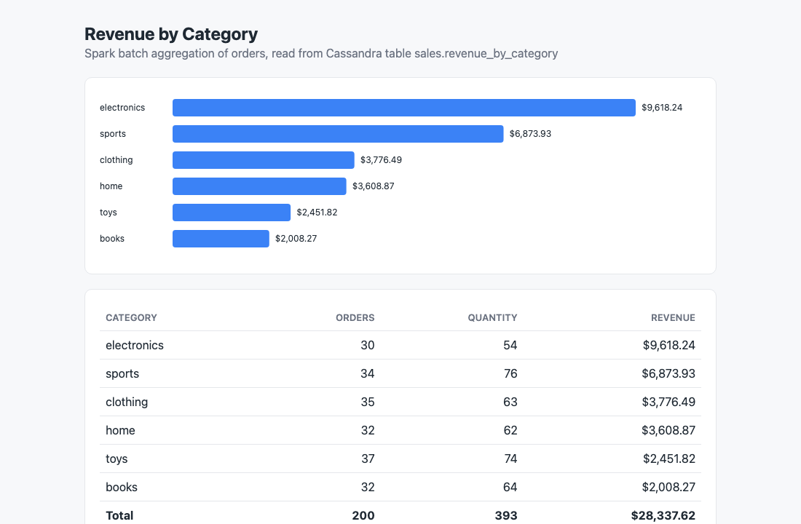

# spark-scala-cassandra

An Apache Spark batch pipeline written in Scala 3. It reads orders from a CSV file, aggregates revenue per category, stores the result in Cassandra, and shows it in a small web UI served by a Scala backend that reads from Cassandra.

## How it Works

1. `data/orders.csv` holds 200 orders across 6 categories: electronics, books, clothing, home, sports, toys.
2. `Pipeline` starts Spark in `local[*]` mode inside a container and reads the CSV with an explicit schema.
3. It groups by `category` and computes `total_orders` (count), `total_quantity` (sum of quantity) and `total_revenue` (sum of quantity * price, rounded to 2 decimals).
4. It creates the keyspace `sales` and table `revenue_by_category` if missing, then writes the rows with the spark-cassandra-connector.
5. `Server` is a JDK `HttpServer` that serves `index.html` at `/` and `GET /api/revenue`, which queries Cassandra with the Java driver.
6. `index.html` fetches the API and renders a table plus a plain SVG bar chart.

## Architecture



## Features

* Spark batch aggregation: the DataFrame API does the group by, so the same code scales from one CSV to a cluster.
* Cassandra sink: the result table is keyed by category, so rerunning the pipeline overwrites rows instead of duplicating them.
* Schema bootstrap: the pipeline creates the keyspace and table, so a fresh Cassandra needs no manual CQL.
* Tiny UI backend: the JDK `HttpServer` plus the Cassandra driver, no web framework.
* Self-contained UI: one `index.html` with plain JS and SVG, no frontend build.
* End to end check: `scripts/test-all.sh` recomputes the totals from the CSV with `awk` and compares them with the API.

## Stack

* Scala 3.7.4: latest Scala 3 line whose standard library still works with the `scala-reflect` runtime Spark needs.
* Apache Spark 4.2.0 (`_2.13`, consumed with `CrossVersion.for3Use2_13`): batch engine running in `local[*]`.
* spark-cassandra-connector 3.5.1: latest published connector, writes the DataFrame into Cassandra.
* joda-time 2.14.4: required by the connector and no longer shipped by Spark 4.
* Cassandra 5.0.9: result store, heap limited to 512M.
* sbt 2.0.9: build tool, also writes the runtime classpath used by the container.
* Java 25 (Eclipse Temurin 25.0.4): runtime inside the `sbtscala/scala-sbt` image.
* podman and podman-compose: run Cassandra, the pipeline and the UI.

## Contracts and APIs

`GET /` returns the UI page.

`GET /api/revenue` returns the rows of `sales.revenue_by_category`, ordered by revenue:

```json
[
  {"category":"electronics","total_orders":30,"total_quantity":54,"total_revenue":9618.24},
  {"category":"sports","total_orders":34,"total_quantity":76,"total_revenue":6873.93}
]
```

Cassandra table:

```sql
CREATE TABLE sales.revenue_by_category (
  category text PRIMARY KEY,
  total_orders bigint,
  total_quantity bigint,
  total_revenue double
);
```

## Design Decisions

* Spark 4 runs on Scala 2.13 and uses `scala-reflect` to find its `SparkSession` implementation. Scala 3.8 and later ship a new standard library that breaks `scala-reflect` (`class Array does not have a member apply`), so the build stays on Scala 3.7.4.
* No official spark-cassandra-connector targets Spark 4 yet. Version 3.5.1 works with Spark 4.2 for DataFrame writes once `joda-time` is on the classpath.
* The image runs `java -cp` with the classpath written by the `writeClasspath` sbt task, so no assembly plugin or merge strategy is needed.
* Java 25 needs `--add-opens` flags for Spark, set through `JDK_JAVA_OPTIONS` in the `Containerfile`.
* Containers, network and volume use the `p1-` prefix and host ports 11042 (Cassandra) and 11080 (UI).

## How to run

```bash
./scripts/setup.sh
./scripts/start-all.sh
./scripts/test-all.sh
./scripts/stop-all.sh
```

`start.sh`, `stop.sh` and `test.sh` in the project root call the same scripts.

## Printscreens



The UI after the pipeline ran: the bar chart ranks categories by revenue, and the table shows orders, quantity and revenue per category with the totals (200 orders, 393 items, $28,337.62) in the last row. All values come from Cassandra through `/api/revenue`.

## Scripts

All scripts live in `scripts/` and run from any directory of the repository.

| Script | What it does |
|---|---|
| `./scripts/setup.sh` | Pulls Cassandra and builds the Spark image |
| `./scripts/start-all.sh` | Starts Cassandra, runs the pipeline, starts the UI and prints the full link of each one |
| `./scripts/status.sh` | Shows every service port as UP or DOWN |
| `./scripts/test-all.sh` | Compares `/api/revenue` with totals computed from the CSV |
| `./scripts/ui.sh` | Opens the UI in the browser |
| `./scripts/stop-all.sh` | Stops every service |
| `./scripts/sql-console.sh` | Opens cqlsh on the `sales` keyspace |

Ports are declared in `scripts/ports.env`.

```bash
./scripts/setup.sh
./scripts/start-all.sh
./scripts/status.sh
./scripts/ui.sh
./scripts/stop-all.sh
```
