<p align="center">
  
</p>

<h1 align="center">SQL Playground</h1>

<p align="center">A macOS workbench for PostgreSQL 18: write SQL, see the plan, the time and the hints, and race real contention bugs.</p>

SQL Playground is like CodeGrind, but for SQL. It runs PostgreSQL 18.6 in podman and loads a 5M row store dataset. It then gives you:

- a Monaco editor with syntax highlighting, autocomplete, line numbers and `⌘ + Enter` to run
- the query plan of every statement
- the run time, from milliseconds up to minutes and hours
- hints that point at the missing index or the anti pattern

Eight classic contention problems ship with it, including a vending machine, a ticket system, bank transfers and a job queue. Each one comes with:

- a background explanation
- a race you can run with 20 concurrent sessions, in naive and safe mode
- one exercise for each of 9 join types

## How it works

1. `scripts/start-all.sh` starts PostgreSQL 18.6 with podman-compose. The data folder is bind mounted from `tmp/pgdata`.
2. The Node API starts next. On the very first start it seeds the `shop` dataset and the 8 problem schemas, which takes about 45 seconds. It writes a version marker when it is done.
3. Every later start finds the marker in `tmp/pgdata` and is ready in about a second. Stopping never loses data.
4. The editor sends the SQL, or only the selected text, to `POST /api/query`.
5. A single `SELECT` or `WITH` runs through a server side cursor. Every row is produced and timed, but only the first 1000 are shipped to the UI.
6. The plan comes from `EXPLAIN (VERBOSE, SETTINGS, FORMAT JSON)`.
7. With Analyze on, the plan comes from `EXPLAIN ANALYZE`, run inside a transaction that is rolled back so no data changes twice.
8. The hint engine walks the plan and the SQL text and returns ranked hints, each with an optional fix. `Apply and re-run` executes the fix and runs your query again, so you see the improvement right away.
9. A race resets the problem schema and opens 20 separate connections. They run the naive or the safe transaction at the same time, then an invariant query decides whether the business rule held.

## Architecture

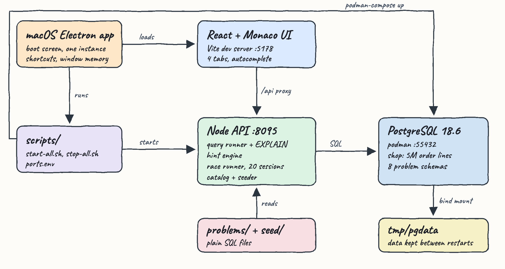

## Features

- **Monaco SQL editor**: PostgreSQL syntax highlighting, line numbers, `⌘ + Enter` to run, and run selection only. It is the editor of VS Code, so it feels familiar.
- **Autocomplete**: schemas, tables, columns and aliases (`oi.` lists `order_items` columns), keywords and functions, all read live from the catalog.
- **Timing that scales**: `0.042 ms`, `113.6 ms`, `1.42 s`, `4 m 12 s`, `1 h 02 m`. A live counter runs while the query is working, and `⌘ + .` cancels it.
- **Query plan tree**: every node shows its own cost or measured time, estimated versus actual rows, loops, buffers, filters and sort method. Row estimates that are off by 10x are shown in red.
- **Hints**: sequential scans on big filtered tables, functions that block index use, top N computed by sorting the whole table, disk sorts, hash batches, bad estimates, `NOT IN`, deep `OFFSET`, leading wildcards and exact counts. Each hint suggests the exact `CREATE INDEX` or setting.
- **5M row dataset**: 7 tables (`categories`, `customers`, `products`, `orders`, `order_items`, `payments`, `reviews`). Some indexes are left out on purpose so the hints have something to teach.
- **8 contention problems**: a naive and a safe version of the same transaction, raced by 20 sessions, with the invariant check shown as a table.
- **All join types in every problem**: inner, left, right, full outer, cross, self, semi, anti and lateral. Each one answers a real question on that schema and has a Venn style icon.
- **Dictionary tab**: types, nullability, defaults, PK, FK, UQ and IDX badges, descriptions, index definitions and sizes, and the tables each table references and is referenced by.
- **ER tab**: a layered diagram in which referenced tables sit on the left and arrows run from the foreign key column to the referenced column. Hovering a table highlights its relations and clicking opens it in the Dictionary.
- **Data that survives restarts**: the database lives in `tmp/pgdata`, so stop and start never re-create the 5M rows.
- **macOS app**: shows a boot screen with every service, allows only one instance and one installed version, remembers the window position, maximizes on a title bar double click, and has `⌘ K` search, the `⌘ /` shortcut guide, zoom, `⌘ P` capture and `⌘ ⇧ ↵` full screen.

## Stack

- **PostgreSQL 18.6** (podman): the latest PostgreSQL release, run exactly as in production.
- **Node 24 + `pg`**: the only backend dependency. The HTTP layer is plain `node:http`.
- **React 19 + Vite 8**: the UI and the dev server that proxies `/api`.
- **Monaco Editor 0.57**: highlighting, autocomplete and line numbers, bundled locally so it works offline.
- **Electron 44**: the macOS app that starts and stops the scripts.
- **podman-compose**: one Postgres service with a bind mounted data folder.

## API

| Method | Path | Body | Returns |
|---|---|---|---|
| GET | `/api/status` | | `phase` (`connecting`, `seeding`, `ready`, `error`), `step`, `total`, `label` |
| GET | `/api/catalog` | | schemas, tables, columns, indexes, constraints, foreign keys, row estimates, sizes |
| GET | `/api/problems` | | the 8 problems with background, race SQL and the 9 join exercises |
| POST | `/api/query` | `{ "sql": "...", "analyze": false }` | `elapsedMs`, `results[]` (`fields`, `rows`, `rowCount`, `truncated`), `plan`, `hints[]`, `notices[]` or `error` with `position` |
| POST | `/api/cancel` | `{}` | how many running queries were cancelled |
| POST | `/api/problems/:id/reset` | `{}` | recreates the problem schema |
| POST | `/api/problems/:id/race` | `{ "mode": "naive" }` or `{ "mode": "safe" }` | `ok`, `elapsedMs`, `errors[]`, `check` (the invariant rows) |

## The 8 problems

| # | Problem | Anomaly | Safe version |
|---|---|---|---|
| 1 | Vending machine: the last can | lost update, 60 cans sold from 10 | `UPDATE ... SET stock = stock - 1 WHERE stock > 0` |
| 2 | Ticket booking: same seat sold twice | 20 bookings on 1 seat | `FOR UPDATE SKIP LOCKED` inside `UPDATE ... RETURNING` plus a unique index |
| 3 | Bank transfer: money appears and disappears | total drifts and deadlocks (`40P01`) | lock both rows `ORDER BY id FOR UPDATE`, relative updates |
| 4 | Job queue: the same email sent twice | 3 jobs run 60 times, 27 never run | `FOR UPDATE SKIP LOCKED` claim |
| 5 | Hot counter: views of a viral post | the counter shows 5 of 100 views | atomic `views = views + 1` |
| 6 | Payments: the double charge | up to 7 charges per idempotency key | unique index and `ON CONFLICT DO NOTHING` |
| 7 | Hotel: overlapping reservations | overlapping stays in one room | `EXCLUDE USING gist (room_id WITH =, stay WITH &&)` |
| 8 | Rate limiter: 10 requests per minute | 24 requests accepted | serialize per key with `FOR UPDATE` on the key row |

The numbers above are from real runs. The races are concurrent, so the naive counts change a little on every run, but the naive invariant always breaks and the safe one always holds. The test suite checks both.

## Design decisions

- **Server side cursor for reads.** `DECLARE ... CURSOR`, `FETCH 1000` and then `MOVE FORWARD ALL`. The whole query executes and is timed, but a 5M row result never crosses the wire. `cursor_tuple_fraction = 1` keeps the plan identical to a normal execution.
- **Analyze is opt in.** `EXPLAIN ANALYZE` executes the statement a second time, so it runs inside `BEGIN ... ROLLBACK`, and the time shown in the toolbar is always the real run.
- **Hints are rules over the JSON plan.** Relation sizes, columns and the leading columns of existing indexes are read from `pg_catalog` for the relations in the plan. That is how the engine never suggests an index that already exists, and why it says an index will not help when the filter keeps more than 20% of the table.
- **Problems are plain SQL files.** Each `problems/NN-name/` folder holds `problem.json` (texts), `setup.sql`, `prepare.sql`, `naive.sql`, `safe.sql`, an optional `safe-prepare.sql`, `check.sql` and `joins/<type>.sql`. Adding a problem needs no code change.
- **The race uses `pg_sleep` inside `DO` blocks** to widen the window between read and write, the same way a network call to a payment gateway does. The invariant query returns a column named `ok`, and the runner reads nothing else.
- **One source of truth for ports.** The backend, Vite, Electron and the scripts all read `scripts/ports.env`.
- **The ER layout is layered.** A table sits one column right of every table it references, and self references loop on the side. Tests check that no two boxes overlap.

## Run

Requirements: macOS, podman with a running machine, podman-compose and Node 24.

```bash
./scripts/setup.sh
./scripts/start-all.sh
./scripts/ui.sh
```

The desktop app:

```bash
./install.sh
open -a "SQL Playground"
./uninstall.sh
```

`install.sh` removes any installed copy first, packages the app, installs it to `/Applications` and checks that exactly one copy exists. The app runs `scripts/start-all.sh` on launch and `scripts/stop-all.sh` on quit.

Tests:

```bash
./scripts/test-all.sh
```

The suite has 31 tests:

- **Unit tests**: time formatting, the hint rules, statement detection and the ER layout.
- **Integration tests** against the running stack:
  - the 5M rows exist
  - every shop column has a description
  - all 72 join solutions return rows
  - every naive race breaks its invariant and every safe race holds it
  - analyze mode never applies a change twice
  - big results are capped
  - error positions are right
  - a running query can be cancelled

```
ℹ tests 31
ℹ pass 31
ℹ fail 0
tests passed
```

## Screenshots

### Playground: results

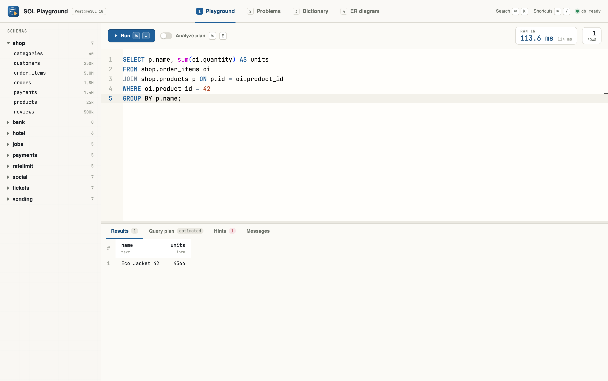

The query joins 5M `order_items` with `products`. The toolbar shows the run time (`113.6 ms`) and the row count. The schema tree on the left shows the row estimate of every table: click a table to insert its name, double click to preview 100 rows.

### Playground: hints

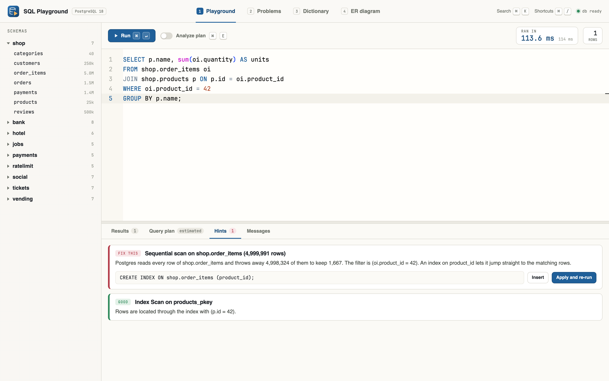

`product_id` has no index on purpose. The hint engine reports that Postgres read 5M rows to keep 1,667 and suggests `CREATE INDEX ON shop.order_items (product_id);`. `Apply and re-run` creates the index and runs the query again.

### Playground: query plan with Analyze

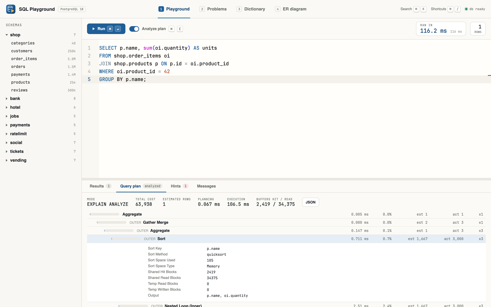

With Analyze on, every node shows its own time, its share of the run, estimated versus actual rows and loops. Click a node to see the sort method, buffers, filters and output columns.

### Playground: autocomplete

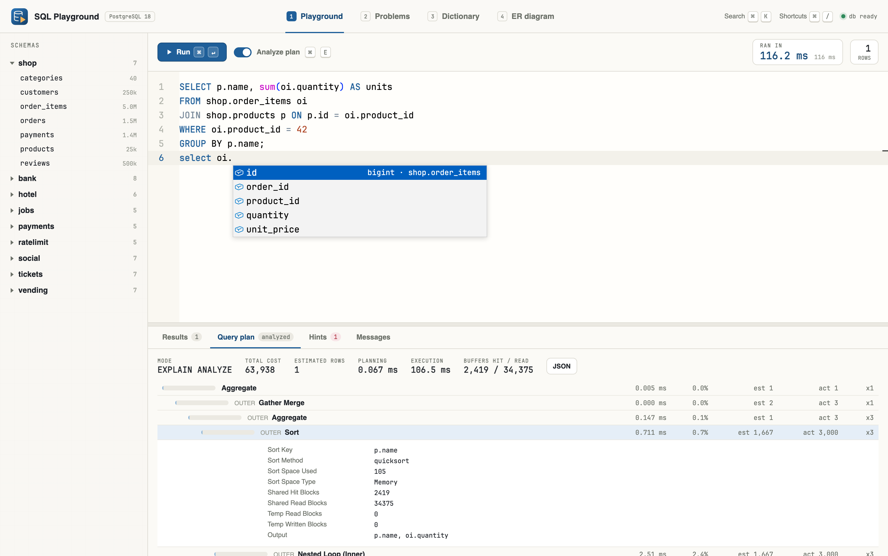

Typing `oi.` resolves the alias to `shop.order_items` and lists its columns with their types.

### Problems

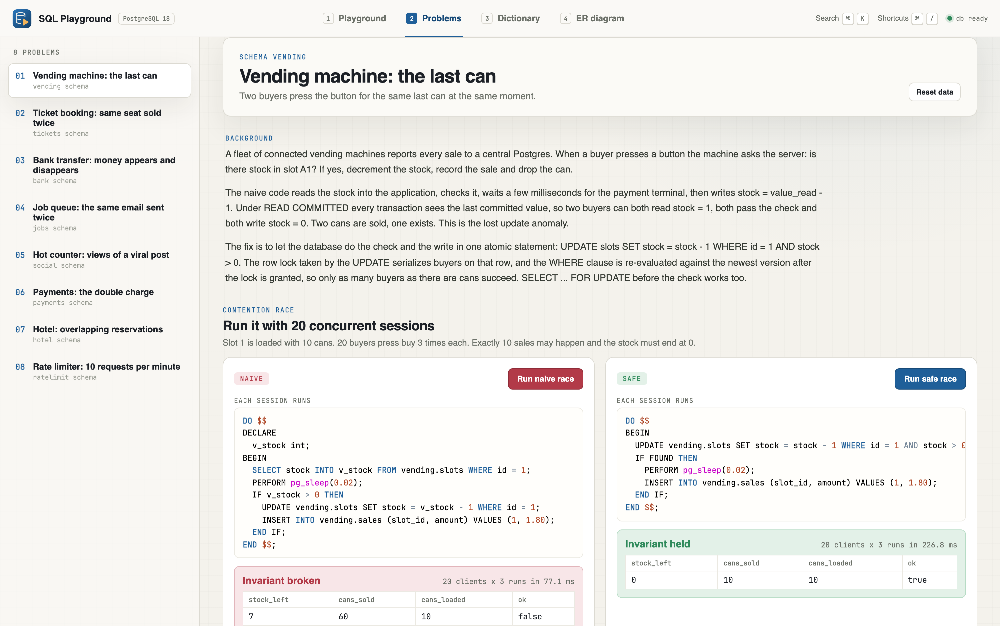

Eight contention problems, each with the schema it runs on and a background that explains the anomaly and the fix.

### Problems: the race

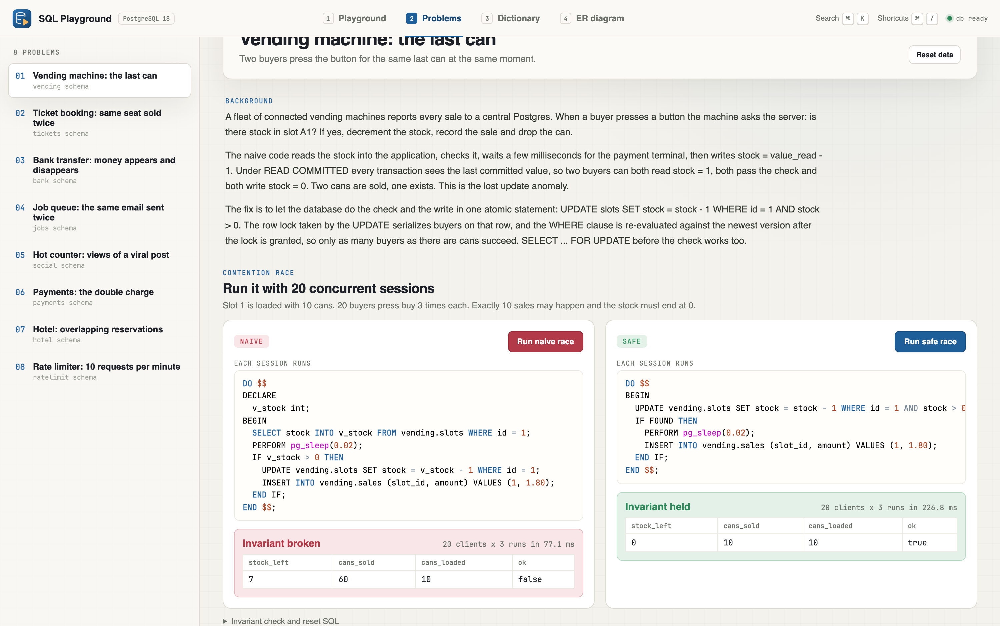

The naive vending machine sold 60 cans from a slot loaded with 10. The safe version sold exactly 10 and ended at stock 0. The invariant query is shown as a table under each run.

### Problems: joins

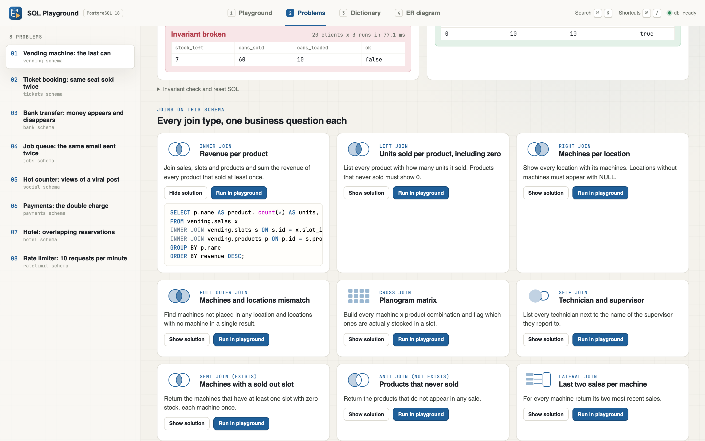

Every problem has one exercise per join type: a question, a Venn style icon, the solution, and `Run in playground`.

### Dictionary

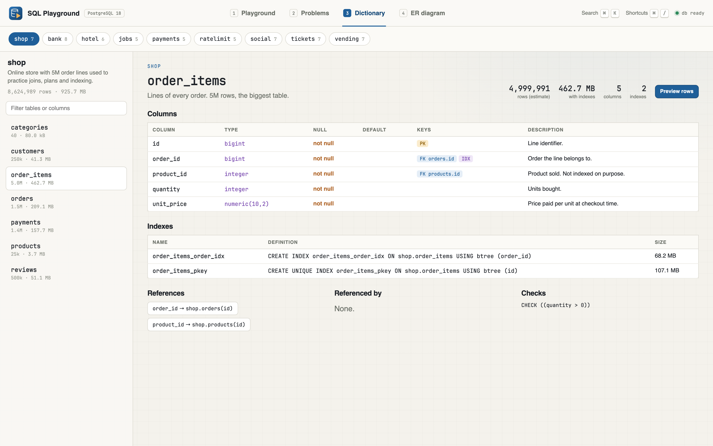

`shop.order_items` with 5M rows: column types, nullability, key badges, descriptions, index definitions with sizes, and its foreign keys in both directions.

### ER diagram

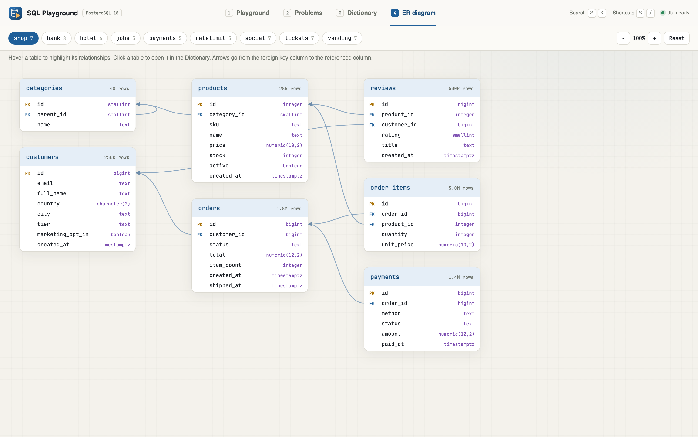

The `shop` schema. Arrows go from each foreign key column to the referenced column, and the chips switch to any problem schema.

### Search

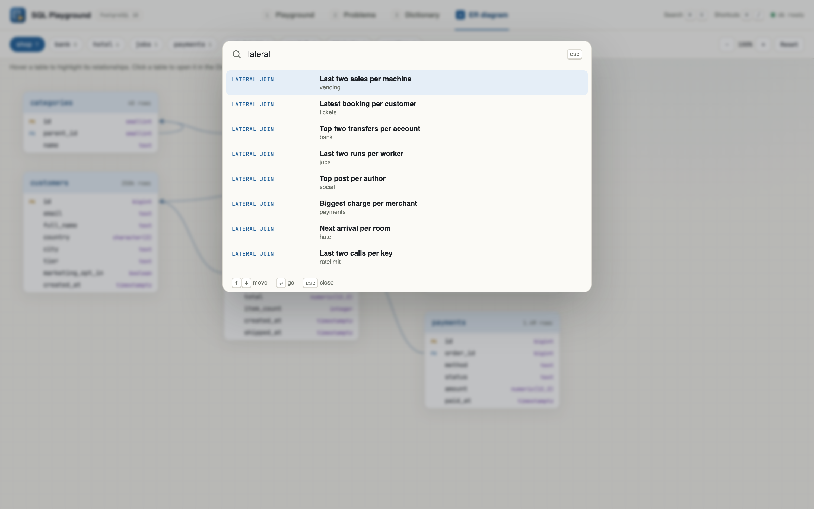

`⌘ K` searches tabs, actions, problems, the 72 join exercises, tables and diagrams. Use the arrow keys to move and Enter to go.

### Shortcut guide

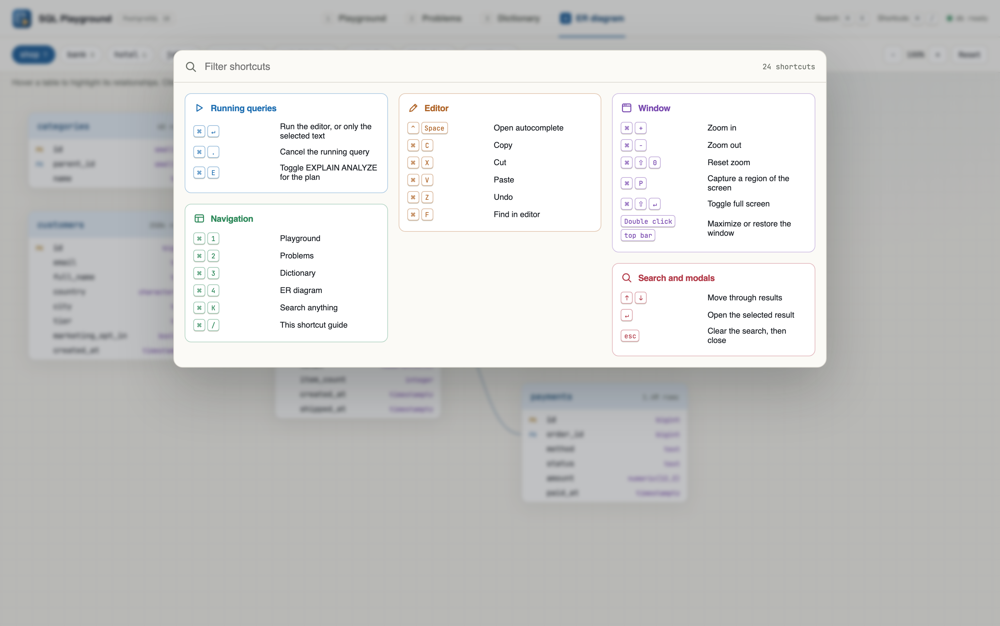

`⌘ /` shows every shortcut, grouped by area, each group with its own icon and color. The search box filters them.

### Desktop app

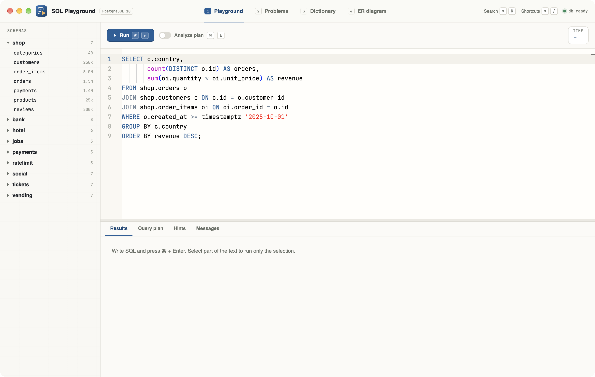

The installed macOS app with the traffic lights in the draggable top bar. Double click the bar to maximize or restore.

## Scripts

All scripts live in `scripts/` and run from any directory of the repository.

| Script | What it does |
|---|---|
| `./scripts/setup.sh` | Installs dependencies and prepares the app |
| `./scripts/start-all.sh` | Starts every service and prints the full link of each one |
| `./scripts/status.sh` | Shows every service port as UP or DOWN |
| `./scripts/test-all.sh` | Runs every test suite |
| `./scripts/ui.sh` | Opens the UI in the browser |
| `./scripts/stop-all.sh` | Stops every service |
| `./scripts/sql-console.sh` | Opens a console on the database |

Ports are declared in `scripts/ports.env`: postgres `55432`, backend `8095`, frontend `5178`.

```bash
./scripts/setup.sh
./scripts/start-all.sh
./scripts/status.sh
./scripts/ui.sh
./scripts/stop-all.sh
```
