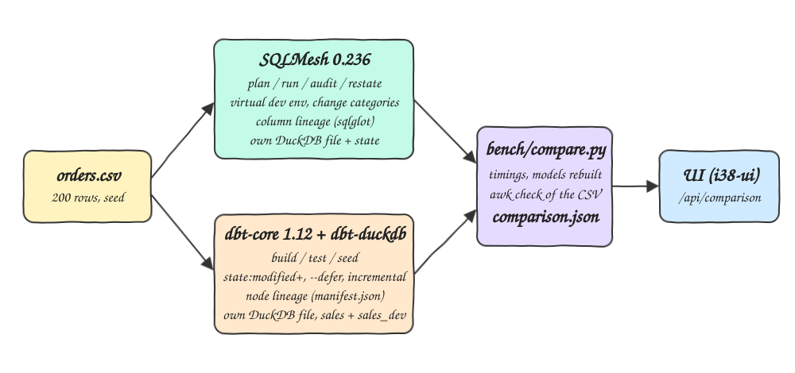
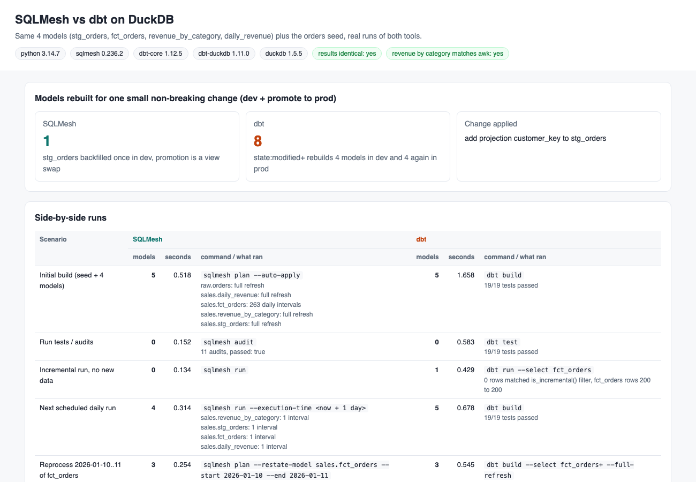
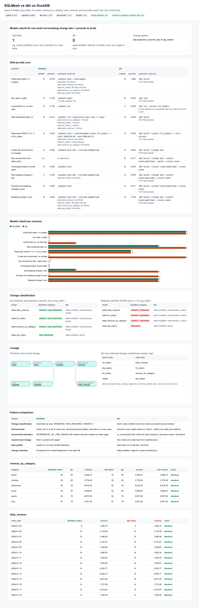

# sqlmesh-vs-dbt

The same four transformation models (`stg_orders`, `fct_orders`, `revenue_by_category`, `daily_revenue`) written twice, once for SQLMesh and once for dbt, both on DuckDB and Python 3.14. A benchmark runs both tools for real through the same scenarios (initial build, tests, incremental runs, reprocessing, dev environments, non-breaking and breaking changes), counts the models each one rebuilds, times every step, writes `comparison.json` and shows it in a UI next to the result tables of both tools and an awk check.

## How it Works

1. `data/orders.csv` (200 orders) is loaded as a seed by both tools (`raw.orders` in SQLMesh, `orders` in dbt).
2. `bench/workspace.py` copies each project into `work/` so the benchmark can edit model files without touching the sources.
3. `bench/sqlmesh_bench.py` drives SQLMesh through its Python API (`Context.plan_builder`, `apply`, `run`, `audit`, `column_dependencies`) and records the plan: which models need backfill, how many intervals, and the change category of each snapshot.
4. `bench/dbt_bench.py` drives dbt through `dbtRunner` (the same entry point as the CLI) and records every model and test result.
5. Both benchmarks apply the same two edits to `stg_orders`: a non-breaking one (new column `customer_key`) and a breaking one (`WHERE price >= 0`).
6. `bench/compare.py` pairs the scenarios, runs `bench/awk_revenue_by_category.sh` on the raw CSV and writes `comparison.json`.
7. `bench/assertions.py` checks the intent of every scenario, and the UI container serves the JSON.

## Architecture



## Features

* Same models, same SQL: only the source reference (`raw.orders` vs `{{ ref('orders') }}`) and the incremental wiring differ, so every difference measured comes from the tool.
* Tests and audits in both: `unique` / `not_null` plus a custom `revenue >= 0` check (`audits/assert_non_negative.sql` in SQLMesh, `tests/generic/non_negative.sql` in dbt).
* Virtual environments: SQLMesh `plan dev` creates a full dev environment with zero recompute; dbt `--target dev` rebuilds everything.
* Change classification: SQLMesh labels each change BREAKING / NON_BREAKING and rebuilds only what the category requires; dbt `state:modified+` rebuilds the node and all children.
* Incremental by time: SQLMesh tracks daily intervals of `fct_orders` and restates any date range; dbt uses a hand written `is_incremental()` filter on `max(ts)`.
* Column-level lineage from SQLMesh (`total_revenue` back to `raw.orders.price` and `raw.orders.quantity`), node-level lineage from the dbt manifest.
* Results verified: both tools produce identical tables, and `revenue_by_category` matches an independent awk computation.

## Stack

* Python 3.14.7: required language version, both tools install and run on it (`pip check` is clean with both in one venv).
* SQLMesh 0.236.2: latest release, plan/apply, virtual layer, audits, lineage.
* dbt-core 1.12.5 + dbt-duckdb 1.11.0: latest releases, build/test/state selection.
* DuckDB 1.5.5: embedded warehouse, one file per tool, no server needed.
* podman-compose with the stock `python:3.14.7-slim` image: runs the stdlib-only UI server, no custom image build.
* Plain HTML, JS and SVG for the UI, no frameworks.

## Models

| Model | SQLMesh kind | dbt materialization |
|---|---|---|
| `stg_orders` | `FULL` | `table` |
| `fct_orders` | `INCREMENTAL_BY_TIME_RANGE (time_column ts)`, cron `@daily` | `incremental`, `delete+insert` on `order_id`, filter `ts > max(ts)` |
| `revenue_by_category` | `FULL` | `table` |
| `daily_revenue` | `FULL` | `table` |

Revenue is `quantity * price`, the same rule used by the other POCs in this repo that read `orders.csv`.

## Results

Numbers from the last run of `./scripts/test-all.sh` (seconds include project load and parse for both tools).

| Scenario | SQLMesh models | SQLMesh s | dbt models | dbt s |
|---|---|---|---|---|
| Initial build (seed + 4 models) | 5 | 0.52 | 5 | 1.66 |
| Run tests / audits | 0 (11 audits) | 0.15 | 0 (19 tests) | 0.58 |
| Incremental run, no new data | 0 | 0.13 | 1 (0 new rows) | 0.43 |
| Next scheduled daily run | 4 (1 interval each) | 0.31 | 5 | 0.68 |
| Reprocess 2026-01-10..11 of fct_orders | 3 (fct: 2 intervals) | 0.25 | 3 (full refresh) | 0.55 |
| Create dev environment, no change | 0 | 0.30 | 5 | 0.95 |
| Dev with `--defer` (dbt only) | n/a | - | 0 | 0.42 |
| Unchanged project vs prod | 0 | 0.26 | 0 | 0.43 |
| Non-breaking change in dev | 1 | 0.38 | 4 | 0.68 |
| Promote non-breaking change to prod | 0 | 0.37 | 4 | 0.97 |
| Breaking change in dev | 4 | 0.50 | 4 | 1.02 |

A single non-breaking change, tested in dev and shipped to prod, rebuilt 1 model in SQLMesh and 8 in dbt.

revenue_by_category (identical in SQLMesh, dbt and awk):

| category | orders | quantity | revenue |
|---|---|---|---|
| books | 32 | 64 | 2008.27 |
| clothing | 35 | 63 | 3776.49 |
| electronics | 30 | 54 | 9618.24 |
| home | 32 | 62 | 3608.87 |
| sports | 34 | 76 | 6873.93 |
| toys | 37 | 74 | 2451.82 |

## Key design decisions

* One venv for both tools: `pip check` reports no conflicts, and one DuckDB version reads both warehouses.
* Programmatic APIs instead of parsing CLI text: `plan.missing_intervals` and `plan.new_snapshots` give exact rebuild counts and change categories, `dbtRunner` returns typed results. The UI shows the CLI command that matches each step.
* The breaking edit (`WHERE price >= 0`) removes no rows on this data, so it changes classification without changing results, and it is only applied in dev.
* dbt has no interval concept: "Reprocess two days" is `--full-refresh` of `fct_orders+`, and late rows older than `max(ts)` would be skipped by its incremental filter; SQLMesh restates exactly the requested days.
* dbt-core has no column-level lineage (dbt Cloud / Fusion features are out of scope), so the dbt side shows node lineage from `manifest.json`.

## Contracts / API

| Method | Path | Returns |
|---|---|---|
| GET | `/` | the UI |
| GET | `/api/health` | `{"status":"UP"}` |
| GET | `/api/comparison` | the full `comparison.json` |

`comparison.json` keys: `versions`, `changes`, `scenarios` (per tool: `models_rebuilt`, `models`, `seconds`, `command`, `detail`), `small_change_models_rebuilt_dev_plus_prod`, `classification`, `features`, `lineage`, `dev_stg_orders_columns`, `results` (`sqlmesh`, `dbt`, `awk_revenue_by_category`), `checks`.

## How to run

```bash
./scripts/setup.sh
./scripts/start-all.sh
./scripts/test-all.sh
./scripts/ui.sh
./scripts/stop-all.sh
```

`test-all.sh` reruns both benchmarks, checks 16 assertions about the scenarios, diffs both tools' `revenue_by_category` against awk and calls the UI API when it is up.

## Printscreens

Top of the UI: versions, the pass/fail checks, the headline count of models rebuilt for one small change, and the start of the side-by-side table with the command each tool ran.



Full page: side-by-side runs, the models-rebuilt chart per scenario, SQLMesh change categories next to what dbt rebuilt, column lineage vs node lineage, the feature table, and the `revenue_by_category` and `daily_revenue` tables of both tools with the awk column and a match flag per row.



## Scripts

All scripts live in `scripts/` and run from any directory of the repository.

| Script | What it does |
|---|---|
| `./scripts/setup.sh` | Creates the Python 3.14 venv, installs SQLMesh and dbt, runs the benchmark once |
| `./scripts/start-all.sh` | Starts the UI container and prints the full link of each service |
| `./scripts/status.sh` | Shows every service port as UP or DOWN |
| `./scripts/test-all.sh` | Reruns both tools, checks the results and the awk verification |
| `./scripts/ui.sh` | Opens the UI in the browser |
| `./scripts/stop-all.sh` | Stops every service |

Ports are declared in `scripts/ports.env` (`ui=23800`).
