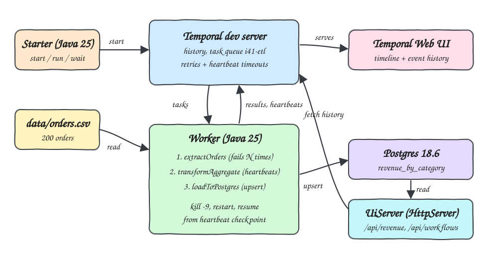
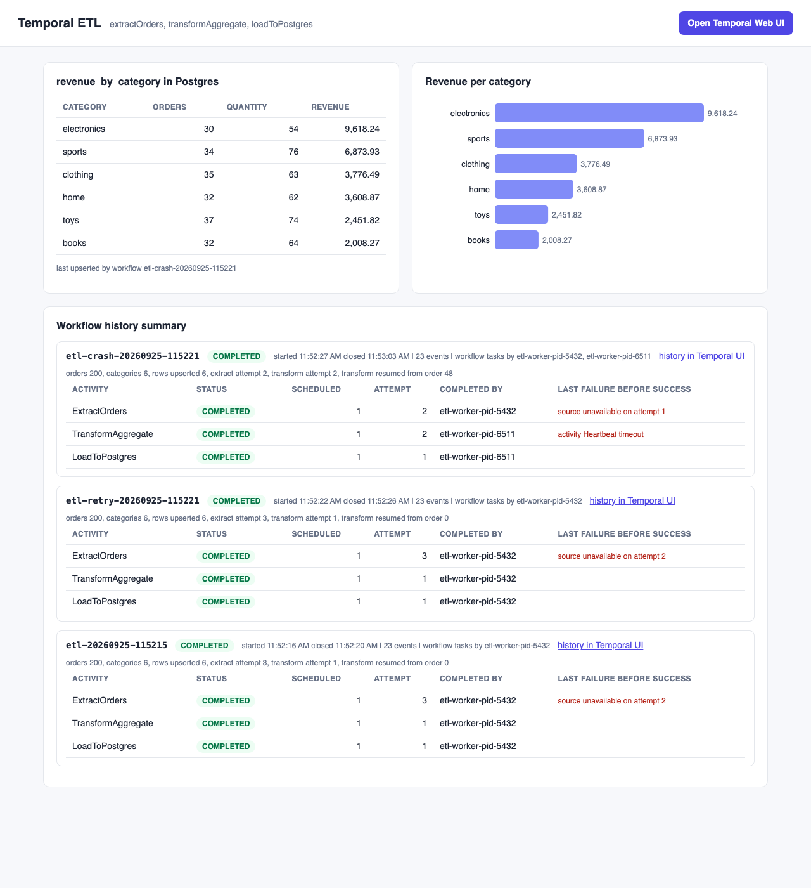
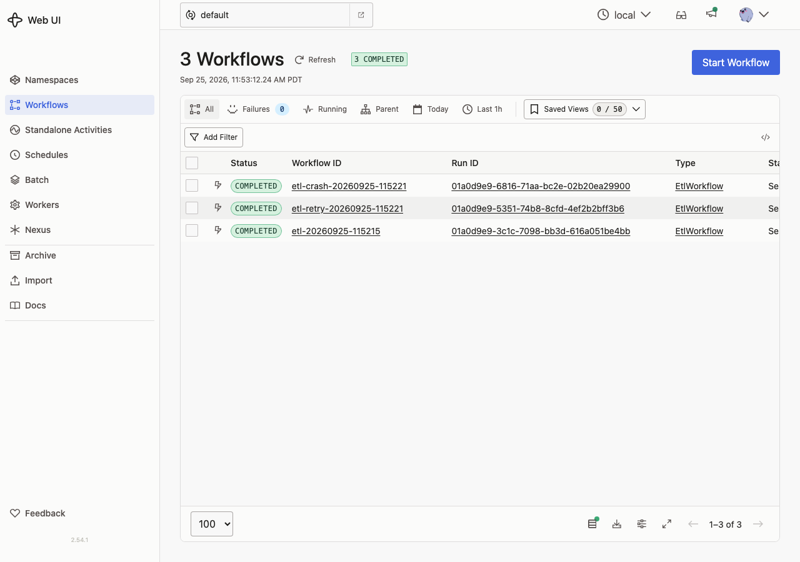
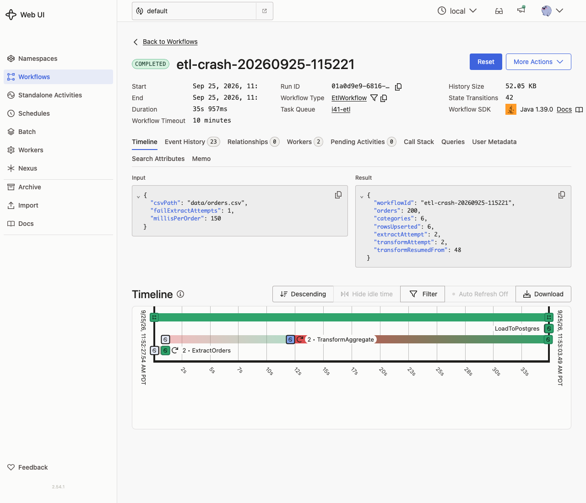

# temporal-java-25-etl

A durable ETL pipeline on Temporal with a Java 25 worker built on the Temporal Java SDK 1.39.0. One workflow runs three activities, `extractOrders` (CSV), `transformAggregate` (per category) and `loadToPostgres` (upsert into `revenue_by_category` on Postgres 18.6). The POC shows two kinds of durability: an activity that fails its first N attempts and is recovered by the retry policy, and a worker killed with `SIGKILL` in the middle of a long heartbeating activity that finishes after a restart without running the completed activities again.

## How it Works

1. `podman-compose` starts the Temporal dev server (`temporal server start-dev` from the `temporalio/temporal` CLI image, with Web UI) and Postgres.
2. `WorkerMain` creates the table and polls task queue `i41-etl` with identity `etl-worker-pid-<pid>`.
3. `Starter` starts `EtlWorkflow` with the CSV path, how many extract attempts must fail, and a per-order delay.
4. `extractOrders` throws `SourceUnavailable` while `attempt <= failAttempts`. Temporal retries it (1s, 2s, 4s backoff, max 5 attempts) and records the last failure.
5. `transformAggregate` heartbeats a `Checkpoint(next, totals)` after every order. Heartbeat timeout is 3s.
6. `crash-recovery.sh` sends `SIGKILL` to the worker when the transform has passed order 60, then starts a new worker process.
7. Temporal sees the missing heartbeat, retries the activity on the new worker, and the activity reads the last heartbeat checkpoint and continues from there.
8. `extractOrders` is not executed again: its result is already in the workflow history and the new worker replays it.
9. `loadToPostgres` upserts 6 rows with `INSERT ... ON CONFLICT (category) DO UPDATE`.
10. `UiServer` reads Postgres plus the workflow histories via the SDK and links to the Temporal Web UI.

## Architecture



## Features

* Retry policy on a flaky source: 2 injected failures, success on attempt 3, the failure message is visible in the history.
* Crash recovery: `kill -9` of the worker during the transform, a fresh process finishes the same workflow run.
* Heartbeat checkpoints: the retried transform resumes near the crash point (order 47/48 of 200 in the runs), not from zero.
* No repeated work: every activity is scheduled exactly once in history, the completed extract is replayed, not rerun.
* Idempotent load: upsert keyed by category, so any retry of `loadToPostgres` writes the same 6 rows.
* History summary per workflow: attempt, completing worker identity and last failure for every activity.
* End to end test with 3 scenarios, including an independent `awk` calculation over the CSV.

## Stack

* Java 25 (Amazon Corretto 25.0.4): worker, starter and UI backend.
* Temporal Java SDK 1.39.0: workflow, activities, retry and heartbeat API, history fetch.
* Temporal CLI 1.9.1 image `temporalio/temporal:1.9.1`: lightest server option, `start-dev` includes the Web UI.
* Postgres 18.6: result store.
* PostgreSQL JDBC 42.7.13: upsert and reads, no ORM.
* JDK `com.sun.net.httpserver` + Jackson (already shipped with the Temporal SDK): tiny JSON backend.
* Maven 3.9 and podman-compose.

## Ports

| Service | Port |
|---|---|
| Temporal gRPC | 24133 |
| Temporal Web UI | 24180 |
| Postgres | 24132 |
| Results UI | 24190 |

## Data Model

```sql
CREATE TABLE revenue_by_category (
  category text PRIMARY KEY,
  total_orders bigint NOT NULL,
  total_quantity bigint NOT NULL,
  total_revenue numeric(14,2) NOT NULL,
  workflow_id text NOT NULL,
  updated_at timestamptz NOT NULL
);
```

Key records in `Model.java`:

* `Order` keeps the price in cents (`long`) so the sums are exact.
* `Checkpoint(next, totals)` is the heartbeat payload, the index of the next order plus partial totals.
* `TransformResult(totals, resumedFrom, attempt)` tells the workflow where the transform resumed.
* `EtlResult` is the workflow result shown in the UI and in the Temporal Web UI.

Design decisions:

* Three activity stubs with their own options: only the transform has a heartbeat timeout and a long start-to-close timeout.
* Worker identity carries the pid, so history proves which process completed each activity.
* Workflow input carries the repo relative CSV path, the worker resolves it from its working directory.

## API

| Method | Path | Response |
|---|---|---|
| GET | `/` | results UI |
| GET | `/api/revenue` | rows of `revenue_by_category` sorted by revenue |
| GET | `/api/workflows` | last 15 `EtlWorkflow` runs with a history summary |
| GET | `/api/workflow?id=<workflowId>` | history summary of one run |
| GET | `/api/config` | Temporal Web UI URL and task queue |

```json
{"workflow_id":"etl-crash-20260925-115221","status":"COMPLETED","event_count":23,
 "activities":[{"activity":"TransformAggregate","status":"COMPLETED","attempt":2,
   "worker":"etl-worker-pid-6511","last_failure":"activity Heartbeat timeout","times_scheduled":1}],
 "workflow_task_workers":["etl-worker-pid-5432","etl-worker-pid-6511"],
 "result":{"orders":200,"categories":6,"rowsUpserted":6,"extractAttempt":2,"transformAttempt":2,"transformResumedFrom":48}}
```

## How to run

Requires podman, podman-compose, Java 25, Maven and python3 (test assertions only).

```bash
./scripts/setup.sh
./scripts/start-all.sh
./scripts/test-all.sh
./scripts/etl.sh 2 5
./scripts/crash-recovery.sh
./scripts/ui.sh
./scripts/stop-all.sh
```

* `etl.sh [failExtractAttempts] [millisPerOrder] [workflowId]` runs one workflow and waits for the result.
* `crash-recovery.sh [workflowId]` starts a slow run (150 ms per order), kills the worker at order 60, restarts it and waits.
* `start-all.sh` runs one baseline workflow when the Temporal dev server has none, so the UI is never empty.

Test output from `./scripts/test-all.sh`:

```
scenario 1: extractOrders fails on attempts 1 and 2, retry policy succeeds on attempt 3
ok   extractOrders succeeded on attempt 3 after 2 injected failures
ok   last failure recorded by temporal: source unavailable on attempt 2
scenario 2: worker killed with SIGKILL during the heartbeating transformAggregate
transform passed 60 orders, killing worker pid 5432 with SIGKILL
ok   ExtractOrders scheduled once and completed
ok   extractOrders scheduled once and completed by etl-worker-pid-5432 before the crash
ok   transformAggregate finished on attempt 2 after the crash
ok   crash detected by heartbeat timeout: activity Heartbeat timeout
ok   transformAggregate completed by the restarted worker etl-worker-pid-6511
ok   transformAggregate resumed from heartbeat checkpoint at order 48 of 200
scenario 3: postgres revenue_by_category matches an independent awk calculation
books,32,64,2008.27
clothing,35,63,3776.49
electronics,30,54,9618.24
home,32,62,3608.87
sports,34,76,6873.93
toys,37,74,2451.82
tests passed
```

The Temporal dev server keeps history in memory, so workflow history is gone after `stop-all.sh`. Postgres data lives in the `i41-postgres-data` volume.

## Printscreens

### Results UI



Postgres table and bar chart on top. Below, one card per workflow run: the crash run shows `ExtractOrders` completed by the first worker pid, `TransformAggregate` on attempt 2 after an `activity Heartbeat timeout` completed by the restarted worker, and the result says the transform resumed from order 48. The retry run shows `ExtractOrders` on attempt 3 with the last injected failure.

### Temporal Web UI, workflow list



Baseline, retry and crash runs on the dev server, all completed.

### Temporal Web UI, crash run



Input and result of the crash run, 2 workers in the Workers tab, and the timeline with the retried `ExtractOrders`, the red retry segment of `TransformAggregate` where the worker died, and the final `LoadToPostgres`.

## Scripts

All scripts live in `scripts/` and run from any directory of the repository.

| Script | What it does |
|---|---|
| `./scripts/setup.sh` | Installs dependencies and prepares the app |
| `./scripts/start-all.sh` | Starts every service and prints the full link of each one |
| `./scripts/status.sh` | Shows every service port as UP or DOWN |
| `./scripts/test-all.sh` | Runs every test suite |
| `./scripts/ui.sh` | Opens the UI in the browser |
| `./scripts/stop-all.sh` | Stops every service |
| `./scripts/sql-console.sh` | Opens a console on the database |

Ports are declared in `scripts/ports.env`.

```bash
./scripts/setup.sh
./scripts/start-all.sh
./scripts/status.sh
./scripts/ui.sh
./scripts/stop-all.sh
```
