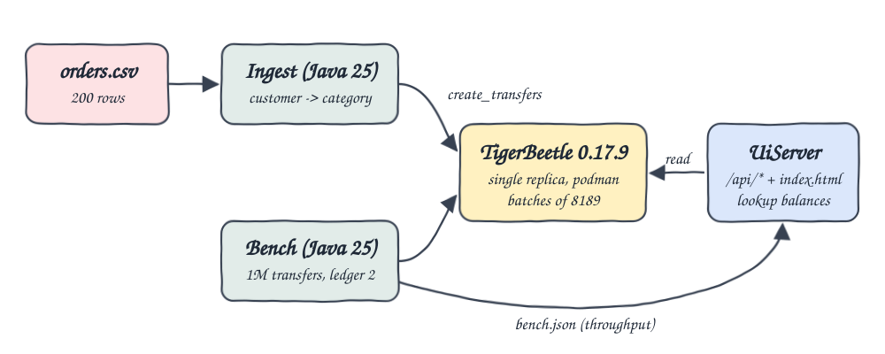
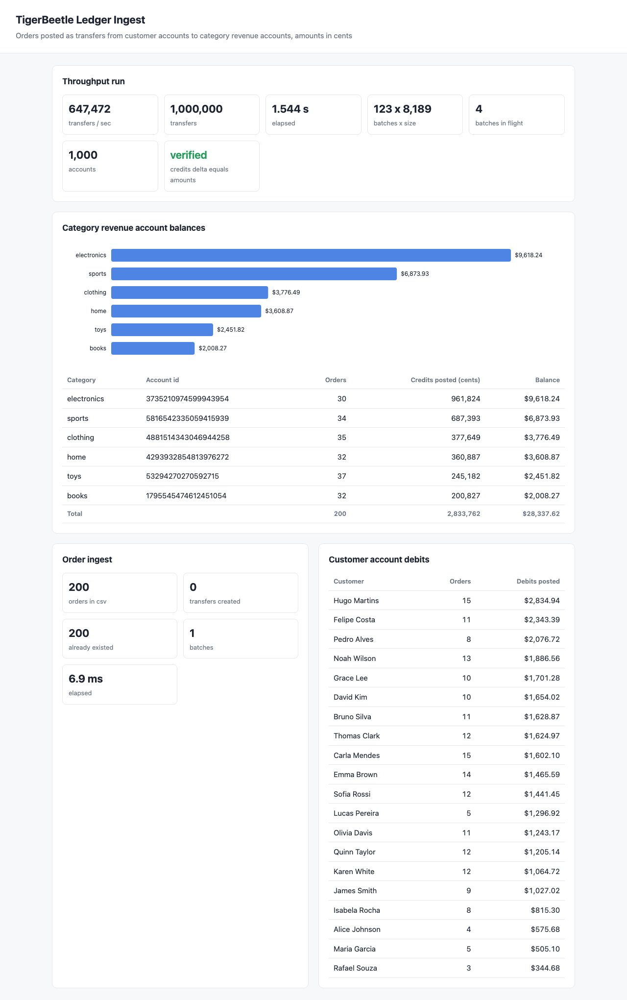

# tigerbeetle-ledger-ingest

Uses TigerBeetle as a double-entry ledger for the order data. A Java 25 program creates one account per customer and one revenue account per category. Each order becomes a transfer from the customer account to the category account, with amount = quantity * price in cents. A second Java program runs 1,000,000 generated transfers and measures transfers per second. A small UI shows the category balances and the throughput.

## How it Works

1. `podman-compose` starts one TigerBeetle 0.17.9 replica. On first boot the container formats `/data/0_0.tigerbeetle`, then it starts the replica.
2. `ledger.Ingest` reads `data/orders.csv` and creates 20 customer accounts (code 1) and 6 category revenue accounts (code 2) on ledger 1.
3. It sends each order as a transfer (`id = order_id`, debit = customer, credit = category, amount in cents), in batches of up to 8189.
4. Every account and transfer ID is deterministic, so running the ingest again only returns `Exists` and the balances do not change.
5. `ledger.Bench` creates 1,000 accounts on ledger 2 and sends 1,000,000 generated transfers in 123 batches, with 4 batches queued at a time. It then checks that the credits posted grew by exactly the sum of the generated amounts.
6. `ledger.UiServer` calls `lookup_accounts` on every request and serves JSON plus a single `index.html`.

## Architecture



## Features

- **Ledger of orders**: every order is a balanced double-entry transfer, so the total of customer debits always equals the total of category credits.
- **Batched ingest**: up to 8189 transfers go in one request. This is TigerBeetle's per-request limit.
- **Idempotent reruns**: IDs are deterministic (SHA-256 of the name for accounts, `order_id` for transfers), so a rerun creates no duplicates.
- **Throughput run**: 1M transfers, generated the same way every run, go to a separate ledger. They never touch the order balances.
- **Self-check**: after the run, the program compares the change in balances against the generated amounts and records the result in `verified`.
- **UI**: shows category balances (chart and table), customer debits, ingest stats and throughput.

## Stack

- **TigerBeetle 0.17.9** (`ghcr.io/tigerbeetle/tigerbeetle:0.17.9`): the latest release, a financial transactions database built for high transfer throughput.
- **tigerbeetle-java 0.17.9**: the official client. It bundles the native JNI library for macOS and Linux.
- **Java 25**: the language runtime. The HTTP server is the JDK's built-in `com.sun.net.httpserver`, so there is no web framework.
- **Maven 3.9**: builds the code and copies the dependencies.
- **podman / podman-compose**: run the container.
- **Plain JS + SVG**: the UI. No frontend libraries.

## Running TigerBeetle inside the podman VM

TigerBeetle needs `io_uring`. The podman machine runs Fedora CoreOS (kernel 6.15), and there `io_uring` is blocked in two ways:

| Setting | Result |
|---|---|
| default | `error(io): io_uring is not available ... disabled by seccomp` then `SystemOutdated` |
| `seccomp=unconfined` only | `error: Unexpected` (SELinux still denies io_uring) |
| `label=disable` only | seccomp error again |
| `seccomp=unconfined` + `label=disable` | works, Direct IO works on the named volume |
| `--privileged` | works, but grants far more than needed |

`podman-compose.yml` uses `security_opt: [seccomp=unconfined, label=disable]`.

`--development` is **not** used. It would skip the Direct IO requirement and lower memory use, but it also makes the batch size smaller, and this project needs full 8189-transfer batches. TigerBeetle allocates all of its memory at startup. With `--cache-grid=128MiB` the replica reports `Allocated 2190MiB`, and that amount stays fixed. Expect about 2.2 GB RSS.

## Contracts / APIs

The UI server listens on port `24901`.

| Method | Path | Response |
|---|---|---|
| GET | `/` | the UI |
| GET | `/api/categories` | `[{"category":"books","account_id":"...","orders":32,"credits_cents":200827}, ...]` |
| GET | `/api/customers` | `[{"customer":"Alice Johnson","account_id":"...","orders":4,"debits_cents":57568}, ...]` |
| GET | `/api/ingest` | `{"orders":200,"created":200,"existing":0,"batches":1,"seconds":0.004}` |
| GET | `/api/bench` | `{"transfers":1000000,"accounts":1000,"batch_size":8189,"batches":123,"in_flight":4,"seconds":1.54,"tps":647472,"amount_total":5000500000,"credits_delta":5000500000,"verified":true}` |

## Key Data Structures and Design Decisions

- **Chart of accounts** (`Chart.java`): an account ID is the first 63 bits of `SHA-256("customer:"+name)`, `SHA-256("revenue:"+category)` or `SHA-256("bench:"+i)`. IDs do not depend on row order.
- **Ledgers**: ledger 1 holds the orders (codes 1 and 2 for accounts, 10 for transfers). Ledger 2 holds the throughput run (account code 3, transfer code 20). TigerBeetle rejects transfers between accounts on different ledgers, so the two sets cannot mix.
- **Money as integers**: prices are parsed with `BigDecimal.movePointRight(2).longValueExact()`, so there is no floating point anywhere in the ledger.
- **Per-event results**: in 0.17 the client returns one status per event (`Created`, `Exists`, or an error). Any other status stops the run.
- **Throughput transfer IDs**: `(start millis << 20) | i`. Each run gets new IDs, while the amounts and account pairs are the same every time.
- **Batch size 8189**: the task asked for 8190. That was the limit in older releases, and TigerBeetle 0.17.9 rejects 8190 with `Too much data was sent or requested in this batch`. The current documented maximum is 8189.

## How to run

```bash
./scripts/setup.sh
./scripts/start-all.sh
./scripts/test-all.sh
./scripts/ui.sh
./scripts/stop-all.sh
```

`start-all.sh` runs the ingest every time, since it is idempotent. It runs the throughput run only when `.run/bench.json` does not exist yet. Delete that file to measure again.

`test-all.sh` checks the following:

- The category credits in TigerBeetle match an `awk` sum of `quantity * price` in cents per category, from `data/orders.csv`.
- The total of customer debits equals the total of category credits.
- Running the ingest again creates 0 transfers and leaves the balances unchanged.
- The throughput run is `verified`.

Verified output:

```
books 32 200827
clothing 35 377649
electronics 30 961824
home 32 360887
sports 34 687393
toys 37 245182
customer debits 2833762, category credits 2833762
bench: 1000000 transfers, 123 batches of 8189, 4 in flight, 1.544s, 647472 transfers/sec
PASS
```

## Printscreens



The page has four sections:

- **Throughput run**: 1,000,000 transfers in 123 batches of 8189, about 647k transfers/sec. It shows `verified` because the credits delta equals the sum of the generated amounts.
- **Category revenue account balances**: `lookup_accounts` results as a bar chart and a table. The table shows account IDs, order counts and credits posted in cents, and the total is $28,337.62.
- **Order ingest**: stats from the most recent ingest. After a rerun it shows 0 created and 200 already existed.
- **Customer account debits**: each customer's debit balance, which together match the category credits.

## Scripts

All scripts live in `scripts/` and run from any directory of the repository.

| Script | What it does |
|---|---|
| `./scripts/setup.sh` | Installs dependencies and prepares the app |
| `./scripts/start-all.sh` | Starts every service and prints the full link of each one |
| `./scripts/status.sh` | Shows every service port as UP or DOWN |
| `./scripts/test-all.sh` | Runs every test suite |
| `./scripts/ui.sh` | Opens the UI in the browser |
| `./scripts/stop-all.sh` | Stops every service |
| `./scripts/sql-console.sh` | Opens the TigerBeetle REPL on the ledger |

Ports are declared in `scripts/ports.env` (`tigerbeetle=24900`, `ui=24901`).

```bash
./scripts/setup.sh
./scripts/start-all.sh
./scripts/status.sh
./scripts/ui.sh
./scripts/stop-all.sh
```
