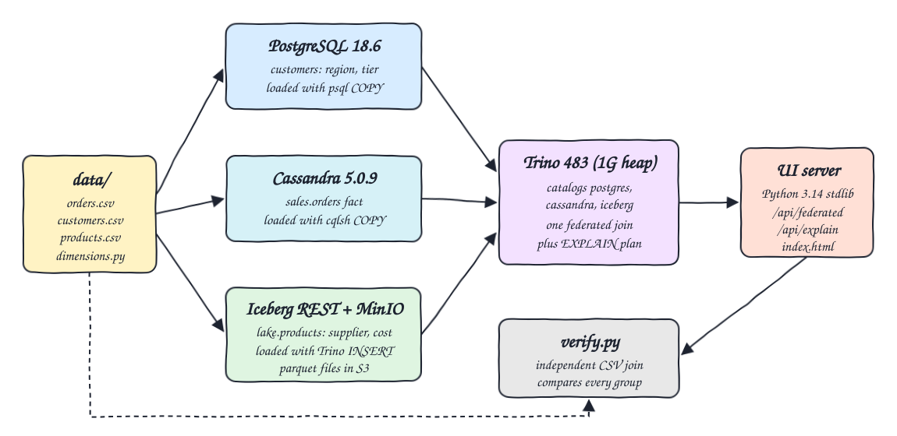
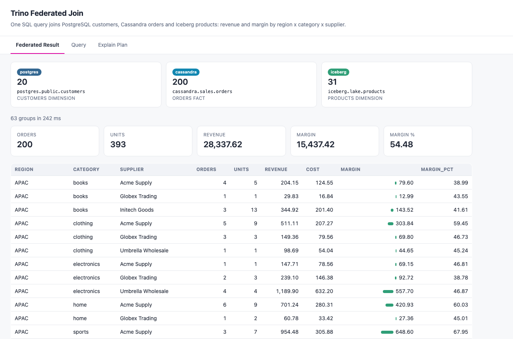
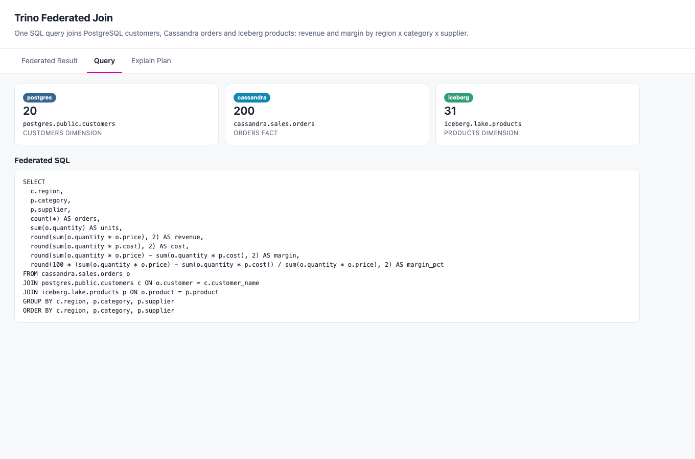
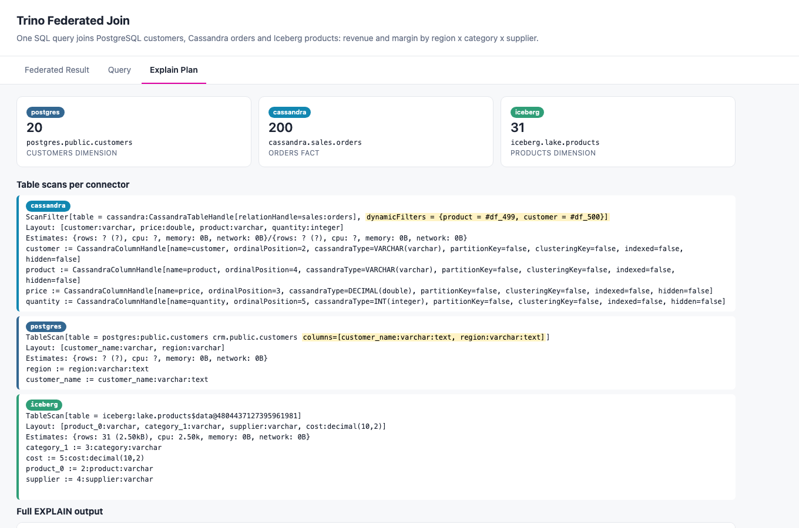

# Trino Federated Join

One Trino SQL query joins three different storage systems at once: a PostgreSQL `customers` dimension, a Cassandra `orders` fact table and an Iceberg `products` dimension on MinIO. It returns revenue and margin by region x category x supplier, shows the `EXPLAIN` plan so you can see what each connector scans, and checks the result against an independent Python join over the source CSV files.

## How it Works

1. `app/dimensions.py` reads `data/orders.csv` and deterministically generates `customers.csv` (one row per customer with region and tier) and `products.csv` (one row per product with supplier and unit cost).
2. Customers are loaded into PostgreSQL with `psql COPY`.
3. Orders are loaded into Cassandra with `cqlsh COPY`.
4. Products are written to Iceberg through Trino (`CREATE TABLE` + `INSERT`), the Iceberg REST catalog tracks the table and MinIO stores the Parquet files.
5. Trino has three catalogs (`postgres`, `cassandra`, `iceberg`) and runs `sql/federated.sql`, one query that joins all three.
6. A Python stdlib server exposes the query text, result and `EXPLAIN` output as JSON, and `index.html` renders them.
7. `app/verify.py` recomputes every group from the CSV files with `Decimal` math and compares it to the Trino result.

## Architecture



## Features

- Three-way federated join in one statement: no ETL between the systems, Trino reads each source where it lives.
- Revenue (`quantity * price`), cost (`quantity * unit cost`), margin and margin % per region x category x supplier.
- `EXPLAIN` view per connector: shows the pushed columns for PostgreSQL, the dynamic filters applied to the Cassandra scan and the Iceberg snapshot being read.
- Native loaders per system (psql COPY, cqlsh COPY, Trino INSERT) so each store is loaded the way it is used in production.
- Independent verification: `verify.py` never talks to the databases, it only reads the CSVs, so a wrong join or wrong type mapping in Trino makes it fail.
- Deterministic dimensions: regions, tiers, suppliers and costs come from hashes of the names, so every run produces the same numbers.

## Stack

- Trino 483 (JVM heap 1G): the federation engine with PostgreSQL, Cassandra and Iceberg connectors.
- PostgreSQL 18.6: relational home of the customers dimension.
- Cassandra 5.0.9 (heap 512M): wide-column store holding the orders fact table.
- Apache Iceberg REST catalog fixture 1.10.1: Iceberg catalog used by Trino.
- MinIO (community build `pgsty/minio`): S3 object store for the Iceberg Parquet files.
- Python 3.14.7 (stdlib only): data generation, Iceberg loader, UI server and verification.
- podman + podman-compose: runs every container.

## Contracts / APIs

| Method | Path | Returns |
|---|---|---|
| GET | `/` | the UI (`index.html`) |
| GET | `/api/federated` | `{sql, columns, rows, elapsed_ms}` for the federated query |
| GET | `/api/explain` | `{plan}` with the text of `EXPLAIN <federated query>` |
| GET | `/api/sources` | `{sources: [{catalog, table, role, rows}]}` row count per source table |

## The federated query

```sql
SELECT c.region, p.category, p.supplier,
       count(*) AS orders, sum(o.quantity) AS units,
       round(sum(o.quantity * o.price), 2) AS revenue,
       round(sum(o.quantity * p.cost), 2) AS cost,
       round(sum(o.quantity * o.price) - sum(o.quantity * p.cost), 2) AS margin,
       round(100 * (sum(o.quantity * o.price) - sum(o.quantity * p.cost)) / sum(o.quantity * o.price), 2) AS margin_pct
FROM cassandra.sales.orders o
JOIN postgres.public.customers c ON o.customer = c.customer_name
JOIN iceberg.lake.products p ON o.product = p.product
GROUP BY c.region, p.category, p.supplier
ORDER BY c.region, p.category, p.supplier
```

## What EXPLAIN shows per connector

- `postgres`: `TableScan[table = postgres:public.customers ... columns=[customer_name, region]]`. Only the two needed columns are pushed down to PostgreSQL; `tier` is never read.
- `cassandra`: `ScanFilter[table = cassandra:...sales:orders, dynamicFilters = {product = #df, customer = #df}]`. The join keys from the two dimension tables are applied as dynamic filters on the Cassandra scan, only 4 of 7 columns are read.
- `iceberg`: `TableScan[table = iceberg:lake.products$data@<snapshot id>]`. The scan is pinned to one Iceberg snapshot and the 31-row table is broadcast (`distribution = REPLICATED`) to the join.
- Aggregation and joins happen inside Trino; none of these connectors can push a cross-catalog join down.

## Key design decisions

- `price` in `orders.csv` is a unit price (the same convention used by the other POCs in this repo), so revenue is `quantity * price`.
- Product cost is 55% to 75% of the lowest unit price seen for that product, so margins are positive and vary by product.
- Cassandra `decimal` is exposed by Trino as `double`, so revenue is a double and cost is a decimal; the verifier compares with a 0.01 tolerance after rounding to cents.
- Trino starts after PostgreSQL and Cassandra are ready and loaded, so the Cassandra catalog never sees an empty cluster.
- The UI server is a single Python file with no dependencies; it talks to Trino over its REST protocol (`/v1/statement`).

## How to run

```bash
./scripts/setup.sh
./scripts/start-all.sh
./scripts/test-all.sh
./scripts/ui.sh
./scripts/stop-all.sh
```

`test-all.sh` output:

```
source row counts
  postgres.public.customers: 20
  cassandra.sales.orders: 200
  iceberg.lake.products: 31
explain plan has one scan per connector
  scan found for postgres
  scan found for cassandra
  scan found for iceberg
federated result vs independent python join over the csv files
groups expected=63 trino=63
orders expected=200 trino=200
revenue expected=28337.62 trino=28337.62
margin expected=15437.42 trino=15437.42
PASS federated result matches independent CSV join
```

## Printscreens

### Federated Result



Row counts of the three source tables (one per catalog), overall totals, and the result grid: one row per region x category x supplier with orders, units, revenue, cost, margin (with a bar) and margin %.

### Query



The exact SQL text Trino runs, read from `sql/federated.sql`.

### Explain Plan



One card per connector with the scan node extracted from `EXPLAIN`: pushed columns for PostgreSQL, dynamic filters for Cassandra and the Iceberg snapshot. The full plan text is shown below the cards.

## Scripts

All scripts live in `scripts/` and run from any directory of the repository.

| Script | What it does |
|---|---|
| `./scripts/setup.sh` | Generates the dimension CSVs, pulls images and builds the UI image |
| `./scripts/start-all.sh` | Starts every service, loads the three stores and prints the full link of each one |
| `./scripts/status.sh` | Shows every service port as UP or DOWN |
| `./scripts/test-all.sh` | Checks source counts, the EXPLAIN scans and verifies the federated result |
| `./scripts/ui.sh` | Opens the UI in the browser |
| `./scripts/stop-all.sh` | Stops every service |
| `./scripts/sql-console.sh` | Opens the Trino CLI against all three catalogs |

Ports are declared in `scripts/ports.env`.

```bash
./scripts/setup.sh
./scripts/start-all.sh
./scripts/status.sh
./scripts/ui.sh
./scripts/stop-all.sh
```
