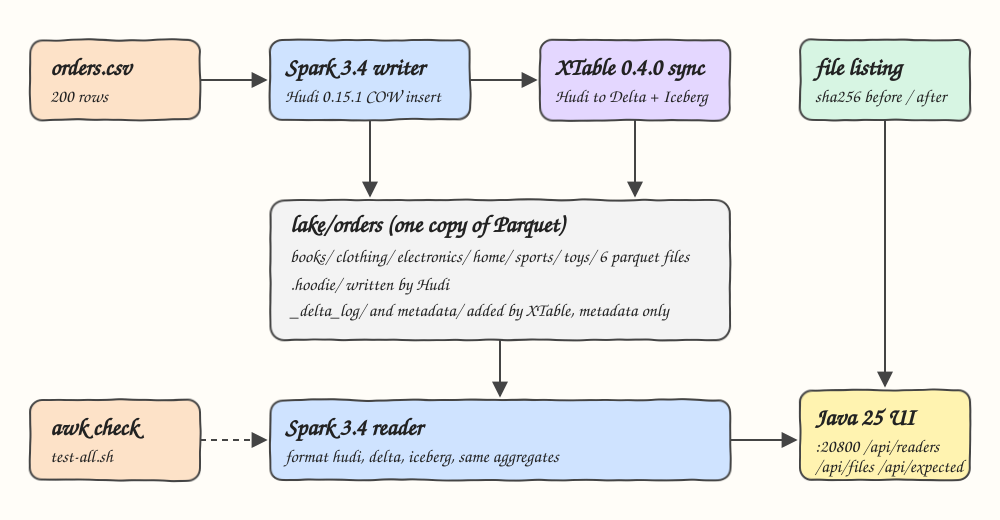
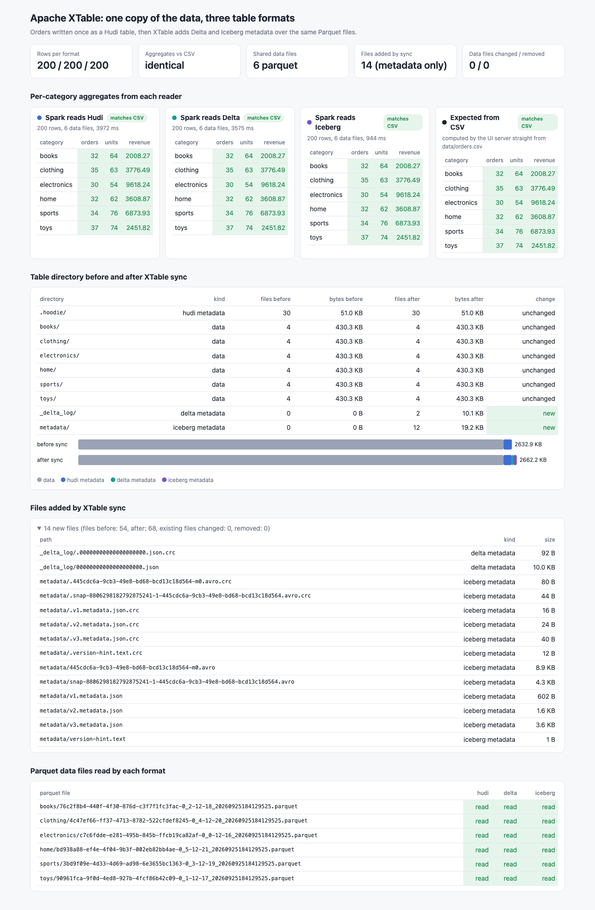

# xtable-iceberg-delta-hudi

Write the orders once as an Apache Hudi table with Spark, then run Apache XTable (incubating) 0.4.0 to expose the very same Parquet files as Delta Lake and Apache Iceberg tables without copying any data. Spark then reads the table through all three formats, the per-category aggregates are compared with each other and with an awk computation over the CSV, and a file listing (size + sha256) taken before and after the sync proves XTable only added metadata directories.

## How it Works

1. `data/orders.csv` (200 orders) is loaded by a Spark 3.4.4 job and written as a Hudi 0.15.1 Copy-On-Write table in `lake/orders`, partitioned by `category`.
2. A listing job records every file of the table (path, size, sha256) into `results/files_before.tsv`.
3. The XTable `RunSync` utility (bundled jar built from the `0.4.0-incubating` source tag inside a Maven container) reads the Hudi timeline and writes Delta (`_delta_log/`) and Iceberg (`metadata/`) metadata pointing at the existing Parquet files.
4. The listing job runs again into `results/files_after.tsv`.
5. A Spark reader loads the same path with `format("hudi")`, `format("delta")` and `format("iceberg")`, computes orders, units and revenue per category, and records which Parquet files each format scanned. It fails if any format disagrees.
6. A Java 25 UI server shows the three readers side by side, the expected values computed from the CSV, and the directory diff.
7. `scripts/test-all.sh` recomputes the aggregates with awk, re-hashes the lake on the host with `shasum`, and checks everything.

## Architecture



## Features

* Single write, three formats: Hudi writes the data once, XTable only adds metadata.
* Metadata-only proof: before/after listing with sha256 shows the 54 original files are byte-identical and the 14 new files live under `_delta_log/` or `metadata/`.
* Same data files: every format scans exactly the 6 Parquet files Hudi wrote.
* Independent checks: awk over the CSV, BigDecimal in the UI server, and a host-side `shasum` listing.
* XTable from source: the utilities bundle is not published to Maven Central, so it is built from the pinned `0.4.0-incubating` tag in a container.

## Stack

| Piece | Version | Why |
|---|---|---|
| Apache XTable (incubating) | 0.4.0-incubating (released 2026-08-24) | latest release; `xtable-utilities` built from the source tag |
| Apache Spark | 3.4.4, Scala 2.12 | XTable 0.4.0 is built against Spark 3.4 / Scala 2.12, and Hudi 0.x / Delta 2.4 need Spark 3.4 |
| Apache Hudi | 0.15.1 (`hudi-spark3.4-bundle_2.12`) | newest Hudi that writes table version 6; XTable 0.4.0 reads Hudi with 0.14.0 and cannot read Hudi 1.x table version 8 |
| Delta Lake | 2.4.0 (`delta-core_2.12`) | last Delta release for Spark 3.4, same version XTable uses |
| Apache Iceberg | 1.11.0 (`iceberg-spark-runtime-3.4_2.12`) | newest Iceberg runtime for Spark 3.4; reads the XTable written metadata (XTable writes with 1.9.2) |
| Java | 17 for Spark jobs and XTable, 25 for the UI server | Spark 3.4 supports Java 8/11/17 only, XTable's own container uses 17; the UI server has no such limit |
| Maven | 3.9.16 (container `maven:3.9.16-eclipse-temurin-17`) | builds the XTable bundle and the Spark jobs jar |
| podman / podman-compose | local | runs every step as a container |

Deviation from the repo defaults: the JVM code is Java 17 (not Java 25) and uses Spark 3.4 (not Spark 4.x), because XTable 0.4.0 and the Hudi 0.x/Delta 2.4 libraries it depends on only support Spark 3.4/3.5 with Scala 2.12. Scala 3 cannot consume `_2.12` artifacts, so the jobs are written in Java.

## Contracts / APIs

The UI server listens on port 20800.

| Method | Path | Returns |
|---|---|---|
| GET | `/` | the UI |
| GET | `/api/readers` | `{readers:[{format, rows, files, millis, aggregates:[{category, orders, units, revenue}], dataFiles:[...]}]}` for hudi, delta, iceberg |
| GET | `/api/expected` | `{aggregates:[...]}` computed with BigDecimal directly from `data/orders.csv` |
| GET | `/api/files` | `{before:[{dir, kind, files, bytes}], after:[...], added:[{path, size, sha256}], changed, removed, beforeCount, afterCount}` |

## Design decisions

* Result files are plain TSV in `results/` (`agg_<format>.tsv`, `datafiles_<format>.txt`, `files_before.tsv`, `files_after.tsv`, `readers.tsv`) so awk and `comm` can check them without extra tools.
* No custom runtime images: jars are built on the host through builder containers (`xtable/Containerfile`, Maven image) and mounted into stock `eclipse-temurin` images. The XTable bundle is about 1.1 GB, so keeping it out of image layers keeps the shared podman disk small.
* The Hudi table is partitioned by `category`; XTable gets `partitionSpec: category:VALUE` (`xtable/xtable.yaml`).
* Iceberg path reads need `spark.sql.catalog.default_iceberg` set to a Hadoop-type `SparkCatalog`, otherwise Iceberg tries a Hive catalog that is not on the classpath.
* Each Hudi Parquet file is about 430 KB even with ~35 rows because Hudi embeds a bloom filter index in the footer.
* The Delta and Iceberg views also expose Hudi's `_hoodie_*` meta columns because they are physically in the Parquet files.

## Verification output

```
awk expected aggregates from data/orders.csv
books	32	64	2008.27
clothing	35	63	3776.49
electronics	30	54	9618.24
home	32	62	3608.87
sports	34	76	6873.93
toys	37	74	2451.82
PASS hudi aggregates identical to awk
PASS delta aggregates identical to awk
PASS iceberg aggregates identical to awk
PASS every format returns 200 rows
PASS hudi, delta and iceberg read the same 6 parquet files
PASS all 54 files that existed before sync are byte-identical after sync
PASS sync added 14 files, all under _delta_log/ or metadata/
PASS delta commit json and iceberg metadata json exist
PASS the files every reader scans are exactly the parquet files spark wrote through hudi
PASS host-side shasum listing matches the recorded after-sync listing
PASS ui api serves 3 readers and 0 removed files
all tests passed
```

## Printscreens



* Top tiles: 200 rows in every format, aggregates identical to the CSV, 6 shared Parquet files, 14 files added (all metadata), 0 data files changed or removed.
* Aggregate cards: Spark reading the table as Hudi, Delta and Iceberg next to the values the UI server computes from the CSV; green cells match.
* Directory table and bar: the six partition folders and `.hoodie/` are unchanged, `_delta_log/` and `metadata/` are new and only add about 29 KB.
* Files added by sync: the Delta commit JSON and the Iceberg metadata JSON, manifest list, manifest and version hint.
* Parquet data files: each of the six files is read by all three formats.

## Scripts

All scripts live in `scripts/` and run from any directory of the repository.

| Script | What it does |
|---|---|
| `./scripts/setup.sh` | Pulls images, builds the XTable utilities bundle from source and the Spark jobs jar inside containers |
| `./scripts/start-all.sh` | Runs write, listing, XTable sync, listing, three-format read, starts the UI and prints its links |
| `./scripts/status.sh` | Shows the UI port as UP or DOWN |
| `./scripts/test-all.sh` | Checks the three formats against awk and the before/after file listings |
| `./scripts/ui.sh` | Opens the UI in the browser |
| `./scripts/stop-all.sh` | Stops every container |

Ports are declared in `scripts/ports.env`.

```bash
./scripts/setup.sh
./scripts/start-all.sh
./scripts/status.sh
./scripts/test-all.sh
./scripts/ui.sh
./scripts/stop-all.sh
```
